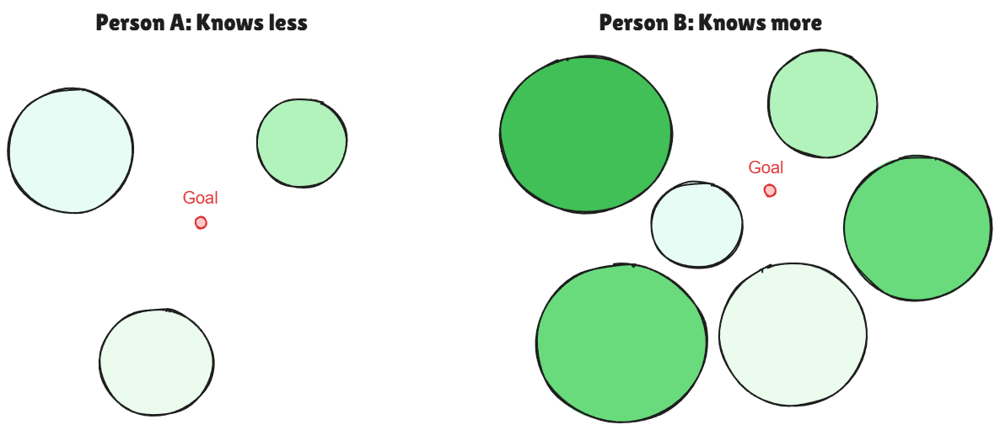

We all know the slogan "knowledge is power". In this essay, I want to argue for the opposite:

> **too much knowledge can hinder creativity**

Not because learning is bad, but because what you already know quietly narrows what you consider plausible. In the age of AI, where solutions are increasingly cheap, this matters: the bottleneck shifts from "finding an answer" to "finding an original direction".

## So... should we stay ignorant?

Creativity needs ingredients: skills, taste, vocabulary, technique, references. But there's a trade-off between **exploration** (searching broadly) and **exploitation** (reusing what already works) [[2]](#references). Expertise pulls you toward exploitation and AI makes exploitation nearly frictionless.

The failure mode looks like this:

- You reach for the first "known-good" template.
- The template works well enough, so you stop searching.
- Over time, your outputs converge toward a local optimum: polished, competent, and predictable.

This is related to several well-studied phenomena:

- **Curse of knowledge**: once you know something, it becomes hard to imagine not knowing it - changing how you explain, teach, and even think [[3]](#references).
- **Einstellung effect**: familiar methods block better ones [[4]](#references).
- **Functional fixedness / design fixation**: example solutions "anchor" your imagination and reduce novelty [[5, 6]](#references).

## A simple picture of the trap

Assume the circles represent the "nearby" ideas you can easily access. Person B has more knowledge, but that also means more well-worn paths, so exploring outside the circles feels less cost-effective.

## Evidence (and what it actually implies)

Richard Hamming was one of the first to point this out in "You and Your Research" [[1]](#references):

> **- Question:** How much effort should go into library work?\
> **- Hamming:** It depends upon the field. I will say this about it. There was a fellow at Bell Labs, a very, very, smart guy. He was always in the library; he read everything. If you wanted references, you went to him and he gave you all kinds of references. But in the middle of forming these theories, I formed a proposition: there would be no effect named after him in the long run. He is now retired from Bell Labs and is an Adjunct Professor. He was very valuable; I'm not questioning that. He wrote some very good Physical Review articles; but there's no effect named after him because he read too much. If you read all the time what other people have done you will think the way they thought. If you want to think new thoughts that are different, then do what a lot of creative people do - get the problem reasonably clear and then refuse to look at any answers until you've thought the problem through carefully how you would do it, how you could slightly change the problem to be the correct one. So yes, you need to keep up. You need to keep up more to find out what the problems are than to read to find the solutions. The reading is necessary to know what is going on and what is possible. But reading to get the solutions does not seem to be the way to do great research. So I'll give you two answers. You read; but it is not the amount, it is the way you read that counts.

Another interesting extension of the well-known Arthur C. Clarke quote might be:

> "If an ~~elderly but distinguished scientist~~ LLM says that something is possible, he is almost certainly right; but if he says that it is impossible, he is very probably wrong."\
> — Arthur C. Clarke.

Creators in other fields describe the same intuition in plain language:

> "Film is not the art of scholars but of illiterates."\
> —Werner Herzog

> "I want them [models or actors] to be intact, virgin. What I want from them is the unknown."\
> —Robert Bresson

These quotes can be read as an argument for **protecting the unknown**: leaving room for accidents, misreadings, and naive attempts that experts would reject too early.

## How to use AI without losing originality

> **AI is not the enemy; premature convergence is.**

Research on human-AI ideation is still young, but it is already clear that how you use these tools matters [[8, 9]](#references).
One practical workflow I have seen recommended is:

1. **Write your "pre-AI" draft**: your best explanation, outline, or sketch from memory.
2. **Force divergence**: list 5-10 alternatives (inversions, constraints, different audiences, different mediums).
3. **Then query AI**, but ask for breadth: counterarguments, edge cases, weird analogies, uncommon constraints.
4. **Incubate**: step away, come back, and rewrite from your own perspective [[7]](#references).
5. **Use AI last for polish**: clarity, structure, proofreading.

## References

[1] Richard Hamming, "You and Your Research". https://www.cs.virginia.edu/~robins/YouAndYourResearch.html

[2] March, J. G. (1991). Exploration and exploitation in organizational learning. *Organization Science*, 2(1), 71-87. https://doi.org/10.1287/orsc.2.1.71

[3] Camerer, C., Loewenstein, G., & Weber, M. (1989). The curse of knowledge in economic settings: An experimental analysis. *Journal of Political Economy*, 97(5), 1232-1254. https://doi.org/10.1086/261651

[4] Luchins, A. S. (1942). Mechanization in problem solving: The effect of Einstellung. *Psychological Monographs*, 54(6), i-95. https://doi.org/10.1037/h0093502

[5] Duncker, K. (1945). On problem-solving. *Psychological Monographs*, 58(5), i-113. https://doi.org/10.1037/h0093599

[6] Jansson, D. G., & Smith, S. M. (1991). Design fixation. *Design Studies*, 12(1), 3-11. https://doi.org/10.1016/0142-694X(91)90003-F

[7] Sio, U. N., & Ormerod, T. C. (2009). Does incubation enhance problem solving? A meta-analytic review. *Psychological Bulletin*, 135(1), 94-120. https://doi.org/10.1037/a0014212

[8] Kim, H. K., Roknaldin, A., Nayak, S., Zhang, X., Yang, M., Twyman, M., Hwang, A. H.-C., & Lu, S. C.-Y. (2024). ChatGPT and Me: Collaborative Creativity in a Group Brainstorming with Generative AI. https://doi.org/10.18260/1-2--48457

[9] "Augmented Brainstorming with AI" - Research Approach for Identifying Design Criteria for Improved Collaborative Idea Generation Between Humans and AI. (2023). https://doi.org/10.3233/FAIA230113
