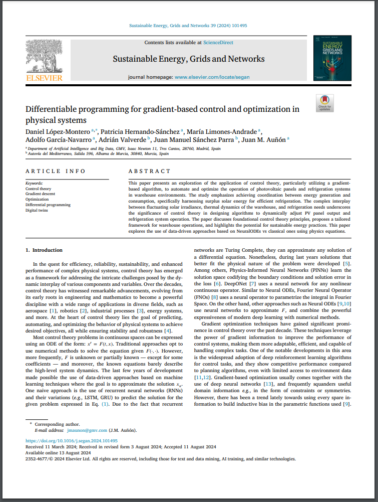

We have recently published a paper with GMV at Elsevier and I wanted to share it here also. 

- **Link to Article: [https://www.sciencedirect.com/science/article/pii/S2352467724002248](https://www.sciencedirect.com/science/article/pii/S2352467724002248)**

## Abstract
This paper presents an exploration of the application of control theory, particularly utilizing a gradient-based algorithm, to automate and optimize the operation of photovoltaic panels and refrigeration systems in warehouse environments. The study emphasizes achieving coordination between energy generation and consumption, specifically harnessing surplus solar energy for efficient refrigeration. The complex interplay between fluctuating solar irradiance, thermal dynamics of the warehouse, and refrigeration needs underscores the significance of control theory in designing algorithms to dynamically adjust PV panel output and refrigeration system operation. The paper discusses foundational control theory principles, proposes a tailored framework for warehouse operations, and highlights the potential for sustainable energy practices. This paper explores the use of data-driven approaches based on NeuralODEs vs classical ones using physics equations.

