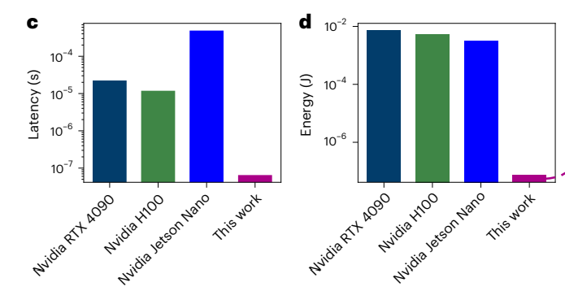
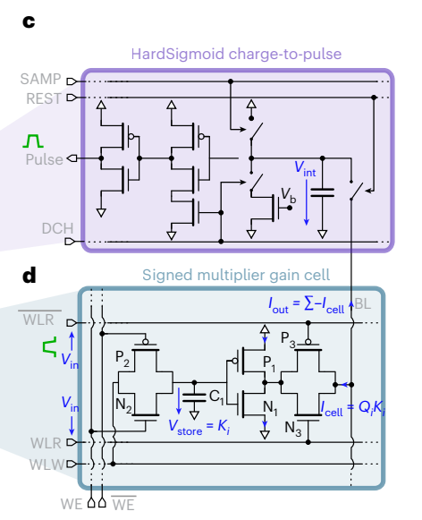
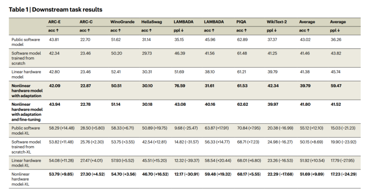
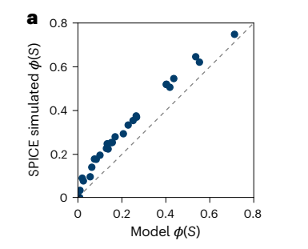

A few days ago, this paper was published in Nature [[1]](#references) claiming a huge improvement in LLM inference using analog computing:

> "Our architecture reduces attention latency and energy consumption by up to two and four orders of magnitude"

This could mean we may soon run LLMs on devices no bigger than smartphones while consuming less power than a light bulb. After taking a deep dive, I believe this might turn out to be one of the most influential results of 2025.

It is no surprise that current digital computing is very inefficient, there is a lot of overhead on communication (between cache and SRAM) and synchronization (clock cycle), all to maintain the general-purpose and deterministic paradigm that we are used to.

For specific workloads like inference, there exist some alternatives (specialized hardware that focuses on inference [[2]](#references), but they remain digital; and neuromorphic computing [[5]](#references), although it has never quite taken off ). And, unlike current digital hardware, that uses all this big and complex framework to perform these rather simplistic operations (self-attention and feed-forward), using built-in math operations on the chip using the analog operations, we can speed things near the speed of light!

Back to the paper, what they have done up to now is modified the self-attention mechanism (flash attention) so that it can be implemented using analog circuits, while still remaining compatible with differentiable programming frameworks like pytorch:

They trained this analog-inspired simulation within a GPT-2 architecture and compared it with standard digital models (ensure accuracy wasn’t sacrificed):

Caveats: The paper only showcases the simulated version of the model, they haven't benchmarked it on real hardware, and I expect a big decay in performance from noise in the analog version (see for example Sim2Real problems arising in reinforcement learning). They share a possible result between the digital model and the analog implementation:

Very recently, I have seen someone on twitter who is trying to implement it on hardware of this work [[4]](#references)

For so long, we have adapted the hardware to fit our software, it's time to turn things around! Richard Sutton has long argued this point (see Bitter Lesson [[3]](#references)). Just as transformers mapped neatly onto the strengths of GPUs, we may now see a new wave of research into models designed to be analog-friendly, i.e., architectures that can be efficiently ported to analog computing.

Inference, in particular, seems ripe for disruption. Training will likely remain dominated by gpus with Nvidia still leading, i.e., train on gpu -> inference on custom-device. It might be interesting exploring the implications of this result (if this hold), we will probably have inference at no cost and a surge of custom-built analog components for different use cases. 

**Additional info:**
- The code is available [[6]](#references)
- They used PyTorch and Triton (see the requirements)
- SPICE software for circuit simulation

## References

[1] Leroux, N., Manea, PP., Sudarshan, C. et al. Analog in-memory computing attention mechanism for fast and energy-efficient large language models. Nat Comput Sci (2025). https://doi.org/10.1038/s43588-025-00854-1

[2] https://www.chipstrat.com/p/the-future-of-edge-inference-hardware

[3] http://www.incompleteideas.net/IncIdeas/BitterLesson.html

[4] https://x.com/BrianRoemmele/status/1966473607795929527

[5] https://en.wikipedia.org/wiki/Neuromorphic_computing

[6] https://github.com/NathanLeroux-git/GainCellAttention/