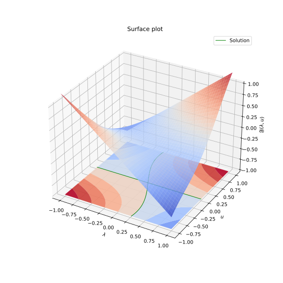
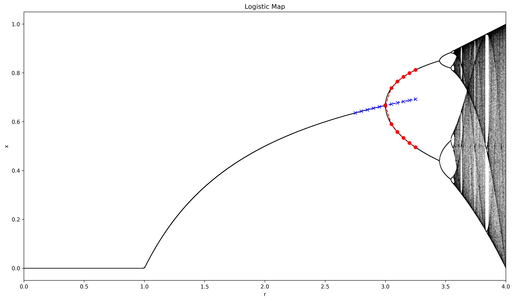
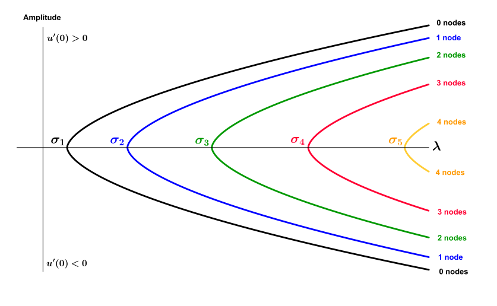
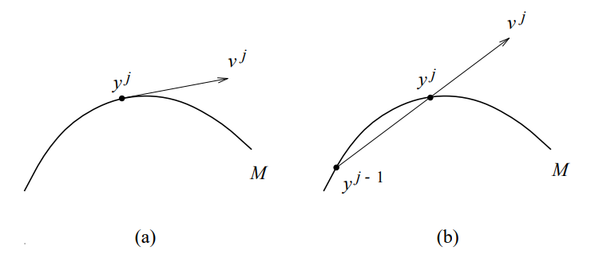
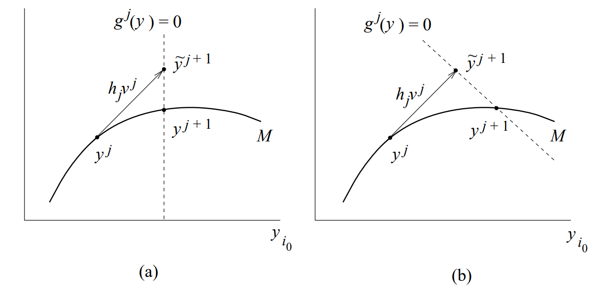
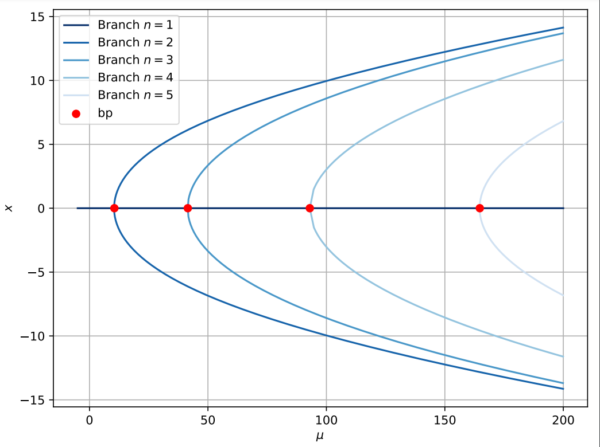

Several non-linear problems relevant in practical applications can be expressed as a fixed point equation. In many cases, it is crucial to investigate how the model’s behavior changes with variations in a parameter, denoted as $\lambda$. In practical applications, $\lambda$ represents a physical or empirical magnitude of interest. Bifurcation Theory is a subfield in Nonlinear Functional Analysis that tries to study the general behavior of the equations that can be written as $\mathfrak{F}(\lambda, u)=0$ where $\lambda$ is the *bifurcation parameter*.

## Examples of Bifurcations

### One-Dimensional Example
Considering the one-dimensional problem where $U=\mathbb{R}$
$$
    \mathfrak{F}(\lambda, u) = \lambda u + \frac{1}{2}\cos(2\lambda)u^2
$$
Here, $\mathfrak{F}$ exhibits a bifurcation behavior at $(\lambda, u)=(0,0)$ as shown in the following figure.

Here, we have a trivial branch of solutions $(\lambda, u)=(\lambda, 0)$ for every $\lambda\in\mathbb{R}$.

### Logistic Map
Another example of bifurcation emerges from the logistic map, 
$$
x_{n+1} = rx_n(1-x_n)
$$
The chaotic behavior of arises from a very simple nonlinear dynamical equation. And it describes the many physical effects such as the population reproduction and starvation of a population, i.e., given a population $x\in [0,1]$ where 1 represent the population maximum capacity, the population of the next year can be given by $x_{n+1} = rx_n$. However, we need to further constraint to the maximum capacity, and that is why the factor $(x_n-1)$ appears. This equation exhibits a bifurcation behavior in the stable points (the limit of the sequences) where we take the bifurcation parameter $r$. You can see in the next figure that multiple bifurcation points emerge (the most notorious is when $r=2$)

## Bifurcation from Simple Eigenvalues

One of the most important theorems in Bifurcation Theory is the Crandall-Rabinowitz Theorem [[Crandall \& Rabinowitz, 1971]](https://www.sciencedirect.com/science/article/pii/0022123671900152) which state the sufficient conditions to find a simple bifurcation point, it is build upon the Implicit Function Theorem and therefore the convergence of the Newton method. Firstly, it defines a function $\mathfrak{G}$ as follows

\[\tag{1}
\mathfrak{G}(s, \lambda, y):=
\begin{cases}
s^{-1}\mathfrak{F}(\lambda, s(\varphi_0 + y)) & \text{if }s\not=0\\
D_u\mathfrak{F}(\lambda, 0)(\varphi_0 + y)& \text{if }s=0
\end{cases}
\]
where $\varphi_0$ is the simple eigenvector of  $D_u \mathfrak{F}_u(\lambda_0)$ whose corresponding eigenvalue is 0. Using the Implicit Function Theorem, we can prove that there exists two unique mappings $\lambda(s)$ and $y(s)$ such that $\mathfrak{G}(s, \lambda(s), y(s))=0$.

### Application to equation: $-u'' = \lambda u - a(x) u^3$

We will study the general case of the equation
$$\tag{2}
    \begin{cases}
        -u'' = \lambda u - a(x)u^3\quad\quad \text{in}\quad (0,L),\\
        u(0) = u(L) = 0
    \end{cases}
$$
where $a\in\mathcal{C}[0,L]$. Using the Crandall-Rabinowitz Theorem, we can prove that there are bifurcation points at $(\lambda, u) = (\frac{n^2\pi^2}{L^2}, 0)$ for every $n\geq 1$. And the bifurcation diagram will look like the following figure.

*[[López-Gomez, 2020]]()*

We will introduce in the following section some numerical methods for bifurcation theory.

## Numerical Methods in Bifurcation Theory

The numerical methods in bifurcation theory can be categorized into three main groups:
- **Continuation methods**: These methods extend a branch fo solutions from a given solution point, progressing in both directions along the branch.
- **Bifurcation point detection**: These methods identify bifurcation points within a branch of solutions, where qualitative changes in the system behavior occur.
- **Branch Switching**: Starting from a detected bifurcation point, these methods facilitate the exploration of other solution branches that intersect at that bifurcation point.

### Continuation Methods
This method are most two-steps based algorithms, the first part give a plausible guess for the extension of the branch and the second one corrects the guess point to satisfy the equation. That is the reason why they are called *prediction-correction* methods. 

Predicion Method             |  Correction Method
:---------------------------:|:-------------------------:
|     |   |
*[Yuri A. Kuznetsov. Elements of Applied Bifurcation Theory, 2023](https://link.springer.com/10.1007/978-3-031-22007-4.)* 

- **Prediction**: The main core of the algorithm is to use $v^j$ to calculate the next point $\tilde{y}^{j+1}$. 
    $$
    \tilde{y}^{j+1} := y^j + \eta \frac{v^j}{|v^j|}
    $$ 
    The most simple methods are the secant and the tangent method. The secant method uses previous points to calculate the extrapolate the next possible value
    $$v^j := y^j - y^{j-1}.$$
    A more sophisticated method is to use the tangent at the given point to calculate the next point. The method can be derived from the initial condition:
    $$
    \mathfrak{F}(y^j) = 0 \Leftrightarrow \mathfrak{F}_y (y^j)v^j = 0
    $$
    This equation does not have a unique solution because $\mathfrak{F}: \mathbb{R}\times U \rightarrow U$, therefore, we need another equation to provide a unique solution. A common trick is to use restraint with the following condition: $\langle v^{j-1}, v^j \rangle = 1$.

- **Correction**: The correction uses a Newton-based method in most cases. It uses two equations
    $$
    \begin{cases} 
    \mathfrak{F}(y) = 0 \\
    g^j (y) = 0
    \end{cases}
    $$
    The simplest method, also called Natural, defines $g^j$ as follows: $g^j(y) = y_{i_0} - \tilde{y}_{i_0}^{j+1}. Geometrically, it restraints to solution to the prediction $i_0$-plane. However, it is noteworthy that this method does not work when the curve is turning in that axis. 

    An alternative method is the so called Pseudo-arclength that defines $g^j(y) = \langle y-\tilde{y}^j+1 , v^j \rangle$. Intuitively, it restraints the solutions to the perpendicular plane to $v^j$ at the point $\tilde{y}^{j+1}$.

### Bifurcation Point Detection

Defining the following test function
\begin{equation}
    \psi(y^k) = \lambda_1\lambda_2\dots \lambda_n
\end{equation}
where $\lambda_n$ are the eigenvalues of the $D_u \mathfrak{F}(y^k)$.
We can test whether two consecutive points are a fold bifurcation point when 
\begin{equation}
    \psi(y^k)\psi(y^{k+1}) < 0 
\end{equation}

Once, detected a bifurcation point, we can improve the point precision using an iterative algorithm based on the Bisection method:

  - $\tilde{y}^{k+1/2} := \frac{1}{2}(y^{k} + y^{k+1})$
  - Use a correction method on $\tilde{y}^{k+1/2}$ to obtain $y^{k+1/2}$.
  - Calculate $\psi(y^{j+1/2})$ and test it again:
      $$
          \begin{cases}
              \text{Bisection}(y^{k}, y^{k+1/2}) & \text{If }\psi(y^{k})\psi(y^{n})<0\\
              \text{Bisection}(y^{k+1/2}, y^{k+1}) & \text{If }\psi(y^{n})\psi(y^{k+1})<0
          \end{cases}
      $$
    

### Branch Switching

We will use a method based on the proof of the Crandall-Rabinowitz Theorem [], where we will apply a Newton-like algorithm. Let us use the following function
$$
    \mathfrak{G}(s, \lambda, y) := 
    \begin{cases}
        s^{-1}\mathfrak{F}(\lambda, s(\varphi_0 + y)) & \text{if } s\not= 0\\
        D_u\mathfrak{F}(\lambda, 0)(\varphi_0 + y) & \text{if } s=0
    \end{cases}
$$
Furthermore, we restraint the solution $y$ to the closed subspace of $U$ such that $Y \oplus  N[D_u \mathfrak{F}(y)] = U$. Hence, $y\in N[\mathfrak{L}_0]^\perp = N[\mathfrak{F}_u(\lambda_0, u_0)]^\perp$. This condition can be expressed as follows
$$
\langle y, \phi \rangle=0
$$
where $\text{Span}[\phi] = N[\mathfrak{F}^T_u (\lambda_0, u_0)]$ due to the Fundamental Theorem of Linear Algebra. Therefore, Crandall-Rabinowitz assures us that the Newton method converges to a solution in the non-trivial branch.

### Results

Using the above-mentioned algorithms to the problem described in (1), we obtain the following bifurcation diagram, that coincides with the results obtained using the Crandall-Rabinowitz Theorem

The full code has been uploaded to the public repository: [https://github.com/dani2442/bifurcationjax](https://github.com/dani2442/bifurcationjax)