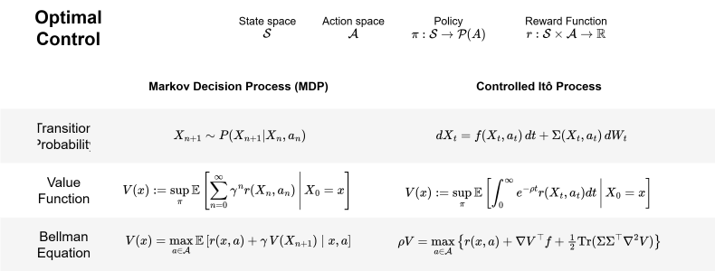
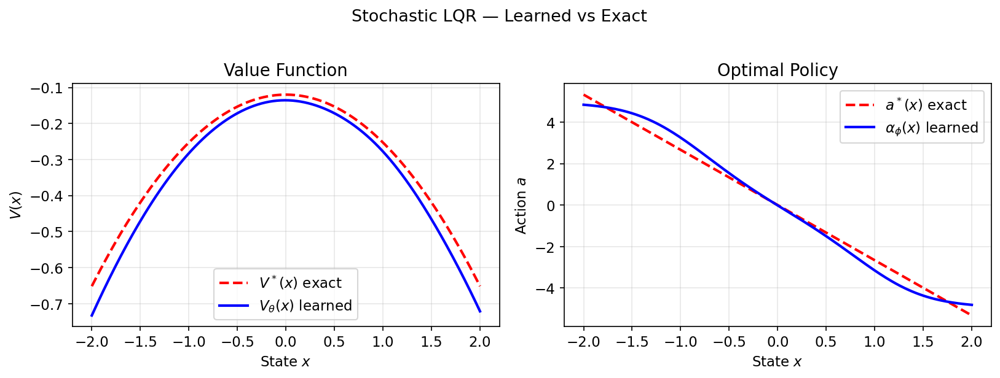
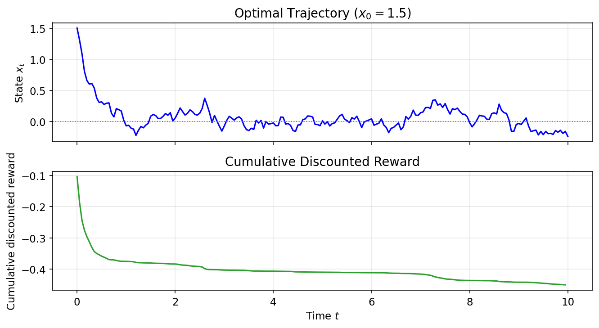
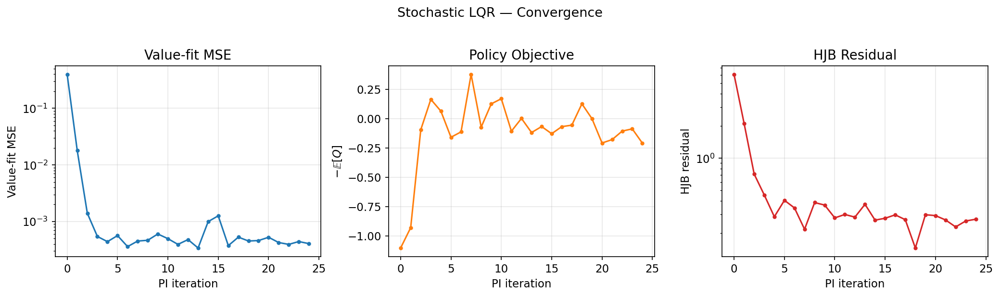
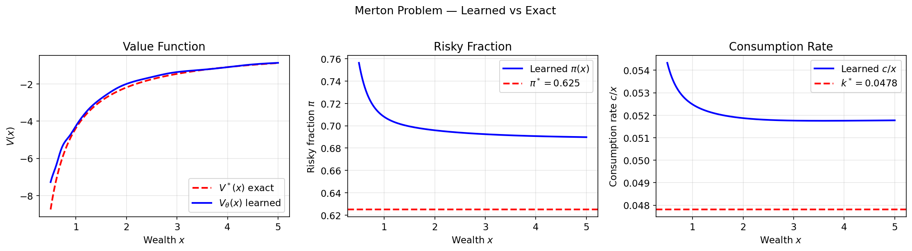
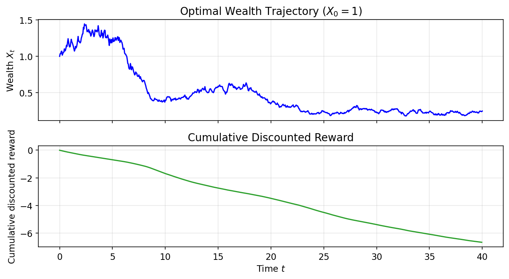
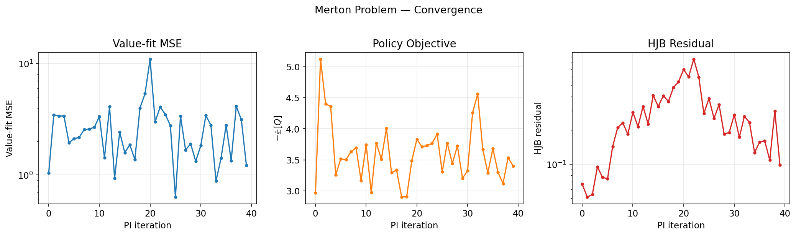

Machine learning feels recent, but one of its core mathematical ideas dates back to 1952, when Richard Bellman published a seminal paper titled "On the Theory of Dynamic Programming" [[6, 7]](#references), laying the foundation for optimal control and what we now call reinforcement learning.

Later in the 50s, Bellman extended his work to continuous-time systems, turning the optimal condition into a PDE. What he later found was that this was identical to a result in physics published a century before (1840s), known as the Hamilton-Jacobi equation.

Once that structure is visible, several topics line up naturally:
- continuous-time reinforcement learning
- stochastic control
- diffusion models
- optimal transport


In this post I want to turn our attention to two applications of Bellman's work: continuous-time reinforcement learning, and how the training of generative models (diffusion models) can be interpreted through stochastic optimal control


## 1. Introduction

Bellman originally formulated dynamic programming in discrete time in the early 1950s [[6, 7]](#references). Consider a Markov decision process with state space $\mathcal X$, action space $\mathcal A$, transition kernel $P(\cdot\mid x,a)$, reward function $r(x,a)$, and discount factor $\gamma\in(0,1)$. A policy $\pi$ maps each state to a distribution over actions. If the state evolves as a controlled Markov chain
$$
X_{n+1}\sim P(\cdot\mid X_n,a_n),
$$
with one-step reward $r(x,a)$ and discount factor $\gamma\in(0,1)$, then the objective is
$$
J(\pi):=\mathbb E\left[\sum_{n=0}^\infty \gamma^n r(X_n,a_n)\right],\qquad a_n\sim \pi(\cdot\mid X_n),
$$
and the value function is defined as:
$$
V(x):=\sup_\pi \mathbb E\left[\sum_{n=0}^\infty \gamma^n r(X_n,a_n)\,\middle|\,X_0=x\right].
$$

Under mild conditions, $V$ satisfies the Bellman equation
$$
V(x)=\max_{a\in\mathcal A}\left\{r(x,a)+\gamma\,\mathbb E \left[V(X_{n+1})\mid X_n=x,a_n=a\right]\right\}.\tag{Bellman equation}
$$
> This says: choose the action that maximizes immediate reward plus continuation value. Continuous time keeps the same local logic, but now the time step has length $h$ and we send $h\downarrow 0$.


To isolate the main idea, first ignore noise and consider the non-autonomous deterministic control system
$$
\dot X_s = f(s,X_s,a_s),\qquad X_t=x,
$$
with finite-horizon value function
$$
V(t,x):=\sup_{a_\cdot}\left[\int_t^T r(s,X_s,a_s)\,ds+g(X_T)\,\middle|\,X_t=x\right].
$$

> **Theorem (HJB, deterministic non-autonomous).** For $V\in C^1$, the value function satisfies
> $$
> -\partial_t V(t,x) = H\bigl(t,x,\nabla_x V(t,x)\bigr), \tag{HJB}
> $$
> where the **Hamiltonian** is $H(t,x,p):=\sup_{a\in\mathcal A}\left\{r(t,x,a)+p^\top f(t,x,a)\right\}$.

*Proof.* Fix $(t,x)$ and $h>0$. The dynamic programming principle gives
$$
V(t,x)=\sup_{a_\cdot}\left[\int_t^{t+h} r(s,X_s,a_s)\,ds + V(t+h,X_{t+h})\right].
$$
To first order in $h$, it is enough to optimize over constant actions $a$ on $[t,t+h]$. For smooth $V$ and deterministic dynamics:
$$
V(t+h,X_{t+h})=V(t,x)+h\,\partial_t V(t,x)+h\,\nabla_x V(t,x)^\top f(t,x,a)+o(h),
$$
$$
\int_t^{t+h} r(s,X_s,a)\,ds = h\,r(t,x,a)+o(h).
$$
Substituting into the DPP, cancelling $V(t,x)$, dividing by $h$, and letting $h\downarrow 0$:
$$
0=\sup_{a\in\mathcal A}\left\{r(t,x,a)+\nabla_x V(t,x)^\top f(t,x,a)+\partial_t V(t,x)\right\},
$$
which rearranges to $-\partial_t V(t,x) = H(t,x,\nabla_x V(t,x))$. $\quad\blacksquare$

**Connection to Hamilton–Jacobi.** What Bellman realized in the 1950s is that the partial differential equation produced by dynamic programming has exactly the same structure as the 19th-century Hamilton–Jacobi equation from classical mechanics. Writing the running reward as minus a Lagrangian, $r(t,x,a)=-L(t,x,a)$, define
$$
H(t,x,p):=\sup_{a\in\mathcal A}\{p^\top f(t,x,a)-L(t,x,a)\}.
$$
The HJB equation then becomes identical to Hamilton’s equation for the action $S(t,q)$,
$$
\frac{\partial S}{\partial t}+H\!\left(q,\frac{\partial S}{\partial q}\right)=0.
$$
Under the correspondence $S\leftrightarrow V$ and $q\leftrightarrow x$, the two equations are the same at the level of PDE structure. 


### Controlled diffusions (Itô processes)

We now move to the stochastic setting: continuous time, continuous state and action spaces, and Itô dynamics. Assume the system evolves according to the SDE
$$
dX_t = f(X_t,a_t)\,dt + \Sigma(X_t,a_t)\,dW_t
$$
where $X_t$ is the state, $a_t$ is the control, $W_t$ is a standard Wiener process, and $f$ and $\Sigma$ describe drift and diffusion. The reward is given by $r(x,a)$, and the objective is to maximize expected discounted reward over an infinite horizon:
$$
J(\pi):=\mathbb{E}\Big[\int_0^\infty e^{-\rho t}r(X_t,a_t)\,dt\Big],\qquad a_t\sim \pi(\cdot\mid X_t)
$$
where $\rho>0$ is the discount rate. The associated value function is
$$
V(x):=\sup_\pi \mathbb{E}\Big[\int_0^\infty e^{-\rho t}r(X_t,a_t)\,dt \Big| X_0=x\Big]
$$

> **Theorem (Hamilton-Jacobi-Bellman equation for a controlled diffusion).** Under suitable regularity conditions:
> 1. $f(\cdot,a)$, $\Sigma(\cdot,a)$, $r(\cdot,a)$ are continuous in $(x,a)$; Lipschitz in $x$ uniformly in $a$.
> 2. $\Sigma\Sigma^\top(x,a)$ is bounded and uniformly nondegenerate (for classical $C^2$ theory; if you drop this you typically work in viscosity form).
> 3. $r$ is bounded (or has at most linear growth with enough integrability).
> 4. $V\in C^2(\mathbb R^d)$ and bounded (or polynomial growth, with the usual technical modifications).
>
> Then the value function satisfies the *Hamilton-Jacobi-Bellman* (HJB) PDE
> $$ \rho V(x)=\max_{a\in \mathcal{A}}\Big\{ r(x,a)+\mathcal{L}^a V(x)\Big\}.\tag{1} $$
> where $\mathcal{L}^a$ is the infinitesimal generator under action $a$:
> $$ \mathcal{L}^a \varphi(x):=\nabla \varphi(x)^\top f(x,a)
+\tfrac12 \mathrm{Tr}\big(\Sigma\Sigma^\top \nabla^2 \varphi(x)\big) $$

*Proof.* The structure is the same as in the deterministic case. The only new ingredient is the short-time expansion of $\mathbb E_x[V(X_h)]$: by Itô's formula,
$$
\mathbb E_x[V(X_h)] = V(x) + h\,\mathcal L^a V(x) + o(h),
$$
where the generator $\mathcal{L}^a$ replaces the directional derivative $\nabla V^\top f$, adding the curvature term $\tfrac{1}{2}\mathrm{Tr}(\Sigma\Sigma^\top\nabla^2 V)$ coming from the quadratic variation of $W$. The rest is unchanged: substitute into the DPP, cancel $V(x)$, divide by $h$, and let $h\downarrow 0$ to obtain (1). $\quad\blacksquare$


The same argument also yields the non-autonomous HJB when $f$, $\Sigma$, and $r$ depend explicitly on time; see [Appendix C](#appendix-c-non-autonomous-case).


> **Historical Note:** In 1960, Rudolf E. Kalman published his seminal paper on the linear-quadratic regulator (LQR) problem [[8]](#references), which is a continuous-time optimal control problem with linear dynamics and quadratic cost. The solution to the LQR problem is given by the algebraic Riccati equation, which can be derived from the Hamilton-Jacobi-Bellman (HJB) equation for continuous-time control problems.

## 2. Continuous-time Reinforcement Learning

Define the continuous-time analogue of the **Q-function** by
$$
Q(x,a):=\frac{1}{\rho}\Big(r(x,a)+\mathcal{L}^a V(x)\Big).\tag{2}
$$
From the HJB (1), it follows immediately that $V(x)=\max_{a} Q(x,a)$. This identity is the basis of **policy improvement**: once we have an estimate of $V$, the greedy action is $a^*(x) = \arg\max_a Q(x,a)$.

This stationary, discounted form is the RL convention used in the next two sections.


### 2.1 Policy Iteration

We solve the HJB numerically with policy iteration (PI), alternating between *evaluating* the current policy and *improving* it through the Q-function. Both the value $V_\theta$ and the policy $\alpha_\phi$ are represented by MLPs.

This algorithm is **model-based**: it assumes known dynamics through $f(x,a)$ and $\Sigma(x,a)$ (equivalently, access to the generator $\mathcal L^a$). The model is used both to simulate closed-loop trajectories in policy evaluation and to compute $\mathcal L^aV$ in policy improvement.

We iterate the following steps until convergence:

1. **Policy evaluation** (value under current policy $\alpha_k$):
$$
\rho V_k(x)=r\big(x,\alpha_k(x)\big)+\mathcal{L}^{\alpha_k(x)}V_k(x).
$$
In practice, we estimate $V_k\approx V^{\alpha_k}$ by Monte Carlo rollouts of the closed-loop SDE and fit $V_\theta$ by regression.

2. **Policy improvement** (greedy with respect to $V_k$):
$$
\alpha_{k+1}(x)\in\arg\max_{a\in\mathcal A}\{r(x,a)+\mathcal L^aV_k(x)\}
=\arg\max_{a\in\mathcal A} Q_k(x,a),
$$
where
$$
Q_k(x,a):=\frac{1}{\rho}\big(r(x,a)+\mathcal L^aV_k(x)\big).
$$
With a differentiable actor $\alpha_\phi$, this becomes gradient ascent on
$$
\max_\phi\;\mathbb E_x\big[Q_k\big(x,\alpha_\phi(x)\big)\big].
$$

3. **Diagnosis / stopping**:
$$
\mathcal R_{\mathrm{HJB}}(x)=\rho V(x)-\max_a\{r(x,a)+\mathcal L^aV(x)\},
$$
and stop when sampled norms of $\mathcal R_{\mathrm{HJB}}$ and parameter changes plateau.

Intuition: evaluation estimates the value landscape induced by the current policy, and improvement moves the policy uphill on that landscape. Repeating the two steps drives $(V,\alpha)$ toward a fixed point of the HJB.


### Computing the generator $\mathcal{L}^a V$

The generator requires $\nabla V$ and $\nabla^2 V$, obtained from $V_\theta$ via autograd. The diffusion $\Sigma(x,a)$ is problem-given (model-based setting).

```python
def compute_generator(V_net, x, f_xa, Sigma_xa):
    """L^a V(x) = ∇V · f + ½ Tr(ΣΣᵀ ∇²V)."""
    V = V_net(x)                                                # (batch, 1)
    grad_V = autograd.grad(V.sum(), x, create_graph=True)[0]    # (batch, d)
    drift  = (grad_V * f_xa).sum(-1, keepdim=True)              # ∇V · f
    d = x.shape[1]
    H = torch.stack([autograd.grad(grad_V[:,i].sum(), x,
                     create_graph=True)[0] for i in range(d)], dim=1)
    A = Sigma_xa @ Sigma_xa.transpose(-1,-2)                    # ΣΣᵀ
    diff = 0.5 * (A * H).sum(dim=(-2,-1)).unsqueeze(-1)         # ½Tr(AH)
    return drift + diff
```

During policy improvement, $\nabla V$ and $\nabla^2 V$ are *detached* from $\theta$ so gradients flow only through $\phi$.

### Policy evaluation (Feynman–Kac MC)

For a fixed policy $\alpha$, $V^\alpha$ solves the linear PDE
$$
\rho V^\alpha(x)=r\big(x,\alpha(x)\big)+\mathcal L^{\alpha(x)}V^\alpha(x).
$$
By the Feynman-Kac representation, for any truncation horizon $T>0$,
$$
V^\alpha(x)=
\mathbb E_x\!\left[\int_0^\infty e^{-\rho s}\,r\big(X_s,\alpha(X_s)\big)\,ds\right]=\mathbb E_x\!\left[\int_0^T e^{-\rho s}\,r\big(X_s,\alpha(X_s)\big)\,ds + e^{-\rho T}V^\alpha(X_T)\right]
$$

In Monte Carlo policy evaluation, we approximate this expectation with simulated trajectories and use the critic to bootstrap the terminal value at time $T$.

### Policy improvement

At collocation points, compute $Q_k(x,\alpha_\phi(x))$ using the detached $\nabla V_k$, $\nabla^2 V_k$, and maximise $\mathbb{E}[Q_k]$ w.r.t. $\phi$:

```python
grad_V, H = compute_generator_detached(V_net, x)   # frozen V
a    = policy_net(x)                                 # differentiable in φ
f_xa, S_xa = problem.drift(x, a), problem.diffusion(x, a)
L_V  = generator_from_precomputed(grad_V, H, f_xa, S_xa)
Q    = (problem.reward(x, a) + L_V) / rho
loss = -Q.mean()            # gradient ascent on Q
loss.backward()
opt_pi.step()
```

### 2.2 Model-Free: Continuous-Time Q-learning

Policy iteration is model-based. A complementary route is **Q-learning**, which can be implemented model-free from sampled transitions.

In continuous time, the Q-function satisfies the PDE
$$
\rho Q(x,a)=r(x,a)+\mathcal L^a\big(\max_{a'\in\mathcal A}Q(x,a')\big).\tag{4}
$$
With neural networks, set
$$
Q_\psi(x,a)\approx Q(x,a),\qquad a_\omega(x)\approx \arg\max_{a}Q_\psi(x,a),
$$
where $Q_\psi$ (critic) and $a_\omega$ (actor) are MLPs.

Using short transitions $(X_t,a_t,r_t,X_{t+\Delta t})$ and a small step size $\Delta t$, a practical TD target is
$$
y_t = r_t\,\Delta t + e^{-\rho\Delta t}\,\bar V(X_{t+\Delta t}),
\qquad
\bar V(x):=Q_{\bar\psi}(x,a_\omega(x))\ \text{(or }\max_a Q_{\bar\psi}(x,a)\text{)}.
$$
Then train the critic with
$$
\mathcal L_Q(\psi)=\mathbb E\big[(Q_\psi(X_t,a_t)-y_t)^2\big].
$$
The actor is updated by ascent on
$$
\max_\omega\;\mathbb E\big[Q_\psi(X_t,a_\omega(X_t))\big].
$$
This mirrors the usual actor-critic split: one network fits state-action values, while the other outputs actions that maximize them.


### Example 1 — Stochastic LQR

The linear-quadratic regulator is the canonical continuous-time control benchmark: linear dynamics, quadratic cost, and a closed-form solution. That makes it ideal for validating a numerical solver.

#### Problem setup

**Dynamics** (additive noise, 1-D scalar):
$$dX_t = (\alpha\,X_t + \beta\,a_t)\,dt + \sigma\,dW_t$$

**Reward** (negative quadratic cost):
$$r(x,a) = -\tfrac{1}{2}(q\,x^2 + r_a\,a^2)$$

| Symbol | Meaning | Value |
|:------:|:--------|------:|
| $\alpha$ | open-loop drift (stable if $<0$) | $-0.5$ |
| $\beta$ | control effectiveness | $1.0$ |
| $q$ | state cost weight | $1.0$ |
| $r_a$ | action cost weight | $0.1$ |
| $\sigma$ | diffusion (noise intensity) | $0.3$ |
| $\rho$ | discount rate | $0.1$ |

#### Analytical solution

Substituting a quadratic ansatz $V(x) = -\tfrac{1}{2}Px^2 - c$ into the HJB and optimising over $a$ yields (see [Appendix A](#appendix-a-lqr-derivation) for the full derivation):

The closed-form objects are:
$$
a^*(x)=-\frac{\beta P}{r_a}x=: -Kx,
$$
$$
\rho P = q + 2\alpha P - \frac{\beta^2}{r_a}P^2,
$$
$$
c = \frac{\sigma^2 P}{2\rho}.
$$

#### Code

```python
class StochasticLQR(ControlProblem):
    def drift(self, x, a):     return x @ A.T + a @ B.T
    def diffusion(self, x, a): return D.unsqueeze(0).expand(x.shape[0], -1, -1)
    def reward(self, x, a):
        return -0.5*((x@Q*x).sum(-1,keepdim=True) + (a@R*a).sum(-1,keepdim=True))

P, c, K = solve_are(A, B, Q, R, D, rho=0.1)    # exact Riccati solution
solver  = PolicyIteration(problem, cfg)
history = solver.solve()                          # neural PI
```

#### Results

Learned $V_\theta$ and $\alpha_\phi$ closely match $V^*(x) = -\tfrac{1}{2}Px^2 - c$ and $a^*(x) = -Kx$:



Sample trajectories under the learned policy ($x_0=1.5$) and cumulative discounted reward:



Convergence diagnostics (value-fit MSE, policy objective, HJB residual):



---

### Example 2 — Merton Portfolio

Merton's (1969) portfolio problem asks how an investor should allocate wealth between a risk-free bond and a risky asset while also choosing a consumption rate. The objective is to maximize expected lifetime CRRA (constant relative risk aversion) utility of consumption. It also admits a closed-form solution, making it a useful second benchmark with *multiplicative* noise rather than the additive noise of LQR.

#### Problem setup

**State:** wealth $X_t > 0$. **Controls:** $a_t = (\pi_t, k_t)$ — risky-asset fraction and consumption-to-wealth ratio $k = c/X$.

**Dynamics** (geometric / multiplicative noise):
$$dX_t = \big[r_f + \pi_t(\mu - r_f) - k_t\big] X_t dt + \pi_t \sigma X_t dW_t$$

**Reward** (CRRA utility of consumption flow, $\gamma \neq 1$):
$$r(x,a) = \frac{(k\,x)^{1-\gamma}}{1-\gamma}$$

| Symbol | Meaning | Value |
|:------:|:--------|------:|
| $r_f$ | risk-free rate | $0.03$ |
| $\mu$ | risky asset expected return | $0.08$ |
| $\sigma$ | risky asset volatility | $0.20$ |
| $\gamma$ | relative risk aversion (CRRA) | $2.0$ |
| $\rho$ | subjective discount rate | $0.05$ |

#### Analytical solution

Substituting a power-law ansatz $V(x) = \frac{A}{1-\gamma}x^{1-\gamma}$ into the HJB and optimising over $(\pi, k)$ yields (see [Appendix B](#appendix-b-merton-derivation) for the full derivation):

The closed-form controls and value are:
$$
\pi^*=\frac{\mu-r_f}{\gamma\sigma^2}=0.625,
$$
$$
k^*=\frac{\rho-(1-\gamma)M}{\gamma},\qquad
M:=r_f+\frac{(\mu-r_f)^2}{2\gamma\sigma^2},\qquad
k^*\approx 0.0478,
$$
$$
V^*(x)=\frac{A}{1-\gamma}x^{1-\gamma},\qquad
A=\left(\frac{\gamma}{\rho-(1-\gamma)M}\right)^\gamma.
$$

Both optimal controls are *constant* — independent of wealth and time. 

#### Code

```python
class MertonProblem(ControlProblem):
    def drift(self, x, a):                              # a = (π, c_rate)
        pi, cr = a[:, 0:1], a[:, 1:2]
        return (self.r_f + pi*(self.mu - self.r_f) - cr) * x
    def diffusion(self, x, a):
        return (a[:, 0:1] * self.sigma * x).unsqueeze(-1)
    def reward(self, x, a):
        c = (a[:, 1:2] * x).clamp(min=1e-8)
        return c.pow(1 - self.gamma) / (1 - self.gamma)
```

#### Results

Learned value function matches the exact power-law $V^*\propto x^{1-\gamma}$; both controls converge to the analytical constants:



Sample wealth trajectories under the learned policy ($X_0 = 1$) and cumulative discounted reward:



Convergence diagnostics:




## 3. Diffusion Models


The same HJB machinery also appears in diffusion models once reverse-time sampling is written as a control problem. Let $p_{\text{data}}(x)$ be the target data distribution. For simplicity, consider a forward diffusion whose noise coefficient depends only on time, as in standard score-based SDE formulations:
$$ dY_t = f(Y_t, t)\,dt + \sigma(t)\,dB_t, \qquad Y_0 \sim p_{\text{data}}. $$
Let $p_t(x)$ denote the marginal density of $Y_t$. Under standard regularity assumptions, the time reversal of this process is again a diffusion. Instead of writing time backward from $T$ down to $0$, define
$$
X_t := Y_{T-t}, \qquad t\in[0,T].
$$
Then $X_0\sim p_T$, $X_T\sim p_{\text{data}}$, and $X_t$ has marginal $p_{T-t}$.

To expose the control structure [[9]](#references), define the reverse-time drift and diffusion coefficients
$$ \mu(x, t) := -f(x, T-t), \qquad \Sigma(t) := \sigma(T-t). $$
Now consider a family of controlled diffusions $X_t^u$ driven by an arbitrary control field $u(x, t)$:
$$ dX_t^u = \big(\mu(X_t^u, t) + \Sigma(t) u(X_t^u, t)\big)\,dt + \Sigma(t)\,dW_t, \qquad X_0^u \sim p_T. $$
The goal is to choose $u$ so that the terminal law of $X_T^u$ matches $p_{\text{data}}$.

Now define the candidate value function
$$ V(x, t) := -\log p_{T-t}(x). $$
This is the negative log-density of the reverse-time marginals, so its terminal value is
$$ V(x, T) = -\log p_{\text{data}}(x). $$

To identify the PDE satisfied by $V$, recall that the forward marginals $p_t$ solve the Fokker-Planck equation for $Y_t$. Consequently, $\rho_t(x) := p_{T-t}(x) = e^{-V(x, t)}$ satisfies the reverse-time Fokker-Planck PDE
$$ \partial_t \rho_t = -\operatorname{div}(\mu\,\rho_t) - \tfrac{1}{2}\operatorname{Tr}\big(\Sigma\Sigma^\top \nabla_x^2 \rho_t\big). $$
Substituting $\rho_t = e^{-V}$, $\nabla_x \rho_t = -e^{-V}\nabla_x V$, and $\nabla_x^2 \rho_t = e^{-V}(\nabla_x V\nabla_x V^\top - \nabla_x^2 V)$ into that PDE and dividing by $-e^{-V}$ yields
$$ \partial_t V = \operatorname{div}\mu - \mu \cdot \nabla_x V + \tfrac{1}{2}\|\Sigma^\top \nabla_x V\|^2 - \tfrac{1}{2}\operatorname{Tr}\big(\Sigma\Sigma^\top \nabla_x^2 V\big). $$

To rewrite this as a control problem, introduce a control variable $u$ through the convex-conjugate identity for the quadratic function $g(y) = \frac{1}{2}\|y\|^2$:
$$ \tfrac{1}{2}\|y\|^2 = \sup_{u\in\mathbb{R}^d} \left\{ u \cdot y - \tfrac{1}{2}\|u\|^2 \right\}. $$
Setting $y = -\Sigma^\top \nabla_x V$ lets us rewrite the quadratic gradient term as
$$ \tfrac{1}{2}\|-\Sigma^\top \nabla_x V\|^2 = \sup_{u} \left\{ u^\top (-\Sigma^\top \nabla_x V) - \tfrac{1}{2}\|u\|^2 \right\} = -\inf_{u} \left\{ \tfrac{1}{2}\|u\|^2 + (\Sigma u) \cdot \nabla_x V \right\}. $$
This is the key step: it replaces a quadratic gradient term with a linear one that can be interpreted as controlled drift.

Plugging this back into the PDE for $V$, multiplying by $-1$, and collecting the $u$-independent terms inside the infimum gives the finite-horizon HJB equation
$$ -\partial_t V = \inf_u \left\{ \tfrac{1}{2}\|u\|^2 - \operatorname{div}\mu + (\mu + \Sigma u)\cdot \nabla_x V + \tfrac{1}{2}\operatorname{Tr}\big(\Sigma\Sigma^\top \nabla_x^2 V\big) \right\}. \tag{3} $$

This PDE shows that $V(x,t) = -\log p_{T-t}(x)$ is exactly the value function of a stochastic control problem with dynamics $X_t^u$ and cost
$$ J(u; x, t) = \mathbb{E}\left[ \int_t^T \left( \tfrac{1}{2}\|u(X_s^u,s)\|^2 - \operatorname{div}\mu(X_s^u,s) \right) ds - \log p_{\text{data}}(X_T^u) \;\middle|\; X_t^u=x \right]. $$

The optimal control law $u^*(x, t)$ is the minimizer in the HJB equation. From the quadratic optimization above, the minimizer of $\frac{1}{2}\|u\|^2 + u^\top (\Sigma^\top \nabla_x V)$ is obtained by setting its derivative with respect to $u$ to zero:
$$ u^* + \Sigma^\top \nabla_x V = 0 \implies u^*(x, t) = -\Sigma^\top(t)\nabla_x V(x, t). $$
Since $V(x, t) = -\log p_{T-t}(x)$, we have $\nabla_x V = -\nabla_x \log p_{T-t}(x)$. Substituting this identity gives the exact optimal control law
$$ u^*(x, t) = \Sigma^\top(t)\nabla_x \log p_{T-t}(x) = \sigma(T-t)^\top \nabla_x \log p_{T-t}(x). $$
Therefore the controlled drift becomes
$$
\mu(x,t)+\Sigma(t)u^*(x,t)
=-f(x,T-t)+\Sigma(t)\Sigma(t)^\top \nabla_x \log p_{T-t}(x),
$$
which is exactly the reverse-time score correction.

Applying Itô's formula to $V(X_s^u, s)$ along an arbitrary controlled trajectory and then using the HJB gives the verification identity
$$ J(u; x, t) = V(x, t) + \frac{1}{2} \mathbb{E}\left[ \int_t^T \| u(X_s^u,s) - u^*(X_s^u,s) \|^2 ds \;\middle|\; X_t^u = x \right]. $$

This identity is the control-theoretic backbone of diffusion models:
1. Depending on the parameterization, the network can predict either the score $s(x,t)=\nabla_x\log p_{T-t}(x)$ or the scaled control $u(x,t)=\Sigma^\top(t)s(x,t)$.
2. The verification gap is quadratic in the control error. Under the standard diffusion-model reparameterization used in practice, the resulting ELBO reduces to a weighted denoising score-matching objective [[9]](#references).
3. When $u=u^*$, the gap vanishes and the terminal law of the reverse process matches the data distribution exactly.

So diffusion-based generative modeling can be viewed as a finite-horizon stochastic optimal control problem whose optimal policy is precisely the score-induced reverse-time drift correction.


## References

[1] Jia, Yanwei, and Xun Yu Zhou. "q-Learning in continuous time." Journal of Machine Learning Research 24, no. 161 (2023): 1-61.

[2] Jia, Yanwei, and Xun Yu Zhou. "Policy gradient and actor-critic learning in continuous time and space: Theory and algorithms." Journal of Machine Learning Research 23, no. 275 (2022): 1-50.

[3] Hamilton-Jacobi-Bellman Equations,
Stochastic Differential Equations by Benjamin Moll https://benjaminmoll.com/wp-content/uploads/2019/07/Lecture4_ECO521_web.pdf

[4] Fleming, Wendell H., and H. Mete Soner. Controlled Markov processes and viscosity solutions. New York, NY: Springer New York, 2006.

[5] Yong, Jiongmin, and Xun Yu Zhou. Stochastic controls: Hamiltonian systems and HJB equations. Vol. 43. Springer Science & Business Media, 1999.

[6] Bellman, Richard. "On the Theory of Dynamic Programming." Proceedings of the National Academy of Sciences 38, no. 8 (1952): 716-719. https://doi.org/10.1073/pnas.38.8.716.

[7] Bellman, Richard Ernest. An Introduction to the Theory of Dynamic Programming. Santa Monica, CA: RAND Corporation, 1953. https://www.rand.org/pubs/reports/R245.html.

[8] Kalman, Rudolf E. "Contributions to the Theory of Optimal Control." Boletin de la Sociedad Matematica Mexicana 5 (1960): 102-119. https://boletin.math.org.mx/pdf/2/5/BSMM%282%29.5.102-119.pdf.

[9] Berner, Julius, Lorenz Richter, and Karen Ullrich. "An optimal control perspective on diffusion-based generative modeling." Transactions on Machine Learning Research, 2024. https://arxiv.org/abs/2211.01364.

## Appendix A: LQR Derivation {#appendix-a-lqr-derivation}

**Ansatz.** Guess $V(x) = -\tfrac{1}{2}Px^2 - c$ with $P > 0$. Then $V'=-Px$, $V''=-P$.

**Generator.** With drift $f = \alpha x + \beta a$ and constant diffusion $\sigma$:
$$
\mathcal{L}^a V
=V'(\alpha x+\beta a)+\tfrac{1}{2}\sigma^2V''
=-Px(\alpha x+\beta a)-\tfrac{1}{2}\sigma^2P
=-\alpha P x^2-\beta P a x-\tfrac{1}{2}\sigma^2P.
$$

**HJB.** Substituting into $\rho V = \max_a \{r + \mathcal{L}^a V\}$:
$$
-\tfrac{1}{2}\rho P x^2 - \rho c
=\max_{a}\Big\{-\tfrac{1}{2}qx^2-\tfrac{1}{2}r_a a^2-\alpha P x^2-\beta P a x-\tfrac{1}{2}\sigma^2P\Big\}.
$$

**Optimality in $a$.** The RHS is concave in $a$; set $\partial_a(\cdot) = 0$:
$$
-r_a\,a-\beta P x=0
\implies
a^*(x)=-\frac{\beta P}{r_a}\,x=: -Kx.
$$

**Riccati equation.** Substituting $a^* = -Kx$ back and matching the $x^2$ coefficient and the constant:

$$x^2:\quad \rho P = q + 2\alpha P - \frac{\beta^2}{r_a}P^2, \qquad \text{const:}\quad c = \frac{\sigma^2 P}{2\rho}$$

The first is the *discounted algebraic Riccati equation*. In the scalar case it is a quadratic in $P$. $\quad\blacksquare$


## Appendix B: Merton Derivation {#appendix-b-merton-derivation}

**Ansatz.** Power-law value: $V(x) = \frac{A}{1-\gamma}\,x^{1-\gamma}$, $A > 0$. Then:
$$V'(x) = A\,x^{-\gamma},\qquad V''(x) = -\gamma A\,x^{-\gamma-1}$$

**Generator.** Using drift $\mu_X x = [r_f + \pi(\mu-r_f) - k]x$ and diffusion $\sigma_X x = \pi\sigma x$:
$$\mathcal{L}^a V = A\,x^{-\gamma}\cdot\mu_X x - \tfrac{1}{2}\gamma A\,x^{-\gamma-1}\cdot\sigma_X^2 x^2 = A\,x^{1-\gamma}\big[r_f + \pi(\mu-r_f) - k - \tfrac{1}{2}\gamma\pi^2\sigma^2\big]$$

**HJB.** Substituting and dividing through by $x^{1-\gamma} > 0$:
$$\frac{\rho A}{1-\gamma} = \max_{\pi,\,k}\left\{\frac{k^{1-\gamma}}{1-\gamma} + A\big[r_f + \pi(\mu-r_f) - k - \tfrac{1}{2}\gamma\pi^2\sigma^2\big]\right\}$$

**Optimality in $\pi$.** FOC $\partial_\pi(\cdot) = 0$: $\;A[(\mu-r_f) - \gamma\pi\sigma^2] = 0$:
$$\pi^* = \frac{\mu - r_f}{\gamma\,\sigma^2}$$

This is the **myopic** portfolio rule — independent of wealth and time. Higher risk aversion $\gamma$ or volatility $\sigma$ reduces exposure.

**Optimality in $k$.** FOC $\partial_k(\cdot) = 0$: $\;k^{-\gamma} - A = 0$, so $k^* = A^{-1/\gamma}$.

**Solving for $A$.** Define the *certainty-equivalent growth rate* $M := r_f + \frac{(\mu-r_f)^2}{2\gamma\sigma^2}$. Substituting the optimisers back:
$$
\frac{\rho A}{1-\gamma}
=\frac{(A^{-1/\gamma})^{1-\gamma}}{1-\gamma}+A\big[M-A^{-1/\gamma}\big]
=\frac{A^{(\gamma-1)/\gamma}}{1-\gamma}+AM-A^{(\gamma-1)/\gamma}.
$$
Multiplying by $1-\gamma$ and collecting terms gives
$$
\rho A=(1-\gamma)AM+\gamma A^{(\gamma-1)/\gamma}.
$$
Since $A>0$, divide by $A^{(\gamma-1)/\gamma}$ to obtain
$$
A^{1/\gamma}=\frac{\gamma}{\rho-(1-\gamma)M}.
$$
Therefore
$$
A = \left(\frac{\gamma}{\rho - (1-\gamma)M}\right)^\gamma, \qquad k^* = \frac{\rho - (1-\gamma)M}{\gamma}
$$

The denominator $\rho - (1-\gamma)M$ must be positive — this is the **feasibility condition** ensuring lifetime utility is finite. With our parameters: $M \approx 0.04563$, so $k^* \approx 0.0478$. $\quad\blacksquare$


## Appendix C: Non-autonomous and Finite-Horizon Cases {#appendix-c-non-autonomous-case}

Let the dynamics and reward depend on time:
$$
dX_t=f(t,X_t,a_t)\,dt+\Sigma(t,X_t,a_t)\,dW_t,\qquad r=r(t,x,a).
$$

For the discounted infinite-horizon problem, define the time-dependent value
$$
V(t,x):=\sup_\pi \mathbb E\Big[\int_t^\infty e^{-\rho(s-t)} r(s,X_s,a_s)\,ds\ \Big|\ X_t=x\Big].
$$
Then the time-dependent generator is
$$
\mathcal L_t^a \varphi(x)=\nabla \varphi(x)^\top f(t,x,a)+\tfrac12\mathrm{Tr}\big(\Sigma\Sigma^\top(t,x,a)\nabla^2\varphi(x)\big),
$$
and the HJB becomes
$$
\rho V(t,x)=\max_{a\in\mathcal A}\Big\{r(t,x,a)+\partial_t V(t,x)+\mathcal L_t^a V(t,x)\Big\}.
$$
Equivalently,
$$
-\partial_t V(t,x)=\max_{a\in\mathcal A}\Big\{r(t,x,a)+\mathcal L_t^a V(t,x)\Big\}-\rho V(t,x).
$$

In the autonomous case, $V(t,x)$ is time-independent, so $\partial_t V=0$ and you recover (1).

For the finite-horizon deterministic case, set $\Sigma\equiv 0$ and define
$$
V(t,x):=\sup_{a_\cdot}\left[\int_t^T r(s,X_s,a_s)\,ds+g(X_T)\,\middle|\,X_t=x\right].
$$
Then
$$
-\partial_t V(t,x)=\sup_{a\in\mathcal A}\left\{r(t,x,a)+\nabla_x V(t,x)^\top f(t,x,a)\right\},
\qquad V(T,x)=g(x).
$$
Writing $r=-L$ and
$$
H(t,x,p):=\sup_{a\in\mathcal A}\{p^\top f(t,x,a)-L(t,x,a)\},
$$
this becomes
$$
\partial_t V(t,x)+H\bigl(t,x,\nabla_x V(t,x)\bigr)=0,
\qquad V(T,x)=g(x),
$$
which is the classical Hamilton-Jacobi form.


<!-- 
## Appendix D: Kullback-Leibler HJB


A common KL-regularized continuous-time control formulation fixes a reference (prior) policy $\mu(\cdot\mid x)$ and introduces a temperature $\alpha>0$. The HJB equation becomes a pointwise maximization over action distributions $\pi(\cdot\mid x)$:
$$
\rho V_\alpha(x)=
\max_{\pi(\cdot\mid x)}
\left\{
\int_{\mathcal{A}}\pi(a\mid x)\big(r(x,a)+\mathcal{L}^aV_\alpha(x)\big)\,da -
\alpha\,\mathrm{KL}\!\big(\pi(\cdot\mid x)\,\|\,\mu(\cdot\mid x)\big)
\right\}.
\tag{5}
$$

The maximization over $\pi$ is explicit and yields the log-sum-exp / softmax form:
$$
\rho V_\alpha(x)=
\alpha\log\!\left(
\int_{\mathcal{A}}\mu(a\mid x)\exp\!\Big(\tfrac{r(x,a)+\mathcal{L}^aV_\alpha(x)}{\alpha}\Big)\,da
\right).
\tag{6}
$$
> If $\mathcal{A}$ is finite and $\mu(\cdot\mid x)$ is uniform on $\mathcal{A}$, then
> $$ \rho V_\alpha(x)=
  \alpha\log\!\left(\sum_{a\in\mathcal{A}}\exp\!\Big(\tfrac{r(x,a)+\mathcal{L}^aV_\alpha(x)}{\alpha}\Big)\right)   -\alpha\log|\mathcal{A}|. $$
As $\alpha\downarrow 0$, the Laplace principle gives $\alpha\log\int \exp(\cdot/\alpha)\to \max(\cdot)$, so you recover the hard HJB:
  $$
  \rho V(x)=\max_{a\in\mathcal{A}}\{r(x,a)+\mathcal{L}^aV(x)\}.
  $$

The maximizing policy in (5) is
$$
\pi_\alpha^*(a\mid x)=
\frac{\mu(a\mid x)\exp\!\Big(\tfrac{r(x,a)+\mathcal{L}^aV_\alpha(x)}{\alpha}\Big)}
{\int_{\mathcal{A}}\mu(a'\mid x)\exp\!\Big(\tfrac{r(x,a')+\mathcal{L}^{a'}V_\alpha(x)}{\alpha}\Big)\,da'}.
\tag{7}
$$
This is the continuous-time analogue of softmax over "advantages", with $\mu$ acting as a prior.

Keeping the same definition of $Q_\alpha$, but now with the soft value $V_\alpha$:
$$
Q_\alpha(x,a)
:=\frac{1}{\rho}\Big(r(x,a)+\mathcal{L}^aV_\alpha(x)\Big).\tag{8}
$$
Then the soft value aggregation becomes the exact analogue of $V(x)=\max_a Q(x,a)$:
$$
V_\alpha(x)=
\frac{\alpha}{\rho}\log\!\left(
\int_{\mathcal{A}}\mu(a\mid x)\exp\!\Big(\tfrac{\rho\,Q_\alpha(x,a)}{\alpha}\Big)\,da
\right).
\tag{9}
$$
Substituting (9) back into $\rho Q_\alpha(x,a)=r(x,a)+\mathcal{L}^aV_\alpha(x)$ yields the soft-HJB / KL Bellman equation for $Q_\alpha$:
$$
\rho Q_\alpha(x,a)=
r(x,a)
+
\mathcal{L}^a\left[
\frac{\alpha}{\rho}\log\!\left(
\int_{\mathcal{A}}\mu(a'\mid x)\exp\!\Big(\tfrac{\rho\,Q_\alpha(x,a')}{\alpha}\Big)\,da'
\right)
\right](x).
\tag{10}
$$
This is the direct "soft" replacement of the hard-max PDE (4).

### Expanding the generator term in (10)

Equation (10) is often read in the viscosity sense, since $x\mapsto V_\alpha(x)$ may fail to be $C^2$ without extra assumptions. If you do assume $V_\alpha\in C^2$ (and can differentiate under the integral defining $V_\alpha$), then $\mathcal{L}^a[V_\alpha](x)$ can be expanded explicitly.

Define the partition function
$$
Z(x):=\int_{\mathcal A}\mu(a'\mid x)\exp\!\Big(\tfrac{\rho}{\alpha}Q_\alpha(x,a')\Big)\,da',
\qquad
V_\alpha(x)=\frac{\alpha}{\rho}\log Z(x).
$$
The associated Boltzmann policy is
$$
\bar\pi_\alpha(a'\mid x):=\frac{\mu(a'\mid x)\exp\!\big(\tfrac{\rho}{\alpha}Q_\alpha(x,a')\big)}{Z(x)}.
$$

Let
$$
h(x,a'):=\log\mu(a'\mid x)+\frac{\rho}{\alpha}Q_\alpha(x,a').
$$
Then the standard log-partition identities give
$$
\begin{aligned}
\nabla V_\alpha(x)
&=\mathbb E_{\bar\pi_\alpha(\cdot\mid x)}\!\big[\nabla_x Q_\alpha(x,a')\big]
+\frac{\alpha}{\rho}\,\mathbb E_{\bar\pi_\alpha(\cdot\mid x)}\!\big[\nabla_x\log\mu(a'\mid x)\big],
\end{aligned}
$$
and
$$
\begin{aligned}
\nabla^2 V_\alpha(x)
&=\mathbb E_{\bar\pi_\alpha(\cdot\mid x)}\!\big[\nabla_x^2 Q_\alpha(x,a')\big]
+\frac{\alpha}{\rho}\,\mathbb E_{\bar\pi_\alpha(\cdot\mid x)}\!\big[\nabla_x^2\log\mu(a'\mid x)\big]\\
&\quad+\frac{\alpha}{\rho}\,\operatorname{Cov}_{\bar\pi_\alpha(\cdot\mid x)}\!\Big(\nabla_x\log\mu(a'\mid x)+\frac{\rho}{\alpha}\nabla_x Q_\alpha(x,a')\Big),
\end{aligned}
$$
where $\operatorname{Cov}(\cdot)$ is the covariance matrix of the indicated vector under $\bar\pi_\alpha(\cdot\mid x)$.

For the dynamics under action $a$,
$$
\mathcal{L}^a\varphi(x)=\nabla\varphi(x)^\top f(x,a)+\tfrac12\mathrm{Tr}\big(\Gamma(x,a)\nabla^2\varphi(x)\big),
\qquad \Gamma(x,a):=\Sigma(x,a)\Sigma(x,a)^\top,
$$
so
$$
\mathcal{L}^a V_\alpha(x)=f(x,a)^\top \nabla V_\alpha(x)+\tfrac12\mathrm{Tr}\big(\Gamma(x,a)\nabla^2 V_\alpha(x)\big).
$$
Substituting these into (10), you get an explicit (but still nonlinear) PDE involving expectations and covariances of $\nabla_x Q_\alpha$ and $\nabla_x^2 Q_\alpha$ under $\bar\pi_\alpha(\cdot\mid x)$.

### Simplification when $\mu$ is independent of $x$

If $\mu(a\mid x)\equiv \mu(a)$, then $\nabla_x\log\mu=\nabla_x^2\log\mu=0$ and
$$
\begin{cases}
\nabla V_\alpha(x)=\mathbb E_{\bar\pi_\alpha(\cdot\mid x)}\!\big[\nabla_x Q_\alpha(x,a')\big],\\
\nabla^2 V_\alpha(x)=\mathbb E_{\bar\pi_\alpha(\cdot\mid x)}\!\big[\nabla_x^2 Q_\alpha(x,a')\big]
+\frac{\rho}{\alpha}\operatorname{Cov}_{\bar\pi_\alpha(\cdot\mid x)}\!\big(\nabla_x Q_\alpha(x,a')\big).
\end{cases}
$$
The covariance term is the extra contribution coming from the log-sum-exp; it only affects (10) through the second-order part of the generator (i.e. it matters when $\Sigma\neq 0$).

### Practical evaluation

Given $Q_\alpha(x,\cdot)$ and its $x$-derivatives, the remaining objects are just expectations under $\bar\pi_\alpha(\cdot\mid x)$: sums when $\mathcal A$ is finite, and typically Monte Carlo / quadrature approximations when $\mathcal A$ is continuous. In parametric settings (e.g. neural networks), $\nabla_x Q_\alpha$ and $\nabla_x^2 Q_\alpha$ can be obtained by automatic differentiation (the Hessian being the expensive part). -->
