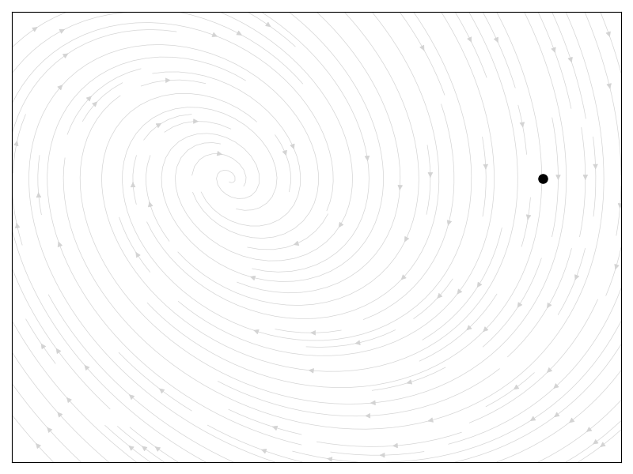
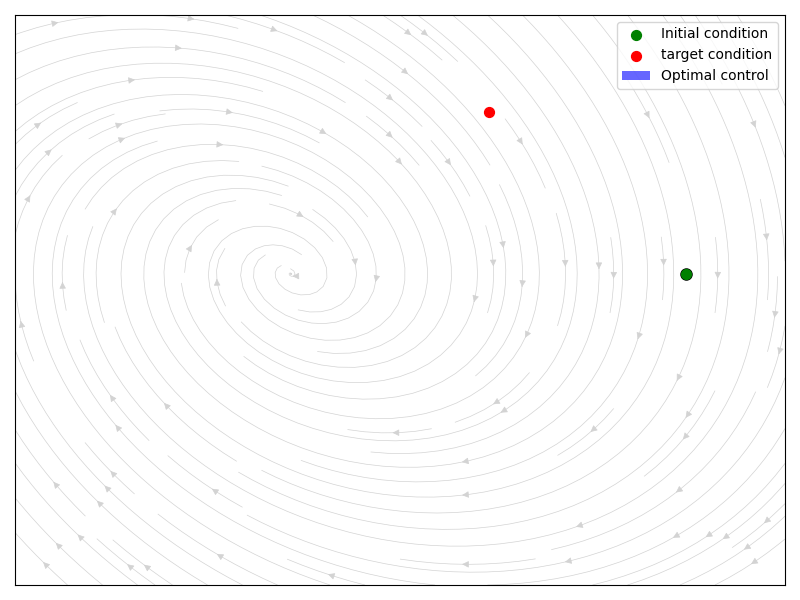
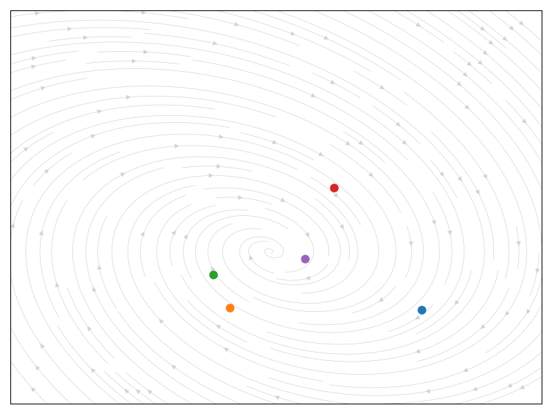

## 1. Linear Model
Consider the linear time-invariant (LTI) system
$$
\dot x(t)=Ax(t)+Bu(t),\qquad x(t)\in\mathbb{R}^n,\; u(t)\in\mathbb{R}^m,
$$
with constant matrices $A\in\mathbb{R}^{n\times n}$ and $B\in\mathbb{R}^{n\times m}$. The vector $x(t)$ is the system state and $u(t)$ is the control input we can apply.

### Example 1. Spring-Mass-Damper

Consider a mass $m$ attached to a spring with stiffness $k$ and a damper with damping coefficient $c$. Apply an external force $u(t)$ to the mass. Let $x_1$ be the position of the mass and $x_2$ the velocity of the mass. From Newton's Law,
$$m(dx_2/dt) = -kx_1 - cx_2 + u(t)$$
Writing $x=(x_1, x_2)^\top$ with $x_2 = \dot x_1$ yields
$$
    \begin{bmatrix} \dot{x}_1 \\ \dot{x}_2 \end{bmatrix} = \begin{bmatrix} 0 & 1 \\ -\frac{k}{m} & -\frac{c}{m} \end{bmatrix} \begin{bmatrix} x_1 \\ x_2 \end{bmatrix} + \begin{bmatrix} 0 \\ \frac{1}{m} \end{bmatrix} u
$$
Let us see how this example reflects in the code

```python
class LinearControlSDE(torch.nn.Module):
    noise_type = 'diagonal'
    sde_type = 'ito'
    
    def __init__(self, A, B, control_input: callable, sigma=0.1):
        super().__init__()
        self.A = A
        self.B = B
        self.sigma = sigma
        self.state_size = A.shape[0]
        self.control_size = B.shape[1]
        self.control_input = control_input
        
    def f(self, t, x):
        """Drift function: Ax + Bu"""
        # Get control input at time t
        u = self.control_input(t, x)
        return torch.matmul(x, self.A.T) + torch.matmul(u, self.B.T)
    
    def g(self, t, x):
        """Diffusion function: σ"""
        batch_size = x.shape[0]
        state_diffusion = self.sigma * torch.ones(batch_size, self.state_size)
        return state_diffusion
```

We set the initial condition as well as initialize the spring-mass-damper system and proceed to simulate it.

```python
m, k, c = 1.0, 1.0, 0.5
A = torch.tensor([[0.0, 1.0],[-k/m, -c/m]])
B = torch.tensor([[0.0], [1.0/m]])
t_span = [0.0, 20.0] # Time Span
ts = torch.linspace(t_span[0], t_span[1], 100)

# Initial condition: [position, velocity]
x0 = torch.tensor([[2.0, 0.0]])
x_target = torch.tensor([1., 1.])

# Initialize spring-mass-damper system and control
control_input = lambda t, x: 0
sde = LinearControlSDE(A, B, control_input=control_input, sigma=0.0) 
ys = torchsde.sdeint(sde, x0, ts, method="euler", dt_min=1e-1) # Simulate
```


Now, two basic questions arise:

- Existence: Given a target state $x_{\mathrm{target}}$ and a horizon $T>0$, does there exist a control $u(\cdot)$ that steers $x(0)=x_0$ to $x(T)=x_{\mathrm{target}}$? 
- Construction: If such a control exists, can we construct a simple, possibly optimal, control that achieves it?

For finite-dimensional LTI systems both questions have clean answers. The classical Kalman rank condition characterizes existence (controllability). When the condition holds one can also construct an explicit minimum-energy control using the controllability Gramian.

## 1.1 Controllability: Kalman controllability criterion
The pair $(A,B)$ (or the LTI system above) is controllable (i.e., one can steer any initial state to any final state in finite time) if and only if the controllability matrix
$$
\mathcal{C} = \big[\,B\;\mid\; AB \;\mid\; A^2B \;\mid\; \dots \;\mid\; A^{n-1}B\,\big]
$$
has rank $n$. Here $\mathcal{C}$ is an $n\times nm$ matrix whose columns collect the directions available through $B$ and propagated by powers of $A$.

We sketch a proof of the equivalence and then show how to construct a minimum-energy control when the criterion holds.


The solution with initial condition $x(0)=x_0$ is
$$
x(T)=e^{AT}x_0 + \int_{0}^{T} e^{A(T-s)}B\,u(s)\,ds.
$$
Define the reachable set from $x_0$ at time $T$:
$$
\mathcal{R}_T(x_0)=\left\{ x(T) : x(T)=e^{AT}x_0+\int_0^T e^{A(T-s)}B\,u(s)\,ds,\; u(\cdot)\ \text{admissible}\right\}.
$$
It suffices to study reachability from the origin $x_0=0$, so write
$$
\mathcal{R}_T = \left\{\int_0^T e^{A(T-s)}B\,u(s)\,ds \right\}.
$$
The system is controllable if for some $T>0$ we have $\mathcal{R}_T=\mathbb{R}^n$.

 > Direction 1: rank condition fails => not controllable

If $\operatorname{rank}\mathcal{C}\lt n$ then there exists a nonzero vector $q\in\mathbb{R}^n$ such that
$$
q^T A^k B = 0,\qquad k=0,1,\dots,n-1.
$$
Since $e^{A\tau}=\sum_{k=0}^\infty \frac{\tau^k}{k!}A^k$, it follows that for every $\tau\ge0$,
$$
q^T e^{A\tau}B =\sum_{k=0}^\infty \frac{\tau^k}{k!}q^T A^k B = 0.
$$
Hence for every admissible $u(\cdot)$,
$$
q^T\int_0^T e^{A(T-s)}B\,u(s)\,ds = \int_0^T q^T e^{A(T-s)}B\,u(s)\,ds = 0.
$$
Therefore the scalar $q^T x(T)=q^T e^{AT}x_0$ is independent of the control; one cannot affect that component by any choice of $u$. The reachable set is a strict subset of $\mathbb{R}^n$, so the system is not controllable. This proves the contrapositive: controllability implies $\operatorname{rank}\mathcal{C}=n$.

> Direction 2: If $\operatorname{rank}(\mathcal{C}) = n$ then controllable (Gramian construction)

Define the finite-horizon controllability Gramian for $T>0$:
$$
W(T) := \int_0^T e^{A\tau} B B^T e^{A^T\tau}\, d\tau. \tag{2}
$$
Let $d = x(T)-e^{AT}x_0$ be the desired displacement. We seek $u(\cdot)$ such that
$$
\int_0^T e^{A(T-s)}B\,u(s)\,ds = d.
$$
Among all controls achieving this, the minimum-energy control (minimizing $J(u)=\tfrac12\int_0^T \|u(s)\|^2 ds$) is obtained by calculus of variations / Lagrange multipliers. Define the Lagrangian
$$
\mathcal{L}(u,\lambda)=\tfrac12\int_0^T u(s)^T u(s)\,ds + \lambda^T\Big(\int_0^T e^{A(T-s)}B\,u(s)\,ds - d\Big).
$$
Stationarity with respect to $u$ (pointwise) gives
$$
u(s) + B^T e^{A^T(T-s)}\lambda = 0 \quad\Rightarrow\quad u(s) = -B^T e^{A^T(T-s)}\lambda.
$$
Plugging into the constraint yields
$$
d = -\int_0^T e^{A(T-s)}B B^T e^{A^T(T-s)}\,\lambda\,ds = -W(T)\lambda.
$$
Therefore, if $W(T)$ is invertible ($\Leftrightarrow$ Kalman rank condition [[1]](#why-invertibility-of--is-equivalent-to-the-kalman-rank-condition)), $\lambda = -W(T)^{-1} d$ and the minimum-energy control is
$$
\boxed{\;u^*(s)=B^T e^{A^T(T-s)} W(T)^{-1} d\; }
$$
Substituting this $u^*$ into the state equation yields the desired final state $x(T)=e^{AT}x_0+d$. And the total cost of the optimal displacement is given by
$$
J(u^\star) = \int_0^T \|u^\star(t)\|^2 dt = d^\top W(T)^{-1} d 
$$

---
> **Note: Why invertibility of $W(T)$ is equivalent to the Kalman rank condition**
>
>    If $\operatorname{rank}\mathcal{C}\lt n$ then, as shown earlier, there exists $q\neq0$ with $q^T A^k B=0$ for $k=0,\dots,n-1$. This implies $B^T e^{A^T\tau}q\equiv0$ and hence
>    $$ q^T W(T) q = \int_0^T \|B^T e^{A^T\tau}q\|^2\,d\tau = 0, $$
>    so $W(T)$ is singular for every $T>0$.
>
>    Conversely, if $\operatorname{rank}\mathcal{C}=n$ but $W(T)$ were singular for every $T$, there would exist $q\neq0$ with $q^T W(T) q=0$ for all $T$. Hence $B^T e^{A^T\tau} q\equiv0$ for all $\tau\ge0$, and differentiating at $\tau=0$ repeatedly yields
>    $$    B^T (A^T)^k q = 0\qquad\text{for all }k\ge0,    $$
>    equivalently $q^T A^k B=0$ for all $k\ge0$. By Cayley–Hamilton only the first $n$ powers are independent, so this contradicts $\operatorname{rank}\mathcal{C}=n$. Therefore for some $T>0$ the Gramian $W(T)$ is invertible, and reachability follows from the construction in the previous section.


Let us see the code in action.
```python
class OptimalRoute(nn.Module):
    def __init__(self, A, B, x_target, T, n_steps=200, regularize=1e-9):
        super().__init__()
        self.x_target = x_target.reshape(1, -1)
        self.A = A
        self.B = B
        self.T = T
        self.m_exp = torch.matrix_exp(A * T)

        Wc = compute_gramian(A, B, T, n_steps=n_steps)
        Wc_reg = Wc + regularize * torch.eye(A.shape[0])
        self.Wc_inv = torch.inverse(Wc_reg)

    def forward(self, t, x):
        s = self.T - t
        term = torch.matrix_exp(self.A.T * s)
        u = ((self.x_target - x @ self.m_exp.T) @ self.Wc_inv.T) @ term.T @ self.B
        return u
```

and we execute the inference

```python
# Initialize spring-mass-damper system and optimal control
control_input = OptimalRoute(A, B, x_target, T=t_span[1])
sde = LinearControlSDE(A, B, control_input=control_input, sigma=0.0)
xs = torchsde.sdeint(sde, x0, ts, method="euler", dt_min=1e-1) # Simulate multiple trajectories
```



In the next section we will see how to learn a model, we will start with the linear case and then we will learn more complex models such NeuralODEs or Neural SDEs.

### 1.2 Model fitting


Suppose we observe vector signals on an interval $[0,T]$
$$
    X(t) \in\mathbb{R}^n, \qquad U(t) \in \mathbb{R}^m,
$$
and the model is
$$
    \dot X(t) = AX(t) + BU(t), \qquad \Theta:=[A, B] \in \mathbb{R}^{n\times (n+m)}.
$$
Define the concatenated regressor
$$
    \phi(t) = \begin{bmatrix}
    X(t) \\
    U(t)
    \end{bmatrix}\in \mathbb{R}^{n+m}
$$
The continuous least-square problem is
$$
    \min_\Theta \|\dot X - \Theta \phi\|_{L^2([0,T])}^2 = \min_{\Theta} \int_0^T \|\dot X(t) - \Theta\phi(t)\|_2^2 dt
$$
Following the standard linear least-squares in function space. Let $J(\Theta)$ be function we want to derivate. Consider the an arbitrary perturbation $H\in \mathbb{R}^{n\times (n+m)}$:
$$
    J(\Theta + \epsilon H) = \int_0^T \|\dot X - \Theta \phi(t) - \epsilon H\phi(t)\|_2^2 dt = J(\Theta) + 2\epsilon \int_0^T (\Theta \phi(t) - \dot X(t))^\top (H\phi(t))dt + o(\epsilon)
$$
Rewriting the linear term using the trace:
$$
\begin{aligned}
    \int_0^T (\Theta \phi - \dot X)^\top (H\phi)dt &= \int_0^T \text{trace}((\Theta \phi - \dot X)^\top H \phi) dt \\
    &=  \text{trace}(H^\top\int_0^T((\Theta \phi - \dot X) \phi^\top) dt
\end{aligned}
$$
For $\Theta$ to be a stationary point the lienar term must vanish for every $H$ because $\text{trace}(H^\top A) = 0 \quad \forall H$ iff $A=0$. We get the equation
$$
    \int_0^T (\Theta \phi(t) - \dot X(t)) \phi(t)^\top dt = 0
$$
In other words,
$$
    \Theta\int_0^T \phi(t)\phi(t)^\top dt =  \int_0^T \dot X(t) \phi(t)^\top dt.
$$
This is a similar result we got before. And if $G:= \int_0^T \phi(t)\phi(t)^\top dt$ is invertible, then the minimizer is unique and we can solve explicitly:
$$
    \Theta = \left( \int_0^T \dot X(t) \phi(t)^\top dt\right) G^{-1}.
$$
Let us calculate the minimum value of the residual for the optimal value. First define 
$$
    H = \int_0^T \dot{X}(t) \phi(t)^\top dt
$$
So the optimizer is $\Theta^\star = HG^{-1}$. Now compute the costs at $\Theta^\star$. Start from
$$
\begin{aligned}
    J(\Theta) &= \int_0^T \|\dot X(t) -\Theta \Phi(t)\|_2^2 dt = \underbrace{\int_0^T \|\dot X(t)\|_2^2 dt}_{A} - 2\int_0^T \dot X(t) ^\top \Theta \phi(t)dt + \int_0^T \phi(t)^\top \Theta^\top \Theta \phi(t) dt \\
    &= A - 2\operatorname{trace}(\Theta H^\top) + \operatorname{trace}(\Theta G\Theta^\top).
\end{aligned}
$$
Evaluating at $\Theta^\star = HG^{-1}$: 
$$
    J(\Theta^\star) = A - 2 \operatorname{trace}(HG^{-1}H^\top) + \operatorname{trace}(HG^{-1}G^\top) = A - \operatorname{trace}(HG^{-1}H^\top).
$$


> **Proposition 1. (Minimizer of the least-squares problem)** \
> Let $\phi(t) = [X(t), U(t)]^\top$ and $H:= \int_0^T \dot X(t) \phi(t)^\top dt$. If $G:=\int_0^T \phi(t)\phi(t)^\top dt$ is invertible, then there exists a unique minimizer of the least-squares problem
> $$  \Theta^\star :=\arg\min_\Theta \| \dot X(t) - \Theta \phi(t)\|_{L^2([0,T])}^2 $$
> where $\Theta^\star =HG^{-1}$ and $J(\Theta^\star) = \|\dot X\|_{L^2([0,T])}^2 - \operatorname{trace}(HG^{-1}H^\top)$.

Therefore, the matrix $\Theta^\star = [A,B]\in \mathbb{R}^{n\times (n+m)}$ uniquely characterizes both the dynamics and the control.

Let us create a dataset generated using 3 different constant controls $u=-1,0,1$. And check if this is enough to infer the rest of the system.
```python
# Initial condition: [position, velocity]
x0 = [torch.randn(20, 2) for _ in range(3)]
u_values = [-1., 0., 1.]  # Possible control inputs
controls = [(lambda t, x, v=vi: torch.full((x.shape[0], B.shape[1]), v)) for vi in u_values] # No control

sdes = [LinearControlSDE(A, B, control_input=control_input, sigma=0.0) for control_input in controls]

# Simulate multiple trajectories
xs = [torchsde.sdeint(sde, x0i, ts, method="euler", dt_min=1e-2) for sde, x0i in zip(sdes, x0)]
us = [control_input(ts, x0i.view(-1,2)).unsqueeze(0).repeat(200, 1, 1) for control_input, x0i in zip(controls, x0)]
phi = torch.concat([torch.cat(xs, dim=1), torch.cat(us, dim=1)], dim=2).view(-1,3)
x_prime = torch.concat([sde.f(0, xsi.view(-1, 2)).view(200, 20, 2) for sde, xsi in zip(sdes, xs)], dim=1).view(-1,2)
```
Now, we infer the values $H$ and $G$ from the dataset generated

```python
G = dt * torch.sum(phi[:, :, None] * phi[:, None, :], dim=0)
H = dt * torch.sum(phi[:, None, :] * x_prime[:, :, None], dim=0)
assert not torch.isclose(torch.linalg.det(G),torch.tensor([0.0])), "G is singular!"

# Calculate the parameters
theta = H @ torch.inverse(G)
assert torch.allclose(theta, torch.cat([A, B], dim=1), atol=1e-4), "The parameters were not recovered accurately."
```



We have been able to recover the values of the system! However, in real-life we may encounter more real scenarios that not satisfy linearity. In the next section, we will introduce the tools necessary for nonlinear systems.


## 2. Nonlinear Control: Pontryagin Maximum Principle


Consider the *Bolza problem* of optimal control which corresponds to the sum of an integral term and a terminal term as
$$\tag{1}
\begin{aligned}
\min_{u(\cdot)} &J(u):= h(x(T), T)+\int_0^T \ell(x(t),u(t), t)\,dt,\\
\text{s.t. } &\dot x(t)=f\bigl(x(t),u(t),t\bigr),\quad x(0)=x_0.
\end{aligned}
$$

Before reviewing the Pontryagin Maximum Principle (PMP), we introduce the variational approach which seeks a minimum of the cost with the dynamics as constraints. 

> **Theorem (Euler-Lagrange Equations).** Consider the minimization problem (1). Suppose $f$ is Lipschitz in $x$ uniformly in $u,t$ and that $u$ is differentiable. Assume that $u^\star$ is a minimizer for the problem, and let $x^\star$ denotes the corresponding trajectory. Then, there exists a function $p^\star \in C^1([0,T], \mathbb{R}^n)$ such that the triple $(x^\star, u^\star, p^\star)$ satisfies the Euler-Lagrange equations:
$$
\begin{aligned}
\dot x^\star_t &= f(x_t^\star, u_t^\star), & x^\star(0)=x_0\\
\dot p^\star(t) &= \ell_x(x_t^\star, u_t^\star) -(p_t^\star)^\top f_x(x_t^\star, u_t^\star), &p_T^\star = -h_x(x_T^\star)\\
0 &= f_b(x_t^\star, u_t^\star)^\top p_t^\star - \ell_u(x_t^\star, u_t^\star).
\end{aligned}
$$
*Proof.* Define the Lagrangian
$$
\mathcal L(x, u, p) = h(x(T)) + \int_0^T \ell(x_t, u_t)dt + \int_0^T p_t^\top(\dot x_t  f(x_t, u_t))dt.
$$
associated to the minimization problem (1). Then the first variation of the Lagrangian provide necessary conditions for optimality:
$$
\mathcal{L}_p(x^\star, u^\star, p^\star) = 0, \quad \mathcal{L}_x(x^\star, \beta^\star, p^\star) = 0, \quad \mathcal{L}_u(x^\star, u^\star, p^\star) = 0.
$$
Then, the function
$$
\begin{aligned}
\frac{d}{dt}\Big|_{\epsilon=0} \mathcal{L}(x^\star, u^\star + \epsilon \delta v, p^\star) &= \int_0^T v_t^\top \ell_u(x_t^\star, u_t^\star) dt - \int_0^T v_t^\top f_u(x_t^\star, u_t^\star)^\top p_t^\star dt\\
&= \int_0^T v_t^\top \Big(\ell_u(x_t^\star, u_t^\star) - f_u(x_t^\star, u_t^\star)^\top p_t^\star\Big) dt.
\end{aligned}
$$
If this is zero for every variation $v$, we get the third condition. Similarly, 
$$
\begin{aligned}
\frac{d}{d\epsilon}\Big|_{\epsilon=0} \mathcal{L}(x^\star + \epsilon \delta v, u^\star, p^\star) &= v_T^\top h_x(x_T^\star) + \int_0^T v_t^\top \ell_x(x_t^\star, u_t^\star) dt + \int_0^T p_t^{\star\top} \Big(\dot v_t - f_x(x_t^\star, u_t^\star)v_t\Big) dt\\
&= v_T^\top \Big(h_x(x_T^\star) - p_T^\star\Big) + \int_0^T v_t^\top \Big(\ell_x(x_t^\star, u_t^\star) - \dot p_t^\star - f_x(x_t^\star, u_t^\star)^\top p_t^\star\Big) dt.
\end{aligned}
$$
As the integrand is continuous the above immediately implies the second condition. Finally, 
$$
\begin{aligned}
\frac{d}{d\epsilon}\Big|_{\epsilon=0} \mathcal{L}(x^\star, u^\star, p^\star + \epsilon \delta v) &= \int_0^T \delta v_t^\top \Big(\dot x_t^\star - f(x_t^\star, u_t^\star)\Big) dt.
\end{aligned}
$$
which implies the first condition.


> **Theorem. Pontryagin Maximum Principle (PMP).**
> It is convinient to introduce the Hamiltonian function $H: \mathbb{R}^n \times \mathbb{R}^m \times \mathbb{R}^n$ associated to the optimal control problem (1) as
> $$ H(x,u,p) = p^\top f(x,u) - \ell(x,u).$$
> Thus, the Euler-Lagrange equations can be rewritten as
$$
\begin{aligned}
\dot x_t^\star &= H_p(x_t^\star, u_t^\star, p_t^\star),\qquad  x^\star(0)=x_0&&\\
\dot p_t^\star &= -H_x(x_t^\star, u_t^\star, p_t^\star), \qquad p_T^\star= -h_x(x_T^\star)&&\\
0 &= H_u(x_t^\star, u_t^\star, p_t^\star).
\end{aligned}
$$
In addition, the optimal control $u^\star$ satisfies the
$$  H\bigl(t,x^\ast(t),p(t),u^\ast(t)\bigr)=\max_{u\in U} H\bigl(t,x^\ast(t),p(t),u\bigr).  $$


### 2.2. NeuralODE, Neural SDE and KernelODE

Machine learning for dynamical systems has seen significant success; one of the best-known examples is the neural ODE [[2,3,4]](#references). The core idea is to parameterize the vector field with a neural network:
$$
    \dot{x}(t) = f_{\theta}\big(x(t), t\big),\qquad x(t_0) = x_0.
$$
Instead of fitting discrete-time updates, the network models the continuous-time dynamics directly. Training, while seemingly more involved, can be handled via the adjoint method together with modern automatic differentiation frameworks (e.g., PyTorch, TensorFlow, JAX). Conceptually, gradients are obtained either by differentiating through a numerical ODE solver (e.g., Euler, Runge-Kutta) or by using a continuous-time adjoint sensitivity formulation.

This idea extends naturally to stochastic differential equations (SDEs) [[3,4]](#references), where both the drift and diffusion are parameterized by neural networks:
$$
    \mathrm{d}X_t \,=\, f_{\theta}(X_t, t)\,\mathrm{d}t \; + \; g_{\theta}(X_t, t)\,\mathrm{d}W_t,
$$
with $W_t$ a standard Brownian motion (Itô interpretation unless stated otherwise). Gradients can be computed using SDE adjoint sensitivity methods, enabling end-to-end training of $f_{\theta}$ and $g_{\theta}$.

While more expressive, neural SDEs introduce additional challenges compared to neural ODEs, including numerical stability and solver choice; gradient variance; identifiability of drift versus diffusion; and the need for careful control of solver tolerances and regularization.


### References

[1] An Introduction to Mathematical Optimal Control Theory, Evans https://math.berkeley.edu/~evans/control.course.pdf

[2] Ricky T. Q. Chen et al. Neural Ordinary Differential Equations. Dec. 2019. doi: 10.48550/
arXiv.1806.07366. arXiv: 1806.07366 [cs].

[3] Xuechen Li et al. Scalable Gradients for Stochastic Differential Equations. Oct. 2020. doi:
10.48550/arXiv.2001.01328. arXiv: 2001.01328 [cs].

[4] Patrick Kidger et al. Efficient and Accurate Gradients for Neural SDEs. Oct. 2021. doi:
10.48550/arXiv.2105.13493. arXiv: 2105.13493 [cs]. 

[5] Xiaowu Dai et al. Kernel Ordinary Differential Equations. Oct. 2021. doi: 10.48550/arXiv.
2008.02915. arXiv: 2008.02915 [stat]. 

## Appendix

### (A) Linear Time-Invariant SDEs are Gaussian Processes

Let us consider the Stochastic LTI
$$
dX(t) = AX(t)dt + BdW(t).
$$
Given an initial state $X(0)$, the solution can be formally written as:
$$
X(t) = e^{At}X(0) + \int_0^t e^{A(t-s)}BdW(t) \tag{5}
$$
> This can be proven using Itô formula:
> $$ \frac{d}{dt}e^{-At} = -A e^{-A(t)} \xrightarrow{\quad C(t):=e^{-At}\quad} dC(t) = -AC(t) dt $$
> Applying Itô to the semimartingales $X(t)C(t)$:
> $$ \begin{aligned} d(C(t)X(t)) &= \underbrace{dC(t)}_{-AC(t)dt}X(t) + C(t) dX(t) + \cancel{(dC(t))(dX(t))} \\ &= (-AC(t))Xdt + C(t)(AX(t)dt + BdW(t)) = C(t)BdW(t) \end{aligned} $$
> So $d(e^{-At}X(t)) = e^{-At}BdW(t)$. And integrating,
> $$ e^{-At}X(t) - X(0) = \int_0^t e^{-As}BdW(s) $$
> And arranging the terms we arrive at (5).

We know that $\int_0^t g(t)X(t) dt$ is Gaussian $\Leftrightarrow$ $X(t)$ is Gaussian for all deterministic $g(t)$. Therefore, it is sufficient to assume that the initial condition is Gaussian. 

Let us calculate the mean and covariance of this process. Firstly, let us define $\Phi(t):= e^{At}$ to simplify the calculcations.

#### 1. Mean

We know from (5) that $X(t) = \Phi(t)X_0 + \int_0^t \Phi(t-s) BdW(s)$. Then,
$$
\mathbb{E}[X(t)] = \mathbb{E}[\Phi(t)X_0] + 0 = \Phi(t) \mathbb{E}[X_0].
$$
#### 2. Covariance

Let $P(t)=\operatorname{Cov}(X(t))=E\big[(X(t)-m(t))(X(t)-m(t))^{T}\big]$. Substitute the expression above and expand:
$$
\begin{aligned}
P(t) &= E\Big[\Phi(t)(X_0-E[X_0])(X_0-E[X_0])^{T}\Phi(t)^{T}\Big] \\
&\quad + E\Big[ \Phi(t)(X_0-E[X_0])\big(\int_0^t\Phi(t-s)B dW(s)\big)^{T}\Big] \\
&\quad + E\Big[\big(\int_0^t\Phi(t-s)B dW(s)\big)\big(\int_0^t\Phi(t-u)B dW(u)\big)^{T}\Big].
\end{aligned}
$$

The first term is the propagated initial covariance.
$$
E\big[\Phi(t)(X_0-E[X_0])(X_0-E[X_0])^{T}\Phi(t)^{T}\big]  = \Phi(t)P(0)\Phi(t)^{T}.
$$
If $X_0$ is independent of $W(\cdot)$, then the stochastic integral has mean zero and is independent of $X_0$; hence the middle term is zero. 
The last term can be simplified using the Itô isometry. Define $G_s=\Phi(t-s)B$. Then
$$
Y:=\int_0^t G_s dW(s).
$$
Itô isometry (or the Riemann-sum argument) gives
$$
E\big[Y Y^{T}\big] = \int_0^t G_s G_s^{T} ds    = \int_0^t \Phi(t-s) B B^{T} \Phi(t-s)^{T} ds.
$$
Combining the terms, we get the covariance formula:
$$
P(t)=\Phi(t)P(0)\Phi(t)^{T} + \int_{0}^{t}\Phi(t-s) B B^{T} \Phi(t-s)^{T} ds.
$$
Maybe the second terms seems familiar, and in fact, we have seen a very similar in (2). Equivalently, $P(t)$ satisfies the Lyapunov equation
$$
P'(t) = AP(t) + P(t) A^\top + BB^\top, \qquad P(0) = \operatorname{Cov}(X_0)
$$
This remark is important because in practice, computing the $P(t)$ using the ODE is way cheaper than computing the covariance for each component.

For $t\ge s$, the covariance $\operatorname{Cov}(X(t), X(s))$ can be deduced from the previous expression. We can write $X(t)$ as an intermediate step
$$
X(t)=\Phi(t-s)X(s) + \int_{s}^{t}\Phi(t-u)B dW(u),
$$
so the second (future) integral is independent of the past $X(s)$ and has mean zero. Thus
$$
\boxed{\operatorname{Cov}(X(t)X(s)) = \Phi(t-s) P(s),\qquad t\ge s. }
$$


### (B) KernelODE

An alternative to neural networks for modeling unknown dynamics is to use kernel methods [[5]](#references). Here, the vector field is modeled as a function in a reproducing kernel Hilbert space (RKHS):
$$
    \dot{x}(t) = f(x(t)), \quad f \in \mathcal{H}_K,
$$
where $\mathcal{H}_K$ is the RKHS associated with a positive definite kernel $K$. Assume that the state space $\mathbb{R}^d$, i.e., $f: \mathbb{R}^d \rightarrow \mathbb{R}^d$. Then, $f$ lives in a vector-valued RKHS $\mathcal{H}_K$ with matrix-valued kernel $K: \mathbb{R}^d \times \mathbb{R}^d \rightarrow \mathbb{R}^{d\times d}$. The reproducing property is given by
$$
    \langle f, K(\cdot, x)v \rangle_{\mathcal H_K} = v^\top f(x)\qquad x, v\in \mathbb{R}^d
$$
For each training pair $(x_0^{(i)}, y^{(i)})$, let $x_i(\cdot)$ solve the ODE
$$
    \dot x_i(t) = f(x_i(t)), \qquad x_i(0)=x^{(i)}_0,
$$
and write $\Phi_T(x_0^{(i)}) = x_i(T)$ for the time-T flow. Let us define the objective
$$
    E(f) = \sum_{i=1}^n \|x_i(T) - y_i\|^2 + \frac{\lambda}{2}\|f\|_{\mathcal H_K}^2 
$$


> **Theorem. Representer theorem for flow-matching in RKHS**
>    Let $f^\star \in \mathcal{H}_K$ be a stationary point of $E$ (e.g., a minimizer). Define, for each $i$, the adjoint $p_i: [0,T]\rightarrow \mathbb{R}^d$ by
>   $$  \dot p_i(t) = -(D f^\star(x_i(t)))^\top p_i(t), \qquad p_i(T) = 2(x_i(T) - y^{(i)}).$$
>   Then
>    $$ f^\star(\cdot) = -\frac{1}{\lambda}\sum_{i=1}^n \int_0^T K(\cdot, x_i(t)) p_i(t)dt.$$
>    Equivalently, $f^\star$ lies in the closed linear span of the kernel sections $\{K(\cdot, x_i(t)): i=1, \dots, n, t\in [0,T]\}$.

*Proof.* We compute the first variation of $E$ at an arbitrary $f\in\mathcal H_K$ in the direction $g\in\mathcal H_K$, and then impose stationarity at $f^\star$.

Fix $i$. The perturbation $\delta x_i(t)$ of the trajectory induced by $f+\epsilon g$ solves the linear ODE (standard sensitivity)
$$
\dot{\delta x}_i(t)= Df(x_i(t))\delta x_i(t) + g\big(x_i(t)\big),\qquad \delta x_i(0)=0.    
$$
Let $\Phi_i(t,s)\in\mathbb{R}^{d\times d}$ denote the state-transition matrix for $\dot z=Df(x_i(t))z$ with $\Phi_i(s,s)=I$. Then
$$
\delta x_i(T)= \int_0^T \Phi_i(T,t) g\big(x_i(t)\big) dt.    
$$
For $L_i(f):=|x_i(T)-y^{(i)}|^2$,
$$
\begin{aligned}
\frac{d}{d\epsilon}\Big|_{\epsilon=0} L_i(f+\epsilon g)
&= 2(x_i(T)-y^{(i)})^\top \delta x_i(T) \\\
&= 2(x_i(T)-y^{(i)})^\top \int_0^T \Phi_i(T,t) g(x_i(t))\, dt.
\end{aligned}    
$$
Introduce the adjoint variable $p_i(\cdot)$ as the solution of the backward ODE
$$
\dot p_i(t)= - \big(Df(x_i(t))\big)^\top p_i(t),\qquad p_i(T)=2(x_i(T)-y^{(i)}).
$$
A standard calculation (integration by parts / adjoint trick) yields
$$
2,(x_i(T)-y^{(i)})^\top \Phi_i(T,t)= p_i(t)^\top,
$$
hence
$$
\frac{d}{d\epsilon}\Big|_{\epsilon=0} L_i(f+\epsilon g)
= \int_0^T p_i(t)^\top g\big(x_i(t)\big)\, dt.    
$$
Summing over $i$ and adding the RKHS regularizer:
$$
     D E(f)[g] ;=; \sum_{i=1}^n \int_0^T p_i(t)^\top g\big(x_i(t)\big), dt + \lambda, \langle f, g\rangle_{\mathcal H_K}.
$$
Here, each $p_i$ depends on $f$ via $x_i$ and $Df$; we won’t need its explicit dependency, only linearity in $g$.
Use the reproducing property: for any $g\in\mathcal H_K$,
$$
p_i(t)^\top g(x_i(t)) = \big\langle K(\cdot, x_i(t)) p_i(t), g\big\rangle_{\mathcal H_K}.
$$
%
Integrating and summing,
$$
\sum_{i=1}^n \int_0^T p_i(t)^\top g(x_i(t))\, dt
= \Big\langle \sum_{i=1}^n \int_0^T K(\cdot, x_i(t)) p_i(t)\, dt, g\Big\rangle_{\mathcal H_K}.
$$
Therefore
$$
D E(f)[g] = \Big\langle \sum_{i=1}^n \int_0^T K(\cdot, x_i(t)) p_i(t)\, dt + \lambda f, g\Big\rangle_{\mathcal H_K}.    
$$
Let $f^\star$ be a stationary point of $E$. Then $D E(f^\star)[g]=0$ for all $g\in\mathcal H_K$. By the Riesz representation in a Hilbert space,
$$
\lambda f^\star + \sum_{i=1}^n \int_0^T K(\cdot, x_i(t)) p_i(t)\, dt = 0\quad\text{in }\mathcal H_K,    
$$
with $x_i(\cdot)$ and $p_i(\cdot)$ defined using $f^\star$. Rearranging yields
$$
    f^\star(\cdot)= -\frac{1}{\lambda}\sum_{i=1}^n \int_0^T K\big(\cdot, x_i^\star(t)\big) p_i^\star(t)\, dt.
$$
This is precisely a representer theorem: $f^\star$ lies in the closed span of ${K(\cdot, x_i(t))}_{i,t}$.


