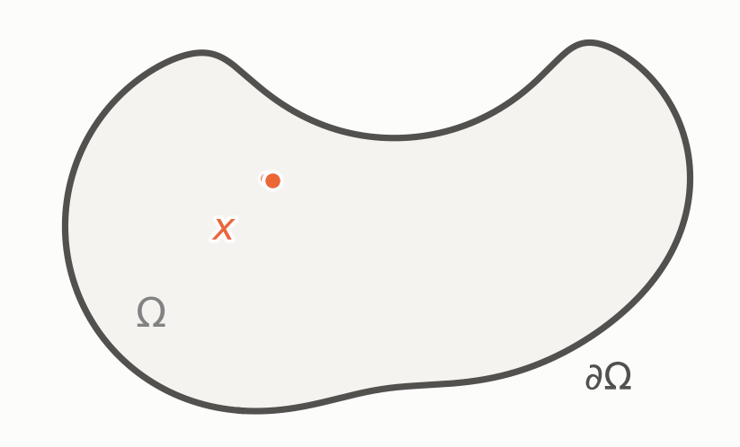
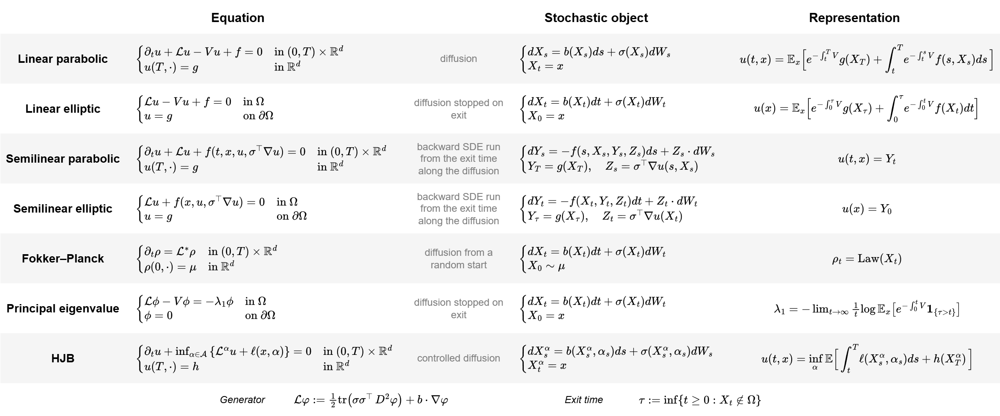

There is a beautiful connection between probability theory and partial differential equations (PDEs), given by the famous Feynman–Kac theorem.

This result allows us to translate between stochastic finite-dimensional problems and deterministic infinite-dimensional problems. It appears everywhere in finance, physics, control theory, and machine learning (generative modeling and reinforcement learning).

This connection is useful in both directions. For example, a high-dimensional PDE (very expensive to solve numerically) can be evaluated at a single point simply by simulating a random process. Conversely, a difficult question about a stochastic process can be transformed into a deterministic PDE and tackled using PDE techniques.

> **Example.** Take the Poisson problem
> $$
> \begin{cases}
> -\Delta u = f & \text{in } \Omega, \\
> \phantom{-\Delta} u = g & \text{on } \partial\Omega .
> \end{cases}
> $$
> The Feynman–Kac theorem says its solution is
> $$ u(x) \;=\; \mathbb{E}\Big[\,g(B_\tau) \;+\; \tfrac12\int_0^\tau f(B_s)\,ds\,\Big] $$
> where $B$ is a Brownian motion started at $x$ and $\tau$ is the first time it
> leaves $\Omega$: the value at $x$ is the boundary datum at the place where the
> path happens to come out, plus the source collected along the way there,
> averaged over paths.

One path gives one exit point and one running integral, so one number
$g(B_\tau)+\tfrac12\int_0^\tau f(B_s)\,ds$. The solution at $x$ is what those
numbers average to. With $f=0$ only the exit point survives and this is the
Dirichlet problem, $u$ harmonic with boundary values $g$; a source adds what the
path picks up before it gets out.

The proof is short, and worth seeing once before the general statement. It needs
one tool, the chain rule for Brownian paths.

> **Itô's formula.** For $\varphi\in C^2(\mathbb{R}^d)$ and a Brownian motion $B$,
> $$ d\varphi(B_t) \;=\; \nabla\varphi(B_t)^\top dB_t \;+\; \tfrac12\Delta\varphi(B_t)\,dt . $$
> The second term is what an ordinary chain rule misses. The path is nowhere
> differentiable, but it accumulates quadratic variation at a definite rate,
> $d\langle B^i,B^j\rangle_t=\delta_{ij}\,dt$, and the Laplacian is what that
> second-order term collects.

*Proof of the example.* Let $\Omega$ be bounded, let $f$ be bounded on $\Omega$,
let $u\in C^2(\Omega)\cap C(\overline\Omega)$ solve the problem, let $B$ start at
$x\in\Omega$ and let $\tau=\inf\{t>0:\;B_t\notin\Omega\}$.

Check first that the path leaves at all. Itô's formula on $h(y)=|y|^2$, for which
$\tfrac12\Delta h=d$, gives
$\mathbb{E}_x\big[|B_{t\wedge\tau}|^2\big]-|x|^2=d\,\mathbb{E}_x[t\wedge\tau]$,
whose left-hand side is at most $\sup_{y\in\overline\Omega}|y|^2$; letting
$t\to\infty$ and using monotone convergence, $\mathbb{E}_x[\tau]<\infty$, and in
particular $\tau<\infty$ almost surely.

Now Itô's formula applied to $u$ leaves
$$
du(B_t) \;=\; \nabla u(B_t)^\top dB_t \;+\; \tfrac12\Delta u(B_t)\,dt \;=\; \nabla u(B_t)^\top dB_t \;-\; \tfrac12 f(B_t)\,dt ,
$$
the $dt$ term being $-\tfrac12 f$ because $u$ solves the equation. Moving it to
the other side, the compensated process
$$
M_t \;:=\; u(B_{t\wedge\tau}) \;+\; \tfrac12\int_0^{t\wedge\tau} f(B_s)\,ds
$$
is a local martingale, and it is dominated by
$\sup_{\overline\Omega}|u|+\tfrac12\sup_\Omega|f|\,\tau$, which is integrable by
the previous paragraph; hence it is a martingale and
$$
u(x) \;=\; \mathbb{E}_x\big[\,M_t\,\big] \qquad\text{for every } t .
$$
Letting $t\to\infty$, $u(B_{t\wedge\tau})\to u(B_\tau)=g(B_\tau)$ because $u$ is
continuous up to the boundary, the integral converges to $\int_0^\tau f(B_s)\,ds$,
and dominated convergence turns the display into
$$
u(x) \;=\; \mathbb{E}_x\big[\,g(B_\tau)\,\big] \;+\; \tfrac12\,\mathbb{E}_x\Big[\int_0^\tau f(B_s)\,ds\Big]. \qquad\blacksquare
$$

## 1. The Feynman–Kac theorem

Let $X$ solve the SDE
$$
dX_t \;=\; b(X_t)\,dt + \sigma(X_t)\,dW_t
$$
in $\mathbb{R}^d$, with $b,\sigma$ Lipschitz.

> **Theorem (Feynman–Kac).**
> Let $V,g:\mathbb{R}^d\to\mathbb{R}$ and $f:[0,T]\times\mathbb{R}^d\to\mathbb{R}$
> be continuous, with $V\ge0$, and suppose
> $u\in C^{1,2}\big([0,T)\times\mathbb{R}^d\big)\cap C\big([0,T]\times\mathbb{R}^d\big)$ solves
> $$ \partial_t u + \tfrac12\operatorname{tr}\big(\sigma\sigma^\top D^2u\big) + b\cdot\nabla u - Vu + f \;=\; 0, \qquad u(T,\cdot)=g . $$
> If $u$, $f$ and $\sigma^\top\nabla u$ grow at most polynomially in $x$, uniformly in $t$, then
> $$ u(t,x) \;=\; \mathbb{E}\Big[\, e^{-\int_t^T V(X_r)dr}\,g(X_T) \;+\; \int_t^T e^{-\int_t^s V(X_r)dr}\, f(s,X_s)\,ds \,\Big\vert\, X_t=x\Big]. $$

*Proof.* Write $D_s=e^{-\int_t^s V(X_r)dr}$ for the discount factor and set
$$
Y_s \;=\; D_s\,u(s,X_s) + \int_t^s D_r\,f(r,X_r)\,dr , \qquad s\in[t,T].
$$
Itô's formula applied to $D_s\,u(s,X_s)$ produces one $dt$ term per derivative
of $u$, and what it collects is precisely the operator in the statement: the
second-order part comes from the quadratic variation
$d\langle X\rangle_s=\sigma\sigma^\top(X_s)\,ds$, the first-order part from the
drift. That combination is the *generator* of $X$, and from here on it gets a
name,
$$
\mathcal{L}\varphi \;:=\; \tfrac12\operatorname{tr}\big(a\,D^2\varphi\big) + b\cdot\nabla\varphi,
\qquad a:=\sigma\sigma^\top .
$$
The drift of $Y$ is therefore
$D_s\big(\partial_s u+\mathcal{L}u-Vu+f\big)(s,X_s)=0$ by the equation, leaving
$dY_s = D_s\,\nabla u(s,X_s)^\top\sigma(X_s)\,dW_s$. No exit time has to be
controlled; the horizon $T$ is deterministic: the growth assumption is what
promotes this local martingale to a true one on $[t,T]$, and then
$u(t,x)=Y_t=\mathbb{E}[Y_T\mid X_t=x]$, which is the claim. $\;\blacksquare$

This statement gives uniqueness for free, but presumes the existence of a solution. The converse, that the right-hand
side *defines* a solution, can be proven separately.

> **Historical note.** Feynman (1948) described the evolution of the Schrödinger
> equation
> $$ i\hbar\,\partial_t\psi \;=\; -\tfrac{\hbar^2}{2m}\Delta\psi + V\psi $$
> by summing over *every* path joining the two endpoints, each weighted by a
> complex number of modulus one whose phase is the classical action of that path,
> measured in units of $\hbar$. Such weights only rotate; they never shrink, so
> paths cancel by interference rather than by having small weight: the sum is not
> an ordinary probabilistic integral, and no measure on path space realizes it.
>
> Kac (1949) observed that replacing time by imaginary time, $t\mapsto -it$,
> turns the equation, for $\hbar=m=1$, into
> $$ \partial_t u \;=\; \tfrac12\Delta u - Vu , $$
> and turns that rotating phase into the real, decaying weight
> $e^{-\int_0^t V(B_s)ds}$. What was a formal path integral becomes a genuine
> probabilistic representation, an ordinary expectation over Brownian paths:
> $$ u(t,x) \;=\; \mathbb{E}_x\Big[e^{-\int_0^t V(B_s)ds}\,g(B_t)\Big]. $$

Black–Scholes (1973) is the same theorem read through the finance dictionary.
Take the risk-neutral geometric Brownian motion $dX_t=rX_t\,dt+\sigma X_t\,dW_t$
with $V\equiv r$ constant, $f=0$ and $g$ the payoff at maturity: the PDE is
$$
\partial_t u + \tfrac12\sigma^2x^2\,\partial_{xx}u + rx\,\partial_x u - ru = 0,
\qquad u(T,\cdot)=g,
$$
and the representation is the pricing formula
$u(t,x)=e^{-r(T-t)}\,\mathbb{E}\big[g(X_T)\mid X_t=x\big]$. Every ingredient has
a name on both sides: $V$ is the discount rate, a source $f$ is a dividend or running payoff, and $\sigma^\top\nabla u$ is the hedging portfolio, which makes the proof
above, in that dictionary, the statement that a hedged position has no drift.

## 4. Feynman–Kac family of equations

The translation always follows the same pattern. The second-order part of the
operator is the diffusion coefficient, the first-order part is the drift, a
zeroth-order term is a killing rate, a source term is a running payoff, the
boundary condition is a stopping rule — and a nonlinearity, when there is one,
is a control, a game, a branching mechanism or an interaction between copies of
the process. The dictionary below collects the correspondences in that order,
writing
$$
\mathcal{L}\varphi=\tfrac12\operatorname{tr}\!\big(a\,D^2\varphi\big)+b\cdot\nabla\varphi,
\qquad a=\sigma\sigma^\top,\qquad dX_t=b(X_t)\,dt+\sigma(X_t)\,dW_t ,
$$
and, for a path started at time $t_0$, the exit time and the killing time
$$
\tau=\inf\{t>t_0:\,X_t\notin\Omega\},
\qquad
\zeta=\inf\Big\{t>t_0:\ \int_{t_0}^{t} V(X_r)\,dr\ \ge\ \mathcal{E}\Big\},
\qquad \mathcal{E}\sim\mathrm{Exp}(1)\ \text{independent of } W ,
$$
so that $\mathbb{P}\big(\zeta>t\,\big\vert\,X\big)=e^{-\int_{t_0}^{t} V(X_r)dr}$: the discount
factors below are survival probabilities.

### 4.1 Boundary conditions and operators that are not local

| Name | PDE ingredient | Stochastic object | Note |
|---|---|---|---|
| Dirichlet condition | $u=g$ on $\partial\Omega$ | process killed on contact | the datum is paired with the exit distribution $\omega_x$ |
| Neumann condition | $\partial_n u=0$ | reflected diffusion | the Skorokhod term is the boundary local time |
| Robin condition | $\partial_n u=\alpha u$ | reflected diffusion killed at rate $\alpha$ in local time | interpolates the two above as $\alpha:0\to\infty$ |
| Fractional Laplacian | $-(-\Delta)^{\alpha/2}u=0$ in $\Omega$, $u=g$ on $\mathbb{R}^d\setminus\Omega$ | rotationally invariant $\alpha$-stable Lévy process | it jumps *over* the boundary, so the data lives on the whole complement |

### 4.2 Other families

The same reading reaches past the table. Optimal stopping turns the equation
into a variational inequality, $\min\{ru-\mathcal{L}u,\ u-\psi\}=0$, solved by
$\sup_{\theta}\mathbb{E}_x\big[e^{-r\theta}\psi(X_\theta)\big]$ — the American
option, a Dynkin game when two players stop against each other. A polynomial
nonlinearity becomes branching: McKean (1975) solves KPP by multiplying the
datum over the particles of a branching Brownian motion, and the same cascade
reaches the three-dimensional Navier–Stokes equations in Fourier variables.
Coefficients depending on the law of the process give the nonlinear
Fokker–Planck equations and, coupled backward to an HJB equation, mean field
games; a quadratic cost with the control in the range of $\sigma$ gives an HJB
equation that Cole–Hopf makes linear and a value that is again an expectation,
which is path-integral control. Or the driver changes rather than the
equation: a Lévy process makes the generator nonlocal, vanishing noise leaves
Hamilton–Jacobi with the Freidlin–Wentzell rate function in place of the
expectation, and a Poisson random velocity gives Kac's telegraph equation —
the wave equation itself has no such representation. Conditioning instead of
averaging gives the last one: Kallianpur–Striebel writes the filtering density
as a Feynman–Kac weight built from the observation.

## References

[1] R. P. Feynman. Space-Time Approach to Non-Relativistic Quantum Mechanics. Rev. Mod. Phys. 20 (1948) 367–387.

[2] M. Kac. On Distributions of Certain Wiener Functionals. Trans. AMS 65 (1949) 1–13.

[3] F. Black and M. Scholes. The Pricing of Options and Corporate Liabilities. J. Political Economy 81 (1973) 637–654.

[4] K. Itô and H. P. McKean. *Diffusion Processes and their Sample Paths*. Springer, 1965.

[5] B. Øksendal. *Stochastic Differential Equations*. 6th ed., Springer, 2003. (Ch. 8–9.)

[6] I. Karatzas and S. Shreve. *Brownian Motion and Stochastic Calculus*. 2nd ed., Springer, 1991. (§4.2–4.4: harmonic measure, the Dirichlet problem, Wiener's criterion.)

[7] W. H. Fleming and H. M. Soner. *Controlled Markov Processes and Viscosity Solutions*. 2nd ed., Springer, 2006.

[8] E. Pardoux and S. Peng. Adapted solution of a backward stochastic differential equation. Systems & Control Letters 14 (1990) 55–61.

[9] H. J. Kappen. Path integrals and symmetry breaking for optimal control theory. J. Stat. Mech. (2005) P11011.

[10] J.-M. Lasry and P.-L. Lions. Mean field games. Japanese J. Math. 2 (2007) 229–260.

[11] E. Gobet. Weak approximation of killed diffusion using Euler schemes. Stoch. Proc. Appl. 87 (2000) 167–197.

[12] N. G. Makarov. On the distortion of boundary sets under conformal mappings. Proc. London Math. Soc. 51 (1985) 369–384.
