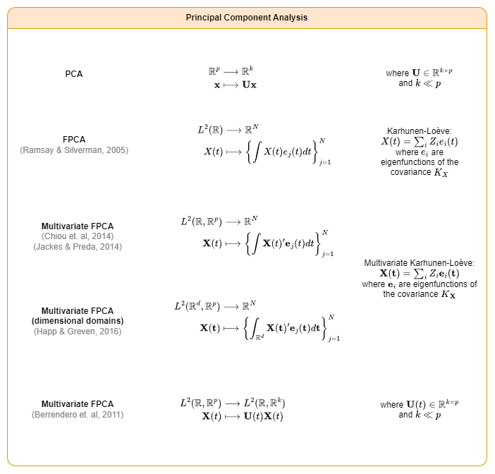
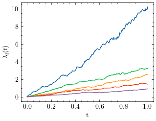

Principal component analysis is one of the key dimension reduction tool for multivariate data used in machine learning. The finite-dimensional case has been extensively studied. We will focus on a generalization of PCA to functional data and termed functional principal component analysis (FPCA). FPCA has taken off to become the most prevalent tool in functional data analysis. This is partly because FPCA facilitates the conversion of inherently infinite-dimensional functional data to a finite-dimensional vector of random scores. Under mild assumptions, the underlying stochastic process can be expressed as a countable sequence of uncorrelated random variables, the functional principal components (FPCs) for scores, which are then truncated to a finite vector. Then the tools of multivariate data analysis can be readily applied to the resulting random vector of scores, thus accomplishing the goal of dimension reduction.

Specifically, the dimension reduction is achieved through an expansion of the underlying but often not fully observed random trajectories $X_i(t)$ in a functional basis that consists of the eigenfunctions of the auto-covariance operator of the process $X$.

The extension of FPCA to multivariate functional data is hence of high practical relevance. Existing approaches for multivariate functional principal component analysis (mFPCA) are based on the multivariate functional Karhunen-Loève expansion to compress the data into a finite-dimensional space (Berrendero, 2011; Chiou, 2014; Jacques, 2014; Ramsay, 2005). However, (Berrendero, 2014) proposed a PCA-like method to compress a multivariate function space $L^2(\mathbb{R}, \mathbb{R}^p)$ to a lower-dimensional multivariate function space $L^2(\mathbb{R}, \mathbb{R}^k)$ with $k\ll p$, using the principles of standard finite-dimensional PCA.

## Experiments

### 1. Correlated $n-$dimensional Brownian Motion

### 2. Anomaly Detection for satellite telemetry

