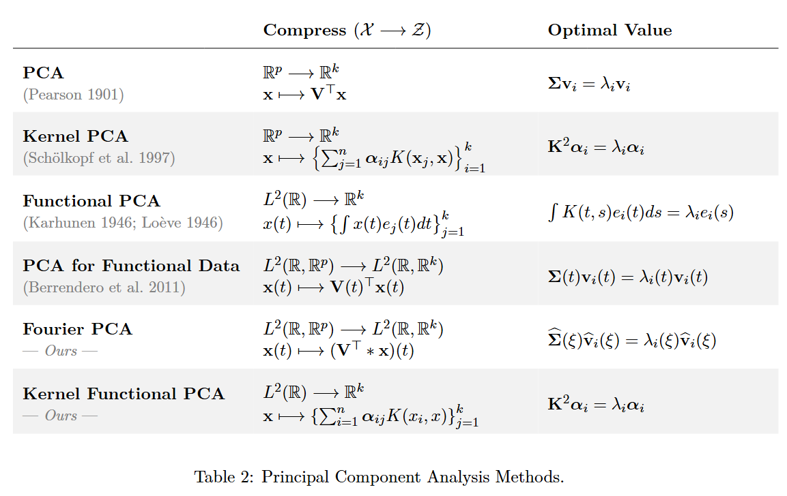
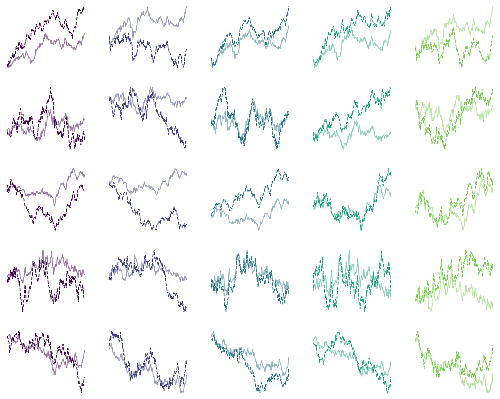
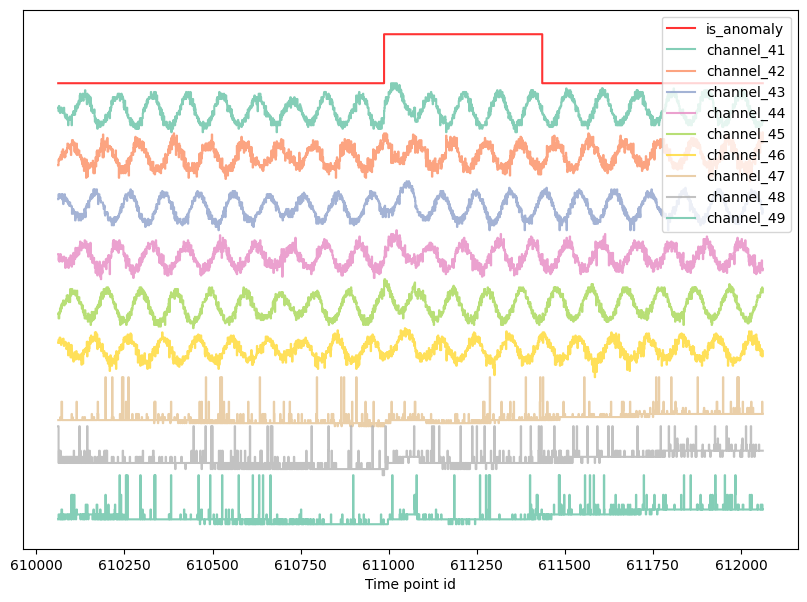
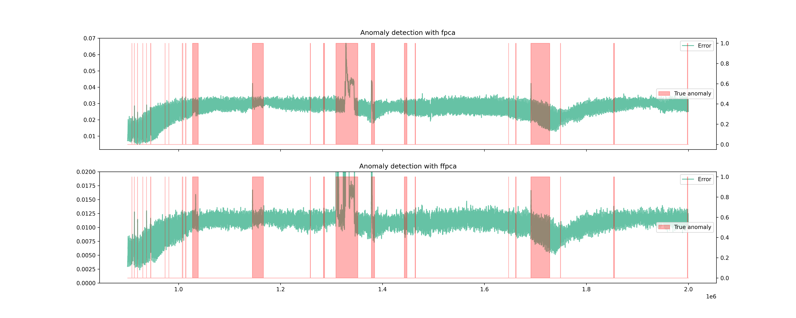
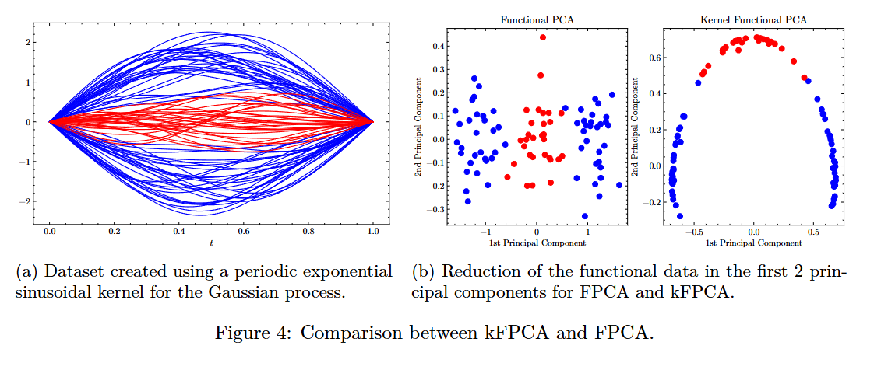

This work is part of project done for a class in the MSc Applied Mathematics in the Autonomous University of Madrid. You can find the complete work [here](https://github.com/dani2442/Functional-Data-Analysis/blob/main/FPCA%20manuscript.pdf). In this manuscript, we explore the application of dimensionality reduction algorithms to real-world datasets within the context of functional data analysis. We establish several theoretical results related to Principal Component Analysis (PCA) for functional data and introduce a novel variation, *Fourier PCA*, inspired by Fourier theory. Additionally, we extend Kernel PCA to the functional data setting by proposing new kernels, adapted from well-known finite-dimensional counterparts, and provide theoretical foundations for their use. Finally, we evaluate and compare the performance of these methods. All code associated with this study is available in a [GitHub repository](https://github.com/dani2442/Functional-Data-Analysis).

For many years, principal component analysis has been a key dimension reduction tool for multivariate data in classical statistics and machine learning. Lately, it has been extended to functional data and termed functional principal component analysis (FPCA). FPCA has taken off to become the most prevalent tool in functional data analysis. This is partly because FPCA facilitates the conversion of inherently infinite-dimensional functional data to a finite-dimensional vector. Under mild assumptions, the underlying stochastic process can be expressed as a countable sequence of uncorrelated random variables, which are then truncated to a finite vector. Then the tools of multivariate data analysis can be readily applied to infinite-dimensional data without the hassle of handling lower-dimensional representations of the data.

Specifically, the dimension reduction is achieved through the Karhunen-Loève expansion, which is a well-known result in stochastic processes. It decomposes observed random trajectories $X_i(t)$ in a functional basis that consists of the eigenvectors of the covariance operator of the process $X$, i.e., $K(s,t) := \text{Cov}(X_s,X_t)$.

The extension of FPCA to multivariate functional data is hence of high practical relevance. Existing approaches for multivariate functional principal component analysis (mFPCA) are based on the multivariate functional Karhunen-Loève expansion to compress the data into a finite-dimensional space (Berrendero, 2011; Chiou, 2014; Jacques, 2014; Ramsay, 2005). However, (Berrendero, 2014) proposed a PCA-like method to compress a multivariate function space \(L^2(\mathbb{R}, \mathbb{R}^p)\) to a lower-dimensional multivariate function space \(L^2(\mathbb{R}, \mathbb{R}^k)\) with \(k\ll p\), using the principles of standard finite-dimensional PCA.

 We will denote by $\mathcal{X}$ the space of our input space; in our case, it will be $L^2(\mathbb{R},\mathbb{R}^d)$. We will denote by $\mathcal{Z}$ the space of the *principal component space* or *latent* space; it can be a finite or infinite-dimensional space, e.g., $\mathbb{R}^n$ or $L^2(\mathbb{R},\mathbb{R}^k)$, see the next Table. The compression method has two functions, the projection that transforms the input into the lower dimensional space, and the functions that *reverse* or 
 $$
 \begin{align}
    \Phi: \;&\mathcal{X} \rightarrow \mathcal{Z} \tag{Transform}\\
    \Phi^*: \;&\mathcal{Z} \rightarrow \mathcal{X} \tag{Inverse Transform}
\end{align}
$$
Let us denote by $P$ the projection onto the subspace spanned by the principal components, i.e., 
$$
\begin{align*}
    P: \mathcal{X}\rightarrow \mathcal{X}\quad\quad\quad P=\Phi^* \circ \Phi
\end{align*}
$$
Let $X$ be a random variable taking values in the space $\mathcal{X}$. The principal component analysis problem can be interpreted from two equivalent perspectives: maximizing the variance of the projections or minimizing the mean squared reconstruction error:

$$
    \max_\Phi \;\text{Var}\left( \Phi(X)\right) \quad\quad \Leftrightarrow \quad\quad
    \min_\Phi \mathbb{E} \|X-P_\Phi X\|^2_{\mathcal{X}}
$$

## Experiments

### 1. Correlated $n-$dimensional Brownian Motion

We simulate a multidimensional Brownian motion with covariance given by the product of $\Sigma = CC^T$ (it needs to be symmetric) where $C$ is a random matrix. Then, the simulated Brownian motion is given by
$$
X_{t+1} = X_{t} + \sqrt{\Delta t}\mathcal{N}(0, \mathbf\Sigma)
$$
For this experiment, we use 5 dimensions, i.e., $p=5$, and our goal is to compress each observation into one ($k=1$). The signals are correlated, so it should be possible with great error despite the noisy signal. The results for 100 experiments can be found in Figure. Observe that both algorithms perform identically in this regime. This is an interesting result and may require further consideration. 

### 2. Anomaly Detection for satellite telemetry

ESA released a large-scale, real-life satellite telemetry [anomaly dataset](https://esoc.esa.int/esa-releases-building-block-open-database-satellite-anomalies).
Solar arrays power regulators switch off, video processing unit reset, attitude disturbances…Throughout its life after launch, a spacecraft is subject to several unexpected behaviours that can lead to loss of scientific data, inadequate performance, and sometimes triggering of spacecraft safe mode, which typically entails a challenging recovery. The dataset, derived from three missions and totaling 31 GB, is curated and annotated to aid the development of AI models for anomaly detection. It consists of over 50 channels and 15 telecommands with over 50M data instances. Figure shows a sample of the data within the spacecraft dataset. We have discarded those channels that spark and contain discontinuities and do not have a functional structure. The way to process the signal is to create a sliding window to process the data. This allows multiple samples of the data and makes it computationally feasible. However, we need to configure the sliding windows length parameter.

### 3. Kernel Functional PCA vs Functional PCA

We create a set of functions that we are not able to separate using any linear projection; hence, Functional PCA is not able to separate both classes. We create three different Gaussian process distributions. We use a periodic covariance, specifically, we use the Exponential Sine Square kernel that is given by
$$
    k(x, x') = \sigma^2 \exp\left(-\frac{2}{\ell^2} \sin^2\left( \pi \frac{|x - x'|}{p} \right) \right)
$$
where $\sigma^2$ is the overall variance ($\sigma$ is also known as amplitude), $\ell$ is the lengthscale, and $p$ the period, which is the distance between repetitions. We choose $p=1$ and we subtract the resulting sampling to the first value so that they start at the same value. We create the first class with mean $\mu(t)=\pm\sin(t\pi)$ and the second class with zero mean. Moreover, we use the Kernel of the RBF for the PCA kernel, i.e., 
$$
    K(x,y) := \exp\{-\|x-y\|_{\mathcal{H}}^2/(2\sigma^2)\}
$$
where we use $\sigma^2=1$ as the kernel.

Finally, we see that using only the 2nd principal component we are able to separate both classes. We can see that, alternatively, the standard Functional PCA is not able to separate both categories of functions. In fact, it can be proven that using a single principal component, we are not able to separate the classes.

