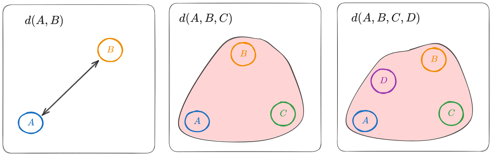
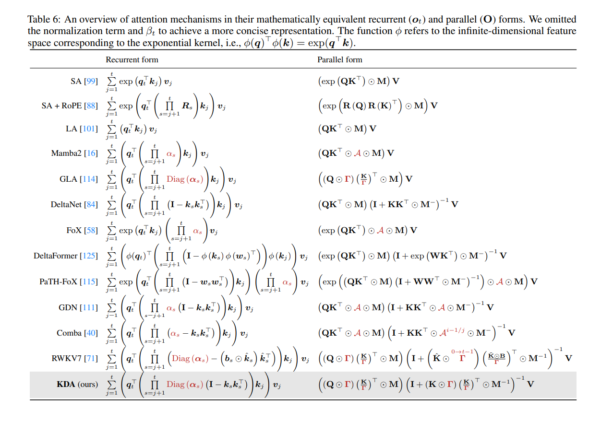
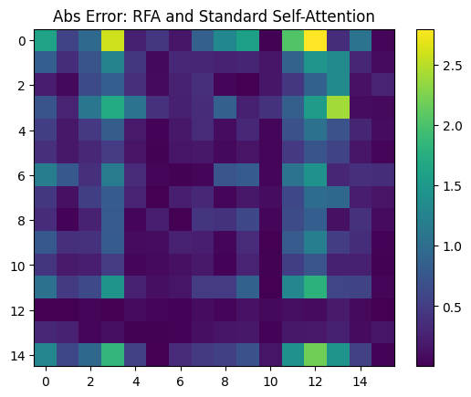
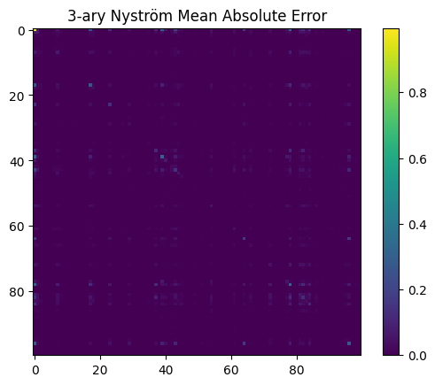

For a while, I’ve been thinking about generalizing self-attention mechanisms. Most attention mechanisms today are based on pairwise similarities (dot products) between query and key vectors. However, higher-order relationships (involving triples or tuples of elements) could capture richer interactions. I then found that several people are already exploring this idea under the name “higher-order attention” [[5]](#references).

I wanted to give my point of view on this topic, connecting it with kernel methods and generalized metric spaces (G-metric spaces). 


## 1. Motivation: Self-Attention

We are all familiar with the self-attention mechanism used in transformers:
Given input vectors $x_i \in \mathbb{R}^{d_m}$, define:
$$
Q_i = W_Q x_i, \quad K_j = W_K x_j, \quad V_j = W_V x_j
$$
where $W_Q, W_K \in \mathbb{R}^{d_m \times d_a}, W_V \in \mathbb{R}^{d_m \times d_v}$ are learned projection matrices.

Then the attention from token $i$ to token $j$ is
$$
\text{Attn}(x_i, x_j) = \text{softmax}_j\left(Q_i K_j^\top\right) V_j = \frac{\exp(\langle Q_i, K_j \rangle)}{\sum_{k} \exp(\langle Q_i, K_k \rangle)} V_j
$$
where we have omitted scaling factors for simplicity.
and the aggregated output for token $i$ is
$$
\text{Attn}(x_i, X) = \sum_j \alpha_{ij} V_j
$$

We can see that attention is fundamentally based on pairwise interactions between elements (queries and keys):
$$
\kappa_{i,j}\equiv \kappa(x_i, x_j) = \exp(\langle Q_i, K_j \rangle) = \exp(Q_{i,\ell} K_{j,\ell})
$$
with summation over $\ell$ implied. This is why attention is $\mathcal{O}(n^2)$ in the number of tokens $n$. Moreover, attention can be interpreted as a kernel method, where the kernel is given by the dot product between the projected vectors.


This can be implemented as follows:
```python
n = 15  # number of tokens
d_model, d_attn, d_value = 5, 4, 16 # dm, da, dv
X = torch.randn(n, d_model)
Wq = torch.randn(d_model, d_attn)
Wk = torch.randn(d_model, d_attn)
Wv = torch.randn(d_model, d_value)

def self_attention(X, Wq, Wk, Wv, scale=1.0):
    Q = X @ Wq * scale # [n, da]
    K = X @ Wk * scale # [n, da]
    V = X @ Wv # [n, dv]
    scores = Q @ K.T # or torch.einsum('il,jl->ij', Q, K); [n,n]              
    attn = torch.softmax(scores, axis=1) # [n,n]
    Y = attn @ V # or torch.einsum('ij,jd->id', attn, V); [n, dv]
    return Y

Y = self_attention(X, Wq, Wk, Wv, scale=1.0/np.sqrt(d_attn))
```

The following picture summarizes several variations of self-attention:

> *Figure: Variations of attention mechanisms that have been proposed recently [[6]](#references)*

### 1.1 Tensor Product Attention

In higher-order attention [[5]](#references), the idea is to consider interactions among triples or tuples of elements. For example, a triadic attention mechanism could be defined as:
$$
\kappa_{i,j_1,j_2} = \exp(Q_{i,\ell} K_{j_1, \ell} K_{j_2, \ell})
$$
And the generalization to $m$-ary attention would involve products over $m$ keys:
$$
\kappa_{i,j_1,\ldots,j_m} = \exp(Q_{i,\ell} \prod_{k=1}^m K_{j_k, \ell})
$$


However, most of these approaches make use of tensor products and therefore lose the nice properties of kernels (positive-definiteness, representer theorem, etc.). The following code summarizes the idea:
```python
Wk1 = torch.randn(d_model, d_attn)
Wk2 = torch.randn(d_model, d_attn)

def self_attention_3d(X, Wq, Wk1, Wk2, Wv):
    Q = X @ Wq # [n, da]
    K1 = X @ Wk1 # [n, da]
    K2 = X @ Wk2 # [n, da]
    V = X @ Wv # [n, dv]
    scores = torch.einsum('il,jl,kl->ijk', Q, K1, K2) # [n, n, n]
    attn = torch.softmax(scores.reshape(n, -1), dim=1).reshape(n, n, n) # [n, n, n]
    Vjk = torch.cat([V.unsqueeze(1)+V.unsqueeze(0)], dim=0) # [n, n, dv]
    Y = torch.einsum('ijk,jkd->id', attn, Vjk) # [n, dv]
    return Y

Y_3d = self_attention_3d(X, Wq, Wk1, Wk2, Wv)
```

## 2. Self-Attention and Kernel Methods

As mentioned, self-attention can be interpreted as a kernel method, where the kernel is given by the dot product between the projected vectors. In this section, we will explore the synergy between self-attention and kernel methods, and how to generalize to higher-order attention using computational efficient approximations.

### 2.1 Random Fourier Features for Attention

Computing all $\kappa(Q_i, K_j)$ requires $\mathcal O(n^2)$ time for sequence length $n$, since we need to evaluate the kernel for all pairs $(i,j)$. How can we reduce this cost?

Random Fourier Attention (RFA) [[7]](#references) provides a way to approximate shift-invariant kernels using random features, enabling linear-time computation.

Bochner’s theorem characterizes continuous, shift-invariant, positive-definite kernels on $\mathbb{R}^d$ (the more general case covers locally compact abelian groups, but we focus on $\mathbb{R}^d$ for simplicity):
> **Theorem (Bochner).** A continuous, shift-invariant kernel $\kappa(x,y)=\kappa(x-y)$ on $\mathbb{R}^d$ is positive definite iff it is the Fourier transform of a non-negative measure $\mu.$
> $$ \kappa(z) = \int_{\Omega} e^{-i\langle z, \omega \rangle} d\mu(\omega) $$

That is, there exists a non-negative measure $\mu$ such that
$$
\begin{aligned}
\kappa(x-y) &= \int_{\Omega} e^{-i\langle x-y, \omega \rangle} d\mu(\omega) = \mathbb{E}_{\omega \sim \mu} \left[ e^{-i\langle x-y, \omega \rangle}\right] \\
&= \mathbb{E}_{\omega \sim \mu} \left[ \cos(\langle x-y, \omega \rangle) \right] \\
&=
 \mathbb{E}_{\omega \sim \mu} \left[ \begin{pmatrix}\cos(\langle x, \omega \rangle) \\ \sin(\langle x, \omega \rangle) \end{pmatrix}^\top \begin{pmatrix}\cos(\langle y, \omega \rangle) \\ \sin(\langle y, \omega \rangle) \end{pmatrix} \right]
\end{aligned}\tag{1}
$$
where we can obtain $\mu$ as the inverse Fourier transform of $\kappa$. Indeed, if we assume that $\kappa$ is the Gaussian kernel:
$$
\kappa(z) = \exp\left(-\frac{\|z\|^2}{2\sigma^2}\right)
$$
then we have:
$$
\mu(\omega) = \frac{1}{(2\pi)^d} \int_{\mathbb{R}^d} \kappa(z) e^{-i\langle z, \omega \rangle} dz = (2\pi)^{-d/2}\sigma^d \exp\left(-\frac{\sigma^2 \|\omega\|^2}{2} \right) = \mathcal{N}(\omega; 0, \sigma^{-2} I)
$$
Therefore, we can approximate (1) with a feature map:
$$
\phi(x) = \frac{1}{\sqrt{N}} [\sin(\omega_1^\top x),\dots, \sin(\omega_N^\top x), \cos(\omega_1^\top x),\dots, \cos(\omega_N^\top x)]^\top
$$
where $\omega_1, \dots, \omega_N \stackrel{i.i.d.}{\sim} \mu$. By the law of large numbers, the error goes to zero at rate $\mathcal O(1/\sqrt{N})$ as $N\to\infty$.


This trick makes the problem linear in $n$: we obtain a feature map $\phi: \mathbb{R}^{d_k}\to\mathbb{R}^r$ such that
$$
\kappa(Q_i, K_j) \approx \phi(Q_i)^\top \phi(K_j),
$$
with $r \ll n$.
We can then rewrite
$$
\sum_j \kappa(Q_i, K_j)V_j \approx \sum_j \phi(Q_i)^\top \phi(K_j)V_j
= \phi(Q_i)^\top \Big( \sum_j \phi(K_j)V_j \Big),
$$
which can be computed in $\mathcal O(nr)$ time instead of $\mathcal O(n^2)$.

```python
def rff_attention(X, Wq, Wk, Wv, sigma=1.0, N=1024, eps=1e-8):
    Q = X @ Wq # [n, da]
    K = X @ Wk # [n, da]
    V = X @ Wv # [n, dv]
    omega = torch.randn(d_attn, N) / sigma # [da, N]

    def phi(T): 
        TOm = T @ omega # [n, N]
        return torch.cat([torch.cos(TOm), torch.sin(TOm)], -1) / N**0.5 # [n, 2N]

    phiQ = phi(Q)  # [n, 2N]
    phiK = phi(K)  # [n, 2N]
    CK = torch.exp((K**2).sum(axis=1, keepdims=True) / (2 * sigma**2)) # [n, 1]
    S = (phiK*CK).T @ V  # [2N, dv]
    D = torch.sum(phiK * CK, axis=0, keepdim=True) # [1, 2N]
    
    denom = phiQ @ D.T  # [n, 1]
    numer = phiQ @ S    # [n, dv]
    return numer / (denom + eps)

Y_rfa = rff_attention(X, Wq, Wk, Wv, sigma=np.sqrt(d_attn), N=64)
```
Interestingly, the error between exact attention and RFA attention for $N=64$ is:




### 2.2 Towards Higher-Order Attention

To extend this to higher-order attention, we need to consider kernels that take multiple arguments, e.g., $\kappa(x,y,z)$ for triadic attention. A natural question arises:

> **Are there generalizations of Bochner’s theorem for multi-argument kernels?**

The answer is yes, but first let us introduce some concepts:


> **Definition.**
> A function $f : (\mathbb{R}^d)^n \to \mathbb{C}$ is positive semidefinite of order $n$ if, for all integers $m \ge 1$, for all choices of points $x^{(1)}_i, \dots, x^{(m)}_i \subseteq \mathbb{R}^d$ for $i=1,\dots, n$, and for all complex coefficients $c_1, \dots, c_m$,
> $$ \sum_{i,j=1}^m c_{i} \overline{c_{j}} \, f\big(x^{(i)}_{1}-x^{(j)}_{1}, \dots, x^{(i)}_n-x^{(j)}_n\big) \ge 0.$$


And the generalization of Bochner’s theorem for $n$-ary functions [[8]](#references):


> **Theorem (Generalized Bochner Theorem).**
> If $f: (\mathbb{R}^d)^n \to \mathbb{C}$ is a continuous, stationary, $n$-positive definite function, then there exists a unique finite positive Borel measure $\mu$ on $(\mathbb{R}^d)^n$ such that, for all $x_1,\dots,x_n\in \mathbb{R}^d$,
> $$
> f(x_1,\dots,x_n) = \int e^{i\sum_j (\omega_j\cdot x_j)} \, d\mu(\omega_1,\dots,\omega_n),
> $$
> where $\mu$ is a positive measure.

As in the 2D case, we can rewrite the kernel as an $(n-1)$-dimensional Fourier transform of its lag form:
$$
K(x_1, \dots, x_n) = f(x_2 - x_1, \dots, x_n - x_1)
$$
Let $T(\omega_1,\dots,\omega_{n-1}) = (-\sum_{r=1}^{n-1} \omega_r, \omega_1, \dots, \omega_{n-1})$. Then $\mu=T_{\#}\nu$ is the pushforward of a unique finite positive Borel measure $\nu$ on $(\mathbb{R}^d)^{n-1}$ such that
$$\begin{aligned}K(x_1,\dots,x_n) &= \int e^{i\sum_{j=1}^n x_j\cdot \omega_j} \, d\mu(\omega_1,\dots,\omega_n)\\&= \int e^{i\sum_{j=2}^n (x_j - x_1)\cdot \omega_{j-1}} \, d\nu(\omega_1,\dots,\omega_{n-1})\\
&= k(x_2 - x_1, \dots, x_n - x_1).\end{aligned}$$


**Example 1: i.i.d. Gaussian frequencies**
   $$
   K(x_1,\ldots,x_n)=\exp\Big(-\frac{1}{2\sigma^2}\sum_{j=1}^n \|x_j\|^2\Big).
   $$
   Moreover, in this case, $\omega_j \stackrel{\text{iid}}{\sim}\mathcal N(0,\sigma^{-2} I_d)$.

We are interested in approximating the lagged kernel:
$$
k(\Delta_2,\dots,\Delta_n)
=\exp\left(-\frac{1}{2\sigma^2}\sum_{j=2}^n |\Delta_j|^2\right)
=\prod_{j=2}^n \exp\left(-\frac{|\Delta_j|^2}{2\sigma^2}\right).
$$
Its spectral measure $\nu$ factorizes:
$$
\eta_{j-1}\ \stackrel{\text{i.i.d.}}{\sim}\ \mathcal N(0,\sigma^{-2}I_d),\qquad j=2,\dots,n.
$$
So we can use either construction above with $\eta^{(m)}_{j-1}\sim \mathcal N(0,\sigma^{-2}I_d)$. And the feature map is
$$\phi_j(x)=\frac{1}{\sqrt{N}} [\sin(\omega_1^\top x),\dots, \sin(\omega_N^\top x), \cos(\omega_1^\top x),\dots, \cos(\omega_N^\top x)]^\top$$


```python
n, d = 5, 50
x = torch.randn(n, d)

def k_mc(x, sigma=1.0, N=128):
    n, d = x.shape
    diffs = x[1:] - x[0] # [n-1, d]
    omegas = torch.randn(n-1, d, N) / sigma

    m = torch.einsum('ij,ijk->ik', diffs, omegas) # [n-1, N]
    phi = torch.cat([torch.cos(m), torch.sin(m)], -1) / N**0.5 # [n-1, 2N]
    return torch.mean(torch.prod(phi, dim=0))

def k_exact(x, sigma=1.0):
    diffs = x[1:] - x[0] # [n-1, d]
    return torch.exp(-0.5 * sigma**2 * torch.sum(diffs**2))

f = lambda : torch.norm(k_mc(x, sigma=1.0, N=16) - k_exact(x, sigma=1.0))
errors = np.array([f().item() for _ in range(1000)])
print(f"L2 Error mean: {errors.mean():.9f}", f"std: {errors.std():.9f}")
```
```console
L2 Error mean: 0.000141528 std: 0.000105931
```
The error is surprisingly small.

**Example 2: Correlated Gaussian frequencies.** Let $R\in\mathbb{R}^{n\times n}$ be any correlation matrix (symmetric PSD with ones on the diagonal). Then
   $$
   K(x_1,\ldots,x_n)
   =\exp\Big(-\frac{1}{2\sigma^2}\sum_{j,k=1}^n \mathbf R_{jk}\, x_j\cdot x_k\Big),
   $$
   which couples different points via $\mathbf R$.

### 2.3 Nyström Method

This method is based on the spectral decomposition of positive-definite kernels, known as Mercer’s theorem:

> **Theorem (Mercer).** For every continuous symmetric and positive-definite kernel $K$ on a compact $X$, there exists an orthonormal basis of $L^2$ functions $\{\phi_i\}_{i=1}^\infty$ and non-negative eigenvalues $\{\lambda_i\}_{i=1}^\infty$ such that 
$$
K(x,y) = \sum_{i=1}^\infty \lambda_i \phi_i(x) \phi_i(y).
$$

We use the truncated expansion to $m$ and absorb eigenvalues:
$$
\psi_i(x)=\sqrt{\lambda_i}\,\phi_i(x).
$$
In practice we don't usually have a closed-form $(\lambda_i,\phi_i)$, so we obtain $\psi$ data-adaptively via Nyström with $m$ landmarks $Z=\{z_1,\dots,z_m\}$:

- $W\in\mathbb{R}^{m\times m}$, $W_{ab}=\kappa(z_a,z_b)$
- $k_Z(x)=[\kappa(x,z_1),\dots,\kappa(x,z_m)]^\top$
- Feature map: $\displaystyle \Psi(x)=W^{-1/2} k_Z(x)\in\mathbb{R}^m$

This yields $\kappa(x,x')\approx \Psi(x)^\top\Psi(x')$ and is equivalent to a truncated Mercer form on the landmark subspace.

One-off (per head) cost: compute $W^{-1/2}$ in $\mathcal O(m^3)$ offline; reuse it at train/inference.

```python
n, d = 100, 5 # Total data points and data dimension
m = 20 # number of inducing points
X = torch.randn(n, d)
rbf = lambda X, Y: torch.exp(-0.5 * torch.cdist(X, Y)**2)

# Nyström approximation
Y = torch.randn(m, d)
K_mm = rbf(Y, Y)
eigvals, eigvecs = torch.linalg.eigh(K_mm)
K_mm_inv_sqrt = eigvecs @ torch.diag(1/torch.sqrt(torch.clamp(eigvals, 1e-5))) @ eigvecs.T

phi = K_mm_inv_sqrt @ rbf(X, Y).T  # [N, m]
K_approx = phi.T @ phi
K_exact = rbf(X, X)

error = torch.linalg.norm(K_exact - K_approx, 'fro')/torch.linalg.norm(K_exact, 'fro')
print(f"Relative error: {error:.4f}")
```
```console
Relative error: 0.4351
```

### 2.4 Generalization to Higher-order kernels

The Nyström method extends to n-ary kernels via a generalized Mercer theorem:

> **Theorem (Generalized Mercer).** Let $f: (\mathbb{R}^d)^n \to \mathbb{C}$. And view $f$ as a two–argument kernel $K(x_1,z)=f(x_1,z)$. Then the associated Hilbert–Schmidt operator
> $$
S:L^2(\mu^{\otimes(n-1)})\to L^2(\mu),\qquad (Sg)(x_1)=\int K(x_1,z)g(z)\,d\mu^{\otimes(n-1)}(z), $$
> admits a singular system $(\sigma_j,u_j,v_j)$ with $(\sigma_j\ge 0)$, $(u_j)$ orthonormal in $(L^2(\mu))$ and $(v_j)$ orthonormal in $(L^2(\mu^{\otimes(n-1)}))$, yielding the *one-vs-rest* expansion
> $$ f(x_1,\dots,x_n)=\sum_{j=1}^\infty \sigma_j u_j(x_1) v_j(x_2,\dots,x_n)
\quad\text{in }L^2(\mu^{\otimes n}). $$
> If $f$ is continuous on a compact domain, the series converges uniformly.


The stronger result 
$$
f(x_1,\dots,x_n)=\sum_{i=1}^\infty \lambda_i \phi_i(x_1)\cdots\phi_i(x_n),\qquad \lambda_i\ge 0,
$$
is not true in general, this property is usually reffered as $f$ being *orthogonally decomposable*.

**Nyström approximation for tri-argument kernels.**

Fix inducing points $C=\{c_1,\dots,c_m\}\subset\mathcal{X}$ and define the *mode-1 unfolding* of the inducing Gram tensor
$$
G \;\coloneqq\; K(C,C,C)_{(1)} \in \mathbb{R}^{m\times m^2},\qquad
G_{i,\,(jk)} \;=\; K(c_i,c_j,c_k).
$$
For any $x\in\mathcal{X}$ define likewise the (row) vector
$$
k_x \;\coloneqq\; K(x,C,C)_{(1)} \in \mathbb{R}^{1\times m^2},\qquad
(k_x)_{(jk)} \;=\; K(x,c_j,c_k).
$$

Now, compute a compact SVD $G=U\Sigma V^\top$ with $U\in\mathbb{R}^{m\times r}$, $\Sigma\in\mathbb{R}^{r\times r}$, $V\in\mathbb{R}^{m^2\times r}$ ($r\le m$).
Define
$$
W \;\coloneqq\; U\,\Sigma^{-1/2}V^\top \in \mathbb{R}^{m\times m^2},
$$
so that $GWW^\top G^\top = UU^\top$ is the orthogonal projector onto $\operatorname{col}(G)$.
The Nyström feature map for the first mode is then
$$
\phi(x) \;\coloneqq\; k_x\, W^\top \;\in\; \mathbb{R}^{m}.
$$
By construction, $\phi(c_i)$ are orthonormal coordinates of the mode-1 fibers $G_{i,:}$, and for any $x$ the vector $k_x$ is projected onto the subspace
$\operatorname{span}\{G_{1,:},\dots,G_{m,:}\}$.

Define the tri-linear approximation
$$
\widehat{K}(x,y,z)
\;\coloneqq\;
\langle \phi(x),\phi(y),\phi(z)\rangle
\;=\;
\sum_{r=1}^{m} \phi_r(x)\,\phi_r(y)\,\phi_r(z).
$$
Expanding with $W$ shows this is precisely the orthogonal projection (in the unfolding space) of the mode-1 fibers associated with $x,y,z$ onto $\operatorname{col}(G)$ \emph{for each mode}, yielding the
best approximation in the induced least-squares sense among all tri-linear forms supported on that span. In particular, if $x\in C$ then $k_x\in\operatorname{col}(G)$ and the projection is exact for that mode.


```python
n, d = 100, 5 # Total data points and data dimension
m = 10 # number of inducing points
X = torch.randn(n, d)

def K3(X, Y, Z):
    dXY = torch.cdist(X, Y).square().unsqueeze(2)  # [x, y, 1]
    dYZ = torch.cdist(Y, Z).square().unsqueeze(0)  # [1, y, z]
    dZX = torch.cdist(X, Z).square().unsqueeze(1)  # [x, 1, z]
    return torch.exp(-0.5 * (dXY + dYZ + dZX))

# Nyström approximation
C = torch.randn(m, d)
K_mm = K3(C, C, C)  # [m, m, m]
U, S, Vh = torch.linalg.svd(K_mm.view(m, m*m))
K_mm_inv_sqrt = U @ F.pad(torch.diag_embed(1/torch.sqrt(S.clamp_min(1e-5))), (0, m*m - m)) @ Vh

phi = K3(X, C, C).view(n, m*m) @ K_mm_inv_sqrt.T   # [N, m]
K_approx = torch.einsum('ir, jr, kr->ijk', phi, phi, phi)
K_exact = K3(X, X, X)

error = torch.linalg.norm(K_exact - K_approx)
print(f"Relative error: {error:.4f}")
```




## 3. Generalized Metric Spaces (G-Metric Spaces)

An alternative approach I came across is the concept of G-metric spaces, which generalize the notion of distance to triples of points.

The concept of a metric space is fundamental in analysis and topology.


> **Definition (Metric Space).** A metric space is a pair $(X,d)$ where $X$ is a set and $d: X \times X \to \mathbb{R}_{\ge 0}$ satisfies:
> 1. $d(x,x)=0$.
> 2. $d(x,y) > 0$ if $x\neq y$ (positivity/identity of indiscernibles).
> 3. $d(x,y)=d(y,x)$ (symmetry).
> 4. $d(x,z)\le d(x,y)+d(y,z)$ (triangle inequality).

This structure underlies the standard notions of convergence, continuity, compactness, and completeness.

It is often useful to consider distances on triples of points rather than only on pairs. This motivates the notion of G-metric spaces, which extend the usual (pairwise) metric to a symmetric, three-argument distance.

> **Definition (G-Metric Space).** Following Mustafa–Sims, a G-metric on a set $X$ is a map $G: X \times X \times X\to \mathbb{R}_{\ge 0}$ such that, for all $x,y,z,a\in X$:
> 1. $G(x,y,z)=0$ if and only if $x=y=z$.
> 2. $G(x,x,y)>0$ whenever $x\neq y$.
> 3. $G(x,x,y)\le G(x,y,z)$ whenever $y\neq z$.
> 4. $G$ is symmetric in its three arguments.
> 5. $G(x,y,z)\le G(x,a,a)+G(a,y,z)$.

When these axioms hold, $(X,G)$ is called a G-metric space. Two simple examples (built from an ordinary metric $d$) are
$$
G(x,y,z)=\max\{d(x,y),\,d(y,z),\,d(z,x)\},\qquad
G(x,y,z)=d(x,y)+d(y,z)+d(z,x).
$$
Both satisfy the axioms above whenever $d$ is a metric. The concept naturally extends to $n$-ary (higher-order) distances, but we focus on the triadic case for clarity.

### 3.1 Topology, Convergence and Completeness

The G-metric generates a natural topology on $X$ via G-balls. For $x_0\in X$ and $r>0$, define the $G$-ball
$$
B_G(x_0, r) := \{ y\in X : G(x_0, y, y)\lt r \}.
$$
One checks that it is “symmetric” in the sense that if $G(x_0,y,z)\lt r$ then both $y$ and $z$ lie in $B_G(x_0,r)$. Proposition 4 of Mustafa–Sims shows that these G-balls form a basis for a topology $\tau(G)$ on $X$, and moreover $\tau(G)$ coincides with the metric topology arising from the associated metric $d_G(x,y) = G(x,y,y) + G(x,x,y)$ [[2]](#references). In particular, every G-metric space is topologically equivalent to an ordinary metric space.

From this one deduces that convergence and continuity in G-metric spaces behave just as in metric spaces. A sequence $(x_n)\subset X$ is G-convergent to $x\in X$ if $x_n\to x$ in the $\tau(G)$-topology. Equivalently, as shown by Mustafa–Sims, $(x_n)$ converges in the G-sense to $x$ if and only if
$$
d_G(x_n, x) \xrightarrow{n\rightarrow\infty} 0,
$$
that is, it converges in the usual metric sense. In fact, the following are equivalent [[2]](#references):

- $(x_n)$ is G-convergent to $x$.
- $d_G(x_n,x)\to0$ as $n\to\infty$.
- $G(x_n,x_n,x)\to0$ as $n\to\infty$.
- $G(x_n,x_m,x)\to0$ as $n,m\to\infty$.

Thus a map $f:(X,G)\to (X',G')$ is G-continuous (continuous in $\tau(G)$) exactly when it is continuous as a map between the corresponding metric spaces. In particular, $G(x,y,z)$ itself is jointly continuous in all three variables.

One likewise defines G-Cauchy sequences: $(x_n)$ is G-Cauchy if for every $\varepsilon>0$ there exists $N$ such that 
$$
G(x_n, x_m, x_\ell) <\varepsilon \qquad \forall n,m,\ell \geq N.
$$
Mustafa–Sims show this is equivalent to $(x_n)$ being Cauchy in $(X,d_G)$. Hence $(X,G)$ is G-complete (every G-Cauchy sequence converges in $G$) if and only if the metric space $(X,d_G)$ is complete. Equivalently, G-completeness coincides with ordinary completeness. As a result, the usual consequences hold: closed subsets of a G-complete space are G-complete, and one obtains a Baire Category theorem in G-metric spaces (every complete G-metric space is non-meager).

Compactness is similarly characterized: a G-metric space is compact if it is G-complete and totally bounded (equivalently, $(X,d_G)$ is compact). In fact, the following are equivalent:

- $(X,G)$ is compact G-metric.
- $(X,\tau(G))$ is compact.
- $(X,d_G)$ is compact.
- Every sequence has a G-convergent subsequence.

G-metric spaces have been extensively used in fixed-point theory, often yielding generalizations or new forms of contraction-type theorems.

> **Theorem (G-Banach fixed point) [[4]](#references).** Suppose $(X,G)$ is G-complete and $T:X\to X$ satisfies a contractive condition in the G-metric, e.g.,
> $$G(Tx,Ty,Tz)\leq k\,G(x,y,z), \qquad 0\le k<1,$$
> for all $x,y,z\in X$. Then $T$ has a unique fixed point in $X$.

### 3.2 Example: G-metric not induced by a pairwise metric

Let $X$ be the vertex set of a connected, edge-weighted, undirected graph. For three vertices $x,y,z\in X$, define
$$
G(x,y,z)=\{\text{length of a minimum Steiner tree that connects } \{x,y,z\}\}.
$$
Equivalently, the minimum total weight of a connected subgraph whose vertex set contains $\{x,y,z\}$.

This $G$ satisfies the axioms:
- $G(x,x,x)=0$.
- If $x\neq y$, then $G(x,x,y)$ is the shortest-path distance between $x$ and $y$, hence $>0$.
- Symmetry is immediate (the definition depends only on the set $\{x,y,z\}$).
- A “rectangle-type” inequality holds: for any $a\in X$, the union of Steiner trees for $\{x,y,a\},\{x,a,z\},\{a,y,z\}$ is a connected subgraph spanning $\{x,y,z\}$ whose total length is at most the sum of the three lengths. Since $G(x,y,z)$ is the minimum such length,
  $$
  G(x,y,z)\le G(x,y,a)+G(x,a,z)+G(a,y,z).
  $$

If a G-metric were composed of ordinary metrics, it would be determined by the three pairwise distances. Steiner length is not determined solely by $d(x,y),d(y,z),d(z,x)$—graph topology matters.

### 3.3 Applications to operator-valued kernels

Let $Z$ be a measurable space with measure $\mu$ and define  
$K_z(x,y):=K(x,y,z)$ for $z\in Z$. Fix a Hilbert space of functions of
$z$ (e.g. $\mathcal H=L^2(\mu)$). Define an operator-valued kernel  
$$
\mathbb{K}(x,y): \mathcal{H}\to\mathcal{H}, 
\qquad 
\bigl[\mathbb{K}(x,y)f\bigr](z)=K(x,y,z)\,f(z).
$$

$\mathbb{K}$ is a valid positive–definite (PD) operator-valued kernel **iff**
$K_z$ is PD for $\mu$-a.e. $z$. Then all the vector-valued RKHS machinery
applies (representer theorem; kernel ridge/SVM for multi-output functions),
with predictors of the form  
$$
F:X\to\mathcal H,\qquad 
F(\cdot)=\sum_{i}\mathbb K(\cdot,x_i)\,c_i,\quad c_i\in\mathcal H .
$$
In this multiplicative case,  
$$
[F(x)](z)=\sum_i K(x,x_i,z)\,c_i(z).
$$

Positive-definiteness of $\mathbb K$ means that for all $x_i\in X$ and
$c_i\in\mathcal H$,  
$$
\sum_{i,j}\big\langle c_i,\ \mathbb K(x_i,x_j)c_j\big\rangle_{\mathcal H}
=\int_Z \sum_{i,j} c_i(z)\,c_j(z)\,K(x_i,x_j,z)\,d\mu(z)\ \ge 0 .
$$

Before giving an example, recall the notion of a conditionally negative-definite (CND) kernel.

> **Definition.** A symmetric kernel $K(x,y)$ is conditionally negative-definite (CND) if, for every finite set of points $x_1,\dots,x_n$ and scalars
> $c_1,\dots,c_n$ satisfying $\sum_i c_i=0$, we have
> $$ \sum_{i,j} c_i c_j K(x_i,x_j)\le 0. $$

Consider a Hilbert-type metric $d(x,y)=\|\Phi(x)-\Phi(y)\|$ induced by a map
$\Phi:X\to\mathcal H$. Then define the G-metric  
$$
G(x,y,z):=\tfrac12\big(\|\Phi(x)-\Phi(y)\|^2+\|\Phi(y)-\Phi(z)\|^2+\|\Phi(z)-\Phi(x)\|^2\big).
$$
This satisfies the axioms, and for each fixed $z$ one can write  
$$
K_z(x,y)=G(x,y,z)
= \tfrac12\|\Phi(x)-\Phi(y)\|^2+u_z(x)+u_z(y),
\qquad 
u_z(x):=\tfrac12\|\Phi(x)-\Phi(z)\|^2.
$$
Since $\|\Phi(x)-\Phi(y)\|^2$ is CND (Schoenberg), and additive terms of the
form $u_z(x)+u_z(y)$ vanish in the CND test (because $\sum_i c_i=0$), it
follows that $K_z$ is CND. Therefore, for any $t>0$,  
$$
\bigl[\overline{\mathbb K}(x,y) f\bigr](z) := e^{-t\, G(x,y,z)}\, f(z)
$$
defines an operator-valued PD kernel.


## 4. Possible future applications 

### 4.1 Triplet-based representation learning

In deep metric learning, we often use *triplet loss*:
$$
L = \max(0, d(f(x_a), f(x_p)) - d(f(x_a), f(x_n)) + \alpha)
$$
which explicitly considers triples (anchor, positive, negative).

A G-metric could encode this triplet geometry directly, rather than defining it indirectly through pairwise distances. One could design a model $G_\theta(x,y,z)$ that is symmetric and satisfies the G-metric axioms while learning consistent triplet relationships.

### 4.2 Higher-order relational learning

In graph representation learning or knowledge graphs, relationships are often ternary or higher, e.g., subject–predicate–object.
A G-metric provides a natural way to model triadic similarity or hypergraph distances.

### 4.3 Higher-order attention
In higher-order attention, the focus is on interactions among triples or tuples of elements:
$$
\operatorname{Attn}(x_i, x_j, x_k) = f(G(x_i, x_j, x_k))
$$
Here, the G-metric measures triadic coherence among the three embeddings, not just pairwise similarity. This contrasts with common approaches to higher-order attention that rely on tensor products [[5]](#references).
This captures contextual or relational dependencies (e.g., how three tokens jointly influence meaning).
It’s useful for relational reasoning, scene understanding, or multi-agent interactions, where relationships are inherently non-pairwise.


## References

[1] Agarwal, R.P., Karapınar, E., O’Regan, D., Roldán-López-de-Hierro, A.F. (2015). G-Metric Spaces. In: Fixed Point Theory in Metric Type Spaces. Springer, Cham. https://doi.org/10.1007/978-3-319-24082-4_3

[2] Mustafa, Zead, and Brailey Sims. "A new approach to generalized metric spaces." Journal of Nonlinear and Convex Analysis 7, no. 2 (2006): 289.

[3] Jleli, Mohamed, and Bessem Samet. "Remarks on G-metric spaces and fixed point theorems." Fixed Point Theory and Applications 2012, no. 1 (2012): 210.

[4] Alghamdi, Maryam A., and Erdal Karapınar. "G-β-ψ-contractive type mappings in G-metric spaces." Fixed Point Theory and Applications 2013, no. 1 (2013): 123.

[5] Omranpour, Soroush, Guillaume Rabusseau, and Reihaneh Rabbany. "Higher Order Transformers: Efficient Attention Mechanism for Tensor Structured Data." arXiv preprint arXiv:2412.02919 (2024).

[6] https://github.com/MoonshotAI/Kimi-Linear/blob/master/tech_report.pdf

[7] Peng, Hao, Nikolaos Pappas, Dani Yogatama, Roy Schwartz, Noah A. Smith, and Lingpeng Kong. "Random feature attention." arXiv preprint arXiv:2103.02143 (2021).

[8] Berg, Christian, Jens Peter Reus Christensen, and Paul Ressel. Harmonic analysis on semigroups: theory of positive definite and related functions. Vol. 100. New York: Springer, 1984.
