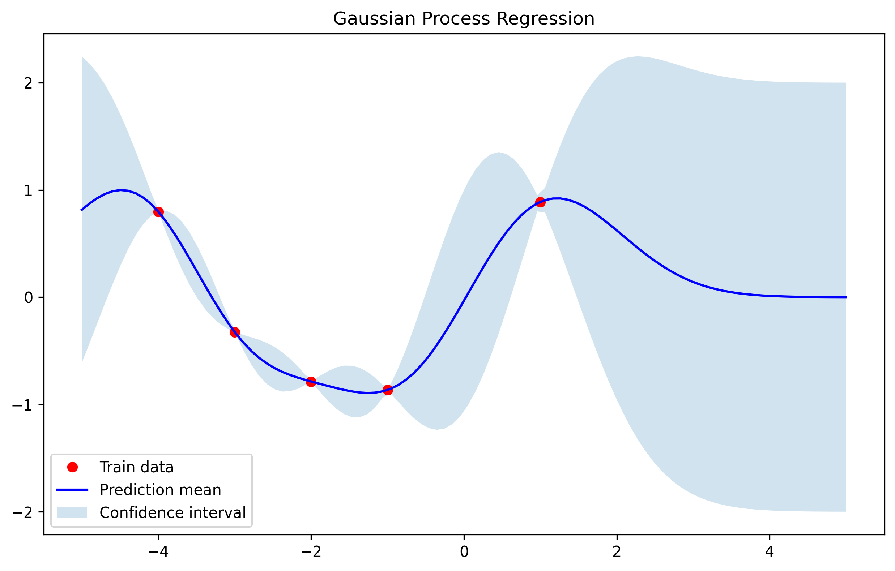
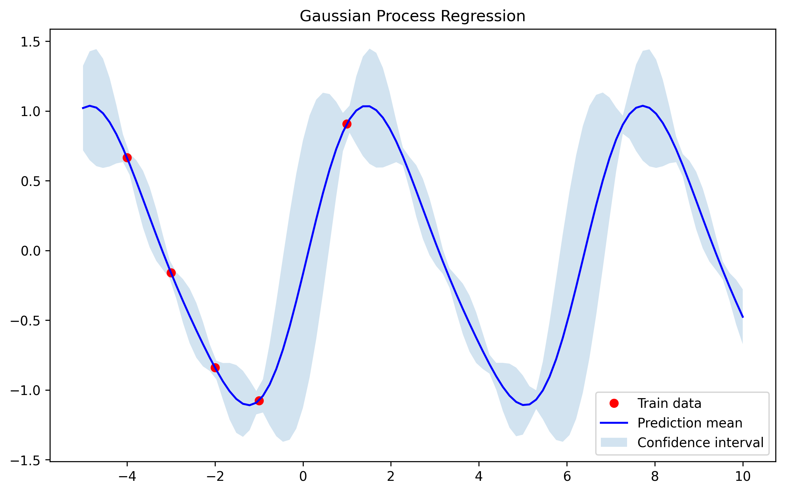
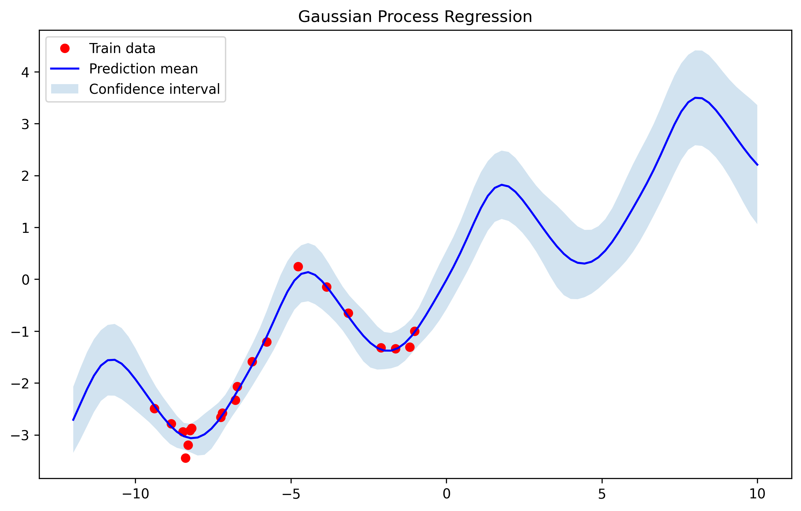
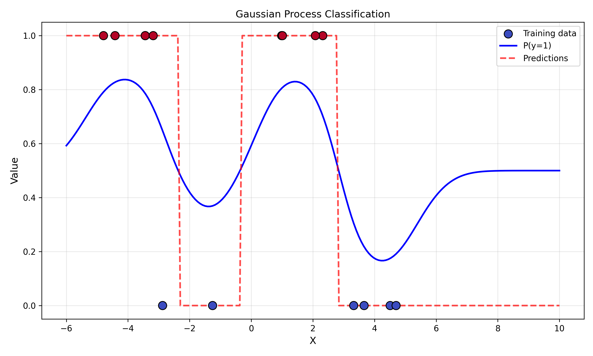
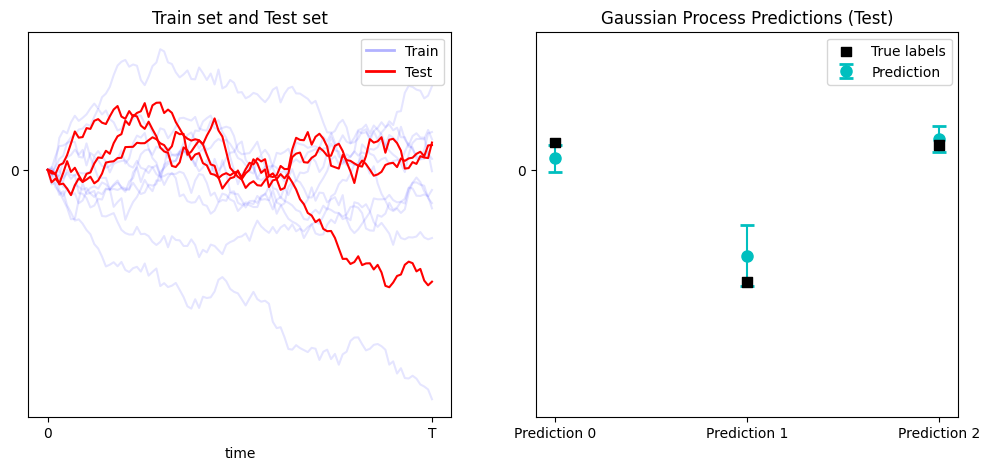

Gaussian Process Regression is one of the key algorithms in machine learning and with this post I want to appreciate the beautiful mathematical theory behind them. I will divide this post into theory and practice, including a sample code.

One of the key advantages of Gaussian Processes vs Deep Learning methods is that it inherently provide with interpretatibility with confidence intervals and uncertainty estimation. Also, it offers really good extrapolation properties as we will see. However, it comes with a hidden cost, it is has a very wide variety of hyperparameters that are far from easy to configure, i.e., only the kernel selection is already challenging and depends case per case basis. Understanding and having a good intuition in the inner workings of this algorithm is key to make the most of it. 

## 1. Theory

For context, a Gaussian process is a type of stochastic process that behaves like an infinite dimensional normal Gaussian distribution. It was introduced by the great Wiener in 1923 [[3]](#references--supplementary-material) and later used for regression in 1960s by Daniel Krige. 

Firstly, I will write the definition of Gaussian process for the shake of completeness:

> A process $X(t)$, $t\in I$ is said to be *Gaussian* when all finite-dimensional projections $(X(t_1), \dots, X(t_n))$ have a Gaussian distribution for $t_1, \dots, t_n \in I$, $n\in \mathbb{N}$.
> 
> This entails that the Gaussian process is entirely determined when we know:
> - The mean function $\mu(t) = \mathbb{E}[X(t)]$.
> - The covariance function $\text{Cov}(X(t), X(s)) = \mathbb{E}[X(t)X(s)] - \mu(t)\mu(s)$.

Gaussian processes belong the family of kernel methods and they are studied in a mathematical structure called *Reproducing Kernel Hilbert Spaces* or RKHS. This allows the use of more complex mathematical structure (non-linear) at *almost* no cost computationally. Some of other kernel methods that you may know are Kernel PCA (non-linear version of PCA) or Support Vector Machines (SVM). Even the self-attention mechanism can be understood as a kernel method [[4]](#references--supplementary-material).

Now, Gaussian processes is a regression algorithm, the goal is to find a function $f$ that maps an input $x$ to an output $y$, or in other words, $f(x) = y$. Let us setup the problem mathematically:

- Training inputs: $X=\{x_i\}_{i=1}^n$.
- Latent function values at training inputs: $f = [f(x_1),\dots,f(x_n)]^\top$.
- Likelihood, $p(y|f)$, is Gaussian: 
$$y_i = f(x_i) + \varepsilon_i \text{, with noise }\varepsilon_i\stackrel{\text{iid}}{\sim}\mathcal N(0,\sigma^2)$$
- Prior on $f(\cdot)\sim \mathcal{GP}$: a Gaussian process with mean $m(\cdot)$ and covariance kernel $k(\cdot,\cdot)$. For now assume $m(\cdot)\equiv 0$; we’ll generalize later.
- Test input: $x_*$ with latent value $f_* = f(x_*)$.

Define covariance matrices/vectors:

- $K \in\mathbb R^{n\times n}$ with $K_{ij}=k(x_i,x_j)$.
- $k_* \in\mathbb R^n$ with $(k_*)_i = k(x_i,x_*) = \operatorname{Cov}(y_i,f_*)$. Note noise on $y$ is independent of $f_*$.
- $k_{**} = k(x_*,x_*) = \operatorname{Var}(f_*)$.
- Covariance of the observed vector $y$: $\mathrm{Cov}(y,y)=K+\sigma^2 I \equiv C_{yy}$.

Some of the most common used kernels in GPR are:
$$
\begin{align}
k(x,x') &= \exp\left\{-\frac{1}{2\sigma}\|x-x'\|^2\right\} \tag{Radial Basis Function (RBF)}\\
k(x,x') &= (\gamma x^\top x' + r)^d \tag{Polynomial kernel}\\
k(x,x') &= \frac{x^\top x'}{\|x\|\cdot \|x'\|} \tag{Cosine similarity kernel}\\
k(x,x') &= \exp\left\{-\frac{\sin^2(\pi|x-x'|/p)}{\ell^2}\right\}\tag{Periodic kernel}
\end{align}
$$

In the following sections we will see three different ways to understand the mathematical formulation of GPR.

### (Option 1) Best Linear Unbaised Estimator (BLUE)

Our goal is to find the linear estimator $\hat f_* := w^\top y$ that minimizes mean squared error (MSE)
$$
\mathrm{MSE}(w)=\mathbb E\big[(f_* - w^\top y)^2\big].
$$
Write the MSE and expand (expectations are over the joint prior of $f$ and noise):

$$
\begin{aligned}
\mathrm{MSE}(w)
&= \mathbb E[f_*^2] - 2,\mathbb E[f_*, w^\top y] + \mathbb E[w^\top y y^\top w] \\
&= k_{**} - 2, w^\top \mathbb E[y f_*] + w^\top \mathbb E[y y^\top] w.
\end{aligned}
$$

But $\mathbb E[y f_*] = k_*$ and $\mathbb E[yy^\top] = C_{yy} = K + \sigma^2 I$. So

$$
\mathrm{MSE}(w) = k_{**} - 2, w^\top k_* + w^\top C_{yy} w.
$$

This is a quadratic function of $w$. Differentiate w.r.t. $w$ and set gradient to zero:

$$
\frac{\partial}{\partial w}\mathrm{MSE}(w) = -2 k_* + 2 C_{yy} w = 0
\quad\Rightarrow\quad C_{yy} w^* = k_*.
$$

Assuming $C_{yy}$ is invertible (typical if $\sigma^2>0$ or $K$ is full rank),

$$
\boxed{w^* = C_{yy}^{-1} k_* = (K+\sigma^2 I)^{-1} k_*.}
$$

Thus the best linear estimator is

$$
\boxed{\hat f_* = {w^*}^\top y = k_*^\top (K+\sigma^2 I)^{-1} y.}
$$

This is exactly the usual GP posterior mean (for zero prior mean).

The minimal MSE (plug $w^*$ back in) is

$$
\begin{aligned}
\mathrm{MSE}_{\min}
&= k_{**} - {k_*}^\top C_{yy}^{-1} k_*.
\end{aligned}
$$

This equals the GP posterior variance at $x_*$. So the minimal achievable MSE by any linear estimator equals the posterior variance.

### (Option 2) Orthogonality interpretation

An equivalent, this derivation uses the orthogonality principle (linear projection): the error $e = f_* - w^\top y$ of the best linear estimator must be uncorrelated with the data used in the estimator:

$$
\mathbb E[e, y] = 0 \quad\Rightarrow\quad \mathbb E[(f_* - w^\top y) y] = 0.
$$

Thus $\mathbb E[f_* y] - \mathbb E[y y^\top] w = 0$, i.e. $k_* - C_{yy} w = 0$, giving the same solution $w = C_{yy}^{-1} k_*$. So the GP predictor is the linear projection of $f_*$ onto the subspace spanned by the observed $y$.


### (Option 3) Joint Gaussian Conditioning

The standard GP route uses the joint distribution of $y$ and $f_*$ is Gaussian:


$$\begin{bmatrix} y \\ f_* \end{bmatrix}
\sim
\mathcal N\left(0,
\begin{bmatrix}
C_{yy} & k_* \\
k_*^\top & k_{**}
\end{bmatrix}
\right).$$

This can be done because the evaluation of a Gaussian Process at finite points is distributed as a normal. The conditional variable of a joint Gaussian is given by
$$
f_* | y \sim \mathcal N(k_*^\top C_{yy}^{-1} y , k_{**} - k_*^\top C_{yy}^{-1} k_*) \tag{Posterior}
$$
Therefore, the conditional expectation and variance for a multivariate Gaussian yields
$$\mathbb E[f_* \mid y] = k_*^\top C_{yy}^{-1} y,
\qquad
\operatorname{Var}(f_* \mid y) = k_{**} - k_*^\top C_{yy}^{-1} k_*.$$


So the posterior mean equals the linear estimator we derived by minimizing MSE. For Gaussian processes, the posterior mean is both the Bayes (minimum mean squared error over all measurable estimators) and, as we've shown, the best linear estimator.

> *Important conceptual note: for a Gaussian prior the **optimal** estimator under squared loss is the conditional mean, and because of Gaussianity that conditional mean is linear in $y$. For non-Gaussian priors the best linear estimator (projection) is still $k_*^\top C_{yy}^{-1} y$ but it will not, in general, equal the conditional mean.*


### 1.2 Nonzero mean function

If the GP has mean function $m(\cdot)$, write $m_X = [m(x_1),\dots,m(x_n)]^\top$ and $m_* = m(x_*)$. The model is $y = m_X + (f - m_X) + \varepsilon$. Working with centered quantities $y - m_X$ and $f_* - m_*$ (which have zero mean) gives the estimator

$$
\mathbb E[f_* \mid y] = m_* + k_*^\top (K+\sigma^2 I)^{-1} (y - m_X).
$$


So you subtract the prior mean from observations, apply the same weight matrix, and add the prior mean back at the test point.


### 1.3 Complexity Analysis

- The training complexity is $\mathcal O(n^3)$ due to inversion of the matrix $C_{yy}$.
- The prediction
    - Mean: $\mathcal O(n)$ after precomputation of $C_{yy}^{-1}y$.
    - covariance: $\mathcal O(n^2)$ due to the multiplication of of $C_{yy}^{-1}k_*$.

But keep in mind that using GPUs this can be parallelized and improved drastically.

## 2. Practice and Code

For this implementation we will use the RBF Kernel:
$$
K(x,x') = e^{-\frac{1}{2\sigma}\|x-x'\|^2}
$$
This kernel is widely used because it is local and *universal* (Corollary 4.58, [[1]](#references--supplementary-material)). This latter property it is very useful to guarante for asympotitacally proving that it converges to the best possible solution.

The implementation is straightforward using the previous section.
```python
def rbf_kernel(x1, x2, sigma=1.0):
    y = x1.reshape(-1, 1)-x2.reshape(1,-1)
    return np.exp(-0.5 / sigma**2 * np.square(y))

class GaussianProcess:
    def __init__(self, kernel=rbf_kernel, noise=1e-3):
        self.kernel = kernel
        self.noise = noise

    def fit(self, X_train, y_train):
        self.X_train = X_train
        self.y_train = y_train
        self.K = self.kernel(X_train, X_train) + self.noise * np.eye(len(X_train))
        self.K_inv = np.linalg.inv(self.K)

    def predict(self, X_s):
        K_s = self.kernel(self.X_train, X_s)
        K_ss = self.kernel(X_s, X_s)

        mu_s = K_s.T.dot(self.K_inv).dot(self.y_train)
        cov_s = K_ss - K_s.T.dot(self.K_inv).dot(K_s)
        return mu_s, cov_s
```

Now we use a very simple dataset, fit the Gaussian Process and plot the results. 

```python
# Training data (noisy observations)
X_train = np.array([[-4], [-3], [-2], [-1], [1]]).astype(float)
y_train = np.sin(X_train) + 0.1 * np.random.randn(*X_train.shape)

# Test points
X_test = np.linspace(-5, 5, 100).reshape(-1, 1)

# Fit GP and predict
gp = GaussianProcess()
gp.fit(X_train, y_train)
mu_s, cov_s = gp.predict(X_test)
std_s = np.sqrt(np.diag(cov_s))

# Plot
plt.figure(figsize=(10, 6))
plt.plot(X_train, y_train, 'ro', label='Train data')
plt.plot(X_test, mu_s, 'b', label='Prediction mean')
plt.fill_between(X_test.ravel(),
mu_s.ravel() - 2 * std_s,
mu_s.ravel() + 2 * std_s,
alpha=0.2, label='Confidence interval')
plt.legend()
plt.title("Gaussian Process Regression")
plt.show()
```




### Kernel selection and combination
In this case, we know that the information is generated by a periodic function with period $2\pi$. Therefore, it makes sense to use a periodic kernel. And we will see that knowing structure of the data in advance can improve the results drastically. Let us see an example with the periodic kernel:
```python
def periodic_kernel(x1, x2, period=2*np.pi, l=1.5, sigma=2):
    y = x1.reshape(-1, 1) - x2.reshape(1, -1)
    return sigma**2*np.exp(-2 * np.sin(np.pi*y/period)**2/l**2)
```
In this case we are interested in the extrapolation properties of the algorithm outside the data points. And as we can see compared to the gaussian kernel, it generalizes as we are expecting:




Now, we will explore a more complex example. Assume that our data has an stationarity and also trend. This problem has been extensively studied in Time-Series and there are already models that can perform this task (see the ARMA family [[8]](#references--supplementary-material)). However, using the Bayesian approach given by Gaussian Processes can lead to similar performances with the plus of a very interpretable and simple model.

For this case we will use some of the most interesting properties of kernels:

> Kernels can be composed using addition and multiplication.

In this case we are going to combine the periodic kernel with the linear using the sum.

```python
def linear_kernel(x1, x2, c=0, sigma=1):
    return sigma**2*(x1.reshape(-1, 1)-c)*(x2.reshape(1, -1)-c)

X_train = np.array(-10 + 10*np.random.rand(20)).astype(float)
y_train = np.sin(X_train)+X_train/2 + 0.2 * np.random.randn(*X_train.shape)

# Test points
X_test = np.linspace(-12, 10, 100).reshape(-1, 1)

# Fit GP and predict
addition_kernel = lambda x1, x2: periodic_kernel(x1, x2) + linear_kernel(x1, x2)

gp = GaussianProcess(addition_kernel, noise=0.1)
gp.fit(X_train, y_train)
mu_s, cov_s = gp.predict(X_test)
std_s = np.sqrt(np.diag(cov_s))
```
And we obtain the following result:




## References & Supplementary Material

[1] Steinwart, I. and Christmann, A., 2008. Support vector machines. Springer Science & Business Media.  \
[2] Williams, Christopher KI, and Carl Edward Rasmussen. Gaussian processes for machine learning. Vol. 2, no. 3. Cambridge, MA: MIT press, 2006. \
[3] https://djalil.chafai.net/docs/M2/history-brownian-motion/Wiener%20-%201923.pdf \
[4] https://x.com/docmilanfar/status/1974328880564752525  
[5] Visual explanation of Gaussian Processes:
https://distill.pub/2019/visual-exploration-gaussian-processes/ \
[6] Scikit code examples (optimized): https://scikit-learn.org/stable/modules/gaussian_process.html \
[7] GPytorch (Efficient GP library using torch as backend): https://github.com/cornellius-gp/gpytorch \
[8] Python package for time-series: https://www.statsmodels.org/stable/index.html

## Appendix

### (A) Gaussian Process Classification
As we saw in section [1](#option-3-joint-gaussian-conditioning), in the case of classification there is no closed form formula to calculate it.
In GP classification, the outputs $y_i \in \{0,1\}$, so a Gaussian likelihood doesn’t make sense.
Instead, we assume the likelihood is given by a sigmoid function (or logistic):
$$
p(y_i=1 \mid f_i) \equiv \sigma(f_i)= \frac{1}{1 + e^{-f_i}} \tag{Likelihood}
$$
The joint model is:
$$
p(\mathbf{y}, \mathbf{f}) = p(\mathbf{y} \mid \mathbf{f}) p(\mathbf{f})
$$
where the prior is given by the Gaussian process, as in previous section,
$$
p(\mathbf{f}) = \mathcal{N}(\mathbf{f} \mid 0, K) \tag{Prior}
$$
and
$$
p(\mathbf{y} \mid \mathbf{f}) = \prod_{i=1}^n \sigma(f_i)^{y_i} [1 - \sigma(f_i)]^{1 - y_i}
$$
The problem is that the posterior is **intractable**. We want:
$$
p(\mathbf{f} \mid \mathbf{y}) = \frac{p(\mathbf{y} \mid \mathbf{f}) p(\mathbf{f})}{p(\mathbf{y})} \tag{Posterior}
$$
but since $p(\mathbf{y} \mid \mathbf{f}) $ is non-Gaussian, the posterior is not Gaussian and $p(\mathbf{y}) = \int p(\mathbf{y} \mid \mathbf{f}) p(\mathbf{f}) d\mathbf{f} $ is intractable. The solution is to approximate the posterior by a Gaussian distribution. The following table compares both methods. 


| Aspect     | GP Regression             | GP Classification             |
|:----------:|-------------------------|-----------------------------|
| Likelihood | Gaussian                  | Bernoulli via logistic/probit |
| Posterior  | Analytic                  | Approximate (Laplace/EP)      |
| Output     | Continuous mean, variance | Class probabilities           |
| Training   | Linear algebra only       | Iterative (Newton-Raphson)    |


We will use the *Laplace approximation* to approximate the intractable distribution with a Gaussian centered at its mode.

>The idea:
>$$p(f \mid y) \approx \mathcal{N}(f \mid \hat{f}, \Sigma)$$
>where:
>
>- $ \hat{f} = \arg\max_{f} \log p(f \mid \mathbf{y}) $ is the *mode*,
>- $ \Sigma^{-1} = - \nabla^2_{f} \log p(f \mid \mathbf{y}) \big|_{f = \hat{f}} $ is given by the curvature / Hessian at the mode.


**Why this makes sense?**

The Laplace method relies on a second-order Taylor expansion of the log-posterior around its mode.

> (Step 1) Approximate the posterior.

Let:
$$
\psi(f) = \log p(f \mid \mathbf{y})
$$

Then we can approximate $\psi(f)$ near its maximum $\hat{f}$ by a quadratic function (the first derivative is zero):

$$
\psi(f) \approx \psi(\hat{f}) - \frac{1}{2} (f - \hat{f})^T A (f - \hat{f})
$$

where: $A = - \nabla^2 \psi(f) \big|_{\hat{f}}$.
Exponentiating both sides gives:

$$
p(f \mid \mathbf{y}) \propto e^{\psi(f)} \approx e^{\psi(\hat{f})}  \exp\left( -\frac{1}{2} (f - \hat{f})^T A (f - \hat{f}) \right)
$$

That’s just a Gaussian density:
$$
p(f \mid \mathbf{y}) \approx \mathcal{N}(f \mid \hat{f}, A^{-1})
$$

Let us apply this to GP classification. We start from the log posterior:

$$
\log p(f \mid \mathbf{y}) = \log p(\mathbf{y} \mid f) + \log p(f) + \text{const}
$$

Applying log to the (Prior), we obtain
$$
\log p(f) = -\frac{1}{2} f^T K^{-1} f - \frac{1}{2} \log |K| + \text{const}
$$
And likewise, to the likelihood:
$$
\log p(\mathbf{y} \mid f) = \sum_i \big[ y_i \log \sigma(f_i) + (1 - y_i)\log (1 - \sigma(f_i)) \big]
$$

> (Step 2) Now we will find the mode, denoted by $\hat{f}$.

We maximize $\log p(f \mid \mathbf{y})$ using Newton-Raphson:

$$
\nabla \log p(f \mid \mathbf{y}) = \nabla \log p(\mathbf{y} \mid f) - K^{-1} f
$$
$$
\nabla^2 \log p(f \mid \mathbf{y}) = -W - K^{-1}
$$
where
$$
W = -\nabla^2 \log p(\mathbf{y} \mid f) = \text{diag}(\pi_i (1 - \pi_i)), \quad \pi_i = \sigma(f_i)
$$

We iteratively update:
$$
f_{\text{new}} = f - (K^{-1} + W)^{-1} (\nabla \log p(\mathbf{y} \mid f) - K^{-1} f)
$$
until convergence to $\hat{f}$.

For a new input $x_*$, the joint prior is:
$$\begin{bmatrix}
\mathbf{f} \\ f_*
\end{bmatrix} \sim \mathcal{N}\left(
0,
\begin{bmatrix}
K & k_* \\
k_*^T & k_{**}
\end{bmatrix}
\right)
$$

Then, using the argument of the joint-conditoinal probabtility, the probability of $\mathbf{f}$ under the approximate Gaussian posterior gives:
$$
p(f_* \mid \mathbf{y}) \approx \mathcal{N}(f_* \mid m_*, v_*)
$$
with:
$$
m_* = k_*^T K^{-1} \hat{\mathbf{f}}, \quad v_* = k_{**} - k_*^T (K^{-1} - K^{-1}\Sigma K^{-1}) k_*
$$

Then, the predictive class probability is:
$$
p(y_* = 1 \mid \mathbf{y}) = \int \sigma(f_*) p(f_* \mid \mathbf{y}) , df_* \approx  \Phi\left( \frac{m_*}{\sqrt{1 + v_*}} \right)
$$

Now, let us see the results in the code.

```python
class GaussianProcessClassifier:
    def __init__(self, kernel, noise=1e-6):
        self.kernel = kernel
        self.noise = noise
    
    def fit(self, X_train, y_train, max_iter=100):
        self.X_train = X_train
        self.y_train = y_train.reshape(-1)
        self.K = self.kernel(X_train, X_train) + self.noise * np.eye(len(X_train))
        
        # Initialize latent function values
        f = np.zeros_like(self.y_train)
        
        # Newton-Raphson iteration for Laplace approximation
        for _ in range(max_iter):
            pi = 1 / (1 + np.exp(-f))  # logistic sigmoid
            W = np.diag(pi * (1 - pi))
            
            # Compute B inverse directly
            B = np.eye(len(X_train)) + np.sqrt(W) @ self.K @ np.sqrt(W)
            B_inv = np.linalg.inv(B)
            
            # Solve for b using inverse instead of Cholesky
            sqrt_W = np.sqrt(W)
            b = sqrt_W @ B_inv @ sqrt_W @ self.K @ (self.y_train - pi)
            
            f = self.K @ b  # update latent f
        
        self.f = f
        self.W = W
        self.pi = pi
        self.B_inv = B_inv  # store for prediction
    
    def predict_proba(self, X_s):
        K_s = self.kernel(self.X_train, X_s)
        K_ss = self.kernel(X_s, X_s)
        
        # Predictive mean and variance for latent function
        sqrt_W = np.sqrt(self.W)
        v = sqrt_W @ K_s
        f_mean = K_s.T.dot(self.y_train - self.pi)
        f_var = np.diag(K_ss - v.T @ self.B_inv @ v)
        
        # Approximate class probability via probit approximation
        probs = norm.cdf(f_mean / np.sqrt(1 + f_var))
        return probs
```
And now let us test the result with a dataset that classifies 1 if the data is positive, otherwise it classifies negative.
```python
np.random.seed(42)
X_train = np.linspace(-5, 5, 15).reshape(-1, 1)
y_train = (np.sin(X_train) > 0).astype(int)  # binary labels (0/1)

X_test = np.linspace(-6, 10, 200).reshape(-1, 1)

gp_clf = GaussianProcessClassifier(rbf_kernel)
gp_clf.fit(X_train, y_train)
probs = gp_clf.predict_proba(X_test)
preds = gp_clf.predict(X_test)

# Plot
plt.figure(figsize=(10, 6))
plt.scatter(X_train, y_train, c=y_train, cmap='coolwarm', s=100, edgecolors='k', label='Training data', zorder=3)
plt.plot(X_test, probs[:], 'b-', label='P(y=1)', linewidth=2)
plt.plot(X_test, preds, 'r--', label='Predictions', linewidth=2, alpha=0.7)
plt.xlabel('X', fontsize=12)
plt.ylabel('Value', fontsize=12)
plt.legend()
plt.grid(alpha=0.3)
plt.title('Gaussian Process Classification')
plt.tight_layout()
plt.show()
```




Notice that we should have used the periodic kernel instead of the RBF kernel. I leave it as an exercise to the reader hehehe.


### (B) Functional Gaussian Processes

Up until now, we have considered a data that belongs to $\mathbb{R}$. The generalization to the euclidean space, $x\in \mathbb{R}^n$ and $y\in \mathbb{R}^m$, is straightfoward using the same procedure. However, one may ask, 

> what if we consider data that are functions instead of points?

This same question is the root of Functional Data Analysis (FDA). And, with this in mind, we can generalize the Gaussian process to take functions or even produce functions. In this case, consider a problem where our data is a function/time-series, $x(t)$ and we want to map it to variable $y$, i.e., $y = f(x(t))$. We can also predict functions, but for the shake of simplicity we assume that $y\in \mathbb{R}$.

Let us put an example. Imagine that we have the following dataset of Brownian motion as input $x(t)$:

> **Goal**: given $x(t)$, $1\leq t\leq T$, we want to predict the value at $x(T)$. 

We can use a functional kernel
$$
k(x,x') = e^{-\frac{1}{2\sigma^2}\|x-x'\|_{L^2}^2} \tag{Functional RBF}
$$
and proceed as before. Let us include the code:

```python
def rbf_kernel(x1, x2, dt, sigma=1.0):
    y = np.square(x1[:, None, :] - x2[None, :, :])
    integral = np.sum(dt * (y[...,:-1] + y[...,1:]) * 0.5, axis=-1)
    return np.exp(-1 / (2*sigma**2) * integral)
```
Generate the dataset and use the Gaussian Process to fit and predict. Notice that we use the same `GaussianProcess` class as before.
```python
N = 100
num = 10
dt = 1/(N-1)
t = np.linspace(0,1,N)

def generate_brownian(num, N):
    incs = np.sqrt(dt) * np.random.randn(num, N-1)
    return np.concatenate((np.zeros((num,1)), np.cumsum(incs, axis=1)), axis=1)

X_train = generate_brownian(num, N)
X_test = generate_brownian(3, N)

# Training data (noisy observations)
y_train = X_train[:,-1] + 0.1 * np.random.randn(X_train.shape[0])
y_test = X_test[:,-1]

# Fit GP and predict
gp = GaussianProcess(rbf_kernel, dt)
gp.fit(X_train, y_train)
mu_s, cov_s = gp.predict(X_test)
std_s = np.sqrt(np.diag(cov_s))
```


We obtain the following results for the the 3 test samples.



The results are quite good despite only using 10 training samples.


### (C) Stable Guassian Process with Cholesky decomposition


One last aspect we have skipped during the implementation is that the matrix $C_{yy}$ is invertible. This is not a very good assumption and in practice it can lead to unstable behaviour. However, there is a nice patch using the Cholesky decomposition. 
$C_{yy}$ is positive definite since $C_{yy} = K + \sigma I$ where $K$ is positive semi-definite. Hence,
$$
C_{yy} = L L^\top
$$

**(1) Predictive mean:**
$$
\mathbb{E}[f_* \mid y] = k_*^\top C_{yy}^{-1} y
$$

Instead of computing $C_{yy}^{-1}$, we solve the equivalent linear system using the Cholesky factors:

1. Solve $L v = y$
2. Solve $L^\top \alpha = v$

Now $\alpha = C_{yy}^{-1} y$. So the mean is:
$$
\mathbb E[f_* \mid y] = k_*^\top \alpha
$$  


**(2) Predictive covariance**

The predictive covariance is:

$$
\operatorname{Var}(f_* \mid y) = k_{**} - k_*^\top C_{yy}^{-1} k_*
$$

Again, avoid $C_{yy}^{-1}$.
Instead compute:

1. Solve $L v = k_*$.
2. Then $k_*^\top C_{yy}^{-1} k_* = v^\top v$.

So:
$$
\operatorname{Var}(f_* \mid y) = k_{**} - v^\top v
$$

The result looks as follows

```python
class GaussianProcess:
    def __init__(self, kernel, noise=1e-3):
        self.kernel = kernel
        self.noise = noise

    def fit(self, X_train, y_train):
        self.X_train = X_train
        self.y_train = y_train
        K = self.kernel(X_train, X_train) + self.noise * np.eye(len(X_train))
        self.L = np.linalg.cholesky(K)

    def predict(self, X_s):
        K_s = self.kernel(self.X_train, X_s)
        K_ss = self.kernel(X_s, X_s)

        v = np.linalg.solve(self.L, self.y_train) # First solve L v = y
        alpha = np.linalg.solve(self.L.T, v) # Then solve L^T alpha = v
        mu_s = K_s.T.dot(alpha)

        v = np.linalg.solve(self.L, K_s) # Solve for L\K_s
        cov_s = K_ss - v.T.dot(v)

        return mu_s, cov_s
```


### (D) Relation between Gaussian Process Regression and Maximum Mean Discrepancy (MMD)


Let $\mathcal H$ be the RKHS with reproducing kernel $k(\cdot,\cdot)$. For a location $x$ denote the representer $k_x := k(\cdot,x)\in\mathcal H$.
For two (signed) measures $\mu,\nu$ the squared MMD (kernel mean embedding distance) is
$$
\mathrm{MMD}^2(\mu,\nu) = \|\mu-\nu\|_{\mathcal H}^2
= \| m_\mu - m_\nu\|_{\mathcal H}^2,
$$
where $m_\mu=\int k(\cdot,x),d\mu(x)$ is the kernel mean map. For discrete/signed measures this reduces to kernel sums.

Take the target distribution $\mu=\delta_{x_*}$ (a unit mass at the test point) so $m_\mu = k_{x_*}$. Take a weighted empirical signed measure $\nu_w=\sum_{i=1}^n w_i \delta_{x_i}$ so $m_{\nu_w}=\sum_i w_i k_{x_i}$. Then
$$
\mathrm{MMD}^2\big(\delta_{x_*},\nu_w\big)
= \|k_{x_*} - \sum_{i} w_i k_{x_i}\|_{\mathcal H}^2.
$$

Use reproducing-kernel identities to expand that squared RKHS norm:
$$
\begin{aligned}
\|k_{x_*} - \sum_i w_i k_{x_i}\|_{\mathcal H}^2
&= \langle k_{x_*},k_{x_*}\rangle - 2\sum_i w_i\langle k_{x_*},k_{x_i}\rangle
\sum_{i,j} w_i w_j \langle k_{x_i},k_{x_j}\rangle \\
  &= k_{**} - 2 w^\top k_* + w^\top K w.
  \end{aligned}
  $$
  This is the MMD between $\delta_{x_*}$ and the weighted empirical measure $\nu_w$.


**Relation to the MSE quadratic form**

Recall from the linear-estimation derivation (zero-mean case) that the MSE of the linear estimator $\hat f_* = w^\top y$ equals
$$
\mathrm{MSE}(w)
= \mathbb E\big[(f_* - w^\top y)^2\big]
= k_{**} - 2 w^\top k_* + w^\top (K + \sigma^2 I) w.
$$

Compare this with the MMD expansion above: the difference is exactly the noise term $\sigma^2 w^\top w = \sigma^2 \|w\|_2^2$. Thus we can write
$$
\boxed{\mathrm{MSE}(w)
= \underbrace{\mathrm{MMD}^2 (\delta_{x_*},\nu_w )}_{\text{deterministic RKHS discrepancy}}+ \sigma^2 \|w\|_2^2.}
$$

So minimizing mean-squared error over linear estimators is *equivalent* to choosing weights $w$ that minimize the RKHS discrepancy (MMD) between the target at $x_*$ and the weighted training points, regularized by the squared $\ell_2$-norm of the weights weighted by the noise variance.
