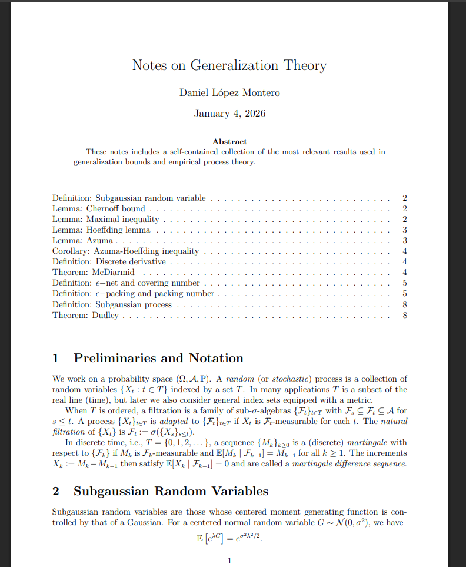

How do we know if a machine learning model will perform well on unseen data? What happens if you continue to add samples to the dataset? Is it better to have a more complex model or a simpler one?

These questions have been around for many years and are central to the field of statistical learning theory. Generalization theory provides mathematical guarantees and bounds on the generalization capability of families of functions. I have prepared a few notes on the basics of generalization theory. The only prerequisite is probability theory, and it is intended to be self-contained. It includes the most important results, such as Dudley's Theorem and McDiarmid's Theorem.

[Link to pdf](/files/generalization.pdf)

