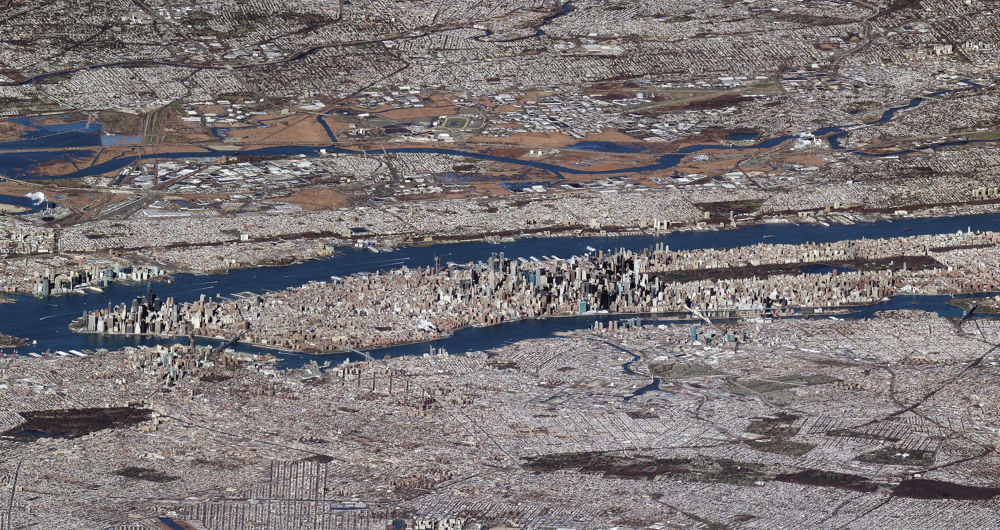
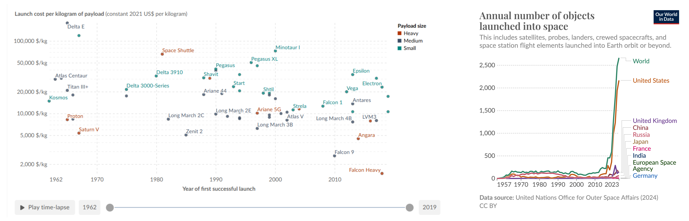
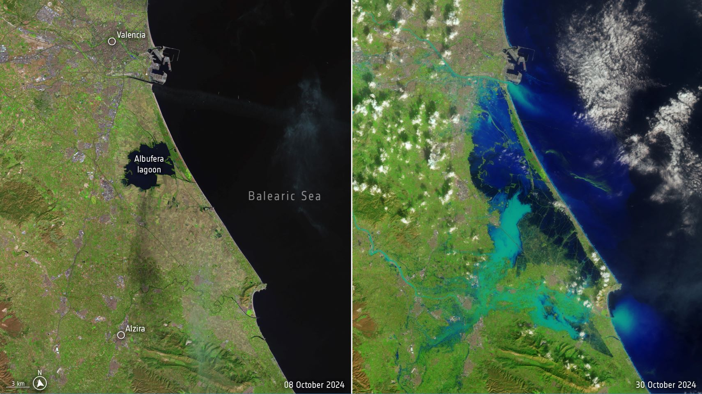
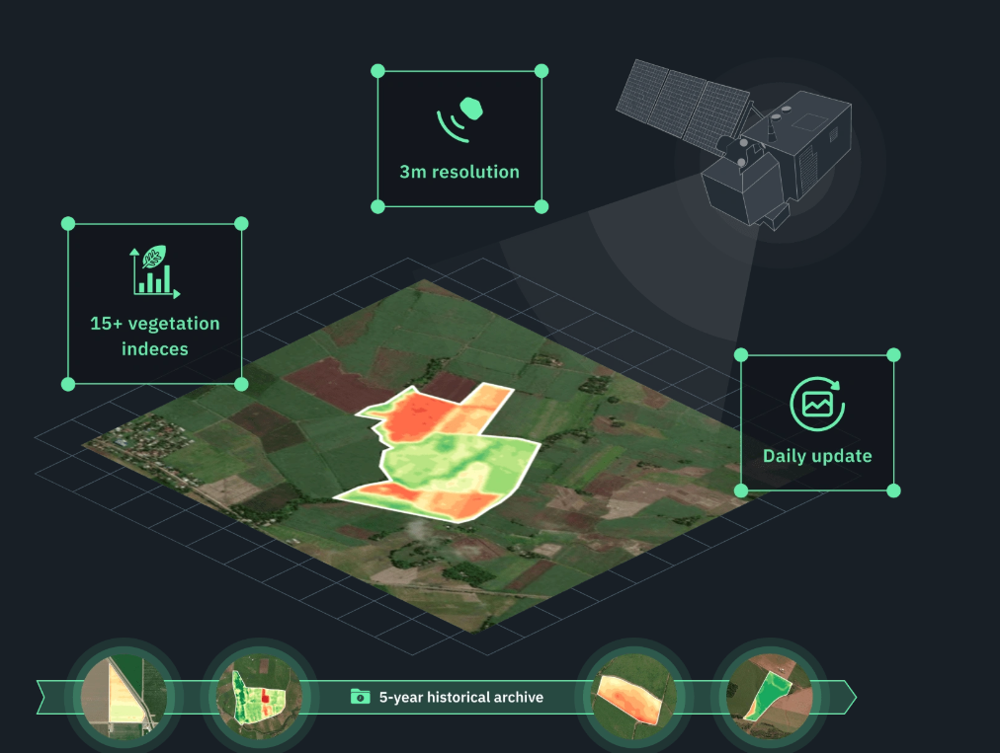
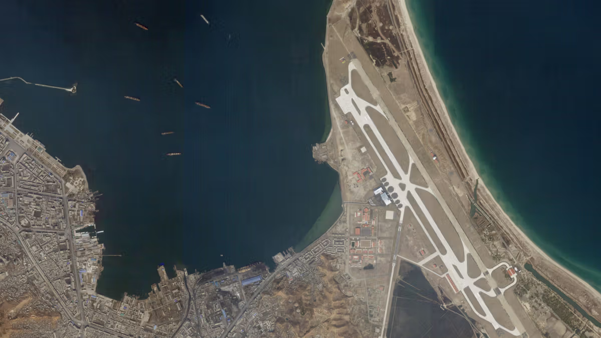
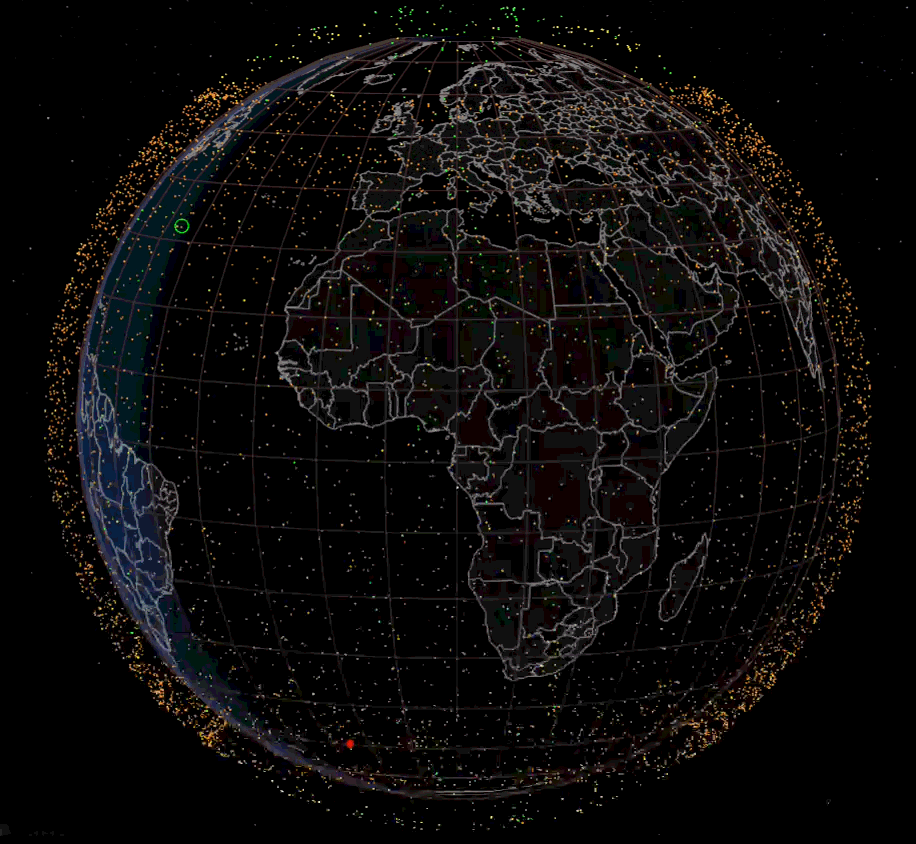

Last week I came across this very high-quality image, at first I thought that it must be one of those expensive satellites that cost millions of dollars. Then I started digging and found out how ignorant i am about the recent advances in satellites.

Apparently, there are three main orbits used by current satellites [[1]](#References):
- LEO (Low Earth Orbit): ~160–2,000 km; short orbital period (90–120 min); low latency; used for Earth observation, Starlink, ISS.
- MEO (Medium Earth Orbit) ~2,000–35,786 km; orbital period ~2–12 hrs; GPS/GNSS satellites.
- GEO (Geostationary Earth Orbit): exactly 35,786 km, equatorial; 24-hr period, appears fixed above Earth; ideal for telecom, TV, weather satellites.

  
Before talking about the satellites, we need to understand the main driver of these advancements. There's been a huge decrease on rocket failure rates and reduction in the costs of putting them into orbit. To put things in perspective, between 1970s and the 2000s the average launch was about 18.5k USD/kg, while recently the Falcon Heavy only costs around 1.4k USD/kg (more than 10x reduction!!!) [[2]](#references). Also, success rate over 99.46% [[5]](#references).

This is perfect example of the Rebound Effect phenomenon [[4]](#references):
> "as costs fall, previously unviable uses become attractive, creating new markets or applications."

In another chapter, these reductions in costs actually open the door to transplanetary flights. There is still significant room for improvement. For example, SpaceX recently opened its new factory, enabling the production of up to 1,000 rockets per year. Much like Henry Ford, who achieved major cost reductions through mass production, I expect a similar outcome here.

The current market cap is approx 1.3 trillion$ (almost GDP of Spain) and it is estimated that more than 10,000 satellites are currently orbiting Earth. They can be divided into two main categories:

## 1. Communication and internet
The best-known are SpaceX (Starlink) and Amazon (Project Kuiper) with approximately 8000 and 3000 in orbit, respectively. It has limitations in speed limit: average 20-100Mbps for download and 10-20Mbps for upload and ~50ms latency, for a modest price of 29€/month [[7, 8]](#references). 

You may not be able to play *csgo* or *ranked* matches, but certainly covers 99% of daily tasks. Also, more than 31% of the global population does not have access to mobile network [[6, 9]](#references). And many studies suggest that lack of access to technology exacerbates exclusion and poverty [[10, 11]](#references).

  
## 2. Earth Observation
This category includes Governmental devices (mainly reconnaissance and spy) and imagery satellites. Apparently, they provide real-time and high-quality images with resolutions down to 30cm. 

Satellites can carry a wide variety of sensors. The most used are Optical Imagery (regular camera; only day), Synthetic Aperture Radar or *SAR* (microwaves and reflections; day and night), Hyperspectral Imagery (infrared spectrum), Thermal Infrared, atmospheric/radio measurements (weather prediction and meteorology). These cutting-edge sensors can cost up to 40M USD each one and they can be very difficult to replicate.

There are a few players in the game: Planet Labs, Maxar, Satellotic, Capella Space, etc. For context, Planet Labs has more than 200 satellites in orbit.  

The interesting part is that each company generate an overwhelming ~100 TB of data per day! You need a very strong infrastructure to manage and deliver that amount of information. More importantly, you need substantial compute resources to process this data to extract the relevant information. A few months ago, deepmind offered a glimpse of how to process such amounts of data with AlphaEarth [[12]](#references).

## Costs and business model
The mass of these satellites is typically 200-800kg for communication and between 50-200kg for imagery satellites. Putting in orbit a single satellite can cost approx 4k-400k USD [[13]](#references). So the vast majority of the cost is spent down on mainland. For example, Planet Labs subscription costs 20k USD/year. The median life span of these Low-Earth Orbit satellites is roughly 5-7 years (friction is greater), so profitability is not trivial (assuming the materials and labour do not *go into orbit* hehehe). 

## But who uses these services and information?
I guess we all can figure most of the use cases for communication services [[14]](#references): 

| Use Case | Examples |
|--------------------------------|----------|
| Maritime | Cruises, Ships, yachts, vessels, containers needing |
| Aviation | In-flight internet, both for commercial airlines and smaller aircraft. |
| Remote places | Agriculture, mining, oil & gas, construction, refuges, rural areas, poor countries without internet infrastructure, etc. |
| Nomads and tourists | Users who travel frequently and want connectivity on the go. |
| Government and military | emergency services, defense, reliability, redundancy. Ukranian war for example.  |

In contrast, for me, it is not entirely obvious why would anyone want to use the imagery services. I was very curious about some use cases from their users. Here are some examples that become possible thanks to recent to recent advancements.

1. Disaster response & rapid damage assessment: During the huge flood that isolated Valencia last year [[15]](#references), the most affected areas where quickly identifed thanks to these new resources

2. Agriculture: Developed countries are seeing a decline in working-age populations. The most arduous and hazardous jobs are often left vacant. Automation will be necessary in the coming years, including monitoring of crops, water content, health status, pest control, etc. [[16]](#references).

3. Tracking ships and suspicious activity in the coast: The ocean is vast and lacks any posible infraestructure for monitoring. Despite being the 21st century, problems with piracy and smuggling. Also, there is an onoing humanitarian criese with refugees attempting to cross Mediterranina and costing lives on a daily basis. SAR imagery makes it almost imposible to miss these scenarios and the maritine authorities are already making use of these tools [[17]](#references)

4. Industrial monitoring, prevention and planning: Many suppliers, customers can benefit from a better information flow provided by the satellites. It can be use for road planning, traffic congestion measurement, port and parking monitoring, and industrial site surveillance. This information can also be valuable in financial markets to improve revenue estimates or to verify and compare less reliable data sources.

## References
[1] https://ntrs.nasa.gov/api/citations/20180007067/downloads/20180007067.pdf

[2] https://ourworldindata.org/grapher/cost-space-launches-low-earth-orbit

[3] https://www.researchgate.net/publication/361415873_How_to_Solve_Big_Problems_Bespoke_Versus_Platform_Strategies

[4] https://en.wikipedia.org/wiki/Rebound_effect_(conservation)

[5] https://en.wikipedia.org/wiki/List_of_Falcon_9_and_Falcon_Heavy_launches

[6] https://www.itu.int/itu-d/reports/statistics/2024/11/10/ff24-mobile-network-coverage

[7] https://www.ookla.com/articles/starlink-us-performance-2025

[8] https://www.starlink.com/updates/network-update?srsltid=AfmBOoosuD4fnN8rKGG4OcG3ewEZTshE07hDrUNSLN6ytRHLRmJz0yOG

[9] https://www.itu.int/en/mediacentre/Pages/PR-2023-09-12-universal-and-meaningful-connectivity-by-2030.aspx

[10] https://journals.sagepub.com/doi/full/10.1177/21582440221116104

[11] https://www.sciencedirect.com/science/article/pii/S2666378322000162

[12] https://deepmind.google/discover/blog/alphaearth-foundations-helps-map-our-planet-in-unprecedented-detail/

[13] https://www.esa.int/Applications/Observing_the_Earth/Copernicus/Sentinel-2

[14] https://en.wikipedia.org/wiki/Starlink#Applications

[15] https://www.bbc.com/news/articles/cz7wvpyewxlo

[16] https://eos.com/products/crop-monitoring/satellite-images-for-agriculture/

[17] https://marine.copernicus.eu/services/use-cases/coastguard-tracking-shorelines-satellite-imagery-understanding-coastal-changes

## Supplementary Material

A useful website that shows real-time satellite locations is https://satellitemap.space/. I highly recommend checking it out:

