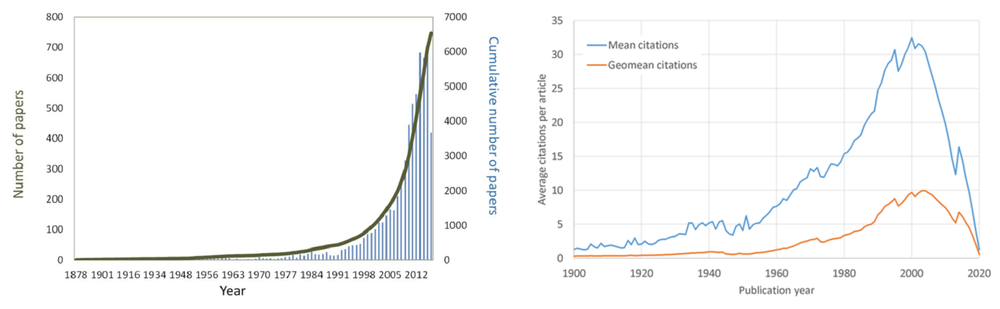

At first, I wanted this post to be only about metrics in machine learning, but this concept is more universal, and it does not make sense to study it as a separate problem. This is more of a philosophical post; the ultimate goal is to make you think and reflect.

We live surrounded by metrics: grades from teachers, performance reviews from employers, number of publications in academia, FLOPs in computing, ELO in chess, salary, IQ for intelligence, movie ratings on IMDB, book ratings on Goodreads, things we buy on Amazon, election results in democracies, F1 score in machine learning, GDP for countries, EBITDA in finance, likes/followers on Instagram, time spent on TikTok for content recommendation algorithms, etc.

In most cases, these metrics try to summarize a complex, variable system with a single number, which is often inaccurate. For example, a well-behaved metric must be comparable, i.e.,

> if A > B and B > C, then A > C

In mathematics, this property is called *transitivity*. However, in real life, this almost never holds; there are usually trade-offs.

In some cases, choosing the wrong metrics can lead to catastrophic failure (as we will see with some examples). I want to argue in this post that choosing the right metrics is as important as solving the problem itself (in the same way that asking the correct questions is as important as solving them).

## Egregious examples of bad metrics

People coined the term *enshitification* [[8]](#references) to describe when a system gets corrupted and degraded due to poor incentives; we have seen it in many companies. The most famous example is Airbnb: it started as an alternative to hotels where a host might share a room and both host and guest benefited for a modest price. Nowadays, Airbnb prices are often similar to hotels, and the platform has contributed to the gentrification (and toxic tourism) of many cities in Europe [[9]](#references).

Here are several other examples of bad metrics and perverse incentives:

 - **p-hacking in statistics**: it is commonplace in statistics to use p-values to describe how confident we are in the results of a statistical test. The standard threshold used to say when a result is *statistically significant* is 0.05. This has led many *scientists* to aim for this arbitrary threshold at all costs. We have seen numerous retractions over the years, and I assume countless others are never noticed [[2]](#references).

 - **overfitting in machine learning**: over the years, there have been many examples of *data leaking*, i.e., training the model using the test set split [[3]](#references). Also, when your only goal is to optimize for a single metric, you may overfit to that single task, even without using the test set, leading to a model that is virtually useless.

- **Cooking the books in planned economies**: In the 20th century, during the USSR under Khrushchev, company and factory leaders often manipulated production data or falsified results to appear more successful than they actually were. Because the Soviet economic system rewarded meeting targets rather than genuine efficiency or quality, managers frequently inflated numbers, hid waste, or produced useless goods just to report success. This and other causes led to the fall of the USSR.

 - **Incentives tied to management**: CEOs were usually paid bonuses based on quarterly earnings results. As a result, many CEOs prioritized short-term wins over long-term goals for a healthy company. They pulled financial tricks, and this led to poor performance for these companies.

 - **In-class assessment**: Although the main goal of going to school is learning, the way to measure it is usually quite different, through exams or projects. And probably you or many people you know practice the *art of cheating*. Another way of cheating is memorizing instead of understanding, which leads to poor learning and forgetting concepts after the exam.

 - **Academia**: The most important metric for researchers is the number of publications and citations. This has created a big misalignment of goals, and nowadays, there is a broken culture where publishing many and fast is the norm [[4]]. The following graphs show the evolution of the number of publications and average citations per paper [[6, 7]](#references). It seems that we are producing so much information that no one reads...

 - **Private healthcare**: When the goal of a hospital is not to cure the patient but rather to make money, it can lead to a perverse incentive where they overcharge, prolong the treatment, and offer more expensive solutions to simple or non-existent problems. I highly recommend this video [[1]](#references). This also happens with the education system.

 - **Democracy**: Political parties only care about the results of the next elections and not the long-term prosperity or planning of the city. Unaffordability of housing, short-term thinking, etc.

These are a few examples I could come up with, but I think anyone can see the pattern and come up with others.

Understanding the root problem, we see that it has been recurrent over time; it has all been a byproduct of a misalignment of incentives. Sometimes, taking your eyes off the Excel file and reflecting may help to solve these issues. One of the most famous quotes and mantras in investing shows the importance of this concept:

> *"Show me the incentive and I will show you the outcome"*\
> — Charlie Munger

We may think that this is something new, but it is far from the truth. For example, in the 15th century, pirates and marines were not taught how to swim to prevent them from running away in battle. There are cases of positive incentives as well: during ancient Rome, soldiers were paid directly from the war spoils, and the same happened with Hannibal in the Second Punic War. In the Iberian Peninsula, during the *Reconquista*, peasants were encouraged to live in the empty lands near the frontier by offering them tax exemptions and other benefits. More recently, people thought the invention of the atomic bomb would bring about the end of the world; however, we saw just the opposite effect, countries are disincentivized to attack other countries holding nuclear arsenals.

This last example can also be related to the very well-known **Prisoner's Dilemma** in game theory, where we study the optimal behaviour given a set of rules and incentives.

We have seen similar questions arise in AI safety and alignment, where people try to set the correct incentives for AI to safeguard the common good of human beings. However, it still remains an open question whether intelligence could, in principle, be combined with any kind of goal, so that scientists can shape AI incentives. This is known as the Orthogonality Thesis [[17]](#references):

> *"Are Intelligence and final goals (values, objectives) orthogonal?"*

The most difficult part of Reinforcement Learning is usually setting the reward (incentive) correctly. This has been one of the most important challenges of this field historically, and people still struggle with how to correctly set the reward during training. Setting a difficult environment hinders training, and choosing a single reward can lead to *reward hacking* [[16]](#references).

I think of an incentive like a second derivative; it is a force that moves the interests of people in one direction. At first, people barely notice it, but the consequences become clear after some time. Or, in mathematical terms, using the Taylor expansion:

$$f(t) = f(0) + tf'(0) + \frac{t^2}{2}f''(0) + \mathcal{O}(t^3)$$

When $t$ is small, higher-order terms are negligible; as $t$ grows, the influence of the second derivative and beyond can dominate.

Designing systems that remain robust over time is often difficult. In the long run, benchmarks and incentives can be gamed in unanticipated ways. Goodhart's law captures this:

> *"When a measure becomes a target, it ceases to be a good measure."*

Corrosion is often slow and unnoticed until it is significant. That said, I don't think corruption is inevitable: well-designed metrics and adaptive governance can lead to stable equilibria. We need to be deliberate about which metrics we choose, not leave results to chance, and stay ready to adjust them when the incentives produce unintended consequences.

### How can we apply this to our daily life?

Metrics influence everyone, including you. Ask which artificial metrics shape your decisions, and whether they reflect your values.

The first thing that comes to mind is how each of us measures success: are you guided by money and status, or by internal goals? It's worth aligning external measures with personal values rather than blindly chasing others' expectations.

### And what about machine learning?

Even simple loss functions such as Mean Squared Error (MSE) and Mean Absolute Error (MAE) have different properties: MAE promotes sparsity and is more robust to outliers, while MSE penalizes large errors more heavily and is differentiable everywhere. Choosing a metric affects model behaviour.

More importantly, the dataset and benchmarks you use matter. For example, in computer vision, the ImageNet dataset helped spark the AI revolution; similarly, progress in NLP has been accelerated by high-quality, diverse benchmarks [[10]](#references). Good benchmarks encourage generalization rather than overfitting to a single metric. If one metric is insufficient, use multiple: confusion matrices, precision/recall, calibration, and task-specific measures provide a richer picture than a single scalar.

Choosing the correct metric in ML is very important, but having access to the correct dataset and benchmark is crucial and often undervalued.
The long-term impact and importance of benchmarking are almost always unnoticed. The competition that sparked the modern AI revolution began with the ImageNet dataset. Recent advances in NLP are partly due to high-quality, well-curated, and rich benchmarks. The abundance and variety of benchmarks in NLP completely overshadow the rest of the fields [[10]](#references). This has allowed teams to focus on generalization rather than optimizing a single benchmark. This almost seems trivial to say, but if a single metric is insufficient, use more than one. For example, use the confusion matrix rather than a single-number score.

One of the historical reasons that robotics underperformed compared to other fields was its poor benchmarks. However, we have seen a lot of progress lately with environments and the push for RL [[11, 14, 15]](#references). In AI for materials and drug discovery, we are seeing a golden age likewise [[12, 13]](#references).

## References
[1] "I Was An MIT Educated Neurosurgeon Now I'm Unemployed And Alone In The Mountains How Did I Get Here?" https://www.youtube.com/watch?v=25LUF8GmbFU&t

[2] p-hacking: https://en.wikipedia.org/wiki/Data_dredging

[3] data leaking: https://en.wikipedia.org/wiki/Leakage_(machine_learning)

[4] "Scientific publishing is broken" https://www.theguardian.com/science/2025/jul/13/quality-of-scientific-papers-questioned-as-academics-overwhelmed-by-the-millions-published

[5] "The misalignment of incentives in academic publishing and implications for journal reform" https://www.pnas.org/doi/10.1073/pnas.2401231121

[6] Monteiro, Maria & Séneca, Joana & Magalhães, Catarina. (2014). The History of Aerobic Ammonia Oxidizers: from the First Discoveries to Today. Journal of microbiology (Seoul, Korea). 52. 537-47. 10.1007/s12275-014-4114-0. 

[7] Mike Thelwall, Pardeep Sud; Scopus 1900–2020: Growth in articles, abstracts, countries, fields, and journals. Quantitative Science Studies 2022; 3 (1): 37–50. doi: https://doi.org/10.1162/qss_a_00177

[8] https://en.wikipedia.org/wiki/Enshittification

[9] Rabiei-Dastjerdi, Hamidreza, Gavin McArdle, and William Hynes. "Which came first, the gentrification or the Airbnb? Identifying spatial patterns of neighbourhood change using Airbnb data." Habitat International 125 (2022): 102582.

[10] https://main--dasarpai.netlify.app/dsblog/nlp-benchmarks1/

[11] https://github.com/newton-physics/newton

[12] https://ai.meta.com/research/publications/open-molecular-crystals-2025-omc25-dataset-and-models/

[13] https://moleculenet.org/datasets-1

[14] https://gymnasium.farama.org/

[15] Kaup, Michael, Cornelius Wolff, Hyerim Hwang, Julius Mayer, and Elia Bruni. "A review of nine physics engines for reinforcement learning research." arXiv preprint arXiv:2407.08590 (2024).

[16] https://en.wikipedia.org/wiki/Reward_hacking

[17] https://www.lesswrong.com/w/orthogonality-thesis
