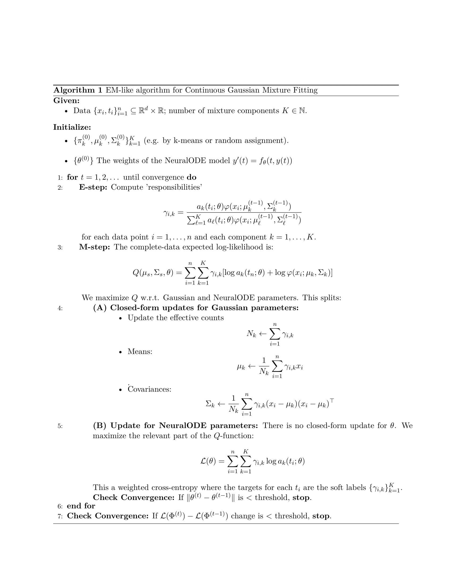

The cumulative density function of the Temporal Mixtures of Gaussians proposed by [[1]](#references) is given by
$$
    F(x,t) = P(\mathbf{X}_t \leq x) = \int_{\prod_{i=1}^d (-\infty, x_i]} \sum_{s=1}^K \mathbf{a}_s(t) \varphi(r | \mathbf m_s, \mathbf\Sigma_s ) dr, \quad\quad\quad x\in \mathbb{R}^n, t\in \mathbb{R}
$$
where $\varphi$ is the probability density function of the normal distribution and $\mathbf{a}_s(t)$ is given by the evolution of NeuralODE. Then the probability density function of this process is obtained by differentiating with respect to $x$ and we obtain 
$$
p(x,t)=\frac{\partial^d}{\partial x_1\cdots\partial x_d}F(x,t)=\sum_{s=1}^K \mathbf{a}_s(t)\varphi(x;\mathbf m_s,\mathbf \Sigma_s) \tag{1}    
$$

### 1.1 Mixture of Gaussian Processes

Consider a family of gaussian processes $X_{k}(t) \sim \mathcal{G}(\mu(t), \Sigma(s,t))$ for $k=1, \dots, K$. The idea is similar to a **mixture of experts** model:
- Latent assignment: Each data point $(x_n, y_n)$ belongs to one of $K$ Gaussian Processes, with probability $\pi_k$.
   $$z_n \sim \text{Categorical}(\pi_1, \ldots, \pi_K)$$
- **Component processes**: Each GP component $k$ has its own kernel and parameters:
   $$f_k(x) \sim \mathcal{GP}(m_k(x), k_k(x, x'))$$
- **Observation model**: If $z_n = k$, then $y_n = f_k(x_n) + \epsilon$, with Gaussian noise. So the likelihood is a **mixture distribution**:
$$
p(y_n | x_n) = \sum_{k=1}^K \pi_k \, \mathcal{N}(y_n | \mu_k(x_n), \sigma_k^2(x_n))
$$


As we saw in (1), given data $\{(x_n,t_n)\}_{n=1}^N$, we can calculate the loss function using the negative log-likelihood with respect to the parameters we want to optimize $\Phi=(\{m_s,\Sigma_s\}_{s=1}^K,\theta)$ yields
$$
\mathcal{L}(\Phi)
=-\sum_{n=1}^N\log p(x_n,t_n;\Phi)
=-\sum_{n=1}^N\log \sum_{s=1}^K \alpha_s(t_n;\theta)\,
\varphi(x_n; m_s,\Sigma_s).
$$
Here $\alpha(t;\theta)=\text{softmax}(y(t;\theta))$, with $y$ evolved by a Neural ODE
$$
\dot y(t)=f\big(y(t),t;\theta\big),\qquad y(t_0)=y_0,
\qquad
\alpha_s(t)=\frac{e^{y_s(t)}}{\sum_{j=1}^K e^{y_j(t)}} ,    \tag{2}
$$
which guarantees $\alpha_s(t)\ge0$ and $\sum_s\alpha_s(t)=1$.
A convenient auxiliary quantity is the responsibility (posterior over components)
$$
\gamma_{ns}
=\frac{\alpha_s(t_n)\,\varphi(x_n\mid m_s,\Sigma_s)}
{\sum_{j=1}^K \alpha_j(t_n)\,\varphi(x_n\mid m_j,\Sigma_j)} .
$$
Using $\partial \log \sum_j a_j/\partial \log a_s = \gamma_{ns}$, the gradient that back-propagates through the ODE is
$$
\frac{\partial\mathcal{L}}{\partial y_s(t_n)}
= -\big(\gamma_{ns}-\alpha_s(t_n)\big),
$$
and the adjoint method carries these signals through the ODE in (2).

## 2. Expectation Maximization (EM Algorithm)

Let $\Phi=(\{m_k,\Sigma_k\}_{k=1}^K,\theta)$ denote all parameters, and let $X=\{(x_i,t_i)\}_{i=1}^n$. Introduce the latent labels $Z=\{z_i\}_{i=1}^n$. The observed-data log-likelihood is
$$
\mathcal L(\Phi)=\log p(X;\Phi)=\log\sum_{Z} p(X,Z;\Phi).
$$
For any distribution $q(Z)$ over latent variables we have the identity 
$$\begin{aligned}
    \mathcal L(\Phi)&= \log \sum_Z q(Z)\frac{p(X,Z; \Phi)}{q(Z)} = \log \mathbb{E}_q \left[\frac{p(X,Z;\Phi)}{q(Z)}\right]\\
    &\ge
\mathbb{E}_{q}\!\left[\log\frac{p(X,Z;\Phi)}{q(Z)}\right]
= \mathbb{E}_{q}[\log p(X,Z;\Phi)] - \mathbb{E}_{q}[\log q(Z)]
\end{aligned}$$
Recognize the entropy $-\mathbb{E}_q[\log q(Z)]=\mathcal{H}(q)$. So the ELBO is
$$
\mathrm{ELBO}(q,\Phi)=\mathbb{E}_{q}[\log p(X, Z;\Phi)]+\mathcal{H}(q).
$$
Because of Jensen, $\mathrm{ELBO}(q;\Phi)\le \log p(X;\Phi)$.
We can in fact write an exact identity by introducing the KL divergence between $q(Z)$ and the true posterior $p(Z\mid X,\Phi)$. Start from the definition
$$
\mathrm{KL}\!\big(q(Z)\,\|\,p(Z\mid X;\Phi)\big)
=\mathbb{E}_{q}\big[\log q(Z)-\log p(Z\mid X;\Phi)\big].
$$
Use $\log p(Z\mid X;\Phi)=\log p(X,Z;\Phi)-\log p(X;\Phi)$; substitute and rearrange:
$$
\mathrm{KL}(q\|p(\cdot\mid X;\Phi))
=\mathbb{E}_q[\log q(Z)]-\mathbb{E}_q[\log p(X,Z;\Phi)]+\log p(X;\Phi)\\
$$
Hence,
$$\begin{aligned}
 \log p(X;\Phi)
&=\mathbb{E}_q[\log p(X,Z;\Phi)]-\mathbb{E}_q[\log q(Z)]+\mathrm{KL}(q\|p(\cdot\mid X;\Phi))\\
&=\underbrace{\mathbb{E}_q[\log p(X,Z;\Phi)]+\mathcal{H}(q)}_{F(q,\Phi)}+\mathrm{KL}(q\|p(\cdot\mid X;\Phi)).
\end{aligned}$$
Since KL$\ge 0$, $F(q,\Phi)$ is a lower bound on $\mathcal L(\Phi)$.
In EM one picks $q$ equal to the posterior under the old parameters $\Phi^{\text{old}}$:
$$
q^\ast(Z)=p(Z\mid X;\Phi^{\text{old}}).\tag{E-Step}
$$
With this choice $F(q^\ast,\Phi^{\text{old}})=\mathcal L(\Phi^{\text{old}})$ because the KL term is zero. Define the auxiliary function
$$
Q(\Phi,\Phi^{\text{old}}):=\mathbb{E}_{q^\ast}[\log p(X,Z;\Phi)]
$$
so that $F(q^\ast,\Phi)=Q(\Phi,\Phi^{\text{old}})+\mathcal H(q^\ast)$. Note $\mathcal H(q^\ast)$ does not depend on $\Phi$.
Now compare log-likelihoods:
$$\begin{aligned}
    \mathcal L(\Phi)-\mathcal L(\Phi^{\text{old}})
&= \big[F(q^\ast,\Phi)-F(q^\ast,\Phi^{\text{old}})\big] \;+\; \big[\mathrm{KL}(q^\ast\|p(\cdot\mid X;\Phi)) - 0\big].\\
&\ge F(q^\ast,\Phi)-F(q^\ast,\Phi^{\text{old}})
= Q(\Phi,\Phi^{\text{old}})-Q(\Phi^{\text{old}},\Phi^{\text{old}}).
\end{aligned}$$
Therefore, a sufficient condition for non-decrease of the observed log-likelihood is
$$
Q(\Phi,\Phi^{\text{old}})\;\ge\;Q(\Phi^{\text{old}},\Phi^{\text{old}}).
$$
This is the standard EM statement: if the M-step finds $\Phi^{\text{new}}$ with $Q(\Phi^{\text{new}},\Phi^{\text{old}})\ge Q(\Phi^{\text{old}},\Phi^{\text{old}})$
$$
    \Phi^{\text{new}} =\arg\max_\Phi Q(\Phi, \Phi^{\text{old}}),\tag{M-Step}
$$
then $\mathcal L(\Phi^{\text{new}})\ge\mathcal L(\Phi^{\text{old}})$.

### 2.1 EM Algorithm for Continuous Gaussian Mixture
In our model, the $Z$ latent variable indicates which variable $1,\dots, k$ is used to sample the variable $x$. 
This is expressed in the following way:
$$
    p(X=(x,t)|Z=k;\Phi) = \varphi(x; \mu, \Sigma)\qquad 
    p(Z=k;\Phi) = a_k(t;\phi)
$$
Then,  the total log-likelihood decomposes into two parts:
$$\begin{aligned}
    \sum_{i=1}^n\log p(X=(x_i,t_i),Z=z_i; \Phi) &= \sum_{i=1}^n\log p(x_i,t_i\mid z_i;\Phi)p(z_i;\Phi) \\
    &=\sum_{i=1}^n \sum_{k=1}^K \bm{1}_{\{z_i=k\}}[\log \varphi(x_i;\mu_{k}, \Sigma_{k}) + \log( a_{k}(t_i;\theta))]
\end{aligned}$$
Thus, 
$$\begin{aligned}
    Q(\Phi, \Phi^{\text{old}}) &= \mathbb{E}_{Z\sim p(Z\mid X;\theta^{\text{old}})}[\log p(X,Z;\theta)] = \sum_{i=1}^n \sum_{k=1}^K \gamma_{i,k}[\log \varphi(x_i;\mu_{k}, \Sigma_{k}) + \log( a_{k}(t_i;\theta))]
\end{aligned}$$
where $\gamma_{i,k} = p(Z_i=k \mid X=(x_i, t_i) ; \Phi^{\text{old}})$. This variables are usually called responsibilities and can be calculated using Bayes' rule,
 $$ \gamma_{i,k} = \frac{a_k(t_i;\theta^{\text{old}}) \varphi(x_i ; \mu_k^{\text{old}}, \Sigma_k^{\text{old}})}{\sum_{\ell=1}^K a_\ell(t_i;\theta^{\text{old}}) \varphi(x_i ; \mu_\ell^{\text{old}}, \Sigma_\ell^{\text{old}})} $$


The resulting algorithm is presented as follows:




And the code:


```python
class LogLikelihoodLoss(nn.Module):
    """
    Log-likelihood loss for mixture of Gaussians.
    
    Implements: -∑_{n=1}^N log ∑_{s=1}^K α_s(t_n;θ) φ(x_n | m_s, Σ_s)
    """
    
    def __init__(self, K, state_dim, device, eps=1e-8):
        """
        Initialize log-likelihood loss.
        
        Args:
            K: Number of mixture components
            state_dim: Dimensionality of state space
            device: Device for computations
            eps: Small constant for numerical stability
        """
        super().__init__()
        self.K = K
        self.state_dim = state_dim
        self.device = device
        self.eps = eps
        
    def forward(self, x_pred, x_obs, means, covariances):
        """
        Compute negative log-likelihood loss.
        
        Args:
            x_pred: Predicted trajectories [n_timesteps, batch_size, state_dim]
            x_obs: Observed trajectories [n_timesteps, batch_size, state_dim] 
            t_eval: Evaluation times [n_timesteps]
        
        Returns:
            Negative log-likelihood loss
        """
        all_log_probs = []  # shape [N, K]

        for k in range(self.K):
            mean_k = means[k]
            cov_k = covariances[k]
            mvn = MultivariateNormal(mean_k, cov_k)
            log_prob_k = mvn.log_prob(x_obs)  # shape [N]
            log_alpha_k = torch.log(x_pred[..., k] + self.eps)  # shape [N]
            all_log_probs.append(log_alpha_k + log_prob_k)

        # Stack into [N, K]
        all_log_probs = torch.stack(all_log_probs, dim=-1)

        # Log-sum-exp across K, then sum across N
        total_log_likelihood = torch.logsumexp(all_log_probs, dim=-1).mean() # TODO.mean(axis=1).sum()

        # Negative log-likelihood
        return -total_log_likelihood
```


```python
class Trainer:
    """
    Trainer class for optimizing Neural ODE models with log-likelihood loss.
    
    Minimizes negative log-likelihood between predicted and observed trajectories.
    """
    
    def __init__(self, model, optimizer, scheduler, device, loss_str="LogLikelihood", 
                 reg_lambda=0.0, print_freq=10, 
                 tol=1e-6, tolrel=1e-4, patience=200, K=3, d=2, lr=1e-3):
        """
        Initialize trainer.
        
        Args:
            model: Neural ODE model
            optimizer: PyTorch optimizer
            scheduler: Learning rate scheduler  
            device: Training device
            loss_str: Loss function ("MSE", "L1", "LogLikelihood")
            reg_lambda: L2 regularization coefficient
            print_freq: Print frequency for training progress
            tol: Absolute tolerance for early stopping
            tolrel: Relative tolerance for early stopping
            patience: Epochs to wait before early stopping
            K: Number of mixture components (for LogLikelihood loss)
        """
        self.model = model
        self.optimizer = optimizer
        self.scheduler = scheduler
        self.device = device
        self.K = K
        self.d = d

        # Means: [K, state_dim]
        self.means = nn.Parameter(torch.tensor(means, dtype=torch.float32), requires_grad=False)

        # Covariances: Use Cholesky decomposition for positive definiteness
        # Shape: [K, state_dim, state_dim]
        self.covs = nn.Parameter(torch.tensor(covs, dtype=torch.float32), requires_grad=False)
        
        # Configure loss function
        if loss_str is None or loss_str == 'MSE':
            self.loss_func = nn.MSELoss()
        elif loss_str == 'L1':
            self.loss_func = nn.L1Loss()
        elif isinstance(loss_str, LogLikelihoodLoss):
            # Determine state dimension from model
            self.loss_func = loss_str
        else:
            raise ValueError(f"Unknown loss function: {loss_str}")
        
        self.reg_lambda = reg_lambda
        self.print_freq = print_freq
        self.tol = tol
        self.tolrel = tolrel
        self.patience = patience
        
        self.best_loss = float('inf')
        self.best_state = None
        self.loss_history = []
        self.cov_reg = 1e-5
        self.eps = 1e-8  # for numerical stability in log
        self.lr = lr

    
    def _compute_regularization(self):
        """Compute L2 regularization terms."""
        reg_loss = 0.0
        # Regularize model parameters
        #reg_loss += self.reg_lambda * sum(torch.sum(param ** 2) for param in self.model.parameters())
        # Regularize mixture parameters if using log-likelihood
        return reg_loss
    
    def _compute_total_loss(self, x_pred, x_obs, t_eval=None):
        """Compute total loss including regularization."""
        loss = self.loss_func(x_pred, x_obs)
        
        reg_loss = self._compute_regularization()
        return loss + reg_loss
    
    def _should_stop_early(self, current_loss, prev_loss, patience_counter):
        """Check early stopping conditions."""
        # Absolute tolerance
        if current_loss < self.tol:
            return True, f"absolute tolerance ({self.tol})"
        
        # Patience exceeded
        if patience_counter >= self.patience:
            return True, f"no improvement in {self.patience} epochs"
        
        # Relative tolerance
        if prev_loss is not None:
            abs_diff = abs(current_loss - prev_loss)
            rel_diff = abs_diff / (abs(prev_loss) + 1e-12)
            if rel_diff < self.tolrel:
                return True, f"relative tolerance ({self.tolrel})"
        
        return False, None
    
    def e_step(self, x_obs, t_eval):
        T, B, D = x_obs.shape  # batch size
        initial_state_batch = torch.zeros(B, K)
        with torch.no_grad():
            a = self.model(initial_state_batch, eval_times=t_eval)  # [B, T, K]
            a = a.clamp(min=1e-8)

        log_prob = torch.empty(T, B, self.K, device=self.device)
        for k in range(self.K):
            # ensure covariance is SPD by adding diag jitter
            cov_k = self.covs[k] + self.cov_reg * torch.eye(self.d, device=self.device)
            mvn = MultivariateNormal(loc=self.means[k], covariance_matrix=cov_k)
            log_prob[..., k] = mvn.log_prob(x_obs) # [B]

        # 3) compute log_joint: log(a_k) + log p_k
        log_a = torch.log(a + self.eps)  # [B, K]
        log_joint = log_a + log_prob  # [B, K]

        # 4) normalize in log-space -> responsibilities gamma [B, K]
        log_sum = torch.logsumexp(log_joint, dim=2, keepdim=True)  # [B, 1]
        log_gamma = log_joint - log_sum  # [B, K]
        gamma = torch.exp(log_gamma)  # [B, K]; rows sum to 1
        return gamma, log_joint
    
    def m_step_gaussians(self, x: torch.Tensor, gamma: torch.Tensor):
        """Closed-form updates of Gaussian parameters using responsibilities gamma"""
        # x: [N,B,D], gamma: [N,B,K]
        gamma = gamma.reshape(-1, self.K)  # [N*B, K]
        x = x.reshape(-1, self.d)  # [N*B, D
        Nk = gamma.sum(dim=0)  # [K] sums over i
        Nk_safe = Nk.clone().clamp_min(1e-8)  # avoid division by zero

        # Update means: mu_k = (1 / N_k) sum_i gamma_{ik} x_i
        mu_new = (gamma.transpose(1,0) @ x) / Nk_safe.unsqueeze(1)  # [K, D]

        # Update covariances:
        covs_new = torch.zeros(self.K, self.d, self.d, device=self.device)
        for k in range(self.K):
            diff = x - mu_new[k].unsqueeze(0)  # [N, D]
            # Weighted empirical covariance:
            w = gamma[:, k].unsqueeze(1)  # [N,1]
            # sum_i gamma_{ik} * diff_i^T diff_i  -> [D,D]
            cov_k = (diff * w).t() @ diff  # [D, D]
            cov_k = cov_k / Nk_safe[k]
            # regularize
            cov_k += self.cov_reg * torch.eye(self.d, device=self.device)
            covs_new[k] = cov_k

        self.means = mu_new.detach()
        self.covs = covs_new.detach()
        

    def m_step_theta(self, x: torch.Tensor, t: torch.Tensor, gamma: torch.Tensor, steps: int = 20, batch_size: int = 32):
        """Optimize mixing network parameters theta by minimizing:
           L(theta) = - sum_i sum_k gamma_{ik} log a_k(t_i; theta)
           We'll do several gradient steps with Adam.
        """
        optimizer = torch.optim.Adam(self.model.parameters(), lr=self.lr)
        N = x.shape[0]

        n_samples = x.shape[1]
        x0 = torch.zeros(batch_size, K)
        progress_bar = tqdm(range(steps), desc="Training")
        for _ in progress_bar:
            indices = np.random.choice(n_samples, size=batch_size, replace=False)
            gamma_det_i = gamma[:,indices, :]
            optimizer.zero_grad()
            a = self.model(x0, t) 
            a = a.clamp(min=self.eps)
            log_a = torch.log(a)
            loss = -(gamma_det_i * log_a).mean(axis=(0,1)).sum()  # average per point
            loss.backward()
            optimizer.step()
            progress_bar.set_postfix(loss_neuralODE=f"{loss.item():.5f}")
    
    def train(self, t_train, x_obs, initial_state, batch_size=32, max_epochs=5, m_steps=100, shuffle=True):
        """
        Train the Neural ODE model using mini-batch learning.
        
        Args:
            t_train: Time points tensor [n_timesteps]
            x_obs: Observed trajectory [n_timesteps, n_samples, state_dim]
            initial_state: Initial state [n_samples, state_dim]
            batch_size: Size of mini-batches (default: 32)
            shuffle: Whether to shuffle data between epochs (default: True)
        
        Returns:
            Best training loss
        """
        self.model.train()
        
        # Move data to device
        t_train = t_train.to(self.device)
        x_obs = x_obs.to(self.device)
        initial_state = initial_state.to(self.device)
        
        n_samples = x_obs.shape[1]  # Number of samples/trajectories
        n_batches = (n_samples + batch_size - 1) // batch_size  # Ceiling division
        
        
        for epoch in range(max_epochs):
            with torch.no_grad():
                gamma, log_joint = self.e_step(x_obs, t_train,)
                
                loss = -torch.logsumexp(log_joint, dim=2).mean().item()  # total loglik
                #loss = self._compute_total_loss(a, x_obs)
                print(f"Iter {epoch}: total negative log-likelihood = {loss:.5f}")

                # M-step for Gaussians (closed form)
                self.m_step_gaussians(x_obs, gamma)

            # M-step for theta (optimize neural net)
            self.m_step_theta(x_obs, t_train, gamma, steps=m_steps, batch_size=batch_size)

        
        # Load best model state
        if self.best_state is not None:
            self.model.load_state_dict(self.best_state)
        
        print(f"Total samples: {n_samples}, Batch size: {batch_size}, Batches per epoch: {n_batches}")
        
        return self.best_loss
```

 ### References