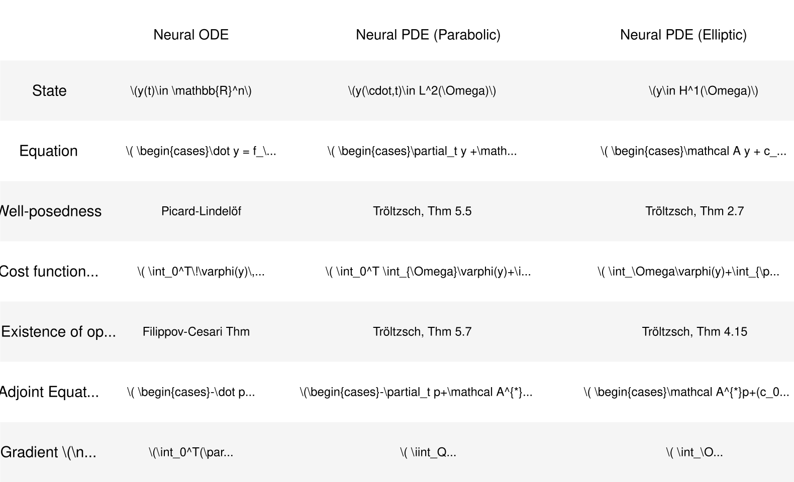
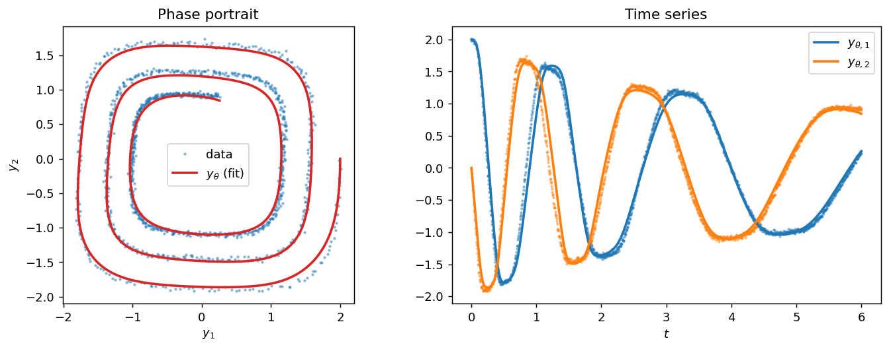
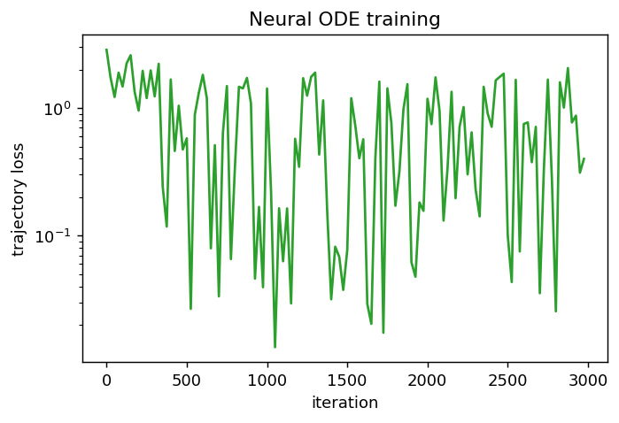
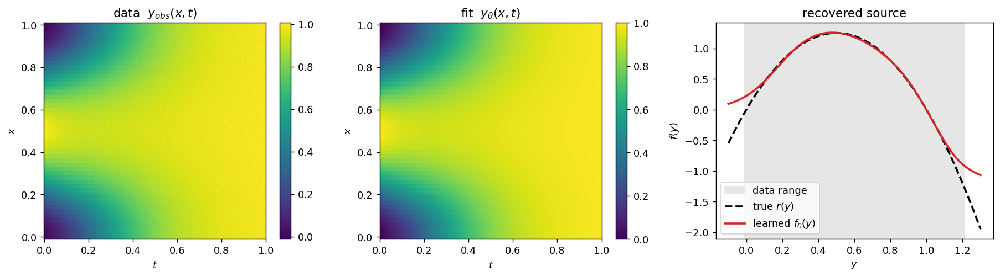
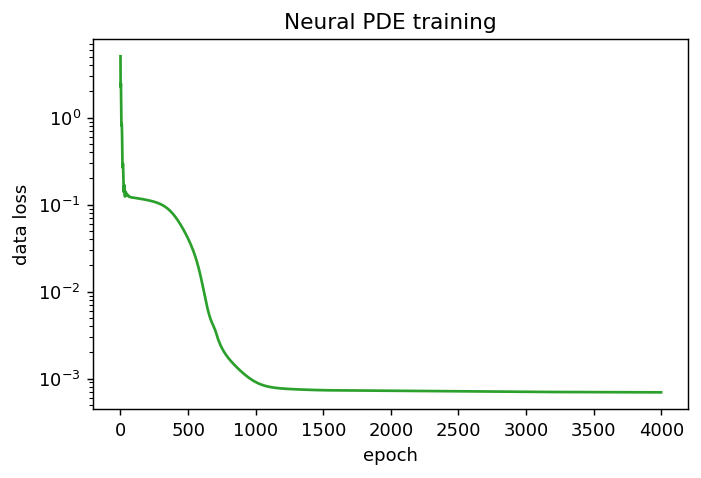

Classical data-driven methods in machine learning tend to be data-inefficient and  they discard expert modeling knowledge. However, during the last decade a different approach has emerged under the name *physics-informed machine learning*. 

First posted in 2017 and published in 2019, *physics-informed
neural networks* (PINNs) [[6]](#references) combined deep learning with prior
knowledge of the governing equations by directly learning the solution using the PDE residual as a soft penalty
in the loss. In 2018, *Neural ODEs* [[1]](#references) took a complementary
route of embedding the physics in the *model* itself: the right-hand side of an
ordinary differential equation $\dot y=f(y,t)$ is replaced by a neural network
$f\approx f_\theta$, trained to reproduce observed data. The same principle was
soon extended to stochastic differential equations [[7]](#references) and to
partial differential equations [[5]](#references) — the latter is what we call
here a *Neural PDE*.

A *Neural PDE* applies the Neural-ODE construction to an evolution equation in
space and time: the unknown coefficient — typically a reaction or source term —
becomes a neural network embedded inside a partial differential equation [[5]](#references), i.e.,

$$\partial_t y -\Delta y = f_\theta\big(x,t,y\big) $$

The two constructions are the same idea applied to a finite- and an
infinite-dimensional state. The goal of this post is to make that parallel
precise within the physics-informed framework. We

1. state both **problem formulations** in a single notation;
2. define the **learning problem** (loss, data term, and the regularizer);
3. derive the **adjoint equations** that give the gradient of the loss; and
4. **fit data** using explicit Euler for the
   Neural ODE, and explicit Euler in time with finite elements in space
   for the Neural PDE.


> **A brief note on geometric deep learning.** Embedding knowledge into the model is one
> instance of a broader trend. *Geometric deep learning* [[8]](#references)
> pursues the same goal with a different prior: it builds geometric structure —
> symmetries, invariances, and the shape of the data domain — directly into the
> architecture. Many successful models are special cases of this principle:
> convolutional networks encode translation equivariance (1998), graph neural
> networks respect permutation symmetry (2008), and transformers can be read as
> attention on a fully connected graph (2017). Where physics-informed learning
> constrains the model with a governing equation, geometric deep learning
> constrains it with a symmetry group.

## 1. Problem formulation

Throughout, $\theta\in\mathbb{R}^p$ denotes the network parameters and $f_\theta$
is a neural network (smooth, e.g. $\tanh$ activations).

### 1.1 Neural ODE

The state $y(t)\in\mathbb{R}^n$ solves the initial-value problem

$$
\dot y = f_\theta\big(y,t\big)\quad\text{in }(0,T],
\qquad y(0)=y_0, \tag{ODE}
$$

with $f_\theta:\mathbb{R}^n\times[0,T]\to\mathbb{R}^n$. We write $y_\theta$ for
the solution map $\theta\mapsto y(\,\cdot\,;\theta)$ where we use a discretization scheme such as explicit Euler.

### 1.2 Neural PDE (Parabolic)

Let $\Omega\subset\mathbb{R}^m$ be a bounded Lipschitz domain with boundary
$\Gamma=\partial\Omega$, and let $T>0$ be a finite time horizon. Over the
space–time cylinder $\Omega\times(0,T)$ and its lateral boundary
$\Gamma\times(0,T)$, the state $y(x,t)$ solves the semilinear parabolic problem

$$
\begin{aligned}
\partial_t y + \mathcal{A}y + d\big(x,t,y\big) &= f_\theta\big(x,t,y\big) && \text{in } \Omega\times(0,T),\\
\partial_{\nu_{\mathcal A}} y + b\big(x,t,y\big) &= g && \text{on } \Gamma\times(0,T),\\
y(\cdot,0) &= y_0 && \text{in } \Omega,
\end{aligned}\tag{PDE-P}
$$

where $\mathcal{A}$ is the second-order elliptic operator in divergence form and
$\partial_{\nu_{\mathcal A}}y$ is its associated *conormal derivative* — the
boundary flux that goes with $\mathcal A$, i.e. the outward normal component of the
flux $a_{ij}\,\partial_{x_i}y$ that $\mathcal A$ takes the divergence of,

$$
\mathcal{A}y = -\sum_{i,j=1}^{m}\partial_{x_j}\!\big(a_{ij}(x)\,\partial_{x_i} y\big),
\qquad
\partial_{\nu_{\mathcal A}}y = \sum_{i,j=1}^{m} a_{ij}\,\partial_{x_i} y\,\nu_j ,
$$

with $(a_{ij})$ symmetric, bounded, and uniformly elliptic, and $\nu$ the outer
normal. When $\mathcal A=-\Delta$ we have $a_{ij}=\delta_{ij}$, so the conormal
derivative reduces to the ordinary normal derivative
$\partial_{\nu_{\mathcal A}}y=\sum_i\partial_{x_i}y\,\nu_i=\nabla y\cdot\nu=\partial_\nu y$ —
the most common example.
The learnable component is the source term $f_\theta(x,t,y)$ or a boundary term $g_\theta(x,t,y)$.

### 1.3 Neural PDE (Elliptic)

On the same domain
$\Omega$ with boundary $\Gamma=\partial\Omega$, the state $y(x)$ solves the
semilinear elliptic problem

$$
\begin{aligned}
\mathcal{A}y + c_0(x)\,y &= f_\theta\big(x,y\big) && \text{in } \Omega,\\
\partial_{\nu_{\mathcal A}} y + \alpha(x)\,y &= g && \text{on } \Gamma,
\end{aligned}\tag{PDE-E}
$$

with $\mathcal A$ the same divergence-form elliptic operator as before, a
nonnegative potential $c_0\in L^\infty(\Omega)$, and a *boundary condition of the
third kind* (Robin) with nonnegative coefficient $\alpha\in L^\infty(\Gamma)$ and
datum $g\in L^2(\Gamma)$. As before the learnable component is the source term
$f_\theta(x,y)$.

The three problems line up term by term: the finite-dimensional vector field
$f_\theta$ stays the learnable right-hand side, the derivative $\dot y$ becomes
$\partial_t y$, and the new ingredients are the spatial operator $\mathcal A$
(with a boundary condition) and a fixed reaction $d$. Setting $\partial_t y=0$
then collapses the parabolic problem (PDE-P) onto the elliptic problem (PDE-E),
with the reaction $d$ playing the role of the potential $c_0$.

## 2. The learning problem

We are given **data**: noisy observations of the true state. We phrase fitting
as the minimization of a regularized cost functional $J$. Keeping the general
Bolza form lets the same expressions specialize to tracking or terminal
objectives.

### 2.1 Cost functionals

**Neural ODE.** With a running cost $\varphi$ and terminal cost $\phi$,

$$
J(\theta)=\int_0^T \varphi\big(y_\theta(t),t\big)\,dt
          +\phi\big(y_\theta(T)\big)
          +\frac{\gamma}{2}\|\theta\|^2
          \qquad \text{(J-ODE)}.
$$

**Neural PDE (Parabolic).** With a distributed cost $\varphi$ on $\Omega\times(0,T)$, a boundary cost
$\psi$ on $\Gamma\times(0,T)$, and a terminal cost $\phi$ on $\Omega$,

$$
J(\theta)=\iint_{\Omega\times(0,T)} \varphi\big(x,t,y_\theta\big)\,dx\,dt
          +\iint_{\Gamma\times(0,T)} \psi\big(x,t,y_\theta\big)\,ds\,dt
          +\int_\Omega \phi\big(x,y_\theta(\cdot,T)\big)\,dx
          +\frac{\gamma}{2}\|\theta\|^2
          \qquad \text{(J-PDE)}.
$$

**Neural PDE (Elliptic).** With a distributed cost $\varphi$ on $\Omega$ and a
boundary cost $\psi$ on $\Gamma$ (no terminal term, since there is no time),

$$
J(\theta)=\int_\Omega \varphi\big(x,y_\theta\big)\,dx
          +\int_\Gamma \psi\big(x,y_\theta\big)\,ds
          +\frac{\gamma}{2}\|\theta\|^2
          \qquad \text{(J-ELL)}.
$$

<!-- This is the regularized form of Tröltzsch's elliptic tracking objective (2.36),
$\frac{\lambda_\Omega}{2}\|y-y_\Omega\|_{L^2(\Omega)}^2
+\frac{\lambda_\Gamma}{2}\|y-y_\Gamma\|_{L^2(\Gamma)}^2$, with
$\varphi=\tfrac{\lambda_\Omega}{2}|y-y_\Omega|^2$ and
$\psi=\tfrac{\lambda_\Gamma}{2}|y-y_\Gamma|^2$. -->

### 2.2 Data term

Let the data be samples of the true state on a finite set of points,

$$
\mathcal D_{\mathrm{ODE}}=\big\{(t_k,\,y^{\mathrm{obs}}_k)\big\}_{k=1}^{N},
\qquad
\mathcal D_{\mathrm{PDE}}=\big\{(x_j,t_k,\,y^{\mathrm{obs}}_{jk})\big\}_{j,k}.
$$

A least-squares data term is the choice

$$
\varphi(y,t)=\tfrac12\sum_{k}\big|y-y^{\mathrm{obs}}_k\big|^2\,\delta(t-t_k),
\qquad
\varphi(x,t,y)=\tfrac12\,\omega(x,t)\,\big|y-y^{\mathrm{obs}}(x,t)\big|^2,
$$

where $\omega=\sum_{j,k}\delta(x-x_j)\delta(t-t_k)$ is the empirical observation
measure (and $\psi=\phi=0$). Concretely the data parts of $J$ read

$$
J_{\mathrm{data}}^{\mathrm{ODE}}(\theta)=\tfrac12\sum_{k=1}^{N}\big|y_\theta(t_k)-y^{\mathrm{obs}}_k\big|^2,
\qquad
J_{\mathrm{data}}^{\mathrm{PDE}}(\theta)=\tfrac12\sum_{j,k}\big|y_\theta(x_j,t_k)-y^{\mathrm{obs}}_{jk}\big|^2 .
$$

### 2.3 Regularization and coercivity

The Tikhonov term $\frac{\gamma}{2}\|\theta\|^2$ is not merely cosmetic — the data term alone need not be coercive in $\theta$ — changes of the
parameters can leave the fit almost unchanged, so a
minimizing sequence may run off to infinity — and indeed network training
problems need not attain an optimum at all [[9]](#references). Adding $\frac{\gamma}{2}\|\theta\|^2$
makes the reduced functional **coercive**,

$$
J(\theta)\ \ge\ \frac{\gamma}{2}\|\theta\|^2\ \xrightarrow[\ \|\theta\|\to\infty\ ]{}\ \infty ,
$$

so sublevel sets are bounded; together with weak lower semicontinuity of $\theta\mapsto J(\theta)$ this yields existence of a minimizer.
<!--  (In the
infinite-dimensional control reading of (PDE), the same term restores
coercivity of the reduced objective and is the standard device for
well-posedness of the *optimization* problem [[3]](#references).) We use
$\varphi$, $\psi$, $\phi$, $\gamma$ with exactly these meanings in the code. -->

## 3. Adjoint equations

To minimize $J$ we need $\nabla_\theta J$. The adjoint (costate) method, classical
in optimal control [[2]](#references) and PDE-constrained control [[4]](#references), computes
it at the cost of one backward solve, independent of $p=\dim\theta$. We give the
continuous adjoint in both settings; the discrete adjoint is what reverse-mode
autodiff computes when we differentiate through the integrator, which is why the
code can simply call `loss.backward()`.

### 3.1 Neural ODE adjoint

Introduce the costate $p:[0,T]\to\mathbb{R}^n$ and the Lagrangian

$$
\mathcal L=\int_0^T\varphi(y,t)\,dt+\phi(y(T))+\frac{\gamma}{2}\|\theta\|^2
          -\int_0^T p^\top\!\big(\dot y-f_\theta(y,t)\big)\,dt .
$$

Stationarity with respect to $y$ gives the **backward** adjoint IVP

$$
-\dot p(t)=\Big(\partial_y f_\theta\big(y_\theta,t\big)\Big)^{\!\top} p(t)+\partial_y\varphi\big(y_\theta,t\big),
\qquad p(T)=\partial_y\phi\big(y_\theta(T)\big), \tag{A-ODE}
$$

and the gradient is

$$
\boxed{\;\nabla_\theta J=\int_0^T\Big(\partial_\theta f_\theta\big(y_\theta,t\big)\Big)^{\!\top} p(t)\,dt+\gamma\,\theta\;}
$$

For the data term, $\partial_y\varphi(y_\theta,t)=\sum_k\big(y_\theta(t_k)-y^{\mathrm{obs}}_k\big)\delta(t-t_k)$,
i.e. the adjoint receives a jump of size $y_\theta(t_k)-y^{\mathrm{obs}}_k$ at each
observation time.

### 3.2 Neural PDE (Parabolic) adjoint

Let $\mathcal A^{*}$ be the adjoint of $\mathcal A$. Repeating the Lagrangian computation with the weak
form of (PDE) and integrating by parts in time (terminal data, since
$\delta y(0)=0$) and in space (Green's identity), the costate $p(x,t)$ solves the
**backward** parabolic problem

$$
\begin{aligned}
-\partial_t p + \mathcal A^{*}p + \big(d_y-\partial_y f_\theta\big)\big(x,t,y_\theta\big)\,p &= \varphi_y\big(x,t,y_\theta\big) && \text{in } \Omega\times(0,T),\\
\partial_{\nu_{\mathcal A^{*}}}p + b_y\big(x,t,y_\theta\big)\,p &= \psi_y\big(x,t,y_\theta\big) && \text{on } \Gamma\times(0,T),\\
p(\cdot,T) &= \phi_y\big(x,y_\theta(\cdot,T)\big) && \text{in } \Omega,
\end{aligned}\tag{A-PDE}
$$

where $d_y=\partial_y d$ is the derivative of the *known* reaction and
$\partial_y f_\theta$ that of the learned source — they enter the linearized
dynamics as the combined reaction $d-f_\theta$. The gradient is

$$
\boxed{\;\nabla_\theta J=\iint_{\Omega\times(0,T)} p(x,t)\,\partial_\theta f_\theta\big(x,t,y_\theta\big)\,dx\,dt+\gamma\,\theta\;}
$$

The structure mirrors (A-ODE) exactly — including the $+$ sign, since $f_\theta$
now sits on the right-hand side just as in (ODE): a backward evolution driven by
the cost sensitivity $\varphi_y$, with the adjoint of the linearized dynamics,
and a gradient pairing the costate against $\partial_\theta f_\theta$. For the
data term, $\varphi_y=\omega\,(y_\theta-y^{\mathrm{obs}})$.

### 3.3 Neural PDE (Elliptic) adjoint

With no time direction the adjoint is itself a **steady** elliptic problem.
Repeating the Lagrangian computation for the weak form of (PDE-E), the costate
$p(x)$ solves

$$
\begin{aligned}
\mathcal A^{*}p + \big(c_0-\partial_y f_\theta\big)\big(x,y_\theta\big)\,p &= \varphi_y\big(x,y_\theta\big) && \text{in } \Omega,\\
\partial_{\nu_{\mathcal A^{*}}}p + \alpha\,p &= \psi_y\big(x,y_\theta\big) && \text{on } \Gamma,
\end{aligned}\tag{A-ELL}
$$

and the gradient is

$$
\boxed{\;\nabla_\theta J=\int_\Omega p(x)\,\partial_\theta f_\theta\big(x,y_\theta\big)\,dx+\gamma\,\theta\;}
$$

This is (A-PDE) with the time derivative removed: the same linearized reaction
$c_0-\partial_y f_\theta$ and the same conormal-plus-Robin boundary operator, but
solved as a single boundary-value problem rather than marched backward in time.

## 4. Examples with code

The code is in [`neural-pde/`](https://github.com/dani2442/dani2442_code/tree/main/neural-pde),
pure PyTorch. We differentiate through the unrolled integrators with autograd
(the discrete adjoint), so the gradients of §3 are obtained without hand-coding
the backward solves.

### 4.1 Neural ODE

Ground truth follows the nonlinear (cubic) spiral example in `torchdiffeq` [[10]](#references),
$\dot y = A^{\top}y$ with
$A=\big[\begin{smallmatrix}-0.1 & 2\\ -2 & -0.1\end{smallmatrix}\big]$ (the cube acting componentwise). We integrate it with explicit Euler, add Gaussian
noise to obtain the data $\mathcal D_{\mathrm{ODE}}$, and fit a two–hidden–layer
$\tanh$ network $f_\theta$ by minimizing $J_{\mathrm{ODE}}$ with the regularizer
of §2.3. The Euler step is

$$
y^{(k+1)}=y^{(k)}+\Delta t\,f_\theta\big(y^{(k)},t_k\big).
$$

Optimizing one long, full step rollout directly is ill-conditioned, so
we use the standard Neural-ODE demo trick [[10]](#references): each gradient step is a
stochastic estimate of the data term computed from a mini-batch of short
*sub-trajectories* started at points along the data; we keep the checkpoint with
the lowest full-trajectory error.

In schematic form, the whole method is the vector field $f_\theta$, the Euler
integrator, and a training loop in which `loss.backward()` is the discrete
adjoint of (A-ODE):

```python
class ODEFunc(nn.Module):                       # f_theta: a tanh MLP on R^2
    def __init__(self, dim=2, hidden=64):
        super().__init__()
        self.net = nn.Sequential(
            nn.Linear(dim, hidden), nn.Tanh(),
            nn.Linear(hidden, hidden), nn.Tanh(),
            nn.Linear(hidden, dim))
    def forward(self, y, t):
        return self.net(y)

def euler_rollout(f, y0, t):                     # explicit Euler: y += dt * f(y, t)
    ys, y = [y0], y0
    for k in range(len(t) - 1):
        y = y + (t[k+1] - t[k]) * f(y, t[k])
        ys.append(y)
    return torch.stack(ys)

for it in range(ITERS):                          # minimize J(theta)
    y0_b, t_b, y_target = get_batch()            # short sub-trajectories from data
    y_pred = euler_rollout(func, y0_b, t_b)
    data = 0.5 * ((y_pred - y_target) ** 2).sum(-1).mean()
    reg  = 0.5 * GAMMA * sum((p ** 2).sum() for p in func.parameters())
    opt.zero_grad(); (data + reg).backward(); opt.step()   # discrete adjoint
```





### 4.2 Neural PDE (Parabolic)

Ground truth is a 1D reaction–diffusion equation on $\Omega=(0,1)$ with
homogeneous Neumann (conormal) data, $\mathcal A y=-\nu\,\partial_{xx}y$, known
reaction $d\equiv 0$, and source $f_{\mathrm{true}}(y)=5\,y(1-y)$. The state
$y(x,t)$ solves

$$
\begin{aligned}
\partial_t y - \nu\,\partial_{xx} y &= f_\theta(y) && \text{in } (0,1)\times(0,T),\\
\partial_x y &= 0 && \text{on } \{0,1\}\times(0,T),\\
y(\cdot,0) &= y_0 && \text{in } \Omega.
\end{aligned}
$$

We learn the source $f_\theta(y)$ using a $\tanh$ network acting on nodal values.

**Weak formulation.** Multiplying by a test function $v\in H^1(\Omega)$,
integrating over $\Omega$, and integrating the diffusion term by parts, the
boundary term $\nu\,\partial_x y\,v\big|_0^1$ vanishes by the homogeneous Neumann
condition. We seek $y(t)\in H^1(\Omega)$ with

$$
\int_\Omega \partial_t y\,v\,dx + \int_\Omega \nu\,\partial_x y\,\partial_x v\,dx
= \int_\Omega f_\theta(y)\,v\,dx
\qquad \forall\,v\in H^1(\Omega),
$$

which is exactly the form the $P_1$ finite-element discretization below
discretizes.

A reaction can only be identified where the data lives, so we simulate **several
initial conditions**;
without this coverage the recovered $f_\theta$ is accurate only on the narrow
range a single trajectory visits.

**Discretization.** With $P_1$ finite elements on a uniform mesh we assemble the
mass matrix $M$ and stiffness matrix $K$,

$$
M_{ij}=\int_\Omega \varphi_i\varphi_j\,dx,\qquad
K_{ij}=\int_\Omega \nu\,\varphi_i'\varphi_j'\,dx,
$$

and the Neumann condition is natural (no constraint on $K$). Lumping the mass to
the diagonal $M_L$, the semidiscrete nodal vector $Y(t)$ obeys

$$
M_L\dot Y + \nu K Y = M_L\,f_\theta(Y)
\quad\Longleftrightarrow\quad
\dot Y = -L\,Y + f_\theta(Y),\quad L=\nu\,M_L^{-1}K ,
$$

so $L$ is the discrete $\mathcal A$. Marching with explicit Euler (subject to the
diffusion stability limit $\Delta t<h^2/2\nu$),

$$
Y^{(k+1)}=Y^{(k)}+\Delta t\,\big(-L\,Y^{(k)}+f_\theta\big(Y^{(k)}\big)\big).
$$

We generate data by simulating $f_{\mathrm{true}}$ from each initial condition,
add noise, subsample in time to obtain $\mathcal D_{\mathrm{PDE}}$, and fit
$f_\theta$ by minimizing $J_{\mathrm{PDE}}$. The rightmost panel shows that the
learned source matches the true nonlinearity across the shaded range of
states visited by the data.

The schematic mirrors the Neural-ODE one: the only changes are that the
integrator carries the assembled discrete operator $L=\nu M_L^{-1}K$, the state
$Y$ is a batch of nodal vectors (one per initial condition), and $f_\theta$ acts
pointwise on nodal values:

```python
A_DISC = NU * (1.0 / Mlump)[:, None] * K         # L = nu * M_L^{-1} K  (discrete A)

def fem_euler(source, Y0, t):                    # M_L Y' + nu K Y = M_L f(Y)
    Ys, Y = [Y0], Y0                             # Y0: (n_ic, N_nodes)
    for k in range(len(t) - 1):
        Y = Y + (t[k+1] - t[k]) * (-(Y @ A_DISC.t()) + source(Y))
        Ys.append(Y)
    return torch.stack(Ys)

class Source(nn.Module):                         # f_theta(y), applied at each node
    def __init__(self, hidden=64):
        super().__init__()
        self.net = nn.Sequential(
            nn.Linear(1, hidden), nn.Tanh(),
            nn.Linear(hidden, hidden), nn.Tanh(),
            nn.Linear(hidden, 1))
    def forward(self, Y):
        return self.net(Y.unsqueeze(-1)).squeeze(-1)

for epoch in range(EPOCHS):                      # fit all initial conditions jointly
    Y_pred = fem_euler(model, Y0, t_grid)
    data = 0.5 * ((Y_pred[obs_idx] - Y_obs[obs_idx]) ** 2).sum(-1).mean()
    reg  = 0.5 * GAMMA * sum((p ** 2).sum() for p in model.parameters())
    opt.zero_grad(); (data + reg).backward(); opt.step()
```






## References

[1] Chen, Ricky T. Q., Yulia Rubanova, Jesse Bettencourt, and David K. Duvenaud.
"Neural Ordinary Differential Equations." *Advances in Neural Information
Processing Systems* 31 (2018).

[2] Pontryagin, L. S., V. G. Boltyanskii, R. V. Gamkrelidze, and E. F.
Mishchenko. *The Mathematical Theory of Optimal Processes.* Translated by K. N.
Trirogoff, edited by L. W. Neustadt, Interscience Publishers (John Wiley &
Sons), 1962.

[3] Tröltzsch, Fredi. *Optimal Control of Partial Differential Equations:
Theory, Methods and Applications.* Graduate Studies in Mathematics 112, American
Mathematical Society, 2010. Translated by Jürgen Sprekels. (Semilinear
parabolic optimal control: §5.5, problem (5.7)–(5.9), Theorems 5.5 and 5.7,
Assumption 5.6. Semilinear elliptic theory: §2.3, §2.5, and §4.2, Theorems 2.7
and 4.4, Assumptions 4.2 and 4.3.)

[4] Lions, Jacques-Louis. *Optimal Control of Systems Governed by Partial
Differential Equations.* Translated by S. K. Mitter. Grundlehren der
mathematischen Wissenschaften 170, Springer-Verlag, 1971.

[5] Sirignano, Justin, Jonathan F. MacArt, and Jonathan B. Freund. "DPM: A deep
learning PDE augmentation method with application to large-eddy simulation."
*Journal of Computational Physics* 423 (2020): 109811.
https://doi.org/10.1016/j.jcp.2020.109811. (First posted as arXiv:1911.09145 in
2019 under the author order Freund, MacArt, Sirignano.)

[6] Raissi, Maziar, Paris Perdikaris, and George E. Karniadakis. "Physics-informed
neural networks: A deep learning framework for solving forward and inverse problems
involving nonlinear partial differential equations." *Journal of Computational
Physics* 378 (2019): 686–707. https://doi.org/10.1016/j.jcp.2018.10.045.
(First posted as arXiv:1711.10561, 2017.)

[7] Li, Xuechen, Ting-Kam Leonard Wong, Ricky T. Q. Chen, and David Duvenaud.
"Scalable Gradients for Stochastic Differential Equations." *Proceedings of the
23rd International Conference on Artificial Intelligence and Statistics (AISTATS)*,
PMLR 108:3870–3882, 2020.

[8] Bronstein, Michael M., Joan Bruna, Taco Cohen, and Petar Veličković.
"Geometric Deep Learning: Grids, Groups, Graphs, Geodesics, and Gauges."
*arXiv preprint* arXiv:2104.13478, 2021.

[9] Le, Quoc-Tung, Elisa Riccietti, and Rémi Gribonval. "Does a sparse ReLU
network training problem always admit an optimum?" *Advances in Neural
Information Processing Systems* 36 (NeurIPS 2023).

[10] Chen, Ricky T. Q. `torchdiffeq`: differentiable ODE solvers with full GPU
support and O(1)-memory backpropagation. GitHub repository,
https://github.com/rtqichen/torchdiffeq, example `examples/ode_demo.py`.


## Appendix: well-posedness

For the learning problem of §2 to make sense, the solution map $\theta\mapsto
y_\theta$ must be well-defined (and the cost finite) for the parameters explored
during training.

### A.1 Neural ODE — Picard–Lindelöf

> **Proposition (existence, uniqueness).**
> Suppose $f_\theta(\cdot,t)$ is measurable in $t$, and there is $L>0$ with
> $$|f_\theta(y_1,t)-f_\theta(y_2,t)|\le L\,|y_1-y_2|\quad\forall\,y_1,y_2,\ \text{a.e. }t,$$
> together with the linear growth bound $|f_\theta(y,t)|\le C(1+|y|)$. Then for
> every $y_0\in\mathbb{R}^n$ the problem (ODE) has a unique absolutely continuous
> solution $y_\theta\in C([0,T];\mathbb{R}^n)$, and $y_\theta$ depends
> continuously (indeed differentiably) on $\theta$ and $y_0$.

A feed-forward network with globally Lipschitz activations ($\tanh$, ReLU) and
bounded weights is globally Lipschitz in $y$ with a constant controlled by the
product of the weight-matrix norms, so the hypotheses hold; the growth bound
gives existence on the whole of $[0,T]$ (no finite-time blow-up). Differentiable
dependence on $\theta$ is what makes $\nabla_\theta J$ in §3.1 meaningful.

### A.2 Neural PDE — Tröltzsch's parabolic theory

Tröltzsch [[3]](#references), §5.5, studies the semilinear parabolic optimal
control problem with a distributed control $v$ and a boundary control $u$,

$$
\min_{v,u}\ J(y,v,u):=\int_\Omega \phi\big(x,y(x,T)\big)\,dx
+\iint_{\Omega\times(0,T)} \varphi\big(x,t,y,v\big)\,dx\,dt
+\iint_{\Gamma\times(0,T)} \psi\big(x,t,y,u\big)\,ds\,dt,
\tag{5.7}
$$

subject to the state equation

$$
\begin{aligned}
y_t-\Delta y + d(x,t,y) &= v && \text{in } \Omega\times(0,T),\\
\partial_\nu y + b(x,t,y) &= u && \text{on } \Gamma\times(0,T),\\
y(0) &= y_0 && \text{in }\Omega,
\end{aligned}\tag{5.8}
$$

and the control constraints

$$
v_a\le v\le v_b\ \text{ a.e. in } \Omega\times(0,T),\qquad
u_a\le u\le u_b\ \text{ a.e. in } \Gamma\times(0,T).\tag{5.9}
$$

Our (PDE-P) is exactly the state equation (5.8) with $\mathcal A=-\Delta$ and the
right-hand sides taken to be the network $f_\theta$ in the interior and $g$ on the
boundary (here $b$ is given). **State well-posedness** — the solution map being
well-defined, which is what §2 needs — is Tröltzsch's Theorem 5.5.

> **Theorem 5.5** (Tröltzsch [[3]](#references)).
> Suppose that Assumptions 5.1 and 5.4 hold. Then the semilinear parabolic
> initial–boundary value problem
> $$y_t+\mathcal A y+d(x,t,y)=f \ \text{ in } \Omega\times(0,T),\qquad
> \partial_{\nu_{\mathcal A}}y+b(x,t,y)=g \ \text{ on } \Gamma\times(0,T),\qquad
> y(0)=y_0 \ \text{ in }\Omega$$
> has a unique weak solution $y\in W(0,T)\cap C(\overline{\Omega\times(0,T)})$ for any triple
> $f\in L^r(\Omega\times(0,T))$, $g\in L^s(\Gamma\times(0,T))$, and $y_0\in C(\overline\Omega)$ with
> $r>N/2+1$ and $s>N+1$. Moreover, there is a constant $c_\infty>0$, which is
> independent of $d$, $b$, $f$, $g$, and $y_0$, such that
> $$\|y\|_{W(0,T)}+\|y\|_{C(\overline{\Omega\times(0,T)})}\le
> c_\infty\big(\|f-d(\cdot,0)\|_{L^r(\Omega\times(0,T))}+\|g-b(\cdot,0)\|_{L^s(\Gamma\times(0,T))}+\|y_0\|_{C(\overline\Omega)}\big).\tag{5.6}$$

Assumptions 5.1 and 5.4 are the structural hypotheses on $\mathcal A$, $d$, and
$b$ (measurability, boundedness/Lipschitz, and the monotonicity $d_y\ge 0$,
$b_y\ge 0$); the integrability thresholds $r>N/2+1$ and $s>N+1$ buy the continuous
representative $y\in C(\overline{\Omega\times(0,T)})$. For **existence of an optimal solution** the
problem (5.7)–(5.9) strengthens these to the twice-differentiable Assumption 5.6,
which we state together with the existence result verbatim.

> **Assumption 5.6** (Tröltzsch [[3]](#references)).
> **(i)** $\Omega\subset\mathbb{R}^N$ is a bounded Lipschitz domain.
>
> **(ii)** The functions
> $$d=d(x,t,y):(\Omega\times(0,T))\times\mathbb{R}\to\mathbb{R},\qquad \phi=\phi(x,y):\Omega\times\mathbb{R}\to\mathbb{R},$$
> $$\varphi=\varphi(x,t,y,v):(\Omega\times(0,T))\times\mathbb{R}^2\to\mathbb{R},\qquad b=b(x,t,y):(\Gamma\times(0,T))\times\mathbb{R}\to\mathbb{R},$$
> $$\psi=\psi(x,t,y,u):(\Gamma\times(0,T))\times\mathbb{R}^2\to\mathbb{R}$$
> are measurable with respect to $(x,t)$ for all $y,v,u\in\mathbb{R}$ and, for
> almost every $(x,t)$ in $\Omega\times(0,T)$ or $\Gamma\times(0,T)$, twice differentiable with respect to
> $y$, $v$, and $u$. Moreover, they satisfy the boundedness and local Lipschitz
> conditions (4.24)–(4.25) of order $k=2$; this means that for $\varphi$, for
> example, there exist some $K>0$ and a constant $L(M)>0$ for any $M>0$ such that,
> with the objects $\nabla\varphi$ and $\varphi''$ explained in the book,
> $$|\varphi(x,t,0,0)|+|\nabla\varphi(x,t,0,0)|+|\varphi''(x,t,0,0)|\le K,$$
> $$|\varphi''(x,t,y_1,v_1)-\varphi''(x,t,y_2,v_2)|\le L(M)\big\{|y_1-y_2|+|v_1-v_2|\big\},$$
> for almost every $(x,t)\in \Omega\times(0,T)$ and any $y_i,v_i\in[-M,M]$, $i=1,2$.
>
> **(iii)** We have $d_y(x,t,y)\ge 0$ for almost every $(x,t)\in \Omega\times(0,T)$ and
> $b_y(x,t,y)\ge 0$ for almost every $(x,t)\in\Gamma\times(0,T)$. Moreover,
> $y_0\in C(\overline\Omega)$.
>
> **(iv)** The bounds $u_a,u_b$ and $v_a,v_b:E\to\mathbb{R}$ belong to
> $L^\infty(E)$ for $E=\Gamma\times(0,T)$ and $E=\Omega\times(0,T)$, respectively, and $u_a(x,t)\le u_b(x,t)$
> and $v_a(x,t)\le v_b(x,t)$ for almost every $(x,t)\in E$.

> **Theorem 5.7** (Tröltzsch [[3]](#references)).
> Suppose that Assumption 5.6 holds, and let $\varphi$ and $\psi$ be convex with
> respect to $v$ and $u$, respectively. Then the optimal control problem
> (5.7)–(5.9) has at least one optimal pair $(\bar v,\bar u)$ with associated
> optimal state $\bar y=y(\bar v,\bar u)$.

The **monotonicity** $d_y\ge 0$, $b_y\ge 0$ in (iii) is the structural condition
behind well-posedness of the state equation (5.8). In our learning problem the
control is the network $v=f_\theta$, so the relevant nonlinearity is the
*effective* reaction $d-f_\theta$: to stay inside this theory we need
$\partial_y(d-f_\theta)\ge 0$ together with the order-$2$ boundedness/Lipschitz
bounds — automatic on bounded sets for $\tanh$ networks except for the
monotonicity, which one keeps by (i) letting $f_\theta$ depend only on $(x,t)$
(genuine control, $v\in L^\infty(\Omega\times(0,T))$), or (ii) penalizing $\partial_y f_\theta$.
Existence of a minimizer in $\theta$ comes instead from the Tikhonov coercivity
of §2.3 — the finite-dimensional analogue of the convexity hypothesis on
$\varphi,\psi$ in Theorem 5.7. In the example the fixed coercive diffusion
$\mathcal A$ dominates on the resolved mesh.

### A.3 Neural PDE (Elliptic) — Tröltzsch's elliptic theory

For the *linear* problem ($f_\theta=f_\theta(x)$ independent of $y$) Tröltzsch
[[3]](#references), §2.3 and §2.5, gives existence, uniqueness, and an a priori
bound for the boundary condition of the third kind.

> **Theorem 2.7** (Tröltzsch [[3]](#references)).
> Let $\Omega\subset\mathbb{R}^N$ be a bounded Lipschitz domain and suppose
> $c_0\in L^\infty(\Omega)$ and $\alpha\in L^\infty(\Gamma_1)$ satisfy
> $c_0(x)\ge 0$ and $\alpha(x)\ge 0$ almost everywhere. If one of
> **(i)** $|\Gamma_0|>0$ (a Dirichlet part of positive measure), or
> **(ii)** $\Gamma_1=\Gamma$ and
> $\int_\Omega c_0(x)^2\,dx+\int_\Gamma \alpha(x)^2\,ds(x)>0$,
> holds, then for all $f\in L^2(\Omega)$ and $g\in L^2(\Gamma_1)$ the problem
> (PDE-E) has a unique weak solution $y\in V$, and there is a constant
> $c_{\mathcal A}>0$, depending on neither $f$ nor $g$, with
> $$\|y\|_{H^1(\Omega)}\le c_{\mathcal A}\big(\|f\|_{L^2(\Omega)}+\|g\|_{L^2(\Gamma_1)}\big).$$

Condition (i) or (ii) excludes the pure-Neumann constant null space (otherwise
$y$ is determined only up to a constant): some zeroth-order term — a Dirichlet
boundary, the potential $c_0$, or the Robin coefficient $\alpha$ — must pin the
solution.

For the *semilinear* problem the source depends on $y$, and Tröltzsch
[[3]](#references), §4.2, gives well-posedness under the following hypotheses.
The boundary value problem is
$$\mathcal A y + c_0\,y + d(x,y) = f \ \text{ in } \Omega,\qquad
\partial_{\nu_{\mathcal A}}y + \alpha\,y + b(x,y) = g \ \text{ on } \Gamma,\tag{4.5}$$
associated with the bilinear form
$$a[y,v]:=\int_\Omega\sum_{i,j=1}^N a_{ij}(x)\,D_i y\,D_j v\,dx
+\int_\Omega c_0\,y\,v\,dx+\int_\Gamma\alpha\,y\,v\,ds.\tag{4.7}$$

> **Assumption 4.2** (Tröltzsch [[3]](#references)).
> **(i)** $\Omega\subset\mathbb{R}^N$, $N\ge 2$, is a bounded Lipschitz domain
> with boundary $\Gamma$, and $\mathcal A$ is an elliptic differential operator of
> the form (2.19) with bounded and measurable coefficient functions $a_{ij}$ that
> satisfy the symmetry condition and the condition (2.20) of uniform ellipticity.
>
> **(ii)** The functions $c_0:\Omega\to\mathbb{R}$ and $\alpha:\Gamma\to\mathbb{R}$
> are bounded, measurable and almost everywhere nonnegative. At least one of these
> functions does not vanish almost everywhere, that is,
> $\|c_0\|_{L^\infty(\Omega)}+\|\alpha\|_{L^\infty(\Gamma)}>0$.
>
> **(iii)** The functions $d=d(x,y):\Omega\times\mathbb{R}\to\mathbb{R}$ and
> $b=b(x,y):\Gamma\times\mathbb{R}\to\mathbb{R}$ are bounded and measurable with
> respect to $x\in\Omega$ and $x\in\Gamma$, respectively, for every fixed
> $y\in\mathbb{R}$. Moreover, they are continuous and monotone increasing in $y$
> for almost every $x\in\Omega$ and $x\in\Gamma$, respectively.
>
> In particular $d(x,0)$ and $b(x,0)$ are then bounded and measurable in $\Omega$
> and $\Gamma$.

> **Assumption 4.3** (Tröltzsch [[3]](#references)).
> For almost every $x\in\Omega$ (respectively, $x\in\Gamma$) we have $d(x,0)=0$
> (respectively, $b(x,0)=0$). Moreover, $b$ and $d$ are globally bounded, that is,
> there is a constant $M>0$ such that for any $y\in\mathbb{R}$ we have
> $$|b(x,y)|\le M\ \text{ for a.e. } x\in\Gamma,\qquad
> |d(x,y)|\le M\ \text{ for a.e. } x\in\Omega.\tag{4.6}$$

> **Theorem 4.4** (Tröltzsch [[3]](#references)).
> Suppose that Assumptions 4.2 and 4.3 hold. Then the elliptic boundary value
> problem (4.5) has for any pair $f\in L^2(\Omega)$ and $g\in L^2(\Gamma)$ of
> right-hand sides a unique weak solution $y\in H^1(\Omega)$. Moreover, there is
> some constant $c_M>0$, which is independent of $d$, $b$, $f$, and $g$, such that
> $$\|y\|_{H^1(\Omega)}\le c_M\big(\|f\|_{L^2(\Omega)}+\|g\|_{L^2(\Gamma)}\big).\tag{4.9}$$

The **monotonicity** of $d$ and $b$ in (iii) is the structural condition behind
well-posedness, exactly as in the parabolic case. In our learning problem the
source is the network, so the relevant nonlinearity is the effective reaction
$d-f_\theta$ (with $d\equiv 0$ in the example): to stay inside this theory we need
$\partial_y\big(d-f_\theta\big)\ge 0$, which one keeps by letting $f_\theta$
depend only on $x$ or by penalizing $\partial_y f_\theta$. Existence of a
minimizer in $\theta$ again comes from the Tikhonov coercivity of §2.3.
