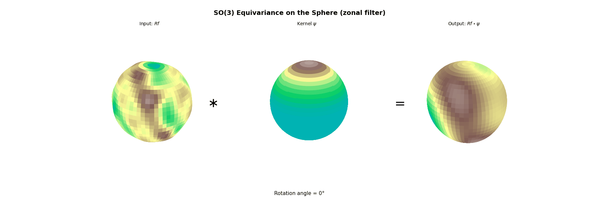
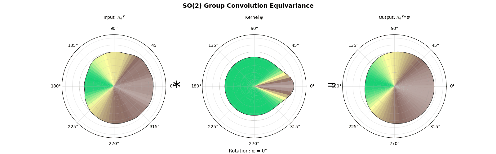

## 1. Preliminaries

We start by introducing some basic notions from representation theory and harmonic analysis on compact groups.

Let $G$ be a locally compact group with a fixed (left) Haar measure $\mu$.

> **Definition (Unitary representation).** A (unitary) representation of $G$ is a continuous homomorphism $\pi:G\to \mathfrak{U}(\mathcal{H}_\pi)$, where $\mathfrak{U}(\mathcal{H}_\pi)$ is the unitary group of a complex Hilbert space $\mathcal{H}_\pi$.
>
> Equivalently, $\pi(gh)=\pi(g)\pi(h)$ for all $g,h\in G$ and $g\mapsto \pi(g)\xi$ is continuous for every $\xi\in \mathcal{H}_\pi$.

We denote $d_\pi:=\dim(\mathcal{H}_\pi)\in \mathbb{Z}_{\ge 0}\cup\{\infty\}$.

For compact $G$, one often starts with (not necessarily unitary) finite-dimensional representations $\pi:G\to \mathrm{GL}(V)$. In that case, averaging an inner product over Haar measure produces a $G$-invariant inner product, so every continuous finite-dimensional representation is equivalent to a unitary one.

> **Example (Left regular representation).** On $\mathcal{H}:=L^2(G)$, the left regular representation $\lambda:G\to \mathfrak{U}(\mathcal{H})$ is defined by
> $$ (\lambda(g)f)(x):=f(g^{-1}x),\qquad f\in L^2(G). $$

> **Definition (Equivalence).** Two unitary representations $\pi_1:G\to\mathfrak{U}(\mathcal{H}_1)$ and $\pi_2:G\to\mathfrak{U}(\mathcal{H}_2)$ are equivalent if there exists a unitary $U:\mathcal{H}_1\to\mathcal{H}_2$ such that
> $$ U\pi_1(g)=\pi_2(g)U,\qquad \forall g\in G. $$
> We write $\pi_1\cong \pi_2$ and denote by $[\pi]$ the equivalence class of $\pi$.

> **Definition (Irreducible).** A unitary representation $\pi:G\to\mathfrak{U}(\mathcal{H}_\pi)$ is irreducible if the only closed subspaces of $\mathcal{H}_\pi$ invariant under every $\pi(g)$ are $\{0\}$ and $\mathcal{H}_\pi$.

We denote by $\widehat{G}$ the set of equivalence classes of irreducible unitary representations of $G$.

If $G$ is abelian, then every irreducible unitary representation is one-dimensional; in particular, $\widehat{G}$ coincides with the character group (Pontryagin dual) of $G$.

Given representations $\pi$ and $\eta$, the tensor product representation $\pi\otimes \eta$ acts on $\mathcal{H}_\pi\otimes \mathcal{H}_\eta$ via
$$
(\pi\otimes \eta)(g)(\xi\otimes \zeta)=\pi(g)\xi\otimes \eta(g)\zeta,\qquad g\in G.
$$

If $n\in \mathbb{Z}^+\cup\{\infty\}$, then $n\cdot \pi:=\bigoplus_{i=1}^n \pi$ denotes the direct sum of $n$ copies of $\pi$.

> **Definition (Commutant).** If $\pi$ is a unitary representation of $G$, then
> $$ \pi(G)' := \{A\in \mathcal{B}(\mathcal{H}_\pi) : A\pi(g)=\pi(g)A,\ \forall g\in G\}  $$
> is a *-subalgebra of $\mathcal{B}(\mathcal{H}_\pi)$ called the commutant of $\pi(G)$.

> **Theorem (Schur's lemma / commutant characterization).** For a unitary representation $\pi$, the following are equivalent:
> 1. $\pi$ is irreducible.
> 2. $\pi(G)'=\mathbb{C}I$.
> 3. Every nonzero $\xi\in \mathcal{H}_\pi$ is cyclic, i.e.
> $$ \overline{\mathrm{span}}\{\pi(g)\xi:g\in G\}=\mathcal{H}_\pi. $$

**Proof.**
(1)$\Rightarrow$(2): Let $A\in \pi(G)'$. The real and imaginary parts of $A$ are self-adjoint and still commute with $\pi(G)$, so it suffices to consider self-adjoint $A$. If $A$ is not a scalar multiple of the identity, the spectral theorem produces a nontrivial spectral projection $P$ of $A$ (e.g. $P=\mathbf{1}_{(-\infty,t]}(A)$ for a suitable $t$). Since $P$ is a Borel functional calculus of $A$, it also commutes with $\pi(G)$; hence $\mathrm{ran}(P)$ is a nontrivial closed $\pi$-invariant subspace, contradicting irreducibility.

(2)$\Rightarrow$(1): If $W\subseteq \mathcal{H}_\pi$ is a nontrivial closed $\pi$-invariant subspace, the orthogonal projection $P_W$ belongs to $\pi(G)'$. By (2), $P_W$ must be $0$ or $I$, contradiction.

(1)$\Leftrightarrow$(3): For $\xi\neq 0$, the cyclic subspace $\overline{\mathrm{span}}\{\pi(g)\xi:g\in G\}$ is a nonzero closed invariant subspace, so it equals $\mathcal{H}_\pi$ iff $\pi$ is irreducible. $\square$

## 2. Peter-Weyl Theorem

In this section we specialize to **compact groups**. A locally compact group $G$ is compact iff $\mu(G)<\infty$; in that case Haar measure can be normalized uniquely by requiring $\mu(G)=1$. With this normalization we write
$$
\int_G f(g)\,dg
$$
for integration against Haar measure.

### 2.1. Matrix coefficients and the coefficient space

Let $\pi$ be a finite-dimensional unitary representation of $G$ on $\mathcal{H}_\pi$ and let $\{e_1,\dots,e_{d_\pi}\}$ be an orthonormal basis. The functions
$$
\varphi_{ij}^{\pi}(g):=\langle e_i,\pi(g)e_j\rangle,\qquad 1\le i,j\le d_\pi,
$$
are called the **matrix coefficients** (or **coordinate functions**) of $\pi$.

More generally, for any $\xi,\eta\in \mathcal{H}_\pi$ the function $g\mapsto \langle \xi,\pi(g)\eta\rangle$ is continuous.

> **Definition (Coefficient space).** Let $E_G$ be the linear span of all functions of the form
> $$ g\mapsto \langle \xi,\pi(g)\eta\rangle, $$
> where $\pi$ ranges over all irreducible unitary representations of $G$ and $\xi,\eta\in\mathcal{H}_\pi$.

We will write $E:=E_G$ when $G$ is clear.

Since every finite-dimensional unitary representation of a compact group decomposes as a direct sum of irreducibles, every matrix coefficient coming from an arbitrary finite-dimensional representation belongs to $E$.

> **Remark (Abelian case and trigonometric polynomials).**  
> When $G$ is abelian, the functions in $E$ are often called **trigonometric polynomials**. For example, if
> $$ G=\mathbb{T}=\mathbb{R}/2\pi\mathbb{Z}, $$
> then every $f\in E$ has the form
> $$ f(\theta)=\sum_{n=-N}^N c_n e^{in\theta} = \sum_{n=0}^N \bigl(a_n\cos(n\theta)+b_n\sin(n\theta)\bigr). $$

> **Remark (Conjugation and inversion).**  
> If $f\in E$, then $\overline{f}\in E$. In terms of coordinate functions,
> $$ \overline{\varphi_{ij}^{\pi}(g)} =\overline{\langle e_i,\pi(g)e_j\rangle} =\langle \pi(g)e_j,e_i\rangle =\langle e_j,\pi(g^{-1})e_i\rangle =\varphi_{ji}^\pi(g^{-1}). $$
> In particular, if $f\in E$, then $\widetilde f(g):=f(g^{-1})$ also lies in $E$ (e.g. by passing to the contragredient representation). The same argument works inside $E_{\mathrm{fin}}$, since the contragredient of a finite-dimensional representation is again finite-dimensional.

### 2.2. Hilbert-Schmidt norms

> **Definition (Hilbert-Schmidt norm).** Let $M_n$ be the complex $n\times n$ matrices. If $A=(a_{ij})\in M_n$, define the Hilbert-Schmidt norm by
> $$ \|A\|_{\mathrm{HS}}^2=\sum_{i,j}|a_{ij}|^2. $$

> **Remark.** If $A\in M_n$, then
> $$ \|A\|_{\mathrm{HS}}^2=\mathrm{tr}(AA^*). $$
> In particular, if $B=UAU^*$ for a unitary matrix $U$, then $\|A\|_{\mathrm{HS}}=\|B\|_{\mathrm{HS}}$.
> Hence, if $\pi$ is finite-dimensional, the value $\|\pi(g)\|_{\mathrm{HS}}$ depends only on the equivalence class $[\pi]$.

### 2.3. Statement of the Peter-Weyl theorem

Our goal is to prove the following result.

> **Theorem (Peter-Weyl).** Let $G$ be a compact group.
> 1. Every irreducible unitary representation of $G$ is **finite-dimensional**.
> 2. If $\lambda$ is the left regular representation of $G$ on $L^2(G)$, then
>   $$   \lambda \;\cong\; \bigoplus_{[\pi]\in \widehat{G}} d_\pi\cdot \pi.   $$
> 3. (**Separation of points**) Given $g\in G$ with $g\ne e$, there exists $[\pi]\in\widehat G$ such that $\pi(g)\ne I$.
> 4. The space $E$ is **dense** in $C(G)$ (hence also dense in $L^p(G)$ for all $1\le p<\infty$).
> 5. (**Plancherel / Parseval identity**) If $f\in L^2(G)$, then
>   $$  \|f\|_2^2 =   \sum_{[\pi]\in\widehat G} d_\pi\,\mathrm{tr}\bigl(\widehat f(\pi)\,\widehat f(\pi)^*\bigr) = \sum_{[\pi]\in\widehat G} d_\pi \|\widehat f(\pi)\|_{\mathrm{HS}}^2,   $$
>   where the operator-valued Fourier transform $\widehat f(\pi)$ is defined by
>   $$   \widehat f(\pi)\;:=\;\int_G f(g)\,\pi(g^{-1})\,dg   \quad\in\mathcal{B}(\mathcal{H}_\pi).   $$

We will prove this theorem using a sequence of preliminary results.

---

### 2.4. Intertwiners and invariant subspaces

> **Lemma 1 (Adjoints of intertwiners).** Let $\pi$ and $\eta$ be unitary representations of a locally compact group $G$. If $A:\mathcal{H}_\pi\to\mathcal{H}_\eta$ is bounded and satisfies
> $$ A\pi(g)=\eta(g)A,\qquad \forall g\in G, $$
> then $A^*$ also intertwines:
> $$ A^*\eta(g)=\pi(g)A^*,\qquad \forall g\in G. $$
> In particular, $A^*A\in \pi(G)'$ and $AA^*\in \eta(G)'$.

**Proof.** Taking adjoints in $A\pi(g)=\eta(g)A$ gives $\pi(g^{-1})A^*=A^*\eta(g^{-1})$, and since $\pi$ and $\eta$ are unitary this is equivalent to $A^*\eta(g)=\pi(g)A^*$. The commutant statements follow by multiplying by $A$ and $A^*$. $\square$

> **Lemma 2 (Nonzero intertwiners from irreducibles).** Suppose $\pi$ and $\eta$ are unitary representations of a locally compact group $G$, with $\pi$ irreducible. If $A:\mathcal{H}_\pi\to\mathcal{H}_\eta$ is a nonzero bounded operator satisfying
> $$ A\pi(g)=\eta(g)A,\qquad \forall g\in G, $$
> then:
> 1. $A\mathcal{H}_\pi$ is a closed $\eta$-invariant subspace of $\mathcal{H}_\eta$;
> 2. $\pi\cong \eta|_{A\mathcal{H}_\pi}$.

**Proof.** By Lemma 1, $A^*A\in \pi(G)'$, so Schur's lemma gives $A^*A=\lambda I$ for some $\lambda\ge 0$. Since $A\neq 0$, we have $\lambda>0$. Then $B:=\lambda^{-1/2}A$ satisfies $B^*B=I$, so $B$ is an isometry and $A\mathcal{H}_\pi=B\mathcal{H}_\pi$ is closed.

The intertwining identity implies $B\pi(g)=\eta(g)B$, so $B\mathcal{H}_\pi$ is $\eta$-invariant. Finally, $B$ is a unitary equivalence between $\pi$ and $\eta$ restricted to $B\mathcal{H}_\pi$. $\square$

---

### 2.5. Orthogonality relations

The next proposition is the key orthogonality statement for matrix coefficients, and it depends crucially on compactness of $G$.

> **Proposition (Schur orthogonality).** Let $\pi$ and $\eta$ be irreducible finite-dimensional unitary representations of a compact group $G$. Fix orthonormal bases $\{e_i^\pi\}_{i=1}^{d_\pi}$ of $\mathcal{H}_\pi$ and $\{e_k^\eta\}_{k=1}^{d_\eta}$ of $\mathcal{H}_\eta$, and define
> $$ \varphi_{ij}^\pi(g)=\langle e_i^\pi,\pi(g)e_j^\pi\rangle, \qquad \varphi_{kl}^\eta(g)=\langle e_k^\eta,\eta(g)e_l^\eta\rangle. $$
> 1. If $\pi\not\cong \eta$, then
>   $$   \int_G \varphi_{ij}^\pi(g)\,\overline{\varphi_{kl}^\eta(g)}\,dg=0   \qquad\text{for all }i,j,k,l.   $$
> 2. If $\pi\cong \eta$, then
>   $$   \int_G \varphi_{ij}^\pi(g)\,\overline{\varphi_{kl}^\pi(g)}\,dg   =   \frac{\delta_{ik}\delta_{jl}}{d_\pi},   \qquad\text{for all }i,j,k,l.   $$

**Proof.** Fix a bounded operator $B:\mathcal{H}_\pi\to\mathcal{H}_\eta$ and define
$$
A:=\int_G \eta(g)\,B\,\pi(g^{-1})\,dg.
$$
Since $\pi$ and $\eta$ are finite-dimensional, $g\mapsto \eta(g)B\pi(g^{-1})$ is continuous in operator norm, so the integral is well-defined (as a Bochner integral).

For $r\in G$, left invariance of Haar measure implies
$$
A\pi(r)=
\int_G \eta(g)\,B\,\pi(g^{-1}r)\,dg=
\int_G \eta(rg)\,B\,\pi(g^{-1})\,dg=
\eta(r)\,A,
$$
so $A$ intertwines $\pi$ and $\eta$.

(1) If $\pi\not\cong\eta$, then Lemma 2 forces $A=0$. Fix indices $j,k$ and take the rank-one operator $B_{kj}(\xi)=\langle \xi,e_j^\pi\rangle e_k^\eta$. Then for any $i,l$,
$$
\begin{aligned}
0&=\langle A e_i^\pi, e_l^\eta\rangle \\ &=
\int_G \left\langle \eta(g)\,B_{kj}\,\pi(g^{-1})e_i^\pi,\ e_l^\eta\right\rangle dg \\&=
\int_G \left\langle B_{kj}\,\pi(g^{-1})e_i^\pi,\ \eta(g^{-1})e_l^\eta\right\rangle dg \\&=
\int_G \langle \pi(g^{-1})e_i^\pi,e_j^\pi\rangle\ \langle e_k^\eta,\eta(g^{-1})e_l^\eta\rangle\ dg \\&=
\int_G \varphi_{ij}^\pi(g)\ \overline{\varphi_{lk}^\eta(g)}\ dg,
\end{aligned}
$$
using unitarity in the last step. Relabeling indices yields the desired orthogonality.

(2) Now assume $\pi=\eta$.
Then $A\in \pi(G)'$, so by Schur's lemma $A=\lambda I$ for some $\lambda\in \mathbb{C}$. Taking traces gives
$$
\lambda d_\pi=\mathrm{tr}(A)=\int_G \mathrm{tr}\!\left(\pi(g)B\pi(g^{-1})\right)dg=
\int_G \mathrm{tr}(B)\,dg=\mathrm{tr}(B),
$$
so $\lambda=\mathrm{tr}(B)/d_\pi$.
Taking $B=B_{jl}$ on $\mathcal{H}_\pi$ (i.e. $B_{jl}(\xi)=\langle \xi,e_l^\pi\rangle e_j^\pi$) gives $\lambda=\delta_{jl}/d_\pi$, and
$$
\int_G \varphi_{ij}^\pi(g)\,\overline{\varphi_{kl}^\pi(g)}\,dg=
\langle A e_i^\pi,e_k^\pi\rangle=
\lambda\,\delta_{ik}=
\frac{\delta_{ik}\delta_{jl}}{d_\pi}.
$$
$\square$

---

### 2.6. Proof of the Peter--Weyl theorem

Let $E_{\mathrm{fin}}\subseteq E$ denote the subspace spanned by matrix coefficients coming from **finite-dimensional** irreducible representations of $G$.

We first show that it suffices to prove that $E_{\mathrm{fin}}$ is dense in $C(G)$.

Assume $E_{\mathrm{fin}}$ is dense in $C(G)$. Since $C(G)$ is dense in $L^2(G)$, it follows that $E_{\mathrm{fin}}$ is also dense in $L^2(G)$.

For each irreducible $\pi$, Proposition (Schur orthogonality) shows that the $d_\pi^2$ functions $\{\sqrt{d_\pi}\,\varphi_{ij}^\pi\}_{i,j}$ form an orthonormal set in $L^2(G)$, and their linear span contains all matrix coefficients of $\pi$. Hence the closed span of all such normalized coefficients contains $E_{\mathrm{fin}}$, and therefore equals $L^2(G)$. In other words, these normalized matrix coefficients form an orthonormal basis of $L^2(G)$.

This already implies item (1): if there were an irreducible unitary representation $\sigma$ with $\dim(\mathcal{H}_\sigma)=\infty$, then the same averaging operator as in the proof of Schur orthogonality would produce an intertwiner $A:\mathcal{H}_\sigma\to \mathcal{H}_\pi$ for each finite-dimensional irreducible $\pi$. Any such nonzero $A$ would be injective (its kernel is a closed $\sigma$-invariant subspace), which is impossible into a finite-dimensional space. Hence $A=0$, so every matrix coefficient of $\sigma$ is orthogonal to every element of $E_{\mathrm{fin}}$. By density, all coefficients of $\sigma$ would have to be $0$, contradiction.

Now fix a finite-dimensional irreducible $\pi$ and let $H_\pi\subseteq L^2(G)$ be the closed span of its matrix coefficients (equivalently, the span of $\{\varphi_{ij}^\pi\}_{i,j}$).

Observe the standard coefficient identity: for $g,t\in G$,
$$
\varphi_{ij}^\pi(g^{-1}t) =
\langle e_i^\pi,\pi(g^{-1}t)e_j^\pi\rangle =
\sum_{k=1}^{d_\pi} \varphi_{ik}^\pi(g^{-1})\,\varphi_{kj}^\pi(t).
$$
For each fixed $j$, define a linear map $A_j:\mathcal{H}_\pi\to H_\pi$ by
$$
A_j(e_i^\pi)=\varphi_{ij}^\pi.
$$
Using the identity above, one checks that $A_j$ intertwines $\pi$ with the left regular representation $\lambda$ restricted to $H_\pi$:
$$
\lambda(g)\,A_j = A_j\,\pi(g).
$$
By Schur orthogonality we have, for fixed $j$,
$$
\left\langle \sqrt{d_\pi}\,\varphi_{ij}^\pi,\ \sqrt{d_\pi}\,\varphi_{kj}^\pi\right\rangle_{L^2} =
\delta_{ik},
$$
so $\widetilde A_j:=\sqrt{d_\pi}\,A_j$ is an isometry $\mathcal{H}_\pi\to L^2(G)$ and its range
$$
H_{\pi,j}:=\mathrm{span}\{\varphi_{ij}^\pi:1\le i\le d_\pi\}
$$
is closed. Moreover, for $j\neq l$ the subspaces $H_{\pi,j}$ and $H_{\pi,l}$ are orthogonal. Hence
$$
H_\pi=\bigoplus_{j=1}^{d_\pi} H_{\pi,j}
$$
as an orthogonal direct sum of $\lambda$-invariant subspaces.

Since each $\widetilde A_j$ is a nonzero intertwiner from the irreducible representation $\pi$ into $\lambda|_{H_{\pi,j}}$, Lemma 2 yields $\lambda|_{H_{\pi,j}}\cong \pi$. Therefore
$$
\lambda|_{H_\pi}\cong \bigoplus_{j=1}^{d_\pi} \pi \;\cong\; d_\pi\cdot \pi.
$$
Summing over $[\pi]\in\widehat G$ yields item (2):
$$
\lambda \cong \bigoplus_{[\pi]\in\widehat G} d_\pi\cdot\pi.
$$

At this point we know $\{\sqrt{d_\pi}\,\varphi_{ij}^\pi\}$ is an orthonormal basis of $L^2(G)$, so every $f\in L^2(G)$ has an expansion
$$
f=\sum_{[\pi]\in\widehat G}\ \sum_{i,j=1}^{d_\pi} c_{ij}^\pi\,\sqrt{d_\pi}\,\varphi_{ij}^\pi
$$
with
$$
\|f\|_2^2=\sum_{[\pi]\in\widehat G}\ \sum_{i,j=1}^{d_\pi} |c_{ij}^\pi|^2.
$$
Moreover, by definition of Fourier coefficients in an orthonormal basis,
$$
\begin{aligned}
c_{ij}^\pi &=
\left\langle f,\ \sqrt{d_\pi}\,\varphi_{ij}^\pi\right\rangle_{L^2} =
\int_G f(g)\,\overline{\sqrt{d_\pi}\,\varphi_{ij}^\pi(g)}\,dg \\&=
\sqrt{d_\pi}\int_G f(g)\,\langle e_j^\pi,\pi(g^{-1})e_i^\pi\rangle\,dg =
\sqrt{d_\pi}\,\langle e_j^\pi,\widehat f(\pi)e_i^\pi\rangle.
\end{aligned}
$$
Therefore
$$
\begin{aligned}
\|f\|_2^2 &=
\sum_{[\pi]\in\widehat G} d_\pi\sum_{i,j=1}^{d_\pi} |\langle e_j^\pi,\widehat f(\pi)e_i^\pi\rangle|^2 \\ &=
\sum_{[\pi]\in\widehat G} d_\pi\,\|\widehat f(\pi)\|_{\mathrm{HS}}^2,
\end{aligned}
$$
which is item (5).

Item (3) follows from item (4): if $g\neq e$ and $\pi(g)=I$ for every irreducible $\pi$, then every matrix coefficient (hence every $f\in E$) would satisfy $f(g)=f(e)$, so $E$ could not be dense in $C(G)$.

Thus it only remains to prove:

> **Claim.** $E_{\mathrm{fin}}$ is dense in $C(G)$.

We prove this using Hilbert--Schmidt operators and an approximate identity.

---

### 2.7. Hilbert--Schmidt operators and convolution

Let $(X,\nu)$ be a measure space and let $K\in L^2(X\times X,\nu\otimes\nu)$. Define an operator $T:L^2(X)\to L^2(X)$ by
$$
Tf(x)=\int_X K(x,y)f(y)\,d\nu(y).
$$
Such operators are called **Hilbert--Schmidt operators**; they are compact, and if $K(x,y)=\overline{K(y,x)}$, then $T$ is self-adjoint. In particular, each eigenspace
$$
H_\alpha=\{f\in L^2(X): Tf=\alpha f\}
$$
is finite-dimensional.

In our case we take $X=G$ with normalized Haar measure and $K$ continuous. Then $x\mapsto K(x,\cdot)$ is continuous as a map into $L^2(G)$, and therefore $Tf(x)=\langle f, K(x,\cdot)\rangle_{L^2}$ defines a continuous function for every $f\in L^2(G)$.

Now fix $k\in C(G)$ satisfying
$$
k(g)=\overline{k(g^{-1})},\qquad \forall g\in G.
$$
Define the right-convolution operator $T:L^2(G)\to L^2(G)$ by
$$
Tf := f*k,
\qquad
Tf(g)=\int_G f(r)\,k(r^{-1}g)\,dr.
$$
Equivalently, $T$ is Hilbert--Schmidt with kernel $K(g,r)=k(r^{-1}g)$, and the symmetry assumption implies $K(g,r)=\overline{K(r,g)}$, so $T$ is self-adjoint and compact.

> **Lemma.** Let $k$ and $T$ be as above. For each $\alpha\in\mathbb{R}\setminus\{0\}$, the eigenspace
> $$ H_\alpha=\{f\in L^2(G): Tf=\alpha f\} $$
> is contained in $E_{\mathrm{fin}}$.

**Proof.** Since $T$ is compact and self-adjoint, $H_\alpha$ is finite-dimensional. Moreover, $H_\alpha\subseteq C(G)$: if $Tf=\alpha f$ with $\alpha\neq 0$, then $f=\alpha^{-1}Tf$ and $Tf$ is continuous by the discussion above.

The space $H_\alpha$ is invariant under the left regular representation. Indeed, for $g\in G$,
$$
T(\lambda(g)f) =
(\lambda(g)f)*k =
\lambda(g)(f*k) =
\lambda(g)(Tf),
$$
so if $Tf=\alpha f$, then $T(\lambda(g)f)=\alpha\,\lambda(g)f$ and $\lambda(g)f\in H_\alpha$.

Let $\{f_1,\dots,f_r\}$ be an orthonormal basis of $H_\alpha$. Define continuous functions
$$
\theta_{ij}(g):=\langle \lambda(g)f_i,f_j\rangle,\qquad 1\le i,j\le r.
$$
Since $\lambda(g)f_i\in H_\alpha$, we can expand
$$
(\lambda(g)f_i)=\sum_{k=1}^r \theta_{ki}(g)\,f_k.
$$
Thus $g\mapsto (\theta_{ij}(g))_{i,j}$ is the matrix of the unitary operator $\lambda(g)|_{H_\alpha}$ in the basis $\{f_i\}$, so it defines a finite-dimensional unitary representation $\rho$ of $G$ on $\mathbb{C}^r$.

Finally, evaluating at the identity element $e\in G$ gives
$$
f_i(g^{-1})=(\lambda(g)f_i)(e)=\sum_{k=1}^r \theta_{ki}(g)\,f_k(e),
$$
so each $f_i$ is a linear combination of the coefficient functions $\theta_{ki}(g^{-1})$. Since $E_{\mathrm{fin}}$ is closed under inversion, we conclude $f_i\in E_{\mathrm{fin}}$. $\square$

> **Lemma.** Let $k$ and $T$ be as above. Then for every $f\in L^2(G)$ we have
> $$ Tf\in \overline{E_{\mathrm{fin}}}^{\|\cdot\|_2}. $$
> In particular, $Tf$ can be approximated in $L^2$ by elements of $E_{\mathrm{fin}}$.

**Proof.** Let $\{ \phi_n \}$ be a complete orthonormal set of eigenvectors for the nonzero eigenspaces of $T$, with eigenvalues $\alpha_n\ne 0$:
$$ T\phi_n=\alpha_n\phi_n.$$
Then by the spectral theorem for compact self-adjoint operators, any $f\in L^2(G)$ can be written as
$$
f=\sum_{n} c_n\phi_n + f_0,
\qquad Tf_0=0,
$$
with $\sum_n |c_n|^2<\infty$. Hence
$$
Tf=\sum_n \alpha_n c_n \phi_n.
$$
Approximating this series by partial sums yields $L^2$-convergence, and each $\phi_n\in E_{\mathrm{fin}}$ by the previous lemma. Thus $Tf$ is in the $L^2$-closure of $E_{\mathrm{fin}}$. $\square$

---

### 2.8. Approximate identities and density

We now use the existence of an approximate identity in $C(G)$.

> **Proposition (Approximate identity).** If $G$ is compact, there exists a net $\{k_U\}\subset C(G)$ indexed by neighborhoods $U$ of $e\in G$ such that:
> 1. $k_U\ge 0$, $\mathrm{supp}(k_U)\subseteq U$,
> 2. $\displaystyle \int_G k_U(g)\,dg = 1$,
> 3. $k_U(g)=k_U(g^{-1})$,
> 4. for every $f\in C(G)$, both $k_U*f\to f$ and $f*k_U\to f$ uniformly on $G$.

**Proof.** (Existence.) Fix a neighborhood $U$ of $e$. Choose a symmetric neighborhood $V$ of $e$ with $\overline V\subset U$ (possible in a topological group). By Urysohn's lemma, there exists $\psi\in C(G)$ with $0\le \psi\le 1$, $\psi\equiv 1$ on $\overline V$, and $\mathrm{supp}(\psi)\subset U$. Then $h(g):=\psi(g)+\psi(g^{-1})$ is continuous, nonnegative, symmetric, supported in $U$, and $\int_G h>0$. Setting $k_U:=h/\int_G h$ gives (1)--(3).

(Approximation.) Fix $f\in C(G)$ and $\varepsilon>0$. By uniform continuity of $f$ (compactness of $G$), there exists a neighborhood $W$ of $e$ such that
$$
|f(t^{-1}g)-f(g)|<\varepsilon,\qquad \forall g\in G,\ \forall t\in W.
$$
If $U\subseteq W$, then for all $g\in G$,
$$
\begin{aligned}
|(k_U*f)(g)-f(g)| &=
\left|\int_G k_U(t)\bigl(f(t^{-1}g)-f(g)\bigr)\,dt\right| \\
&\le
\int_G k_U(t)\,\varepsilon\,dt =\varepsilon.
\end{aligned}
$$
Thus $k_U*f\to f$ uniformly. The proof for $f*k_U\to f$ is the same, using uniform continuity of right translations. $\square$

Now let $T_U$ be the convolution operator
$$
T_Uf := f*k_U.
$$
Each $k_U$ satisfies the hypotheses of the Hilbert--Schmidt lemmas above, and $T_Uf\to f$ uniformly for every $f\in C(G)$.

By the previous lemma, $T_Uf\in \overline{E_{\mathrm{fin}}}^{\|\cdot\|_2}$ for every $f\in L^2(G)$. In particular, if $f\in C(G)$ then $T_Uf$ is continuous and can be approximated by elements of $E_{\mathrm{fin}}$; since $T_Uf\to f$ uniformly, we conclude
$$
\overline{E_{\mathrm{fin}}}^{\|\cdot\|_\infty}=C(G).
$$

This proves the claim, and therefore completes the proof of the Peter--Weyl theorem. $\blacksquare$

## 3. Examples
### 3.1. The circle group SO(2)

We now spell out the Peter--Weyl theorem concretely for $G=\mathrm{SO}(2)$, showing that it reduces to classical Fourier series on the circle.

#### Identify $\mathrm{SO}(2)$ and its Haar measure
Every element of $\mathrm{SO}(2)$ is a rotation
$$
R_\theta=
\begin{pmatrix}
\cos\theta & -\sin\theta \\
\sin\theta & \cos\theta
\end{pmatrix},
\qquad \theta\in\mathbb{R}.
$$
Matrix multiplication corresponds to adding angles:
$$
R_\theta R_\varphi = R_{\theta+\varphi}.
$$
Hence $\mathrm{SO}(2)\cong \mathbb{T}\cong \mathbb{R}/2\pi\mathbb{Z}$ (a compact abelian group).

The normalized Haar measure is
$$
dg = \frac{d\theta}{2\pi},\qquad \theta\in[0,2\pi),
$$
so for $f\in L^1(\mathrm{SO}(2))$,
$$
\int_{\mathrm{SO}(2)} f(g)\,dg =
\frac{1}{2\pi}\int_0^{2\pi} f(R_\theta)\,d\theta.
$$

#### Irreducible unitary representations are characters

Since $G=\mathrm{SO}(2)$ is compact abelian, every irreducible unitary representation is $1$-dimensional (a character). Concretely, they are indexed by $n\in\mathbb{Z}$:
$$
\pi_n:\mathrm{SO}(2)\to \mathbb{C}^\times,
\qquad
\pi_n(R_\theta)=e^{in\theta}.
$$
Each $\pi_n$ is unitary since $|e^{in\theta}|=1$, and irreducibility is automatic in dimension $1$. Thus
$$
\widehat{\mathrm{SO}(2)}\cong \mathbb{Z},
\qquad
[\pi_n]\longleftrightarrow n.
$$

#### Matrix coefficients and the Peter--Weyl space $E_{\mathrm{fin}}$

For a representation $\pi$, a matrix coefficient has the form $g\mapsto \langle \pi(g)v,w\rangle$.

Here $\pi_n$ is $1$-dimensional, so its coefficient functions are exactly the characters themselves:
$$
R_\theta \longmapsto \pi_n(R_\theta)=e^{in\theta}.
$$
Therefore the Peter--Weyl subspace generated by finite-dimensional irreps is the space of trigonometric polynomials:
$$
E_{\mathrm{fin}} =
\mathrm{span}\{e^{in\theta}:n\in\mathbb{Z}\} =
\left\{\sum_{|n|\le N} c_n e^{in\theta}: N\in\mathbb{N},\ c_n\in\mathbb{C}\right\}.
$$

#### The left regular representation decomposes into Fourier modes

Identifying $\mathrm{SO}(2)\cong [0,2\pi)$ via $R_\varphi$, the left regular representation acts by translation:
$$
(\lambda(R_\theta)f)(\varphi)=f(\varphi-\theta).
$$
For the Fourier modes $e_n(\varphi):=e^{in\varphi}$,
$$
(\lambda(R_\theta)e_n)(\varphi) =
e^{in(\varphi-\theta)} =
e^{-in\theta}\,e^{in\varphi}.
$$
Thus each $\mathbb{C}e^{in\varphi}$ is $\lambda$-invariant and carries the character $\pi_{-n}$. Since $\{e^{in\varphi}\}_{n\in\mathbb{Z}}$ is an orthonormal basis of $L^2([0,2\pi),\frac{d\varphi}{2\pi})$, we get
$$
L^2(\mathrm{SO}(2))
\cong
\bigoplus_{n\in\mathbb{Z}} \mathbb{C}e^{in\varphi},
\qquad
\lambda \cong \bigoplus_{n\in\mathbb{Z}} \pi_n.
$$
(Here the last display just reindexes $n\mapsto -n$.)

#### Orthogonality relations

With the normalized Haar measure, the characters are orthonormal:
$$
\left\langle e^{in\theta},e^{im\theta}\right\rangle_{L^2(\mathrm{SO}(2))}=
\frac{1}{2\pi}\int_0^{2\pi} e^{i(n-m)\theta}\,d\theta =
\delta_{nm}.
$$
This is Schur orthogonality in the abelian case.

#### Separation of points and density in $C(\mathrm{SO}(2))$

If $R_\theta\neq R_0$, then $\theta\not\equiv 0\pmod{2\pi}$ and
$$
\pi_1(R_\theta)=e^{i\theta}\neq 1,
$$
so $\widehat G$ separates points (Peter--Weyl item (3)).

Moreover, Peter--Weyl item (4) says that the span of matrix coefficients is dense in $C(G)$ in the sup norm. Here this becomes:
$$
\overline{E_{\mathrm{fin}}}^{\|\cdot\|_\infty}=C(\mathrm{SO}(2)),
$$
i.e. trigonometric polynomials are uniformly dense in $C(\mathbb{T})$ (e.g. via Fejér kernels / Cesàro means of Fourier series).

#### Fourier transform and Plancherel (Parseval)

For $f\in L^1(\mathrm{SO}(2))$, the Peter--Weyl Fourier transform at $\pi_n$ is scalar-valued:
$$
\widehat f(\pi_n) =
\int_{\mathrm{SO}(2)} f(g)\,\pi_n(g^{-1})\,dg.
$$
Writing $g=R_\theta$ gives $g^{-1}=R_{-\theta}$ and $\pi_n(g^{-1})=e^{-in\theta}$, hence
$$
\widehat f(\pi_n) =
\frac{1}{2\pi}\int_0^{2\pi} f(\theta)\,e^{-in\theta}\,d\theta,
$$
which is the usual Fourier coefficient $\widehat f(n)$.

Since $d_{\pi_n}=1$, Plancherel becomes the classical Parseval identity:
$$
\|f\|_2^2 =
\sum_{n\in\mathbb{Z}} |\widehat f(\pi_n)|^2 =
\sum_{n\in\mathbb{Z}} |\widehat f(n)|^2.
$$


### 3.2. The rotation group SO(3)

We now spell out the Peter--Weyl theorem concretely for $G=\mathrm{SO}(3)$, where the Fourier basis is given by Wigner $D$-matrix coefficients.

#### Identify $\mathrm{SO}(3)$ and its Haar measure
Recall
$$
\mathrm{SO}(3)=\{R\in M_{3\times 3}(\mathbb{R}) : R^\top R=I,\ \det R=1\},
$$
a compact (non-abelian) Lie group.

Using Euler angles, every $g\in \mathrm{SO}(3)$ can be written (non-uniquely on a null set) as
$$
g = R_z(\alpha)\,R_y(\beta)\,R_z(\gamma),
\qquad
(\alpha,\gamma)\in[0,2\pi),\ \beta\in[0,\pi].
$$
With Haar measure normalized by $\mu(\mathrm{SO}(3))=1$, one has
$$
dg=\frac{1}{8\pi^2}\,\sin\beta\,d\alpha\,d\beta\,d\gamma,
$$
so for $f\in L^1(\mathrm{SO}(3))$,
$$
\int_{\mathrm{SO}(3)} f(g)\,dg
=
\frac{1}{8\pi^2}\int_0^{2\pi}\int_0^\pi\int_0^{2\pi} f\bigl(R_z(\alpha)R_y(\beta)R_z(\gamma)\bigr)\,\sin\beta\,d\alpha\,d\beta\,d\gamma.
$$

#### Irreducible unitary representations
The irreducible unitary representations of $\mathrm{SO}(3)$ are indexed by $\ell\in\mathbb{Z}_{\ge 0}$. Denote a choice of representative by
$$
\pi_\ell:\mathrm{SO}(3)\to \mathfrak{U}(\mathcal{H}_\ell),
\qquad
d_\ell:=\dim \mathcal{H}_\ell = 2\ell+1.
$$
Equivalently, $\pi_\ell$ may be realized as the natural action on spherical harmonics of degree $\ell$.
Thus
$$
\widehat{\mathrm{SO}(3)}\cong \mathbb{Z}_{\ge 0},
\qquad
[\pi_\ell]\longleftrightarrow \ell.
$$

#### Matrix coefficients and the Peter--Weyl space $E_{\mathrm{fin}}$
Fix an orthonormal basis $\{e_m^\ell\}_{m=-\ell}^{\ell}$ of $\mathcal{H}_\ell$. The matrix coefficients of $\pi_\ell$ are
$$
D^{\ell}_{mn}(g):=\langle \pi_\ell(g)e_n^\ell,e_m^\ell\rangle,
\qquad -\ell\le m,n\le \ell,
$$
the (unitary) Wigner $D$-matrix elements.
Therefore
$$
E_{\mathrm{fin}}
=
\mathrm{span}\bigl\{D^{\ell}_{mn}:\ell\in\mathbb{Z}_{\ge 0},\ -\ell\le m,n\le \ell\bigr\}.
$$

#### The left regular representation decomposes into $D$-matrix blocks
For each $\ell$, the span of $\{D^\ell_{mn}\}_{m,n=-\ell}^\ell$ is a $\lambda$-invariant subspace of $L^2(\mathrm{SO}(3))$ isomorphic to $\mathcal{H}_\ell\otimes \mathcal{H}_\ell^*$.
In particular, each $\pi_\ell$ occurs in the left regular representation with multiplicity $d_\ell$:
$$
L^2(\mathrm{SO}(3))
\cong
\bigoplus_{\ell=0}^\infty \mathcal{H}_\ell\otimes \mathcal{H}_\ell^*,
\qquad
\lambda \cong \bigoplus_{\ell=0}^\infty d_\ell\cdot \pi_\ell.
$$

#### Orthogonality relations
Schur orthogonality specializes to
$$
\int_{\mathrm{SO}(3)} D^{\ell}_{mn}(g)\,\overline{D^{\ell'}_{m'n'}(g)}\,dg
=
\frac{1}{2\ell+1}\,\delta_{\ell\ell'}\,\delta_{mm'}\,\delta_{nn'}.
$$
Equivalently, $\{\sqrt{2\ell+1}\,D^\ell_{mn}\}$ is an orthonormal basis of $L^2(\mathrm{SO}(3))$.

#### Separation of points and density in $C(\mathrm{SO}(3))$
The standard representation $\pi_1(g)=g$ on $\mathbb{C}^3$ is irreducible: if $0\neq v\in W\subseteq \mathbb{C}^3$ and $W$ is $\pi_1$-invariant, then for any $u$ with $\|u\|=\|v\|$ there is $g\in\mathrm{SO}(3)$ with $gv=u$, hence $u\in W$, so $W=\mathbb{C}^3$.
Its matrix coefficients are the coordinate functions $g\mapsto g_{ij}$.
If $g\neq h$ in $\mathrm{SO}(3)$, then $g_{ij}\neq h_{ij}$ for some $i,j$, so matrix coefficients separate points.
Moreover,
$$
\overline{E_{\mathrm{fin}}}^{\|\cdot\|_\infty}=C(\mathrm{SO}(3)).
$$

#### Fourier transform and Plancherel (Parseval)
For $f\in L^1(\mathrm{SO}(3))$, the Peter--Weyl Fourier transform at $\pi_\ell$ is matrix-valued:
$$
\widehat f(\pi_\ell)
:=
\int_{\mathrm{SO}(3)} f(g)\,\pi_\ell(g^{-1})\,dg
\in \mathbb{C}^{(2\ell+1)\times (2\ell+1)}.
$$
In the basis above,
$$
\bigl(\widehat f(\pi_\ell)\bigr)_{mn}
=
\int_{\mathrm{SO}(3)} f(g)\,D^{\ell}_{mn}(g^{-1})\,dg
=
\int_{\mathrm{SO}(3)} f(g)\,\overline{D^{\ell}_{nm}(g)}\,dg.
$$
Plancherel becomes
$$
\|f\|_2^2
=
\sum_{\ell=0}^\infty (2\ell+1)\,\|\widehat f(\pi_\ell)\|_{\mathrm{HS}}^2.
$$


## 4. Group Convolutional Neural Networks

We are interested in studying learnable functions that satisfy certain symmetries. In particular, we want to study functions that are equivariant with respect to the action of a compact group $G$. 

> **Definition (Equivariant function).** Let $G$ be a compact group acting on functions $f\in L^2(G)$ by left translation:
> $$(\lambda(g)f)(h) = f(g^{-1}h), \quad g,h \in G.$$
> A linear operator $F$ is $G$-equivariant if
> $$ F(\lambda(g) f) = \lambda(g) (F f) \qquad \forall g \in G, f \in L^2(G). $$

> **Definition (Group convolution).** Define the (right) convolution with a kernel $L$ by
> $$ (Ff)(h) = (f \ast L)(h) = \int_G f(hg^{-1}) L(g) \, d\mu(g). $$

Equivariant operators are exactly right-convolutions with suitable kernels.

### 4.1 Example SO(2)
In the example $G = \mathrm{SO}(2)$, using a change of variables $d\mu = \frac{d\theta}{2\pi}$. The formula becomes
$$(Ff)(\theta) = \frac{1}{2\pi}\int_0^{2\pi} f(\theta - \phi) L(\phi) \, d\phi,$$
which is the classical convolution on the circle. 

#### Fourier transform of group convolutions
However, the Peter-Weyl theorem allows us to change the viewpoint and improve the efficiency of computations. Indeed,
$$\widehat{Ff}(\pi) = \widehat{f}(\pi) \cdot \widehat{L}(\pi),$$
where $\widehat{L}(\pi)$ is a $d_\pi \times d_\pi$ matrix. 


> Example using $G = \mathrm{SO}(2)$, we have $d_{\pi_n} = 1$ for all $n \in \mathbb{Z}$:

```python
N = 64
theta = np.linspace(0, 2*np.pi, N, endpoint=False)  # Discretize SO(2) ~ [0, 2π)
dtheta = 2 * np.pi / N

f = np.sin(3*theta) + 0.5*np.cos(5*theta) # Example signal f(θ) on the circle
L = np.exp(-0.5 * (((theta + np.pi) % (2*np.pi) - np.pi) / 0.5)**2)
```
```python
# Method A: Direct discretized integral (O(N^2))
# (Ff)(θ_k) ≈ (1/(2π)) Σ_{j=0}^{N-1} f(θ_k - θ_j) L(θ_j) dθ
conv_direct = np.empty(N)
j = np.arange(N)

for k in range(N):
    idx = (k - j) % N # f(θ_k - θ_j) corresponds to f[(k-j) mod N] on the grid
    conv_direct[k] = (1/(2*np.pi)) * np.sum(f[idx] * L) * dtheta

# Method B: Fourier / Peter–Weyl (FFT) (O(N log N))
# ifft(fft(f) * fft(L))[k] = Σ f[k-j] L[j]
# We still multiply by 1/(2π) to match the integral's factor.
f_hat = np.fft.fft(f)
L_hat = np.fft.fft(L)

conv_fft = np.fft.ifft(f_hat * L_hat).real * dtheta / (2*np.pi)
```
```python
# Check agreement
max_err = np.max(np.abs(conv_direct - conv_fft))
print("Max |direct - fft| =", max_err)
```



### 4.2. Example SO(3)

## References

[0] Dana P. Williams, *The Peter--Weyl Theorem for Compact Groups*, notes. <https://math.dartmouth.edu/~dana/bookspapers/pw.pdf>

[1] Elias M. Stein, *Topics in Harmonic Analysis Related to the Littlewood--Paley Theory*, Annals of Mathematics Studies, Princeton University Press.

[2] Walter Rudin, *Fourier Analysis on Groups*, Wiley Classics Library, John Wiley & Sons.

[3] Gerald B. Folland, *A Course in Abstract Harmonic Analysis*, Studies in Advanced Mathematics, CRC Press.
