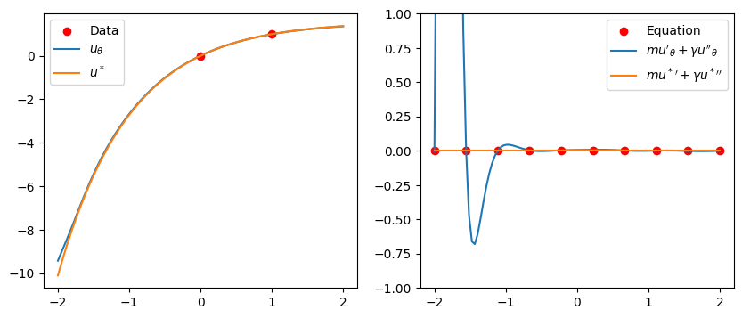
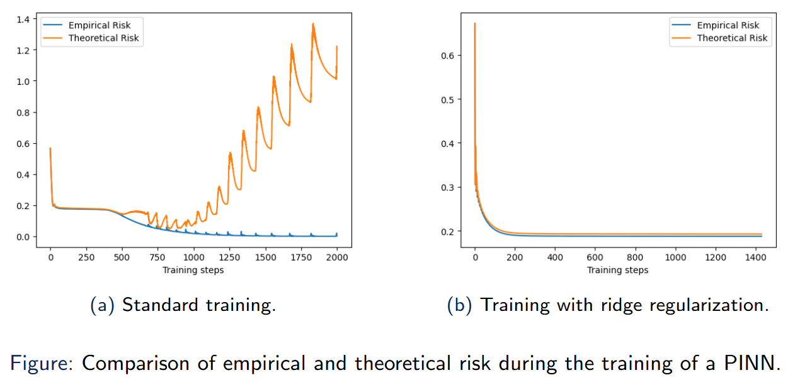
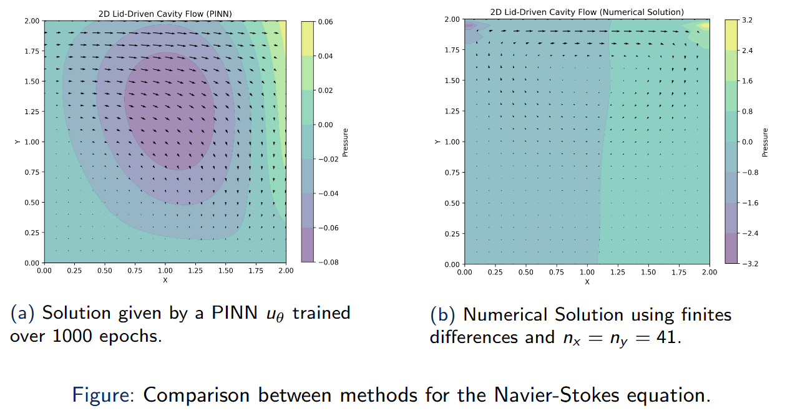

This post is an extract of my Master's Thesis in Mathematics, it can be found in this GitHub repository for a complete and autocomplete document: [repo](https://github.com/dani2442/tfm).

In our continuous pursuit of enlightenment, knowledge, and understanding of the world around us, we turn to the tool of mathematics. For thousands of years, mathematicians have sought to translate our sensory experiences into a language that captures their essence in the most abstract, universal, and general form.

> “Mathematics is the language in which God has written the universe.”\
>    — Galileo Galilei

Mathematics has provided a unique framework to express many foundational ideas about the natural world. For example, in 250 BCE, Archimedes proposed a model to describe the upward force exerted by a fluid on a submerged object, i.e., $F = \rho · V · g$ where $F$ is the force, $\rho$ the density, $V$ the volume and $g$ the force of gravity. More than a thousand years later, in the 17th century, Kepler formulated an equation to describe the motion of the planets around the Sun, i.e., $dA/dt$ is constant, where $A$ is the area of the line connecting a planet and the Sun. Shortly afterward, Newton introduced the three Laws of Motion, which became the foundation of classical mechanics and later led to more complex models such as the Naview-Stokes equation.

Mathematics has provided a unique framework to express many foundational ideas about the natural world. For example, in 250 BCE, Archimedes proposed a model to describe the upward force exerted by a fluid on a submerged object, i.e., $F = \rho \cdot V \cdot g$ where $F$ is the force, $\rho$ the density, $V$ the volume and $g$ the force of gravity. More than a thousand years later, in the 17th century, Kepler formulated an equation to describe the motion of the planets around the Sun, i.e., $\frac{dA}{dt}$ is constant, where $A$ is the area of the line connecting a planet and the Sun. Shortly afterward, Newton introduced the three Laws of Motion, which became the foundation of classical mechanics and later led to more complex models such as the Naview-Stokes equation.

Most of the equations governing the Universe—though not all—are expressed in terms of differentials. These problems are studied in the field of differential equations. The main objective in this field is to describe the solutions of these equations. Unfortunately, some of them do not have closed-form solutions, requiring us to rely on approximations provided by numerical methods.
A key challenge with numerical methods is ensuring that the approximations are reliable. This involves analyzing the consistency, stability, and convergence of the methods. Another significant issue is that numerical computations can be very resource-intensive.

In recent years, alternative approaches to traditional numerical methods have emerged, particularly for handling complex geometries or solving ill-posed problems—such as those with unknown boundary conditions. One such alternative is machine learning, which has gained significant traction in this context. The *leitmotiv* of machine learning is the learn a function from a dataset composed of samples. In our case, our goal may be to learn a *physics phenomenon* from a dataset, which is why this approach is often referred to as *data-driven*. A key drawback of data-driven methods is their heavy reliance on large quantities of data, which may not always be available. Moreover, these methods often disregard prior knowledge about the physical system. This limitation has led to the development of *physics-informed machine learning*.
The motivation behind physics-informed machine learning is twofold: to harness the strengths of machine learning while incorporating prior physical knowledge of the system. Combining these two domains increases the complexity of the problem, and this is the central focus of our study in this manuscript.

## Physics-Informed Machine Learning

Data-driven methods often require \textbf{large quantities of data}, which may be scarce or expensive to obtain. Moreover, they typically ignore valuable prior knowledge about the underlying physical system.Incorporating physical knowledge into the learning process:
- Physics-Informed Neural Networks [Raissi, 2019]
- NeuralODEs [Chen, 2019]

### Neural Networks (with tanh)

A Neural Network $u_\theta: \mathbb{R}^{d_1}\rightarrow \mathbb{R}^{d_2}$ is defined by 
\begin{equation*}
    u_\theta = \mathcal{A}_{H+1}\circ (\phi \circ \mathcal{A}_H) \circ \dots \circ (\phi \circ \mathcal{A}_1),
\end{equation*}
where $\mathcal{A}_k$ is an affine function and $\phi$ is the activation function, e.g., tanh. And, $\theta\in\Theta$ is the parameter of the neural network. 

We denote $\text{NN}_H^D$ the set of neural networks where $H$ is the number of layers and $D$ is the depth.

Key results:
- $\cup_{D\in \mathbb{N}} \text{NN}_H^D$ is dense in $(C^\infty(\bar{\Omega}, \mathbb{R}^{d_2}), \|\cdot\|_{C^K(\Omega)})$.
- $\|u_\theta\|_{C^K(\Omega)} \leq C\|\theta\|_2$.
- $\|u_\theta - u_{\theta'}\|_{C^K(\Omega)} \leq L\|\theta-\theta'\|_2$.
- $\|u_\theta(x) - u_\theta(y)\|_2 \leq \tilde{L} \|x-y\|_2$.

## Physics-Informed Neural Networks (PINNs)

**— Empirical Risk Function**
$$\widehat{R}_{n_1, n_2, n_3}(\textcolor{lightblue}{u_\theta}) := \frac{1}{n_1}\sum_{i=1}^{n_1} \|\textcolor{lightblue}{u_\theta}(\textcolor{red}{X_i})-\textcolor{red}{Y_i}\|_2^2 +\frac{1}{n_2}\sum_{i=1}^{n_2}\|\textcolor{lightblue}{u_\theta}(\textcolor{green}{X^{(2)}_j}) - \textcolor{purple}{h}(\textcolor{green}{X_j^{(2)}})\|_2^2 +\frac{1}{n_3}\sum_{k=1}^M \sum_{\ell=1}^{n_3} \textcolor{orange}{\mathfrak{F}_k}(\textcolor{lightblue}{u_\theta}, \textcolor{brown}{X_\ell^{(3)}})^2$$

where $\textcolor{lightblue}{u_\theta} \in \text{NN}_H^D$, $\{(\textcolor{red}{X_i}, \textcolor{red}{Y_i})\}_{i=1}^{n_1}$ i.i.d distributed as $(X,Y)\in \Omega\times \mathbb{R}^{d_2}$, $\textcolor{purple}{h} \in C(\partial\Omega)$ condition, $\{\textcolor{green}{X_j^{(2)}}\}_{j=1}^{n_2}$ i.i.d. $\partial\Omega$, $\{\textcolor{brown}{X_\ell^{(3)}}\}_{\ell=1}^{n_3}$ i.i.d. in $\Omega$, and $\textcolor{orange}{\mathfrak{F}_k}: C^\infty(\Omega, \mathbb{R}^{d_2}) \times \Omega\rightarrow \mathbb{R}^{d_2}$.

**— Theoretical Risk Function**

$$\widehat{R}_{n_1}(\textcolor{lightblue}{u_\theta}) := \frac{1}{n_1}\sum_{i=1}^{n_1} \|\textcolor{lightblue}{u_\theta}(\textcolor{red}{X_i})-\textcolor{red}{Y_i}\|_2^2 
        +\mathbb{E}_{X\in \mu_X}\|\textcolor{lightblue}{u_\theta}(X) - \textcolor{purple}{h}(X)\|_2^2 
        +\frac{1}{|\Omega|}\sum_{k=1}^M \int_\Omega \textcolor{orange}{\mathfrak{F}_k}(\textcolor{lightblue}{u_\theta}, x)^2dx $$
where $\textcolor{lightblue}{u_\theta} \in \text{NN}_H^D$, $\{(\textcolor{red}{X_i}, \textcolor{red}{Y_i})\}_{i=1}^{n_1}$ i.i.d, $\textcolor{purple}{h} \in C(\partial\Omega)$ condition, and $\textcolor{orange}{\mathfrak{F}_k}: C^\infty(\Omega, \mathbb{R}^{d_2})\times \Omega\rightarrow \mathbb{R}^{d_2}$.

## Example: Dynamic Friction Model

Let $\Omega:=(0,T)$ and $\mathfrak{F}(u,x) := mu''(x) + \gamma u'(x)$  where $u\in C^2(\overline{\Omega}, \mathbb{R})$ and $x\in \Omega$.    

Fix $n_1\in \mathbb{N}$. Let $\{\hat{\theta}_n(n_2, n_3)\}_{n\in \mathbb{N}}$ be a minimizing sequence for the empirical risk, i.e., 
$$ \lim_{n\rightarrow\infty} \widehat{R}_{n_1, n_2, n_3}(u_{\hat{\theta}_n(n_2, n_3)}) = \inf_{\theta\in \Theta_{H,D}} \widehat{R}_{n_1, n_2, n_3}(u_\theta)$$
We say that $\{\hat{\theta}_n(n_2, n_3)\}_{n\in \mathbb{N}}$ satisfies the \textit{risk-consistency} with respect to the theoretical risk $R_{n_1}$ if 
$$\lim_{n_2, n_3\rightarrow\infty} \lim_{n\rightarrow \infty} R_{n_1}(u_{\hat{\theta}_n(n_2, n_3)}) = \inf_{\theta\in \Theta_{H,D}} R_{n_1}(u_\theta).$$

The previous example can be used as a counterexample. We can define a sequence $\{\hat{\theta}_n(n_2, n_3)\}_{n\in\mathbb{N}}$ that verifies:
$$\lim_{n\rightarrow\infty} \widehat{R}_{n_1, n_2, n_3}(u_{\hat{\theta}_n(n_2, n_3)}) = 0 \quad\quad \text{and}  \lim_{n\rightarrow\infty} R_{n_1}(u_{\hat{\theta}_n(n_2, n_3)}) = \infty

First, we consider the case where $m=1$ and $\gamma=1$. We use the conditions $\{(0, 0), (1, 1)\}$, which yield the exact solution $$u^\star(x) = \frac{e}{e-1}(1-e^{-x}).$$

## Ridge PINNs

The ridge empirical risk function is defined by
$$ \widehat{R}^{(\text{ridge})}_{n_1, n_2, n_3}(u_\theta) := \widehat{R}_{n_1, n_2, n_3}(u_\theta) + \lambda_{(\text{ridge})}\|\theta\|_2^2.$$

> Theorem 3.8: Risk-consistency of ridge PINNs \\
>    Let $\{\hat{\theta}^{(\text{ridge})}_n(n_2, n_3)\}_{n\in \mathbb{N}}$ a minimizing sequence of the ridge empirical risk. Then, for some $\lambda_{(\text{ridge})}(n_2, n_3)$ depending only on $n_2, n_3$, then
>        $$ \lim_{n_2,n_3\rightarrow\infty} \lim_{n\rightarrow\infty} R_{n_1}(u_{\hat{\theta}^{(\text{ridge})}_n(n_2, n_3)}) = \inf_{\theta\in \Theta_{H,D}}R_{n_1}(u_\theta) $$
>        In other words, it is risk-consistent.

## Experiment: Lid-Driven Cavity Flow

Let $\Omega := (0,2)^2 \times [0,5]$, where $(x,y)\in (0,2)^2$ is the spatial domain and $t\in [0,5]$ is the time interval. 

The objective is to find the state variables—velocity components $(u,v)$ and pressure $p$—as a continuous function $\mathbf{v}=(u, v, p) \in C(\Omega, \mathbb{R}^3)$ that satisfies the following initial and boundary conditions:

 $$
     \begin{cases}
         u(x,y,0) = v(x,y,0)= p(x,y,0) = 0 & \forall x,y \in [0,2]\\
         v(x,0,t) = v(x,2,t) = 0 & \forall x \in [0,2] \quad\forall t \in [0,5]\\
         u(0,y,t) = 0 & \forall y \in [0,2] \quad\forall t \in [0,5]\\
         u(2,y,t) = 1 & \forall y \in [0,2] \quad\forall t \in [0,5]\\
         \frac{\partial p}{\partial \mathbf{n}}(x,0,t)=\frac{\partial p}{\partial \mathbf{n}}(x,2,t)=0 & \forall x \in [0,2] \quad\forall t \in [0,5]\\
         \frac{\partial p}{\partial \mathbf{n}}(0,y,t)=\frac{\partial p}{\partial \mathbf{n}}(2,y,t)=0 & \forall y \in [0,2] \quad\forall t \in [0,5]
     \end{cases}
 $$

## References
[Raissi, 2019] Raissi, M., Perdikaris, P., and Karniadakis, G. E. (2019). Physics-informed neural networks: A deep learning framework for solving forward and inverse problems involving nonlinear partial differential equations. Journal of Computational Physics, 378:686–707.

[Chen, 2019] Chen, R. T. Q., Rubanova, Y., Bettencourt, J., and Duvenaud, D. (2019). Neural Ordinary Differential Equations. arXiv:1806.07366 [cs].