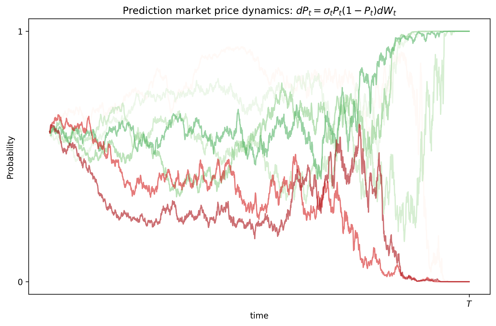

I always thought that actions matter more than words. The ultimate expression of this idea is the stock market and, more recently, prediction markets (such as Polymarket). For example, you can bet on a wide variety of topics that stretch from who might win an election to how many tweets Elon Musk will post in a single day. 

Over the past few years, public trust in institutions and journalism has eroded [[1]](#references), and this distrust has fueled the rise of new financial instruments like prediction markets. This data manipulation became clear during the last US election, where a big gap emerged between conventional polling data and the probabilities implied by market activity [[2]](#references). 

In contrast, traditional financial markets often resemble a "big fish game", where there is an asymmetry of information and influence. The information is aggregated, resulting in a single number, the price. The effectiveness of this "wisdom of the crowds" approach is supported by mathematical theories of information aggregation [[3]](#references), and has been largely validated by recent results. However, we must not glorify them, as there is a risk of insider trading and a perverse incentive for market manipulation.

Now, how does it work behind the scenes?

First, let's see how this compares to traditional markets and what the differences are. Traditional market theory tells us that the current price of an asset falls between the lowest price a seller is asking and the highest price a bidder is offering (the difference between these two is called the spread and represents the market's liquidity). In a prediction market, the "price" represents the odds of a binary outcome (win or lose). Once the bet is settled, you receive the payout. For example, if you bet €20 on an outcome with a 20% probability, you will receive €100 if you're right or €0 if you're wrong. The interesting part is that you can sell your bet at any point in time. For instance, if the market's perceived probability rises to 40%, you could sell your position for €40.

## Mathematical Modeling:
The application of advanced mathematics in finance is a relatively recent development. For example, Modern Portfolio Theory, introduced by Harry Markowitz, dates to the '50s; the Black-Scholes equation for options pricing appeared in the '70s; and the first major interest rate models, such as the Vasicek and CIR models, emerged in the late '70s and '80s [[4, 5, 6, 7]](#references). I expect to see further developments in predictive modeling in the coming years.

Now, we can derive a simple mathematical model for this task. There are several models that can be used: 

| Mathematical model | Stochastic Differential Equation |
| ---- | ------ |
|Two-point information-filtering model | $dP_t = \sigma P_t(1-P_t) dW_t$ |
| Log-diffusion model (see Appendix [A](#a-derivation-of-the-log-odd-diffusion-model)) | $dP_t = P_t(1-P_t)(\mu + \frac{1}{2}\sigma^2(1-2P_t))dt +  P_t(1-P_t)\sigma dW_t $ |
| Wright-Fisher model | $dP_t =\sqrt{\gamma P_t(1-P_t)} dW_t$

We will focus on the two-point information-filtering model as it is Martingale process, i.e., $\mathbb{E}[P_{t+1} | P_{t}] = P_t$. This property is very natural to assume.

Let us denote the unknown event by $X\in\{0,1\}$ with prior probabilities

$$
P(X=1)=p,\qquad P(X=0)=1-p.
$$

We assume the market (or an information stream) observes the continuous process

$$
\xi_t=\sigma X t + B_t,\tag{1}
$$

where $B_t$ is a standard Brownian motion (noise) and $\sigma>0$ is a signal-to-noise parameter (how strong the signal is). So conditional on $X$,

$$
\xi_t\mid\{X=1\}\sim N(\sigma t,\;t),\qquad 
\xi_t\mid\{X=0\}\sim N(0,\;t).
$$

Compute the likelihood ratio $L_t:=\frac{f(\xi_t\mid X=1)}{f(\xi_t\mid X=0)}$.
Gaussian densities give

$$
\frac{f(\xi_t\mid X=1)}{f(\xi_t\mid X=0)}
=\exp\!\Big(-\frac{(\xi_t-\sigma t)^2-\xi_t^2}{2t}\Big)
=\exp(\sigma\xi_t-\tfrac12\sigma^2 t).
$$

Then using the natural filtration $\mathcal{F}_t=\sigma(\xi_s : s\leq t)$ and Bayes yields

$$
P_t:=\Pr(X=1\mid\mathcal F_t)
=\frac{pf(\xi_t | X = 1)}{pf(\xi_t|X=1) + (1-p)f(\xi_t|X=0)}
=\frac{p\exp(\sigma\xi_t-\tfrac12\sigma^2 t)}{p\exp(\sigma\xi_t-\tfrac12\sigma^2 t)+(1-p)}.
$$

This is an explicit closed form for the posterior in terms of $\xi_t$. It’s a logistic-type formula.
Now, Differentiate $\xi_t$ in (1):

$$
d\xi_t=\sigma X\,dt + dB_t.
$$

Given the market filtration $\mathcal F_t$ (generated by $\xi$), the conditional expectation of the instantaneous drift is $\sigma P_t$. So define the *innovation*

$$
dW_t := d\xi_t - \sigma P_t\,dt.
$$

Properties:

* $E[dW_t\mid\mathcal F_t]=E[d\xi_t\mid\mathcal F_t]-\sigma P_t dt=\sigma\mathbb{E}[X |\mathcal{F}_t]dt - \sigma P_t dt =0$. So $W_t$ is a continuous martingale.
* $(dW_t)^2=(d\xi_t)^2=(dB_t)^2=dt$ (cross terms with $dt$ vanish), so $\langle W\rangle_t = t$.

By Lévy’s characterization, $W_t$ is a Brownian motion relative to $\mathcal F_t$. This is the standard *innovation* Brownian motion.


Let us define $\varphi_t := \sigma\xi_t-\tfrac12\sigma^2 t$, so the closed-form posterior is $P_t = \dfrac{p e^{\varphi_t}}{p e^{\varphi_t}+1-p}$. Let $f(\varphi)=P(\varphi)$. Two useful derivatives (logistic identity):

$$
f'(\varphi)=P_t(1-P_t),\qquad
f''(\varphi)=P_t(1-P_t)(1-2P_t).
$$

Compute $d\varphi_t$:

$$
d\varphi_t=\sigma\,d\xi_t-\tfrac12\sigma^2 dt
= \sigma(dW_t+\sigma P_t dt)-\tfrac12\sigma^2 dt
= \sigma\,dW_t + \sigma^2\big(P_t-\tfrac12\big)dt.
$$

Apply Itô’s formula $dP_t=f'(\varphi_t)d\varphi_t+\tfrac12 f''(\varphi_t)(d\varphi_t)^2$.
Since $(d\varphi_t)^2=\sigma^2(dW_t)^2=\sigma^2 dt$, substitute:

$$
dP_t
= P_t(1-P_t)\big(\sigma\,dW_t + \sigma^2(P_t-\tfrac12)dt\big)
+\tfrac12 P_t(1-P_t)(1-2P_t)\sigma^2 dt 
$$
$$
= \sigma P_t(1-P_t)\,dW_t + \sigma^2 P_t(1-P_t)\big(P_t-\tfrac12 + \tfrac12(1-2P_t)\big)dt.
$$

But the bracket in the drift vanishes:

$$
P_t-\tfrac12 + \tfrac12(1-2P_t)=0.
$$

So the drift term cancels exactly, leaving the tidy filtering SDE

$$
\boxed{\,dP_t=\sigma P_t(1-P_t)\,dW_t\,.}
$$

Notice that the model satisfies $P_t \in [0,1] $ and becomes constant when $P_t$ is 0 or 1. However, this model might not be able to arrive at a conclusion when the event is supposed to end, i.e., $P_T = 0 \text{ or }1$ (see the Experiments). See Appendix [B](#b-event-triggering-at) for a follow up on this issue.


## Experiment
We can simulate the two-point information-filtering model that obtained in the previous section and we obtain the following figure


I also attach the code for completeness

```python
T, N, n_sim = 4, 2000, 7    # time horizon and steps
dt = T/N                    # time step
sigma = 2.0                 # information flow parameter
p0 = 0.6                    # prior
t = np.linspace(0, T, N+1)

# Simulate SDE
P = np.zeros((n_sim, N+1))
P[:, 0] = np.full(n_sim, p0)
for i in range(N):
    dW = np.sqrt(dt) * np.random.randn(n_sim)
    P[:, i+1] = P[:, i] + sigma * P[:, i] * (1 - P[:, i]) * dW
    P[:, i+1] = np.clip(P[:, i+1], 0, 1)  # keep in [0,1]

fig, ax = plt.subplots(figsize=(10, 6))
for i in range(n_sim):
    ax.plot(t, P[i], alpha=0.6, c=plt.cm.Greens(i / n_sim) if P[i, -1] > 0.5 else plt.cm.Reds(i / n_sim))
ax.set_xlabel("time")
ax.set_ylabel("Probability")
ax.set_title("Prediction market price dynamics")
ax.set_yticks([0, 1])
ax.set_yticklabels(['0', '1'])
ax.set_xticks([])
plt.savefig("prediction_market_simulations.png", dpi=300, bbox_inches='tight')
plt.show()
```


Main takeaways (opinion):
- I believe this market will continue to grow rapidly, as the information it provides is very useful to consumers and the market participants themselves.
- A drawback of platforms like Polymarket is that capital tied up in long-term bets doesn't accrue interest. This means users are exposed to inflation risk, as the underlying currency is a stablecoin pegged to the dollar, i.e., 1$ = 1 USDT
- I expect institutions to become more involved, shifting the user base from its current majority of retail investors..
- I think we will see the introduction of more complex financial instruments such as derivatives on prediction markets outcomes.
- Increase in regulation (avoid insider trading, market manipulation, etc).
- Future work in mathematical models, introduction of Modern Portfolio Theory, hedging, risk, etc.


## References
[1] https://news.gallup.com/poll/1597/confidence-institutions.aspx

[2] https://edition.cnn.com/2024/11/08/business/polymarket-election-trump-nightcap

[3] https://projects.iq.harvard.edu/files/yiling/files/icecr04.pdf

[4] Baxter, M. y Rennie, A., Financial calculus an introduction to derivative pricing, Cambridge University Press

[5] Hull, J., Options, futures, and other derivative securities, Prentice-Hall.

[6] Neftci, S.N., An Introduction to the Mathematics of Financial Derivatives, Academic Press

[7] Wilmott, P., Howison, S. y Dewynne, J, Option pricing: mathematical models and computation, Oxford Finantial.


## Appendix

### (A) Derivation of the Log-odd diffusion model
This model is an analogue to Black–Scholes idea. Assume log-odds $Y_t=\log\frac{P_t}{1-P_t}$ follows an arithmetic Brownian motion

$$
dY_t = \mu\,dt + \sigma\,dW_t.
$$

Set $P_t = f(Y_t)$ with $f(y) = \frac{1}{1+e^{-y}}$ (the sigmoid). By Itô:

$$
f'(y)=P(1-P),\qquad f''(y)=P(1-P)(1-2P).
$$

Thus

$$
dP_t = f'(Y_t)\,dY_t + \frac{1}{2} f''(Y_t)\,(dY_t)^2 = P_t(1-P_t)\big(\mu\,dt + \sigma\,dW_t\big)+ \frac{1}{2}\sigma^2 P_t(1-P_t)(1-2P_t)\,dt,
$$

or collecting terms

$$
\boxed{\,dP_t = P_t(1-P_t)\,\sigma\,dW_t
\;+\;P_t(1-P_t)\Big(\mu + \frac{1}{2}\sigma^2(1-2P_t)\Big)\,dt. \,}
$$

### (B) Event triggering at $T$

We have studied the two-point information-filtering model.
However, this model does not handle a very important aspect. Imagine an event is resolver at time $T$. The model may not converge in time and in most applications the last moments are the most important. 

We can make the same filtering model but force the information to become infinitely informative as 
$t \rightarrow T^-$, which drives the posterior to 0 or 1 by time $T$. We can modify the equation with a time-dependent signal strength that guarantees resolution at $T$.

$$
dP_t = \sigma P_t(1-P_t)dW_t
$$

Replace the constant signal coefficient by a deterministic time-dependent one. Let

$$
d\xi_t = \sigma_t X\,dt + dB_t,\qquad t\in[0,T),
$$

with $X\in\{0,1\}$ and prior $\Pr(X=1)=p$. Here $\sigma_t>0$ is deterministic and continuous on $[0,T)$. (When needed we think of $\xi_0=0$.)

> When $\sigma_t\equiv\sigma$ this is the previous model; now $\sigma_t$ may blow up as $t\to T$ to create arbitrarily large signal-to-noise.

The likelihood ratio up to time $t$ is

$$
L_t
=\frac{d\mathbb P(\xi_{[0,t]}\mid X=1)}{d\mathbb P(\xi_{[0,t]}\mid X=0)}
=\exp\Big(\int_0^t \sigma_s\,d\xi_s - \tfrac12\int_0^t\sigma_s^2\,ds\Big).
$$

This is the Girsanov / Gaussian likelihood formula (check by completing the square).
By Bayes,

$$
P_t=\frac{p\exp\big(\int_0^t\sigma_s\,d\xi_s-\tfrac12\int_0^t\sigma_s^2\,ds\big)}
{p\exp\big(\int_0^t\sigma_s\,d\xi_s-\tfrac12\int_0^t\sigma_s^2\,ds\big)+(1-p)}.
$$

This reduces to the earlier closed form when $\sigma_s\equiv\sigma$.
As before define the innovation

$$
dW_t := d\xi_t - \sigma_t P_t\,dt.
$$

One checks $W_t$ is an $\mathcal F_t$-Brownian motion. Repeating the Itô calculation (same logistic derivatives as before) yields the SDE

$$
\boxed{\,dP_t=\sigma_t\,P_t(1-P_t)\,dW_t\,.}
$$

So $P_t$ remains a martingale (no drift) and its instantaneous volatility is $\sigma_t P_t(1-P_t)$.

**Condition that forces resolution at $T$**

Intuition: the posterior is driven by the log-odds

$$
\Lambda_t:=\log\frac{P_t}{1-P_t}
=\log\frac{p}{1-p}+\int_0^t\sigma_s\,d\xi_s-\tfrac12\int_0^t\sigma_s^2\,ds.
$$

Under the true value $X$, write $d\xi_s=\sigma_s X\,ds+dB_s$. Then

$$
\Lambda_t
=\log\frac{p}{1-p}+\int_0^t\sigma_s\,dB_s
+\int_0^t\sigma_s^2(X-\tfrac12)\,ds.
$$

The deterministic term $\int_0^t\sigma_s^2(X-\tfrac12)\,ds$ has sign depending on $X$. If the cumulative information $\int_0^T\sigma_s^2\,ds$ **diverges** to $+\infty$, this deterministic term dominates the stochastic martingale $\int_0^t\sigma_s\,dB_s$ as $t\to T$, and $\Lambda_t$ tends to $+\infty$ when $X=1$ and to $-\infty$ when $X=0$. Therefore

$$
P_T:=\lim_{t\to T^-}P_t=\begin{cases}1,& X=1,\\ 0,& X=0,\end{cases}
\quad\text{a.s.}
$$

So a sufficient condition for almost-sure resolution by time $T$ is

$$
\boxed{\ \int_0^T \sigma_s^2\,ds = +\infty.\ }
$$

If $\int_0^T\sigma_s^2 ds<\infty$ then the posterior need not hit $\{0,1\}$ at $T$; the information gathered is finite and the posterior may remain in $(0,1)$ with positive probability.

Take for example

$$
\sigma_s = \frac{\kappa}{\sqrt{T-s}},\quad\quad 0\leq s\leq T
$$

for some $\kappa>0$. Thus this $\sigma_s$ forces resolution at (or before) $T$. The SDE for $P_t$ becomes

$$
dP_t=\frac{\kappa}{\sqrt{T-t}}\,P_t(1-P_t)\,dW_t,
$$

Here, I show the result of a simulation using this new model:

