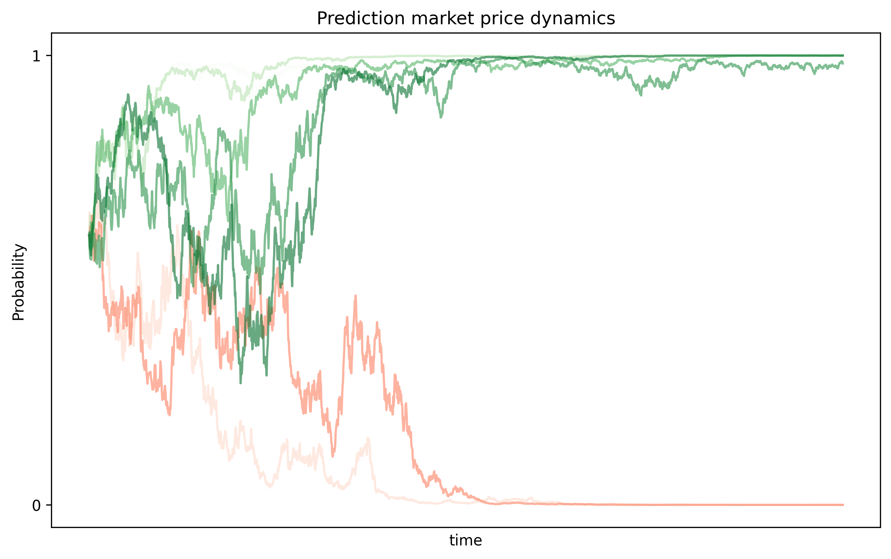

## Introduction

I always thought that actions matter more than words. And the maximum expression of this idea is the stock market, and most recently in prediction markets (such as Polymarket). For example, you can bet on wide varied of topics that stretched from who might win the election to how many tweets will Elon Musk post in a day.  

During the past few years I feel that we have lost the trust on institutions and journalism [1]. This has play an important role on the rise of this new financial instruments. It became clear during the last US election where there was a big gap between the polls and where the money went [2]. In fact, there is mathematical backup for the information aggregation provided by prediction markets [3]. However, we must not glorify it and never guessed as there is the risk of insider trading and there is a perverse incentive for market manipulation.

Now, how does it work behind the curtains?

First, lets see how compares to old markets and what differs. New market theory tells us that the price at the current moment of something is between the lower seller and the highest bidder (the difference between both is called the spread and represents the liquidity of the market). In prediction market the price is the odds of the bet, which is binary (win or lose). And once the bet is settle you receive the total quantity. For example, if you buy 20€ at an odd of 20%, you will receive 100€ or 0€ depending on the outcome. The interesting part is that you can sell your bet at any point in time, for example if the market now prices 40% odds, you can get back 40€.

## Mathematical Modeling:
The use of maths in finance is rather late. The Modern Portolio Theory introduced by Harry Markowitz dates to 50's, the black-scholes equation for options pricing appeared in 70's, and the first interest rates such as Vasicek Model and CIR Model in late 70's and 80's. I expect new work in predictive modeling in the following years.

Now, we can derive a simple model that can be used for this modelling task, namely two-point information-filtering model. 

The unknown event is $X\in\{0,1\}$ with prior

$$
P(X=1)=p,\qquad P(X=0)=1-p.
$$

We assume the market (or an information stream) observes the continuous process

$$
\xi_t=\sigma X t + B_t,
$$

where $B_t$ is a standard Brownian motion (noise) and $\sigma>0$ is a signal-to-noise parameter (how strong the signal is). So conditional on $X$,

$$
\xi_t\mid\{X=1\}\sim N(\sigma t,\;t),\qquad 
\xi_t\mid\{X=0\}\sim N(0,\;t).
$$

Compute the likelihood ratio $L_t:=\frac{f(\xi_t\mid X=1)}{f(\xi_t\mid X=0)}$.
Gaussian densities give

$$
\frac{f(\xi_t\mid X=1)}{f(\xi_t\mid X=0)}
=\exp\!\Big(-\frac{(\xi_t-\sigma t)^2-\xi_t^2}{2t}\Big)
=\exp(\sigma\xi_t-\tfrac12\sigma^2 t).
$$

Then by Bayes

$$
P_t:=\Pr(X=1\mid\mathcal F_t)
=\frac{p\,L_t}{p\,L_t+(1-p)}
=\frac{p\exp(\sigma\xi_t-\tfrac12\sigma^2 t)}{p\exp(\sigma\xi_t-\tfrac12\sigma^2 t)+(1-p)}.
$$

This is an explicit closed form for the posterior in terms of $\xi_t$. It’s a logistic-type formula.
Now, Differentiate $\xi_t$:

$$
d\xi_t=\sigma X\,dt + dB_t.
$$

Given the market filtration $\mathcal F_t$ (generated by $\xi$), the conditional expectation of the instantaneous drift is $\sigma P_t$. So define the *innovation*

$$
dW_t := d\xi_t - \sigma P_t\,dt.
$$

Properties:

* $E[dW_t\mid\mathcal F_t]=E[d\xi_t\mid\mathcal F_t]-\sigma P_t dt=0$. So $W_t$ is a continuous martingale.
* $(dW_t)^2=(d\xi_t)^2=(dB_t)^2=dt$ (cross terms with $dt$ vanish), so $\langle W\rangle_t = t$.

By Lévy’s characterization, $W_t$ is a Brownian motion relative to $\mathcal F_t$. This is the standard *innovation* Brownian motion.


Let us define $\varphi_t := \sigma\xi_t-\tfrac12\sigma^2 t$, so the closed-form posterior is $P_t = \dfrac{p e^{\varphi_t}}{p e^{\varphi_t}+1-p}$. Let $f(\varphi)=P(\varphi)$. Two useful derivatives (logistic identity):

$$
f'(\varphi)=P_t(1-P_t),\qquad
f''(\varphi)=P_t(1-P_t)(1-2P_t).
$$

Compute $d\varphi_t$:

$$
d\varphi_t=\sigma\,d\xi_t-\tfrac12\sigma^2 dt
= \sigma(dW_t+\sigma P_t dt)-\tfrac12\sigma^2 dt
= \sigma\,dW_t + \sigma^2\big(P_t-\tfrac12\big)dt.
$$

Apply Itô’s formula $dP_t=f'(\varphi_t)d\varphi_t+\tfrac12 f''(\varphi_t)(d\varphi_t)^2$.
Since $(d\varphi_t)^2=\sigma^2(dW_t)^2=\sigma^2 dt$, substitute:

$$
dP_t
= P_t(1-P_t)\big(\sigma\,dW_t + \sigma^2(P_t-\tfrac12)dt\big)
+\tfrac12 P_t(1-P_t)(1-2P_t)\sigma^2 dt 
$$
$$
= \sigma P_t(1-P_t)\,dW_t + \sigma^2 P_t(1-P_t)\big(P_t-\tfrac12 + \tfrac12(1-2P_t)\big)dt.
$$

But the bracket in the drift vanishes:

$$
P_t-\tfrac12 + \tfrac12(1-2P_t)=0.
$$

So the drift term cancels exactly, leaving the tidy filtering SDE

$$
\boxed{\,dP_t=\sigma P_t(1-P_t)\,dW_t\,.}
$$


## Experiment
We can simulate the two-point information-filtering model that obtained in the previous section and we obtain the following figure



I also attach the code for completeness

```python
T, N, n_sim = 4, 2000, 7    # time horizon and steps
dt = T/N                    # time step
sigma = 2.0                 # information flow parameter
p0 = 0.6                    # prior
t = np.linspace(0, T, N+1)

# Simulate SDE
P = np.zeros((n_sim, N+1))
P[:, 0] = np.full(n_sim, p0)
for i in range(N):
    dW = np.sqrt(dt) * np.random.randn(n_sim)
    P[:, i+1] = P[:, i] + sigma * P[:, i] * (1 - P[:, i]) * dW
    P[:, i+1] = np.clip(P[:, i+1], 0, 1)  # keep in [0,1]

fig, ax = plt.subplots(figsize=(10, 6))
for i in range(n_sim):
    ax.plot(t, P[i], alpha=0.6, c=plt.cm.Greens(i / n_sim) if P[i, -1] > 0.5 else plt.cm.Reds(i / n_sim))
ax.set_xlabel("time")
ax.set_ylabel("Probability")
ax.set_title("Prediction market price dynamics")
ax.set_yticks([0, 1])
ax.set_yticklabels(['0', '1'])
ax.set_xticks([])
plt.savefig("prediction_market_simulations.png", dpi=300, bbox_inches='tight')
plt.show()
```


Main takeaways (opinion):
- I think this market will continue to grow at a fast pace, I think the information that the market provides is very useful to consumers and the market itself.
- I don't like that in Polymarket, for long-term bets it do not appreciate with the current interest rate, so you kind of bear inflation risk (as the currency used behind is USDT, which is the stable coin for dollars, i.e., 1$ = 1 USDT)
- I expect institutions to start getting involved rather than the current majority of retailers that currently use it.
- I think we will see the introduction of more complex financial instruments such as derivatives.
- Increase in regulation (avoid insider trading, market manipulation, etc).
- Future work in mathematical models, introduction of Modern Portfolio Theory, hedging, risk, etc.


## References
[1] https://news.gallup.com/poll/1597/confidence-institutions.aspx

[2] https://edition.cnn.com/2024/11/08/business/polymarket-election-trump-nightcap

[3] https://projects.iq.harvard.edu/files/yiling/files/icecr04.pdf


