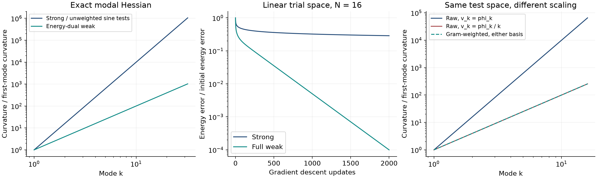
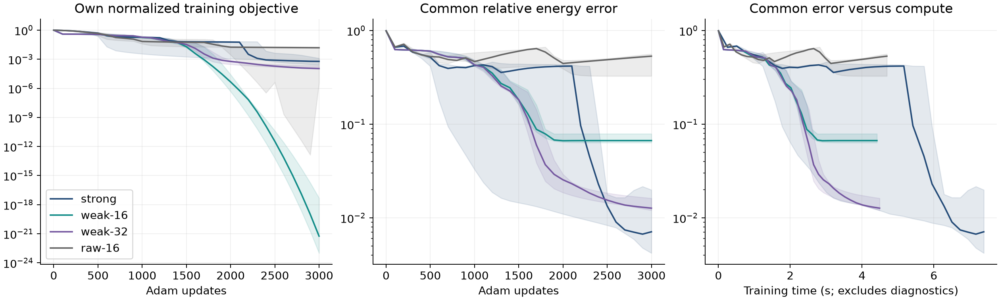
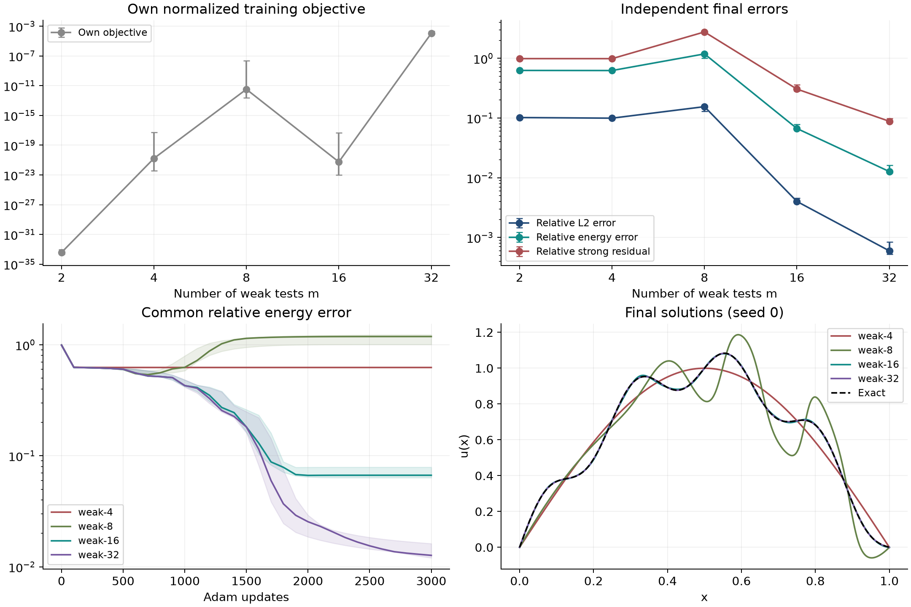

A physics-informed neural network approximates a PDE solution by minimizing a residual loss. The **strong formulation** evaluates the differential equation directly. A **weak formulation** tests the equation against functions and can move derivatives from the network onto those tests through integration by parts. These are the starting points of [PINNs](https://maziarraissi.github.io/PINNs/) and [variational PINNs](https://arxiv.org/abs/1912.00873), respectively.

There are two separate choices: **which norm measures the residual**, and **how much of that residual is observed**. The full weak residual measures the PDE defect in a weaker topology; finitely many weak tests can additionally leave entire error directions undetected. This distinction explains both the potential optimization benefit and the danger of a very small training loss.

We first make these statements precise for Poisson, then compare neural training and ablate the number and weighting of test functions. The [code and saved measurements](https://github.com/dani2442/dani2442_code/tree/main/strong-weak-pinns) reproduce all figures. For an introduction to PINNs, see the [earlier post]().

## 1. Strong and weak residuals

Let $\Omega\subset\mathbb R^d$ be a bounded Lipschitz domain, and consider

$$
-\Delta u^\star=f\quad\text{in }\Omega,
\qquad u^\star=0\quad\text{on }\partial\Omega,
\qquad f\in L^2(\Omega).
$$

Set $V=H_0^1(\Omega)$, with **energy inner product**

$$
(u,v)_V=\int_\Omega\nabla u\cdot\nabla v\,dx,
\qquad \|v\|_V=\|\nabla v\|_{L^2}.
$$

Poincaré's inequality makes this a Hilbert norm, equivalent to the usual $H^1$ norm on $V$. Assume the approximation $u_\theta\in V$ satisfies the boundary condition exactly, and write $e=u_\theta-u^\star$.

**Strong loss.** If $\Delta u_\theta\in L^2$, define

$$
r_\theta=-\Delta u_\theta-f=-\Delta e,
\qquad
\mathcal L_s(u_\theta)=\frac12\|r_\theta\|_{L^2}^2.
$$

Here the Laplacian is understood distributionally; $H^2\cap H_0^1$ is a sufficient trial space. Pointwise implementations use a sufficiently smooth network and spatial quadrature or collocation.

**Weak loss.** For any $u_\theta\in V$, define the functional

$$
\mathcal R_\theta(v)
=\int_\Omega\nabla u_\theta\cdot\nabla v\,dx
-\int_\Omega fv\,dx
=(e,v)_V,
\qquad v\in V.
$$

The residual $\mathcal R_\theta\in V'$ is a **linear functional**, not a single scalar. Its dual norm gives

$$
\mathcal L_w(u_\theta)
=\frac12\|\mathcal R_\theta\|_{V'}^2,
\qquad
\|\mathcal R_\theta\|_{V'}
=\sup_{v\ne0}\frac{|\mathcal R_\theta(v)|}{\|v\|_V}
=\|e\|_V.
$$

The last equality follows from Cauchy–Schwarz, with equality at $v=e$ when $e\ne0$. Thus

$$
\boxed{\mathcal L_w(u_\theta)=\frac12\|\nabla e\|_{L^2}^2.}
$$

This exact identity uses the energy norm chosen above. It is not an identity for every convention for the $H^{-1}$ norm, every PDE, or every weak loss.

### Does the full weak residual lose information?

For $r\in L^2$, the map $r\mapsto[v\mapsto\int rv]$ is injective because $H_0^1$ is dense in $L^2$. Knowing all weak tests therefore determines $r$. Both full losses vanish only at the solution, under our boundary conditions.

However,

$$
\|r\|_{V'}\le C_P\|r\|_{L^2},
$$

and no uniform reverse bound holds on all of $L^2$. A weaker norm changes sensitivity to errors without making nonzero residuals invisible. Actual invisibility enters when we restrict the tests.

## 2. Conditioning depends on the residual norm

Let $\{\phi_k\}$ be an $L^2$-orthonormal Dirichlet Laplacian eigenbasis, with $-\Delta\phi_k=\lambda_k\phi_k$. For $e=\sum_k e_k\phi_k$,

$$
\mathcal L_s=\frac12\sum_k\lambda_k^2|e_k|^2,
\qquad
\mathcal L_w=\frac12\sum_k\lambda_k|e_k|^2.
$$

The strong loss penalizes high frequencies more heavily. On the first $N$ modes, in the **Euclidean coordinates $(e_1,\ldots,e_N)$**, the Hessians are diagonal:

$$
H_s=\operatorname{diag}(\lambda_k^2),
\qquad H_w=\operatorname{diag}(\lambda_k).
$$

For $(0,1)$, $\lambda_k=(k\pi)^2$, giving exactly

$$
\kappa(H_s)=N^4,\qquad \kappa(H_w)=N^2.
$$

This is a conditioning statement in specified coordinates, not an intrinsic condition number of a functional. In energy-orthonormal coordinates, the weak Hessian is the identity.

If $A:V\to V'$ denotes the weak Dirichlet Laplacian, it is also the Riesz map for this energy inner product. Consequently,

$$
\|\mathcal R\|_{V'}^2
=\langle\mathcal R,A^{-1}\mathcal R\rangle_{V',V}.
$$

The inverse elliptic operator reweights the residual. In this sense, the energy-dual weak loss acts as **operator preconditioning**.

### What survives neural parameterization?

Both full losses are strictly convex quadratics in the admissible function $u$. Composing with a nonlinear network $u_\theta$ generally gives nonconvex objectives in $\theta$.

For a discretized residual vector $r(\theta)$ and a fixed positive-definite weight matrix $M$,

$$
\mathcal L(\theta)=\frac12r(\theta)^\top M r(\theta),
\qquad
\nabla_\theta^2\mathcal L
=J_r^\top M J_r
+\sum_i(Mr)_i\nabla_\theta^2r_i.
$$

The first term is the Gauss–Newton matrix. The second vanishes at zero residual and is small near it if the residual Hessians remain bounded. Changing $M$ can improve conditioning, but the network Jacobian, parameter redundancies, and optimizer also matter. The modal calculation does **not** guarantee a better-conditioned parameter Hessian or faster neural training.

Integration by parts provides another benefit: the weak Poisson loss requires first spatial derivatives of the network; the strong loss requires second derivatives. This can reduce differentiation cost. It does not by itself establish smoother parameter losses, lower sampling variance, or better convergence.

For this symmetric problem, the full weak loss also equals the excess Dirichlet energy $E(u_\theta)-E(u^\star)$, where $E(u)=\tfrac12\|u\|_V^2-\int fu$. Minimizing that energy directly is another option; the experiments below instead isolate **finite tested residuals**.

## 3. Finite tests: normalization and missing directions

Choose linearly independent tests $v_1,\ldots,v_m\in V$ and let $V_m$ be their span. Define

$$
b_i=\mathcal R_\theta(v_i),\qquad G_{ij}=(v_i,v_j)_V.
$$

Writing $v=\sum_i c_i v_i$ gives $\mathcal R_\theta(v)=c^\top b$ and $\|v\|_V^2=c^\top Gc$. Maximizing over $c$ yields

$$
\boxed{
\mathcal L_{w,m}
=\frac12\sup_{v\in V_m\setminus\{0\}}
\frac{|\mathcal R_\theta(v)|^2}{\|v\|_V^2}
=\frac12 b^\top G^{-1}b.
}
$$

In code, solve $Gz=b$ and compute $b^\top z$; an explicit inverse is unnecessary. Our sine basis makes $G$ diagonal.

### Why the Gram matrix matters

For a nonsingular basis change $\widetilde v_j=\sum_i v_iS_{ij}$,

$$
\widetilde b=S^\top b,\qquad \widetilde G=S^\top GS,
\qquad
\widetilde b^\top\widetilde G^{-1}\widetilde b=b^\top G^{-1}b.
$$

The loss depends on the test **space**, not its basis. The unweighted alternative $\tfrac12 b^\top b$ lacks this invariance, except for special basis changes.

For $v_k=\phi_k=\sqrt2\sin(k\pi x)$, $b_k=\lambda_ke_k$ and $G_{kk}=\lambda_k$. Therefore

$$
\mathcal L_{w,m}=\frac12\sum_{k\le m}\lambda_k e_k^2,
\qquad
\mathcal L_{\mathrm{raw},m}=\frac12\sum_{k\le m}\lambda_k^2 e_k^2.
$$

Unweighted sine tests retain the strong loss's modal stiffness on the observed modes, despite using only first network derivatives. Rescaling the tests by $1/k$ changes that unweighted stiffness from $k^4$ to $k^2$. Gram weighting already accounts for the rescaling and gives the same objective in either basis.

### What a finite projection cannot see

Let $P_m:V\to V_m$ be the energy-orthogonal projection. For Poisson,

$$
\mathcal L_{w,m}=\frac12\|P_me\|_V^2,
\qquad
\mathcal L_w-\mathcal L_{w,m}
=\frac12\|(I-P_m)e\|_V^2.
$$

Thus $\mathcal L_{w,m}\le\mathcal L_w$, and zero tested loss need not mean zero error. With the first $m$ sine tests, any error $e=a\phi_K$ with $K>m$ is invisible. For nested dense test spaces the projected losses converge upwards to the full loss **for a fixed error**; this does not guarantee monotone error across separately trained networks.

On a prescribed linear trial-error space $E_h$, a useful stability quantity is

$$
\beta_{h,m}
=\inf_{e\in E_h\setminus\{0\}}
\frac{\|P_me\|_V}{\|e\|_V}.
$$

If $\beta_{h,m}>0$, then $\|e\|_V\le\sqrt{2\mathcal L_{w,m}}/\beta_{h,m}$. In energy-orthonormal trial coordinates this constant is the smallest singular value of the Gram-normalized test matrix. Otherwise the relevant trial and test Gram matrices must both be included. Over all of $V$, any finite test space has $\beta=0$.

A finite-parameter neural network is not generally a finite-dimensional **linear function space**. For neural models, such a bound must be established on their attainable error set, or locally on tangent directions; counting parameters and tests is insufficient. Likewise, finitely sampled strong losses can miss errors between collocation points. Both formulations need independent validation.

## 4. Experiments

### 4.1 A controlled conditioning calculation

First, optimize coefficients directly in the first 16 sine modes, with initial error coefficients $e_k^{(0)}=1/k$. For each quadratic, use gradient descent with step size $1/\lambda_{\max}(H)$:

$$
e_k^{(t)}=\left(1-\frac{h_k}{\max_j h_j}\right)^t e_k^{(0)},
\qquad h_k=\lambda_k^2\ \text{or}\ \lambda_k.
$$

This gives an exact, reproducible calculation without neural parameterization, quadrature, or stochasticity. Each objective uses its own curvature-based step size, so overall loss scaling cannot explain the comparison.



*The condition numbers are 65,536 and 256 at $N=16$. The common energy error decays faster under the weak quadratic. The right panel changes only the basis scaling within the same test space; Gram weighting preserves the objective.*

### 4.2 Neural Poisson benchmark

On $(0,1)$, manufacture the solution and forcing

$$
u^\star(x)=\sin(\pi x)+0.1\sin(8\pi x),
\qquad
f(x)=\pi^2\sin(\pi x)+6.4\pi^2\sin(8\pi x).
$$

The second mode has small displacement amplitude but substantial derivative energy. We use

$$
u_\theta(x)=x(1-x)N_\theta(2x-1),
$$

where $N_\theta$ is a tanh network with two hidden layers of width 32 (1,153 parameters). The boundary condition is exact, so no boundary-penalty weight enters the comparison.

All methods use the same 128-point Gauss–Legendre quadrature, CPU float64, full-batch Adam at learning rate $10^{-3}$, and 3,000 updates. Seeds 0, 1, and 2 are paired across methods: each seed gives identical initial parameters for every loss. We report the final iterate, without selecting checkpoints using the exact solution.

The methods are strong training, Gram-weighted sine tests with $m\in\{2,4,8,16,32\}$, and unweighted sine tests with $m=16$. To remove overall forcing scale, the implemented objectives are

$$
\widehat{\mathcal L}_s=\frac{\|r\|_{L^2}^2}{\|f\|_{L^2}^2},
\qquad
\widehat{\mathcal L}_{w,m}=\frac{b^\top G^{-1}b}{\|f\|_{V'}^2},
\qquad
\widehat{\mathcal L}_{\mathrm{raw},m}=\frac{b^\top b}{\|f\|_{L^2}^2}.
$$

The weak denominator is fixed across all $m$. It is computed from the forcing's first 32 sine coefficients, which contain its complete spectrum in this example. These objectives are all dimensionless, but still measure different quantities.

On an independent 512-point Gauss–Legendre rule, we measure three common diagnostics:

$$
\varepsilon_0=\frac{\|u_\theta-u^\star\|_{L^2}}{\|u^\star\|_{L^2}},
\qquad
\varepsilon_1=\frac{\|u_\theta'-u^{\star\prime}\|_{L^2}}{\|u^{\star\prime}\|_{L^2}},
\qquad
\rho=\frac{\|-u_\theta''-f\|_{L^2}}{\|f\|_{L^2}}.
$$

For this problem, $\varepsilon_1^2$ is exactly the normalized **full** weak loss. It is available as a diagnostic because the exact solution is known; training uses only the forcing and tested residuals.



*Lines show medians over three seeds; shading shows the full range. The left panel tracks each method's own objective. The other panels use the same error metric. Time includes optimization steps and excludes diagnostics; curves use median cumulative training time at each recorded update.*

Final medians are:

| Objective | Own loss | Relative L2 | Relative energy | Relative residual | Training (s) |
| --- | ---: | ---: | ---: | ---: | ---: |
| strong | 6.02e-04 | 0.44% | 0.71% | 2.45% | 7.39 |
| weak-2 | 3.75e-34 | 10.19% | 62.71% | 98.95% | 5.66 |
| weak-4 | 1.69e-21 | 9.95% | 62.47% | 98.81% | 5.30 |
| weak-8 | 3.30e-12 | 15.51% | 118.70% | 276.90% | 5.01 |
| weak-16 | 5.62e-22 | 0.40% | 6.68% | 30.57% | 4.41 |
| weak-32 | 1.09e-04 | 0.06% | 1.27% | 8.82% | 4.49 |
| raw-16 | 1.53e-02 | 18.83% | 53.26% | 194.97% | 4.69 |

The strong formulation has the lowest median energy and strong-residual errors. The 32-test weak formulation has the lowest median $L^2$ error and a lower measured training cost. There is no single winner independent of the error norm.

Gram-weighted training improves markedly over unweighted training at $m=16$ under this shared Adam configuration. Yet its almost-zero tested loss coexists with 6.68% energy error. Successful optimization of the projected objective does not certify the full PDE solution.

### 4.3 Ablation: how many tests are enough?



*Markers and error bars show medians and full ranges over three seeds. Solution curves use the prespecified seed 0. All weak runs share the same network, initialization seeds, optimizer, quadrature, and loss normalization.*

With $m=2$ or $4$, the forcing's eighth mode is unobserved. The tested losses approach numerical zero while relative energy errors remain near 62.5%. For comparison, omitting just the true eighth solution mode gives

$$
\varepsilon_0=\frac{0.1}{\sqrt{1.01}}\approx9.95\%,
\qquad
\varepsilon_1=\sqrt{\frac{0.64}{1.64}}\approx62.47\%.
$$

At $m=8$, the tests include every mode present in the exact solution, but the trained network develops substantial error outside the tested space. The relative energy error exceeds 100% despite a tiny tested loss. **Covering the forcing's frequencies is insufficient:** the tests must also constrain unwanted frequencies the trial model can generate.

Increasing to 16 and then 32 tests reduces the unobserved error in these runs. The 32-test training objective is larger than the 16-test objective, even though its solution is more accurate. A harder-to-minimize loss can be a more informative one.

### 4.4 Numerical checks and limits

For every final network, doubling diagnostic quadrature from 512 to 1,024 points changes the reported errors by less than $10^{-5}$ relatively. Recomputing the training objective with 256 instead of 128 points changes its normalized value by less than $2.2\times10^{-8}$ absolutely. The script also checks the manufactured PDE, integration by parts, Gram invariance under a nonorthogonal basis change, an analytically invisible mode, and parameter gradients against finite differences.

These checks separate the observed projection failure from detectable quadrature error in this benchmark. They do not establish stability for arbitrary networks or test spaces. Three seeds on one smooth one-dimensional PDE are an illustration, not a general performance ranking. Learning rates were shared rather than tuned per method; timings depend on this CPU implementation, and no neural Hessian spectrum was measured.

## 5. Practical conclusions

A weak formulation changes both the derivatives needed to compute a residual and, depending on the chosen test norm, its spectral weighting. For Poisson, the full energy-dual norm turns squared Laplacian error into gradient error. This improves conditioning in a fixed modal parameterization without making neural training convex.

Finite tests introduce a separate approximation. Gram weighting removes arbitrary basis dependence; it cannot recover directions outside the test space. The useful comparison therefore reports the training objective alongside common solution and residual errors, varies test-space resolution, and checks quadrature independently. In this example, the most misleading result would have been to declare the smallest training loss the best solution.

## Reproduce the figures

From the repository root, using an environment with NumPy, Matplotlib, and CPU PyTorch:

```bash
python code/strong-weak-pinns/experiment.py
```

This runs all 21 neural experiments, performs the numerical checks, writes histories and a summary under `code/strong-weak-pinns/results/`, and regenerates the figures in this post's directory. To rebuild figures from the committed measurements without retraining:

```bash
python code/strong-weak-pinns/experiment.py --plot-only
```

The [experiment README](https://github.com/dani2442/dani2442_code/blob/main/strong-weak-pinns/README.md) gives environment setup, output formats, and options for separate runs.

## References

- Raissi, M., Perdikaris, P., and Karniadakis, G. E. (2019). [Physics-informed neural networks: A deep learning framework for solving forward and inverse problems involving nonlinear partial differential equations](https://doi.org/10.1016/j.jcp.2018.10.045). *Journal of Computational Physics*, 378, 686–707.
- Kharazmi, E., Zhang, Z., and Karniadakis, G. E. (2019). [Variational Physics-Informed Neural Networks for Solving Partial Differential Equations](https://arxiv.org/abs/1912.00873). The variational residual construction motivates the finite-test comparison; the Poisson identities and controlled ablations above are derived explicitly here.
