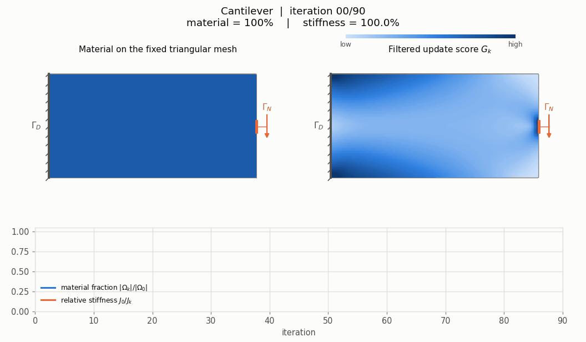
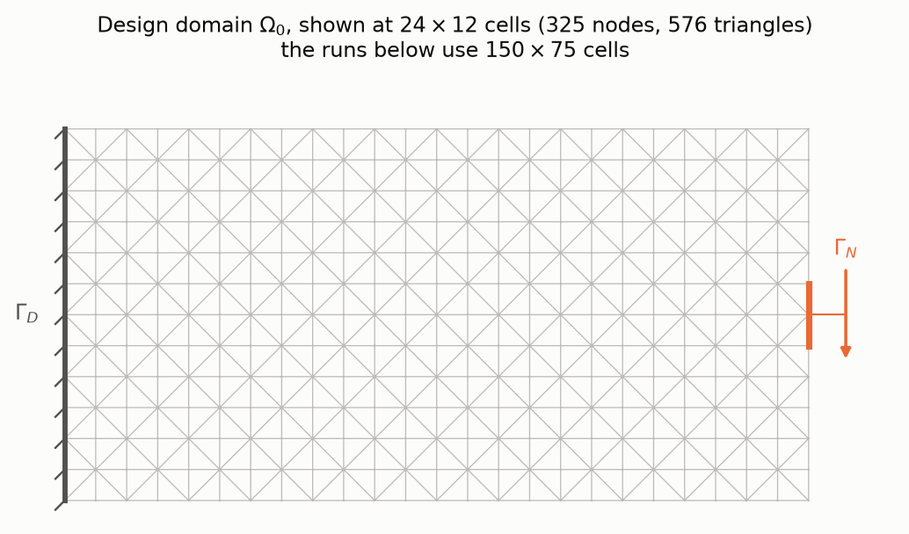
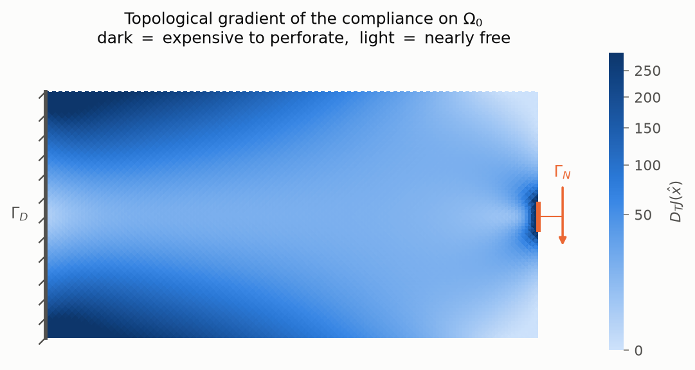
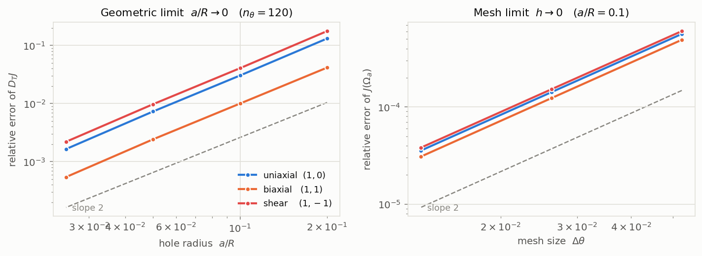
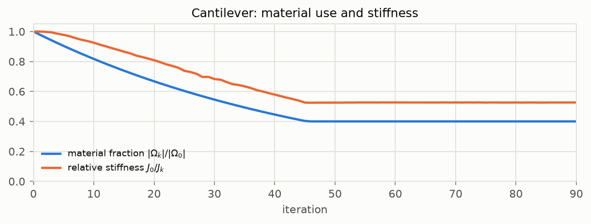
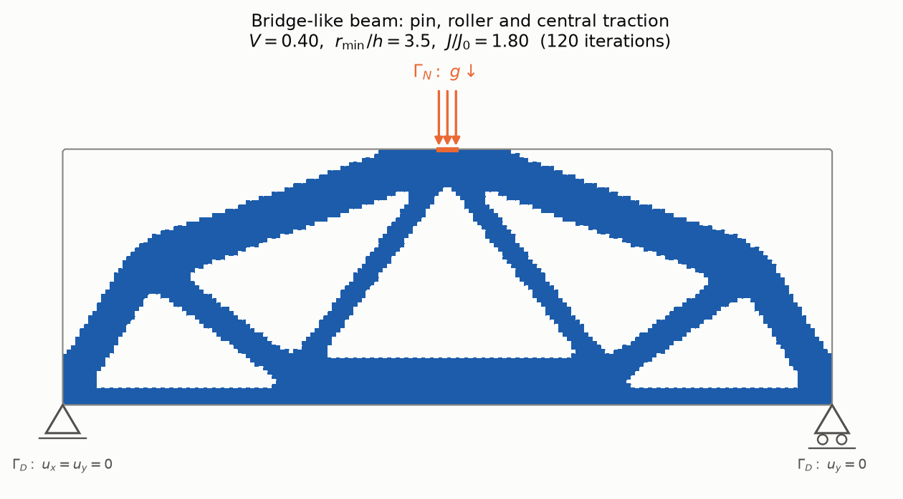
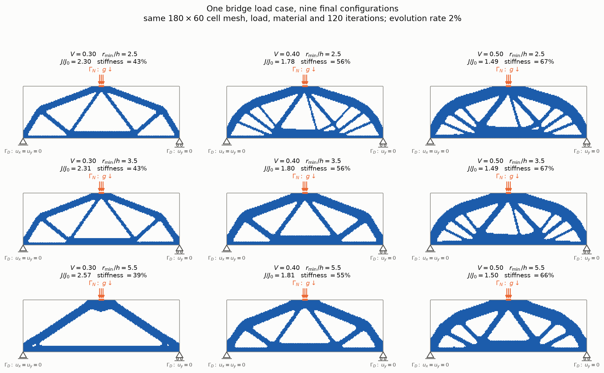
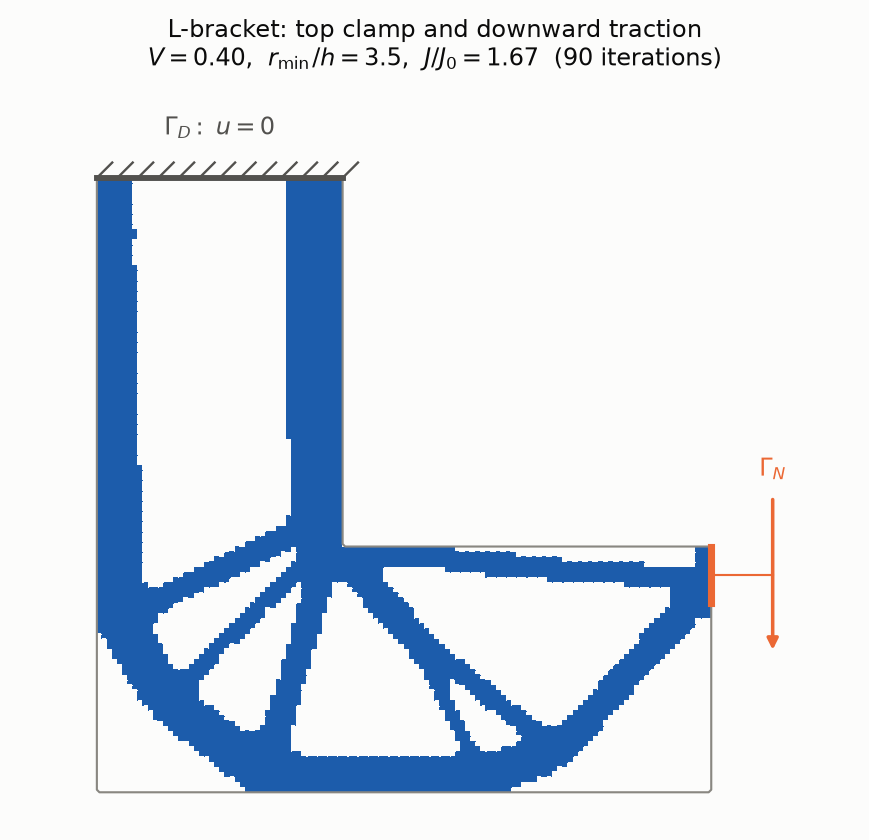

Imagine designing a beam that spans a gap and carries a load at its centre.
A solid block would do the job, but much of its material contributes little to
its stiffness. Where can we remove material without making the beam bend too
much? And if we are allowed to keep only 40% of the block, what shape should
remain? This is the question behind **compliance minimization**: find a stiff
structure within a prescribed material budget.

Moving the outer boundary is one way to improve a design. A classical *shape
derivative* tells us how the cost changes under that motion, but a smooth
boundary deformation cannot open a new hole inside solid material. To discover
a truss-like structure starting from a full block, we need a way to decide
where holes should appear.

The **topological derivative** answers a local version of that question: how
much would the compliance increase if we made a very small hole here? It assigns
a cost per unit removed area to each point. Removing material where this cost
is small, then solving the elasticity problem again, lets us gradually uncover
the parts that carry the load. Hole-insertion ideas appeared in Schumacher's
1995 work [[1]](#references); Sokołowski and Żochowski formalized the
topological derivative in 1999, including examples in plane elasticity.
[Their paper](https://doi.org/10.1137/S0363012997323230) is one of the starting
points for the theory used here.

In this post we derive that derivative for a circular, traction-free hole,
check its coefficient against finite-element calculations, and use it to guide
an optimization on a triangular mesh. At each iteration we solve for the
displacement, compute and smooth the sensitivity, and retain the cells with
the largest scores as the material budget decreases. The animation shows this
process for a cantilever; later we turn to a bridge-like beam and see how the
material budget and smoothing radius change its final configuration.



*Left: the current material layout. Right: the filtered and temporally averaged
sensitivity used to choose the next layout; darker regions have higher scores.
The curves track material use and stiffness. All 91 frames are solved states,
from iteration 0 to iteration 90. The triangular mesh stays fixed while cells
switch between solid and a very weak substitute for void. The colour scale is
fixed throughout, gamma-compressed, and clipped at the 98th percentile of
positive scores over the run. The final frame is a computed design, with no
guarantee of global optimality.*

The state equation and notation come first (§1–§2), followed by the derivation
(§3), discretization and verification (§4–§5), and the algorithm and examples
(§6–§7). All the code is in
[`code/topological_derivative/`](https://github.com/dani2442/dani2442.github.io/tree/main/code/topological_derivative):
`numpy` + `scipy.sparse` + `matplotlib`, with Pillow for the GIF.

## 1. The state problem

We use **static, small-strain linear elasticity**, with no body force and unit
out-of-plane thickness. Let $\Omega\subset\mathbb R^2$ be a bounded, connected
Lipschitz domain occupied by material. Its boundary splits into a clamped part,
a loaded part, and a free part:

$$
\partial\Omega=\Gamma_D\cup\Gamma_N\cup\Gamma_0,
\qquad \mathcal H^1(\Gamma_D)>0 .\tag{1.1}
$$

The pieces are disjoint up to sets of boundary length zero. The unknown is the
**displacement** $u(x)$: the vector by which the material point $x$ moves under
the load. Its symmetric gradient is the small-strain tensor,
$\varepsilon(u)=\tfrac12(\nabla u+\nabla u^\top)$. The stress is given by
Hooke's law, $\sigma(u)=\mathbb C\varepsilon(u)$, where **$\mathbb C$ is the
fourth-order elasticity tensor**. It maps strain to stress and contains the
material's stiffness parameters; it is not the compliance $J$.

For a prescribed $g\in L^2(\Gamma_N;\mathbb R^2)$, the governing equation and
boundary conditions, in **strong form**, are

$$
\boxed{
\begin{aligned}
-\operatorname{div}\!\big(\mathbb C\varepsilon(u)\big)&=0
&&\text{in }\Omega,\\
u&=0 &&\text{on }\Gamma_D,\\
\big(\mathbb C\varepsilon(u)\big)n&=g &&\text{on }\Gamma_N,\\
\big(\mathbb C\varepsilon(u)\big)n&=0 &&\text{on }\Gamma_0.
\end{aligned}
}\tag{1.2}
$$

The first line expresses force balance inside the material. On $\Gamma_D$ we
prescribe zero displacement; on $\Gamma_N$ we prescribe the traction $g$,
meaning force per unit boundary length in this unit-thickness model. The
remaining boundary carries no traction. Thus $\Gamma_D$ and $\Gamma_N$ are
boundary sets, not forces: the orange arrows in the figures represent $g$.

### Notation at a glance

| Symbol | Meaning |
|---|---|
| $\Omega$, $\Omega_0$ | Current material domain and the fixed region in which a design may be placed. |
| $\Gamma_D$, $\Gamma_N$, $\Gamma_0$ | Boundary with prescribed displacement, applied traction, and zero traction, respectively. |
| $u$, $v$ | Displacement and a virtual displacement (test function). |
| $n$, $g$ | Outward unit normal and prescribed boundary traction. On a hole, §3.2 explicitly specifies the normal orientation. |
| $\varepsilon(u)$, $\sigma(u)$ | Symmetric strain tensor and symmetric stress tensor. |
| $\mathbb C$, $D$ | Elasticity tensor and its $3\times3$ matrix representation in engineering Voigt notation. |
| $E$, $\nu$ | Young's modulus (stiffness scale) and Poisson's ratio (lateral contraction). |
| $\mu$, $\lambda^\ast$ | Shear modulus and effective Lamé coefficient for the chosen plane model. |
| $I$, $\operatorname{tr}A$, $A:B$ | Identity tensor, trace, and tensor inner product $A:B=\sum_{i,j}A_{ij}B_{ij}$. |
| $V(\Omega)$, $a_\Omega[u,v]$, $\ell[v]$ | Admissible displacement space, elastic bilinear form, and work of the load. |
| $\ell$ | Scalar multiplier for the material constraint in §6; distinct from the load functional $\ell[v]$. |
| $J(\Omega)$ | Compliance: the work of the prescribed load at equilibrium. Smaller means stiffer for this load. |
| $\hat x$, $\varepsilon$, $B_\varepsilon(\hat x)$ | Hole centre, hole radius, and the disk removed there. The scalar radius $\varepsilon$ is distinct from the strain $\varepsilon(u)$. |
| $D_TJ$, $G_k$ | Topological derivative per unit removed area, and the filtered, averaged cell score used at iteration $k$. |
| $V$, $\chi_e$ | Target material fraction and the binary material indicator of cell $e$. The scalar $V$ is distinct from the space $V(\Omega)$. |
| $h$, $r_{\min}$, $\mathrm{er}$ | Background cell width, filter radius, and fraction of material removed per scheduled update. |
| $\kappa$, $E_{\min}$ | Muskhelishvili constant used in the hole calculation, and the small modulus assigned to void cells in the numerical model. |

### From force balance to the weak form

To solve (1.2) with finite elements, multiply force balance by a test function
$v$ that vanishes on $\Gamma_D$ and integrate by parts. The boundary conditions
leave only the work of $g$:

$$
\int_\Omega \mathbb C\varepsilon(u):\varepsilon(v)\,dx
=\int_{\Gamma_N}g\cdot v\,ds.
$$

More precisely, define

$$
V(\Omega):=\big\{v\in H^1(\Omega;\mathbb R^2):v|_{\Gamma_D}=0\big\},
$$
$$
a_\Omega[u,v]:=\int_\Omega\sigma(u):\varepsilon(v)\,dx,
\qquad \ell[v]:=\int_{\Gamma_N}g\cdot v\,ds.
$$

The **weak problem** is to find $u\in V(\Omega)$ such that
$a_\Omega[u,v]=\ell[v]$ for every $v\in V(\Omega)$. It expresses the same force
balance without requiring classical second derivatives of $u$.

### The material law

For an isotropic plane material the elasticity tensor acts on symmetric
$2\times2$ tensors as
$$\mathbb C\,\xi=2\mu\,\xi+\lambda^\ast\,(\operatorname{tr}\xi)\,I .\tag{1.3}$$
With constant coefficients, substituting this law into the first line of
(1.2) gives the displacement equation explicitly:

$$
-\mu\Delta u-(\lambda^\ast+\mu)\nabla(\operatorname{div}u)=0
\qquad\text{in }\Omega.
$$

Decomposing $\xi=\xi^D+\tfrac12(\operatorname{tr}\xi)I$ into deviatoric and
hydrostatic parts gives $|\xi|^2=|\xi^D|^2+\tfrac12(\operatorname{tr}\xi)^2$ and
$$\mathbb C\,\xi:\xi=2\mu\,|\xi^D|^2+(\lambda^\ast+\mu)\,(\operatorname{tr}\xi)^2
\ \ge\ \min\{2\mu,\,2(\lambda^\ast+\mu)\}\,|\xi|^2 ,\tag{1.4}$$
so $\mathbb C$ is positive definite exactly when $\mu>0$ and
$\lambda^\ast+\mu>0$. The two plane models differ only in $\lambda^\ast$: one
enforces $\sigma_{33}=0$, the other $\varepsilon_{33}=0$, and both reduce to
(1.3) with

| | $\mu$ | $\lambda^\ast$ | $\kappa:=\dfrac{\lambda^\ast+3\mu}{\lambda^\ast+\mu}$ |
|---|---|---|---|
| plane strain | $\dfrac{E}{2(1+\nu)}$ | $\dfrac{E\nu}{(1+\nu)(1-2\nu)}$ | $3-4\nu$ |
| plane stress | $\dfrac{E}{2(1+\nu)}$ | $\dfrac{E\nu}{1-\nu^2}$ | $\dfrac{3-\nu}{1+\nu}$ |

The last column is the **Muskhelishvili constant**; writing it as
$\kappa=(\lambda^\ast+3\mu)/(\lambda^\ast+\mu)$ handles both models at once,
which is what will let us derive one formula instead of two. In Voigt notation
$(\,\cdot_{xx},\cdot_{yy},\cdot_{xy})$, with the engineering shear strain
$\gamma_{xy}=2\varepsilon_{xy}$ in the strain vector so that
$\sigma:\varepsilon$ is the plain dot product,
$$D_{\text{p.stress}}=\frac{E}{1-\nu^2}
\begin{pmatrix}1&\nu&0\\ \nu&1&0\\ 0&0&\frac{1-\nu}{2}\end{pmatrix},
\qquad
D_{\text{p.strain}}=\frac{E}{(1+\nu)(1-2\nu)}
\begin{pmatrix}1-\nu&\nu&0\\ \nu&1-\nu&0\\ 0&0&\frac12-\nu\end{pmatrix}.\tag{1.5}$$

> **Theorem 1.1** (well-posedness). Under (1.1), $\mu>0$ and
> $\lambda^\ast+\mu>0$, problem (1.2) has a unique solution $u\in V(\Omega)$,
> and $\|u\|_{H^1(\Omega)}\le C\,\|g\|_{L^2(\Gamma_N)}$ with $C$ depending only
> on $\Omega$, $\Gamma_D$, $\Gamma_N$ and $\mathbb C$.

*Proof.* $a_\Omega$ and $\ell$ are bounded on $V(\Omega)$, the latter by the
trace theorem. For coercivity, Korn's second inequality on a bounded Lipschitz
domain [[15]](#references) gives $\|v\|_{H^1}\le C\big(\|v\|_{L^2}+\|\varepsilon(v)\|_{L^2}\big)$;
a standard compactness argument upgrades this on $V(\Omega)$ to
$\|\varepsilon(v)\|_{L^2}\ge c\,\|v\|_{H^1}$. Indeed, if not, there are $v_k\in
V(\Omega)$ with $\|v_k\|_{H^1}=1$ and $\|\varepsilon(v_k)\|_{L^2}\to0$; passing
to a weakly convergent subsequence $v_k\rightharpoonup v$ with $v_k\to v$ in
$L^2$ by Rellich, Korn's second inequality shows the convergence is strong in
$H^1$, so $\|v\|_{H^1}=1$ and $\varepsilon(v)=0$. Hence $v$ is an infinitesimal
rigid motion $v(x)=b+\omega Rx$ ($R$ the rotation by $\pi/2$); such a $v$
vanishing on a set of positive $\mathcal H^1$ measure is identically zero,
contradicting $\|v\|_{H^1}=1$. Combining with (1.4),
$a_\Omega[v,v]\ge \alpha\|\varepsilon(v)\|^2_{L^2}\ge \alpha c^2\|v\|^2_{H^1}$,
and Lax–Milgram applies. $\ \blacksquare$

## 2. Compliance, and why it is special

The **compliance** is the work done by the load,
$$J(\Omega):=\int_{\Gamma_N}g\cdot u_\Omega\,ds=\ell[u_\Omega].\tag{2.1}$$
It is the natural measure of *un*-stiffness: small compliance means the
structure barely moves under the load.

> **Lemma 2.1** (energy identities). With $u=u_\Omega$ and
> $\Pi(\Omega):=\min_{v\in V(\Omega)}\big\{\tfrac12 a_\Omega[v,v]-\ell[v]\big\}$
> the total potential energy at equilibrium,
> $$J(\Omega)=\ell[u]=a_\Omega[u,u]=\int_\Omega\sigma(u):\varepsilon(u)\,dx
> =-2\,\Pi(\Omega).\tag{2.2}$$

*Proof.* Taking $v=u$ in the weak form gives $a_\Omega[u,u]=\ell[u]$, which is
the first chain. The quadratic functional
$v\mapsto\tfrac12a_\Omega[v,v]-\ell[v]$ is strictly convex and coercive, and
its Euler–Lagrange equation is precisely the weak form, so its minimizer is
$u$; substituting, $\Pi(\Omega)=\tfrac12a_\Omega[u,u]-\ell[u]=-\tfrac12\ell[u]$.
$\ \blacksquare$

Two consequences matter for what follows.

**Self-adjointness.** The compliance is, up to a factor, the energy itself. Its
derivative with respect to *any* design perturbation therefore involves only
$u$: the adjoint problem is $a_\Omega[p,v]=-\ell[v]$, whose solution is
$p=-u$. One state solve per design iteration, and no adjoint solve. This is a special feature of compliance and is why it, rather
than say a stress constraint, is the model problem of the field.

**Monotonicity.** Removing material can only make a structure softer.

> **Lemma 2.2** (monotonicity). Let $\Omega'\subset\Omega$ be Lipschitz with
> $\Gamma_D\cup\Gamma_N\subset\partial\Omega'$, the rest of $\partial\Omega'$
> traction free. Then $J(\Omega')\ge J(\Omega)$.

*Proof.* If $v\in V(\Omega)$ then $v|_{\Omega'}\in V(\Omega')$ is admissible for
$\Pi(\Omega')$, and since the integrand $\sigma(v):\varepsilon(v)\ge0$ and
$\Omega'\subset\Omega$,
$$\Pi(\Omega')\ \le\ \tfrac12a_{\Omega'}[v,v]-\ell[v]
\ \le\ \tfrac12a_{\Omega}[v,v]-\ell[v]
\qquad\text{for every }v\in V(\Omega).$$
Taking the infimum of the right-hand side over $V(\Omega)$ gives
$\Pi(\Omega')\le\Pi(\Omega)$, and (2.2) turns this into $J(\Omega')\ge J(\Omega)$.
$\ \blacksquare$

So whatever the topological derivative of the compliance turns out to be, it
had better be **non-negative**. That is a genuine check on the algebra, and we
will use it.

## 3. The topological derivative

### 3.1 Definition

Fix $\hat x\in\Omega$ and, for $0<\varepsilon<\operatorname{dist}(\hat
x,\partial\Omega)$, let
$$\Omega_\varepsilon:=\Omega\setminus\overline{B_\varepsilon(\hat x)}$$
with the new boundary $\partial B_\varepsilon$ **traction free**. Let
$u_\varepsilon\in V(\Omega_\varepsilon)$ be the corresponding state and
$J(\Omega_\varepsilon)=\ell[u_\varepsilon]$. The **topological derivative** of
$J$ at $\hat x$ is the coefficient $D_TJ(\hat x)$ in
$$\boxed{\;J(\Omega_\varepsilon)=J(\Omega)+|B_\varepsilon|\,D_TJ(\hat x)
+o(\varepsilon^2),\qquad |B_\varepsilon|=\pi\varepsilon^2 .\;}\tag{3.1}$$

Normalizations differ across the literature — some authors put $\pi
\varepsilon^2$ into the derivative, some use $\varepsilon^2$, some flip the
sign — so it is worth being explicit: here $D_TJ$ is *cost per unit removed
area*, and by Lemma 2.2 it satisfies $D_TJ\ge0$.

### 3.2 An exact difference identity

Before any asymptotics, there is an identity.

> **Theorem 3.1.** Let $u=u_\Omega$ and $u_\varepsilon=u_{\Omega_\varepsilon}$,
> and let $n$ be the unit normal on $\partial B_\varepsilon$ pointing *away*
> from $\hat x$. Then
> $$J(\Omega_\varepsilon)-J(\Omega)
> =\int_{\partial B_\varepsilon}\big(\sigma(u)\,n\big)\cdot u_\varepsilon\,ds .
> \tag{3.2}$$
> No expansion is involved: (3.2) is exact for every admissible $\varepsilon$.

*Proof.* Write $w:=u_\varepsilon-u|_{\Omega_\varepsilon}\in
V(\Omega_\varepsilon)$, so that
$$J(\Omega_\varepsilon)-J(\Omega)=\ell[u_\varepsilon]-\ell[u]=\ell[w].$$
Let $\nu$ denote the outward normal of $\Omega_\varepsilon$, so $\nu=-n$ on
$\partial B_\varepsilon$. Both $u$ and $w$ are equilibrated on
$\Omega_\varepsilon$, so Betti's reciprocity theorem applies:
$$\int_{\partial\Omega_\varepsilon}\big(\sigma(u)\nu\big)\cdot w\,ds
=\int_{\Omega_\varepsilon}\sigma(u):\varepsilon(w)\,dx
=\int_{\partial\Omega_\varepsilon}\big(\sigma(w)\nu\big)\cdot u\,ds .\tag{3.3}$$
Now identify the four pieces of $\partial\Omega_\varepsilon = \Gamma_D\cup
\Gamma_N\cup\Gamma_0\cup\partial B_\varepsilon$. On $\Gamma_D$ both $w$ and $u$
vanish. On $\Gamma_N$, $\sigma(u)\nu=g$ while $\sigma(w)\nu=g-g=0$; on
$\Gamma_0$ both tractions vanish. On $\partial B_\varepsilon$ the new boundary
is traction free for $u_\varepsilon$, so $\sigma(w)\nu=-\sigma(u)\nu$. Hence
(3.3) reads
$$\ell[w]+\int_{\partial B_\varepsilon}\big(\sigma(u)\nu\big)\cdot w\,ds
=-\int_{\partial B_\varepsilon}\big(\sigma(u)\nu\big)\cdot u\,ds,$$
that is, $\ell[w]=-\int_{\partial B_\varepsilon}(\sigma(u)\nu)\cdot
u_\varepsilon\,ds$. Replacing $\nu=-n$ gives (3.2). $\ \blacksquare$

Identity (3.2) has a clean mechanical reading: **the compliance increase equals
the work that the released tractions would do against the displacement of the
new hole boundary.** It also localizes the whole problem: everything now
depends on the behaviour of $u_\varepsilon$ on the small circle
$\partial B_\varepsilon$, and *that* is governed by an exterior problem in the
whole plane.

### 3.3 The exterior (Kirsch) problem

Assume $u$ is $C^{1,\alpha}$ near $\hat x$ — true by interior elliptic
regularity for the constant-coefficient system, since $\hat x$ is an interior
point — and set
$$\hat\sigma:=\sigma\big(u(\hat x)\big),\qquad
\hat\varepsilon:=\mathbb C^{-1}\hat\sigma .$$
On the scale of $B_\varepsilon$ the unperturbed stress is the constant
$\hat\sigma$ plus $O(\varepsilon^\alpha)$. Rescaling $y=(x-\hat
x)/\varepsilon$, the standard matched-asymptotics ansatz is
$$u_\varepsilon(x)=u(\hat x)+\varepsilon\,w\!\left(\frac{x-\hat
x}{\varepsilon}\right)+o(\varepsilon)
\quad\text{uniformly on }\partial B_\varepsilon,\tag{3.4}$$
where the **corrector** $w$ solves the exterior problem
$$\operatorname{div}\sigma(w)=0\ \text{ in }\mathbb R^2\setminus
\overline{B_1},\qquad
\sigma(w)\,n=0\ \text{ on }\partial B_1,\qquad
\nabla w\to\hat\varepsilon\ \text{ as }|y|\to\infty .\tag{3.5}$$
This is exactly Kirsch's 1898 problem [[9]](#references): a traction-free
circular hole in an infinite plate under uniform remote stress.

The constant $u(\hat x)$ in (3.4) drops out of (3.2), because
$\int_{\partial B_\varepsilon}\hat\sigma\, n\,ds=\hat\sigma\int_{\partial
B_\varepsilon} n\,ds=0$. With $ds_x=\varepsilon\,ds_y$ this leaves
$$J(\Omega_\varepsilon)-J(\Omega)
=\varepsilon^2\int_{\partial B_1}\big(\hat\sigma\,n\big)\cdot w\,ds
+o(\varepsilon^2),
\qquad\text{so}\qquad
D_TJ(\hat x)=\frac1\pi\int_{\partial B_1}\big(\hat\sigma\,n\big)\cdot w\,ds .
\tag{3.6}$$
Everything is now a computation on the unit circle.

Because $\hat\sigma$ is symmetric we may choose axes along its principal
directions, $\hat\sigma=\operatorname{diag}(\sigma_I,\sigma_{II})$, and split it
into a hydrostatic and a pure-shear part,
$$p:=\tfrac12(\sigma_I+\sigma_{II}),\qquad q:=\tfrac12(\sigma_I-\sigma_{II}),
\qquad
\hat\sigma_{rr}=p+q\cos2\theta,\quad \hat\sigma_{r\theta}=-q\sin2\theta .
\tag{3.7}$$
Solving (3.5) with Muskhelishvili's complex potentials [[8]](#references) —
the algebra is in
[Appendix A](#appendix-a-the-exterior-problem-by-complex-potentials) — gives the
remarkably simple boundary values
$$w_r\big|_{\partial B_1}=C\Big(\tfrac{p}{2}+q\cos2\theta\Big),\qquad
w_\theta\big|_{\partial B_1}=-C\,q\sin2\theta,\qquad
C:=\frac{\kappa+1}{2\mu}. \tag{3.8}$$

### 3.4 The formula

Insert (3.7) and (3.8) into (3.6). The $\cos 2\theta$ cross term integrates to
zero and the two $q^2$ terms combine through $\cos^2+\sin^2=1$:
$$\begin{aligned}
\int_{\partial B_1}(\hat\sigma n)\cdot w\,ds
&=\int_0^{2\pi}\Big[\hat\sigma_{rr}w_r+\hat\sigma_{r\theta}w_\theta\Big]d\theta\\
&=C\int_0^{2\pi}\Big[\tfrac{p^2}{2}+\tfrac{3}{2}pq\cos2\theta
+q^2\cos^22\theta+q^2\sin^22\theta\Big]d\theta
=\pi C\big(p^2+2q^2\big).
\end{aligned}$$
Finally $4(p^2+2q^2)=(\sigma_I+\sigma_{II})^2+2(\sigma_I-\sigma_{II})^2
=3\sigma_I^2+3\sigma_{II}^2-2\sigma_I\sigma_{II}
=4\,\hat\sigma:\hat\sigma-(\operatorname{tr}\hat\sigma)^2$, which is
frame-independent. We have proved:

> **Theorem 3.2** (topological derivative of the compliance). For a
> traction-free circular hole in a plane isotropic elastic body, with the
> normalization (3.1),
> $$\boxed{\;D_TJ(\hat x)=\frac{\kappa+1}{8\mu}
> \Big[\,4\,\hat\sigma:\hat\sigma-\big(\operatorname{tr}\hat\sigma\big)^2\Big],
> \qquad \hat\sigma=\sigma\big(u(\hat x)\big),\;}\tag{3.9}$$
> with $\kappa=(\lambda^\ast+3\mu)/(\lambda^\ast+\mu)$ as in §1. Specializing,
> $$D_TJ(\hat x)=k\Big[4\,\hat\sigma:\hat\sigma
> -(\operatorname{tr}\hat\sigma)^2\Big],
> \qquad
> k=\begin{cases}\dfrac{1}{E}, & \text{plane stress},\\[6pt]
> \dfrac{1-\nu^2}{E}, & \text{plane strain}.\end{cases}\tag{3.10}$$
> In principal stresses the bracket is
> $3(\sigma_I^2+\sigma_{II}^2)-2\sigma_I\sigma_{II}$.

Two immediate sanity checks. First, positivity: since
$$3\sigma_I^2+3\sigma_{II}^2-2\sigma_I\sigma_{II}
=2\big(\sigma_I^2+\sigma_{II}^2\big)+\big(\sigma_I-\sigma_{II}\big)^2
\ \ge\ 2\,\hat\sigma:\hat\sigma\ \ge\ 0,\tag{3.11}$$
the quadratic form is positive definite and $D_TJ\ge 2k\,\hat\sigma:\hat\sigma$,
consistent with Lemma 2.2 — and strictly positive wherever the structure is
stressed at all. Second, in plane stress the *stress-only* form is completely
independent of $\nu$: the Poisson ratio cancels between $\kappa+1=4/(1+\nu)$ and
$2\mu=E/(1+\nu)$. That is a peculiarity of plane stress, not a general fact; in
plane strain the factor $1-\nu^2$ survives.

For reference, in plane stress
$$\hat\sigma=\begin{pmatrix}\sigma&0\\0&0\end{pmatrix}\Rightarrow
D_TJ=\frac{3\sigma^2}{E},\qquad
\hat\sigma=\sigma I\Rightarrow D_TJ=\frac{4\sigma^2}{E},\qquad
\hat\sigma=\begin{pmatrix}\sigma&0\\0&-\sigma\end{pmatrix}\Rightarrow
D_TJ=\frac{8\sigma^2}{E}.\tag{3.12}$$
Note that these three states do not have the same magnitude: the scalar
$\sigma$ means something different in each. The clean way to compare is through
the single dimensionless invariant
$$t:=\frac{(\operatorname{tr}\hat\sigma)^2}{\hat\sigma:\hat\sigma}\in[0,2]
\qquad (t=0\ \text{pure shear},\quad 1\ \text{uniaxial},\quad
2\ \text{hydrostatic}),\tag{3.13}$$
in terms of which (3.10) reads $D_TJ=k\,(4-t)\,\hat\sigma:\hat\sigma$. At
*equal* $\hat\sigma:\hat\sigma$, then, pure shear is exactly twice as
expensive to perforate as a hydrostatic state, with uniaxial tension in
between.

Measured against the local energy instead, the formula is nearly state-blind.
In plane stress
$$\frac{D_TJ}{\hat\sigma:\hat\varepsilon}=\frac{4-t}{(1+\nu)-\nu t}
\ \in\ \left[\frac{2}{1-\nu},\ \frac{4}{1+\nu}\right]
=[2.86,\ 3.08]\quad\text{at }\nu=0.3,\tag{3.14}$$
the ratio being decreasing in $t$. So $D_TJ$ is within $5\%$ of
$3\,\hat\sigma:\hat\varepsilon$ — six times the local strain energy density —
whatever the stress state. This is worth knowing for two reasons. It explains
why topological-derivative designs come out looking so much like
density-method (SIMP) designs, whose sensitivity *is* the strain energy
density. And it bounds how much extra information (3.9) carries beyond "remove
material where the energy density is low": a $5\%$ correction, tilted in favour
of keeping shear-carrying material.

### 3.5 Equivalent forms and the polarization tensor

The literature usually states the topological derivative through a
**polarization (Eshelby–Pólya) tensor** $\mathbb P$ [[14]](#references), as
$$D_TJ(\hat x)=\mathbb P\,\hat\sigma:\hat\varepsilon .\tag{3.15}$$
Both forms describe the same number, and it is worth carrying out the
conversion once, because it is a standing source of confusion. In plane stress
$E\hat\varepsilon=(1+\nu)\hat\sigma-\nu(\operatorname{tr}\hat\sigma)I$, so
$$\hat\sigma:\hat\varepsilon
=\frac{(1+\nu)\,\hat\sigma:\hat\sigma-\nu(\operatorname{tr}\hat\sigma)^2}{E},
\qquad
\operatorname{tr}\hat\sigma\operatorname{tr}\hat\varepsilon
=\frac{(1-\nu)(\operatorname{tr}\hat\sigma)^2}{E}.$$
Matching coefficients against (3.10) determines the two constants uniquely:

> **Proposition 3.3.** The polarization form of (3.10) is
> $$\mathbb P\,\hat\sigma:\hat\varepsilon=\frac{1}{1+\nu}
> \left[4\,\hat\sigma:\hat\varepsilon-\frac{1-3\nu}{1-\nu}
> \operatorname{tr}\hat\sigma\operatorname{tr}\hat\varepsilon\right]
> \qquad\text{(plane stress)},\tag{3.16}$$
> $$\mathbb P\,\hat\sigma:\hat\varepsilon=(1-\nu)
> \left[4\,\hat\sigma:\hat\varepsilon-\frac{1-4\nu}{1-2\nu}
> \operatorname{tr}\hat\sigma\operatorname{tr}\hat\varepsilon\right]
> \qquad\text{(plane strain)},\tag{3.17}$$
> equivalently
> $\mathbb P=\frac{1}{1+\nu}\big[4\,\mathbb I-\frac{1-3\nu}{1-\nu}I\otimes I\big]$
> in plane stress. These are the coefficients of Garreau–Guillaume–Masmoudi
> [[3]](#references) and Novotny–Sokołowski [[5]](#references).

The signature factors $1-3\nu$ (plane stress) and $1-4\nu$ (plane strain) are
the standard fingerprints of this result. **They belong to the mixed
$\sigma\!:\!\varepsilon$ form, not to the pure-stress form.** A frequently seen
paraphrase reads

$$D_TJ\;\stackrel{?}{=}\;\frac{1}{E}\Big[4(\sigma_I^2+\sigma_{II}^2)
-2(1-3\nu)\,\sigma_I\sigma_{II}\Big],$$

which mixes the two: it takes the coefficients of (3.16) and attaches them to
principal *stresses*. It is correct only at $\nu=0$, and for uniaxial tension it
gives $4\sigma^2/E$ instead of the correct $3\sigma^2/E$ — a $33\%$ error in
exactly the state that dominates a loaded truss. Once one factor of
$\hat\sigma$ is converted to $\hat\varepsilon$, the $\nu$ that (3.10) had
cancelled reappears; converting the other factor back removes it again. The
script `validate.py` checks (3.10), the principal-stress form and (3.16)–(3.17)
against each other at random stresses, for both plane models and four Poisson
ratios; they agree to $3\cdot10^{-16}$ relative.

### 3.6 What the remainder estimate requires

The formal step above is (3.4): that $u_\varepsilon$ on $\partial
B_\varepsilon$ is $u(\hat x)+\varepsilon w+o(\varepsilon)$ uniformly. Making
this rigorous is the technical core of the subject and is *not* a formality —
one has to control the corrector's decay at infinity, the error committed by
freezing $\sigma(u)$ at $\hat x$, and the back-reaction of the hole on the far
field. The complete proof for the elasticity system, including the uniformity
of the remainder in $\hat x$ over compact subsets of $\Omega$, is due to
Garreau, Guillaume and Masmoudi [[3]](#references); Novotny and Sokołowski
[[5]](#references) give a systematic treatment. The hypotheses one needs are
mild but real: $\hat x$ must stay in a compact subset of $\Omega$ (the
expansion degenerates as $\hat x$ approaches $\partial\Omega$, and in
particular near re-entrant corners or the endpoints of $\Gamma_D$, where $u$
loses $C^{1,\alpha}$ regularity), and $\mathbb C$ must be constant near
$\hat x$.

In the numerics below this shows up concretely: the topological gradient
diverges at the clamped corners and at the ends of the loaded patch, and those
cells have to be handled by the algorithm rather than by the formula.

## 4. Discretization: P1 triangles on the design surface

The design domain is a polygonal region of the plane, triangulated by a
conforming mesh $\mathcal T_h$. Every quadrilateral cell of a background grid
is split into two triangles with the **diagonal alternating** in a union-jack
pattern; a single fixed diagonal biases the constant-strain stress field, and
hence the resulting topology, along that direction.



Let $V_h\subset V(\Omega)$ be the conforming space of continuous piecewise
affine vector fields vanishing on $\Gamma_D$. On a triangle with vertices
$(x_1,y_1),(x_2,y_2),(x_3,y_3)$ and area $A_e$, the affine shape functions have
constant gradients, so the strain is constant on each element — the
**constant-strain triangle** (CST):
$$\varepsilon_h|_e=B_e\,u_e,\qquad
B_e=\frac{1}{2A_e}\begin{pmatrix}
b_1&0&b_2&0&b_3&0\\ 0&c_1&0&c_2&0&c_3\\ c_1&b_1&c_2&b_2&c_3&b_3\end{pmatrix},
\qquad
\begin{aligned}b_i&=y_j-y_k,\\ c_i&=x_k-x_j,\end{aligned}\tag{4.1}$$
with $(i,j,k)$ cyclic. Since the Voigt matrices (1.5) are proportional to $E$,
$D(E_e,\nu)=E_e\,D(1,\nu)$, and the element stiffness factorizes as
$$K_e=A_e\,B_e^\top D(E_e,\nu)\,B_e
=E_e\underbrace{A_e\,B_e^\top D(1,\nu)\,B_e}_{=:K_e^0}.\tag{4.2}$$
This matters computationally: the global $K$ depends *linearly* on the element
moduli, so the unit-modulus matrices $K^0_e$ are assembled once and every
re-assembly during the optimization is a single scaling of the sparse value
array — which is what makes a few hundred design iterations cheap.

Two facts about the discrete compliance $J_h:=\ell[u_h]$ are worth recording,
because they are exactly what the verification in §5 measures.

> **Lemma 4.1.** $J_h=a_\Omega[u_h,u_h]\le J$, and
> $$J-J_h=\|u-u_h\|_a^2:=a_\Omega[u-u_h,\,u-u_h].\tag{4.3}$$
> So the discrete compliance always *under*estimates the true one, and
> $J-J_h=O(h^2)$ whenever $u\in H^2$, by Céa's lemma and standard
> interpolation [[16]](#references); under nested refinement $J_h$ increases
> monotonically to $J$.

*Proof.* Galerkin orthogonality gives $a[u-u_h,v_h]=0$ for all $v_h\in V_h$; in
particular $a[u_h,u-u_h]=0$, so
$a[u,u]-a[u_h,u_h]=a[u-u_h,u-u_h]+2a[u_h,u-u_h]=\|u-u_h\|_a^2\ge0$. $\blacksquare$

Finally, the stress $\sigma_h=D B_e u_e$ is **constant on each triangle**, so
the topological gradient $D_TJ$ inherited from (3.10) is naturally one number
per element. No recovery or smoothing is needed to evaluate it — which is a
small but real advantage of the lowest-order element for this particular
functional.



*This is the raw $D_TJ$ before filtering: dark regions are expensive to
perforate, pale regions are inexpensive. The colour scale is gamma-compressed
and clipped at its 98th percentile to keep the large values near the clamp and
loaded patch from hiding the interior pattern. The animation shows the
filtered update score instead.*

## 5. Numerical verification of the formula

Deriving (3.9) and using it are different things; before letting it drive an
optimization, it is worth checking the constant against geometry in which a
hole is genuinely meshed, with no reference to the derivation.

**The test.** Take the quarter disk
$\Omega_a=\{a\le r\le R,\ 0\le\theta\le\pi/2\}$ with symmetry conditions
$u_y=0$ on $\theta=0$ and $u_x=0$ on $\theta=\pi/2$, a traction
$\sigma^\infty n$ on the outer arc $r=R$, and a traction-free hole at $r=a$.
For a *diagonal* $\sigma^\infty$ the two symmetry planes carry no work — there
$(\sigma^\infty n)\cdot u=0$ — so the compliance is the work on the outer arc
alone, and the divergence theorem gives it in closed form for the hole-free
domain. Better still, the hole-free problem has the exact affine solution
$u=\varepsilon^\infty x$, which lies in $V_h$: P1 elements reproduce it
*exactly*, so
$$J(\Omega_0)=\sigma^\infty:\varepsilon^\infty\,|\Omega_0|\tag{5.1}$$
carries *no* discretization error. (The meshed boundaries are polygonal, and
the traction applied on each straight edge is $\sigma^\infty n_{\text{edge}}$,
so the affine field is exact for the polygon too; $|\Omega_0|$ and the hole
area below are the polygons' areas, which at $n_\theta=120$ differ from the
circular ones by $3\cdot10^{-5}$ relative — three orders of magnitude below the
smallest error in the table.) The entire mesh error therefore sits in
$J(\Omega_a)$, and
$$\widehat{D_TJ}:=\frac{J(\Omega_a)-J(\Omega_0)}{|B_a|}\tag{5.2}$$
is a clean estimate of (3.10), which must converge to it as $a/R\to0$ and
$h\to0$. The mesh is a graded polar triangulation with
$r_i=a\,(R/a)^{i/n_r}$, so that cells stay close to square all the way in to
the hole — the perturbation the derivative measures decays like $a^2/r^2$, and
on an ungraded mesh it is simply not resolved.

**Results** (plane stress, $E=1$, $\nu=0.3$, $R=1$, $n_\theta=120$). Entries are
$\widehat{D_TJ}$ divided by the formula.

| remote $\sigma^\infty$ | formula (3.10) | $a/R=0.2$ | $0.1$ | $0.05$ | $0.025$ |
|---|---|---|---|---|---|
| uniaxial $(1,0)$ | $3$ | $1.13179$ | $1.03047$ | $1.00731$ | $1.00165$ |
| biaxial $(1,1)$ | $4$ | $1.04158$ | $1.01002$ | $1.00242$ | $1.00054$ |
| shear $(1,-1)$ | $8$ | $1.17689$ | $1.04070$ | $1.00976$ | $1.00220$ |
| *exact, biaxial* | — | $1.04167$ | $1.01010$ | $1.00251$ | $1.00063$ |

The three predicted values $3,4,8$ of (3.12) are reproduced, and the errors fall
by a factor of four per halving of $a/R$ — second order, as they must be, since
a finite outer radius perturbs the answer at relative order $a^2/R^2$. The last
row makes that quantitative: for the biaxial case the Lamé solution gives the
compliance difference in closed form (see
[Appendix B](#appendix-b-the-annulus-solution-and-an-exact-check)),
$$J(\Omega_a)-J(\Omega_0)=\frac{4\pi a^2p^2}{E}\cdot\frac{1}{1-a^2/R^2},
\tag{5.3}$$
so the exact ratio is $1/(1-a^2/R^2)$ — and the finite-element numbers track it
to four or five digits. **The residual is geometry, not a wrong constant.**

Separately, refining the mesh at fixed $a/R=0.1$ drives $|J_h-J_\infty|/J_\infty$
down by a factor of four per refinement, from $6\cdot10^{-4}$ to $9\cdot10^{-6}$
— the $O(h^2)$ of Lemma 4.1 — confirming that the $3\%$ residual in the
$a/R=0.1$ column really is the geometric term and not discretization.



A plane-strain spot check at $a/R=0.05$ reproduces (3.10) with
$k=(1-\nu^2)/E$ to the same accuracy: formula $2.73$, $3.64$, $7.28$ against
numerical $2.75$, $3.65$, $7.35$ for the three remote states.

## 6. From the gradient to an algorithm

### 6.1 The constrained problem and its topological optimality condition

Fix a **hold-all** design domain $\Omega_0$ containing $\Gamma_D$ and
$\Gamma_N$, and solve
$$\min_{\Omega\subset\Omega_0}\ J(\Omega)
\qquad\text{subject to}\qquad
|\Omega|\le V\,|\Omega_0| .\tag{6.1}$$
Introduce the Lagrangian $L_\ell(\Omega):=J(\Omega)+\ell\,|\Omega|$ with
$\ell\ge0$. Nucleating a hole of radius $\varepsilon$ at $\hat x\in\Omega$
changes it by
$$L_\ell(\Omega_\varepsilon)-L_\ell(\Omega)
=\pi\varepsilon^2\big(D_TJ(\hat x)-\ell\big)+o(\varepsilon^2),\tag{6.2}$$
since the hole removes area $\pi\varepsilon^2$. So the **first-order
topological optimality condition** for (6.1) is
$$D_TJ(\hat x)\ \ge\ \ell\qquad\text{for a.e. }\hat x\in\Omega,\tag{6.3}$$
with $\ell$ the multiplier of the active volume constraint: at an optimum, every
point still carrying material must be at least as expensive to perforate as the
"price of material" $\ell$. Conversely, in a two-phase relaxation where
$\Omega_0\setminus\Omega$ carries a weak material, the corresponding condition
for *insertion* is the reverse inequality outside $\Omega$; Amstutz and Andrä
[[6, 7]](#references) build a level-set method directly on that pair of
inequalities.

Condition (6.3) is what turns the formula into an algorithm: given a field
$D_TJ$, the set $\{D_TJ>\ell\}$ is the candidate design, and $\ell$ is chosen so
that the volume constraint holds with equality. Discretely, with equal-area
cells, $\ell$ is just the threshold that retains the fraction $V$ of cells with
the largest gradient — so the update is a *sort*, and the multiplier never has
to be computed explicitly.

### 6.2 The scheme

Let $\chi_e\in\{0,1\}$ be the material indicator of cell $e$, and give void
cells an **ersatz modulus** $E_{\min}=10^{-6}E$ rather than deleting them from
the mesh; this keeps the sparsity pattern fixed and avoids floating nodes, at
the price of approximating the traction-free hole. One iteration is:

```
solve      K(E) u = f          with  E_e = E_min + (E - E_min) chi_e
stress     sigma_e = D(E, nu) B_e u_e        (SOLID moduli; constant per triangle)
gradient   G_e = k [ 4 sigma_e:sigma_e - (tr sigma_e)^2 ] * chi_e
filter     G <- H G                          (cone kernel, radius r_min)
average    G <- (G + G_prev)/2; G_prev <- G   (recursive temporal smoothing)
volume     V_{k+1} = max(V_target, V_k (1 - er))
update     chi = 1 on the V_{k+1} fraction of cells with largest G, else 0
           chi = 1 on the protected cells (under the load, at point supports)
```

Three ingredients are not part of the theory of §3 and should be named as such.

**The cone filter.** $H$ is the row-normalized linear-hat averaging operator of
radius $r_{\min}$ (here $3.5$ cell widths). It is a *regularization*, not an
approximation: problem (6.1) has, in general, **no minimizer** — minimizing
sequences develop ever finer microstructure, and the infimum is attained only
after relaxation by homogenization [[10, 12]](#references). Some length scale
must be imposed, whether by a perimeter penalty [[18]](#references), a
phase-field, or a filter [[17]](#references). Without one, the computed design
depends on $h$ and refines forever.

Two lines deserve a comment. The stress is recovered with the *solid* moduli
even in void cells, where it is a fictitious "would-be" stress; the factor
$\chi_e$ on the next line discards it, so in every cell whose gradient survives,
$\sigma_e$ is the genuine physical stress and (3.10) applies to it exactly as
derived.

**Insertion.** Formula (3.9) prices hole *nucleation* in solid material. Putting
material back is priced here only implicitly: multiplying by $\chi_e$ zeroes the
gradient in the void, and the filter then carries solid-phase values a distance
$r_{\min}$ into it, so void cells adjacent to highly stressed material can win
the sort and be re-filled. That is a practical device, not a derived quantity.
The rigorous counterpart is the topological derivative with respect to an
inclusion of finite contrast, derived by Amstutz [[7]](#references).

**The update itself.** Thresholding at the volume quantile with temporal
sensitivity averaging follows the BESO update of Huang and Xie
[[13]](#references); the code stores the previously averaged score, so its
smoothing is recursive. It is a greedy descent on (6.3), not a convergent
algorithm: there is no line search, no guarantee of monotone decrease at fixed
volume, and no claim of global optimality.

## 7. Watching the design evolve

### 7.1 The cantilever

The test case is the classic cantilever: $\Omega_0=(0,2)\times(0,1)$ meshed with
$150\times75$ cells — $11\,476$ nodes, $22\,500$ triangles, $22\,952$ degrees of
freedom — clamped along the whole left edge, loaded by a downward traction of
total magnitude $1$ on a patch of height $0.12$ centred on the right edge. Plane
stress, $E=1$, $\nu=0.3$, target volume fraction $V=0.4$, $90$ iterations with
an evolution rate $\text{er}=2\%$. The rounded cell-count schedule first reaches
the target at iteration $46$, followed by $44$ updates at fixed volume.

The full-material compliance is $J_0=38.729$.

The animation at the beginning follows every iteration. These are a few
milestones in that sequence:

**Step 6 ($|\Omega|=0.89$).** Two different things have happened. The top-right
and bottom-right corners have been trimmed and a wedge has been cut into the
middle of the clamped edge — pure boundary motion, which a shape derivative
would do just as well. But a cluster of round holes has also opened *in the
interior*, on the neutral axis ahead of the load, and that is the step a shape
derivative cannot take: there was no boundary there to move. Comparing with the
initial sensitivity field in the animation, all of it happens where $D_TJ$ is
palest — the free corners carry almost no stress, and near the loaded end the
bending moment is small, so the neutral-axis region there is nearly free to
perforate.

**Step 15 ($|\Omega|=0.74$).** The holes have grown, new ones have nucleated
further left as the stress field redistributes around the old ones, and they
have organized into rows roughly aligned with the principal stress
trajectories — a global pattern emerging from a purely pointwise criterion.

**Step 26 ($|\Omega|=0.59$).** The holes have merged. From here on most of the
free boundary is created by *coalescence* of holes, not by boundary motion, and
a recognizable truss appears.

**Step 35 ($|\Omega|=0.49$).** The truss simplifies. Thin members disappear and
their material is redistributed into the survivors, which thicken. Two effects
drive this and it is worth separating them: a member that is thinner than the
filter radius $r_{\min}$ cannot hold a sharp gradient contrast against its
surroundings and so competes badly in the sort, and a member that has already
been partly unloaded by its neighbours has a genuinely low $D_TJ$. The first is
regularization, the second is the topological derivative.

**Step 90 ($|\Omega|=0.40$).** The final design, $J=73.61$, i.e.
$J/J_0=1.90$. In stiffness terms: **the structure retains $53\%$ of the
full-material stiffness using $40\%$ of the material.**



The convergence plot shows two dimensionless quantities on one scale: the
volume fraction $|\Omega_k|/|\Omega_0|$ and the relative stiffness
$J_0/J(\Omega_k)$. Two details there are worth reading carefully rather than
waving at.

*Compliance rises as volume falls, but not because Lemma 2.2 says so.* The
lemma applies to **nested** domains, and consecutive iterates are not nested:
the filter can re-insert material, so $\Omega_{k+1}\not\subset\Omega_k$ in
general. Over the $46$ shrinking iterations the compliance in fact increases at
every step but one — a single decrease of $0.085\%$ at iteration $28$ — and
that one exception is precisely a step where re-insertion outweighed removal.
The monotone trend is empirical; the lemma only forces it in the aggregate.

*The fixed-volume phase does make progress.* The volume target is first met at
iteration $46$ with $J=73.83$; over the remaining $44$ iterations $J$ drifts
down to $73.61$, a $0.31\%$ improvement at no cost in material, and then
oscillates within a band of $0.21\%$. Since the update flips discrete cell
states rather than taking a step along a search direction, exact monotonicity
at fixed volume is not available and should not be claimed — the band is the
honest convergence statement.

### 7.2 A bridge-like beam

The first additional example is a **simply supported beam**, usually called the
MBB benchmark in topology optimization. Its span and arch-and-tie layout make
it a useful simplified picture of a bridge carrying a central load. We model a
single two-dimensional load case here; a bridge deck, moving traffic, self-weight
and buckling are outside this example. The MBB problem is also used in
[DTU's educational topology-optimization code](https://www.topopt.mek.dtu.dk/apps-and-software/a-99-line-topology-optimization-code-written-in-matlab).

The design region is $(0,3)\times(0,1)$, with $180\times60$ cells. A pin at the
bottom-left corner fixes $u_x=u_y=0$, while a roller at the bottom-right fixes
only $u_y=0$, allowing horizontal motion. A downward traction with total
magnitude $1$ acts over a short patch at the centre of the top edge. The small
regions touching the load and supports remain solid throughout the run.



*Grey symbols mark displacement constraints ($\Gamma_D$); orange marks the
loaded patch ($\Gamma_N$) and the direction of $g$. Unlike the clamped
cantilever in §1, this benchmark imposes constraints at individual mesh nodes.
These are discrete pin/roller idealizations, not positive-length clamped
boundaries covered by Theorem 1.1. A continuum model would use finite support
patches with the corresponding constrained displacement components.*

Material arranges itself into an upper arch, a lower tie, and connecting
members that transmit the central load to the supports. The geometry is
computed from the same sensitivity rule as the cantilever; no arch or truss
members are prescribed in advance.

### 7.3 How the bridge changes with the parameters

There is no single final geometry independent of the algorithm's settings.
The grid below changes two parameters: the **material budget** $V$ across
columns and the **filter radius** $r_{\min}/h$ down rows. Each panel is a
separate run starting from the full block, using the same mesh, supports,
traction, plane-stress material ($E=1$, $\nu=0.3$), ersatz modulus
$E_{\min}=10^{-6}$, evolution rate $2\%$, and $120$ updates. The centre panel
uses the same parameters as the beam shown above.



*The span and height are identical in every panel. $J_0$ is the compliance of
the same full-material beam, so the displayed $J/J_0$ values share a common
reference. Smaller $J/J_0$ means greater stiffness under this load.*

[Open the full-size comparison](td_bridge_sweep.png) to inspect the members and
support labels.

The material budget controls how much solid can remain, while the filter
radius controls the spatial averaging of the sensitivity. A small radius lets
nearby thin members compete separately; a larger radius averages over a wider
neighbourhood and favours coarser layouts. It does not impose a strict minimum
member thickness. Comparing down a column holds material use fixed, making
that change in geometry easier to see. Comparing across a row shows the
trade-off between material use and stiffness for a given filter.

For example, at $V=0.30$ the largest radius removes the internal connecting
members and leaves a simpler arch-and-tie layout. Its relative compliance is
$J/J_0=2.57$, compared with $2.30$ and $2.31$ for the two smaller radii:
about $39\%$ of the full beam's stiffness instead of $43\%$, with the same
amount of material. At $V=0.40$, the three layouts differ visibly while their
relative compliances are much closer: $1.78$, $1.80$ and $1.81$.

These are final configurations after a fixed iteration budget. The comparison
illustrates sensitivity to the parameters; it does not identify globally
optimal bridges. The full compliance and volume histories, along with the
parameters of every run, are available in [the numerical results](td_results.json).

### 7.4 The L-bracket

The second load case uses an L-shaped design region: remove the upper-right
$(0.4,1)\times(0.4,1)$ block from the unit square, clamp the top of the vertical
arm, and apply a downward traction near the tip of the horizontal arm. The
$120\times120$ background grid stays fixed; the removed block is permanently
void and excluded from the material budget. We retain $40\%$ of the L-shaped
region, with $r_{\min}/h=3.5$ and $90$ updates.



Here material fans out along diagonals between the loaded tip and the top
clamp, and the free boundary around the re-entrant corner changes as cells are
removed. That corner is also a stress singularity in the initial domain: as
§3.6 explains, the small-hole expansion must be used away from such boundary
points.

## 8. What this does and does not establish

**Established.** Formula (3.9)–(3.10), with its constant, for a traction-free
circular hole in plane isotropic elasticity; it follows from the exact identity
(3.2) plus the exterior solution (3.8), and §5 confirms it against meshed holes
for both plane models and three remote stress states, with the equivalent
algebraic forms of §3.5 cross-checked over four Poisson ratios. The
positivity (3.11), the monotonicity (Lemma 2.2), the self-adjointness of
compliance, and the $O(h^2)$ convergence of the discrete compliance (Lemma 4.1)
are all proved above and observed numerically.

**Not established.**

- *The designs are not optimal.* They satisfy no verified optimality condition;
  they are the output of a greedy descent that is known to be sensitive to the
  volume schedule, the filter radius and the mesh. Different schedules give
  visibly different, comparably good designs.
- *The ersatz relaxation is an approximation.* $E_{\min}=10^{-6}E$ stands in for
  a genuine hole. Re-solving the final design at $E_{\min}/E\in\{10^{-4},
  10^{-6},10^{-8},10^{-10}\}$ gives relative compliance differences from the
  $E_{\min}\to0$ limit of $3.3\cdot10^{-4}$, $3.3\cdot10^{-6}$,
  $3.3\cdot10^{-8}$, $0$ — exactly linear in $E_{\min}/E$, and three parts per
  million at the value used. Small, but not zero.
- *Insertion is heuristic*, as discussed in §6.2.
- *Only compliance, only one load case.* Compliance is self-adjoint, so the
  sensitivity is free. Stress-constrained, multi-load, eigenvalue and
  compliant-mechanism objectives all have their own topological derivatives,
  and none of them is $\mathbb P\sigma:\varepsilon$.
- *2D only.* In $\mathbb R^3$ the expansion is in $|B_\varepsilon|=\frac43\pi
  \varepsilon^3$ and the spherical-cavity polarization tensor has different
  constants.

## References

[1] Schumacher, Andreas. *Topologieoptimierung von Bauteilstrukturen unter
Verwendung von Lochpositionierungskriterien.* PhD thesis, Universität Siegen,
1995. (The original "bubble method": the first systematic use of hole
insertion criteria in structural optimization.)

[2] Céa, Jean, Stéphane Garreau, Philippe Guillaume, and Mohamed Masmoudi. "The
shape and topological optimizations connection." *Computer Methods in Applied
Mechanics and Engineering* 188, no. 4 (2000): 713–726.
https://doi.org/10.1016/S0045-7825(99)00357-6.

[3] Garreau, Stéphane, Philippe Guillaume, and Mohamed Masmoudi. "The
topological asymptotic for PDE systems: the elasticity case." *SIAM Journal on
Control and Optimization* 39, no. 6 (2001): 1756–1778.
https://doi.org/10.1137/S0363012900369538. (The rigorous proof of the expansion
(3.1) for the elasticity system, and the source of the polarization
coefficients of Proposition 3.3.)

[4] Sokołowski, Jan, and Antoni Żochowski. "On the topological derivative in
shape optimization." *SIAM Journal on Control and Optimization* 37, no. 4
(1999): 1251–1272. https://doi.org/10.1137/S0363012997323230.

[5] Novotny, Antonio André, and Jan Sokołowski. *Topological Derivatives in
Shape Optimization.* Interaction of Mechanics and Mathematics, Springer, 2013.
https://doi.org/10.1007/978-3-642-35245-4. (Systematic treatment; the
polarization-tensor form (3.15)–(3.17) and the plane-strain factor $1-4\nu$.)

[6] Amstutz, Samuel, and Heiko Andrä. "A new algorithm for topology
optimization using a level-set method." *Journal of Computational Physics* 216,
no. 2 (2006): 573–588. https://doi.org/10.1016/j.jcp.2005.12.015. (The
optimality condition (6.3) used as a fixed-point iteration on the level set.)

[7] Amstutz, Samuel. "Sensitivity analysis with respect to a local perturbation
of the material property." *Asymptotic Analysis* 49, no. 1–2 (2006): 87–108.
(The rigorous two-phase topological derivative, i.e. the price of *inserting*
material of finite contrast.)

[8] Muskhelishvili, Nikolai I. *Some Basic Problems of the Mathematical Theory
of Elasticity.* Translated by J. R. M. Radok, Noordhoff, Groningen, 1953.
(Complex potentials; §§ on the infinite plane with a circular hole, used in
Appendix A.)

[9] Kirsch, Ernst Gustav. "Die Theorie der Elastizität und die Bedürfnisse der
Festigkeitslehre." *Zeitschrift des Vereines Deutscher Ingenieure* 42 (1898):
797–807. (The exterior problem (3.5) and the stress-concentration factor 3.)

[10] Allaire, Grégoire. *Conception optimale de structures.* Mathématiques et
Applications 58, Springer, 2007. (Homogenization, relaxation, and the
ill-posedness of (6.1) without a length scale.)

[11] Allaire, Grégoire, Frédéric de Gournay, François Jouve, and Anca-Maria
Toader. "Structural optimization using topological and shape sensitivity via a
level set method." *Control and Cybernetics* 34, no. 1 (2005): 59–80.

[12] Bendsøe, Martin P., and Ole Sigmund. *Topology Optimization: Theory,
Methods and Applications.* 2nd ed., Springer, 2003.

[13] Huang, Xiaodong, and Yi Min Xie. "Convergent and mesh-independent
solutions for the bi-directional evolutionary structural optimization method."
*Finite Elements in Analysis and Design* 43, no. 14 (2007): 1039–1049.
https://doi.org/10.1016/j.finel.2007.06.006. (Sensitivity filtering plus
two-iteration averaging — the update of §6.2.)

[14] Eshelby, John D. "The determination of the elastic field of an ellipsoidal
inclusion, and related problems." *Proceedings of the Royal Society of London A*
241, no. 1226 (1957): 376–396. https://doi.org/10.1098/rspa.1957.0133.
(Polarization tensors and the energy of an inclusion.)

[15] Ciarlet, Philippe G. *Mathematical Elasticity, Volume I:
Three-Dimensional Elasticity.* Studies in Mathematics and its Applications 20,
North-Holland, 1988. (Korn's inequalities, used in Theorem 1.1.)

[16] Ciarlet, Philippe G. *The Finite Element Method for Elliptic Problems.*
Classics in Applied Mathematics 40, SIAM, 2002 (reprint of the 1978 edition).
(Céa's lemma and interpolation estimates behind Lemma 4.1.)

[17] Sigmund, Ole, and Joakim Petersson. "Numerical instabilities in topology
optimization: A survey on procedures dealing with checkerboard instabilities,
mesh-dependencies and local minima." *Structural Optimization* 16, no. 1
(1998): 68–75. https://doi.org/10.1007/BF01214002.

[18] Ambrosio, Luigi, and Giuseppe Buttazzo. "An optimal design problem with
perimeter penalization." *Calculus of Variations and Partial Differential
Equations* 1, no. 1 (1993): 55–69. https://doi.org/10.1007/BF02163264.

## Appendix A: the exterior problem by complex potentials

Write $z=y_1+iy_2$. Muskhelishvili's representation [[8]](#references) of a
plane elastic field by two functions $\varphi,\psi$ holomorphic on the domain
is
$$\sigma_{11}+\sigma_{22}=4\operatorname{Re}\varphi'(z),\qquad
\sigma_{22}-\sigma_{11}+2i\sigma_{12}
=2\big[\bar z\,\varphi''(z)+\psi'(z)\big],\tag{A.1}$$
$$2\mu\,(w_1+iw_2)=\kappa\,\varphi(z)-z\,\overline{\varphi'(z)}
-\overline{\psi(z)} ,\tag{A.2}$$
and the resultant force transmitted across an arc is, up to a factor $\pm i$,
the increment of $\varphi(z)+z\overline{\varphi'(z)}+\overline{\psi(z)}$ between
its endpoints. A contour is therefore **traction free** precisely when
$$\varphi(z)+z\,\overline{\varphi'(z)}+\overline{\psi(z)}=\text{const}
\qquad\text{on the contour}.\tag{A.3}$$

For (3.5) the domain is $|z|\ge1$ and the remote condition
$\sigma\to\hat\sigma$ fixes the linear parts of the potentials:
$$\varphi(z)=\Gamma z+\varphi_0(z),\quad \psi(z)=\Gamma' z+\psi_0(z),\qquad
\Gamma=\frac{\hat\sigma_{11}+\hat\sigma_{22}}{4}\in\mathbb R,\quad
\Gamma'=\frac{\hat\sigma_{22}-\hat\sigma_{11}+2i\hat\sigma_{12}}{2},$$
with $\varphi_0,\psi_0\to0$. Make the ansatz
$\varphi_0=A/z$, $\psi_0=B/z+C/z^3$ and impose (A.3). On $|z|=1$ write
$z=\zeta$, $|\zeta|=1$, $\bar\zeta=\zeta^{-1}$; then
$$\varphi=\Gamma\zeta+A\bar\zeta,\qquad
z\overline{\varphi'}=\overline{\Gamma}\zeta-\overline{A}\zeta^3,\qquad
\overline{\psi}=\overline{\Gamma'}\bar\zeta+\overline{B}\zeta
+\overline{C}\zeta^3 ,$$
and (A.3) with the constant taken to be $0$ becomes, collecting the independent
powers $\bar\zeta,\zeta,\zeta^3$,
$$A+\overline{\Gamma'}=0,\qquad
\Gamma+\overline{\Gamma}+\overline{B}=0,\qquad
-\overline{A}+\overline{C}=0 .$$
Since $\Gamma$ is real this gives
$$\varphi(z)=\Gamma z-\frac{\overline{\Gamma'}}{z},\qquad
\psi(z)=\Gamma' z-\frac{2\Gamma}{z}-\frac{\overline{\Gamma'}}{z^3}.\tag{A.4}$$

Now evaluate (A.2) on $|z|=1$. Using $\overline{A}=-\Gamma'$,
$\overline{B}=-2\Gamma$, $\overline{C}=-\Gamma'$,
$$\begin{aligned}
2\mu(w_1+iw_2)
&=\kappa\big(\Gamma\zeta-\overline{\Gamma'}\bar\zeta\big)
-\big(\Gamma\zeta+\Gamma'\zeta^3\big)
-\big(\overline{\Gamma'}\bar\zeta-2\Gamma\zeta-\Gamma'\zeta^3\big)\\[2pt]
&=(\kappa-1+2)\,\Gamma\zeta-(\kappa+1)\,\overline{\Gamma'}\bar\zeta
=(\kappa+1)\big(\Gamma\zeta-\overline{\Gamma'}\bar\zeta\big).
\end{aligned}\tag{A.5}$$
Every $\zeta^3$ term has cancelled — the reason the final formula is as simple
as it is. Converting to polar components with
$w_r+iw_\theta=e^{-i\theta}(w_1+iw_2)=\bar\zeta\,(w_1+iw_2)$,
$$w_r+i\,w_\theta\Big|_{\partial B_1}
=\frac{\kappa+1}{2\mu}\Big(\Gamma-\overline{\Gamma'}\,\bar\zeta^{\,2}\Big).
\tag{A.6}$$
In the principal frame of $\hat\sigma$ we have
$\hat\sigma_{12}=0$, $\Gamma=p/2$ and $\Gamma'=-q$ real, so (A.6) reads
$w_r+iw_\theta=C\big(\tfrac p2+q\,e^{-2i\theta}\big)$ with
$C=(\kappa+1)/(2\mu)$, which is (3.8). $\ \blacksquare$

Two remarks. First, $w$ is determined by (3.5) only up to an infinitesimal
rigid motion, and this is harmless in (3.6): for constant symmetric
$\hat\sigma$, $\int_{\partial B_1}(\hat\sigma n)\cdot b\,ds=0$ for a
translation $b$, and for a rotation $\omega Ry$,
$\omega\,\hat\sigma_{ij}R_{ik}\int n_jn_k\,ds=\pi\omega\,\hat\sigma_{ij}R_{ij}=0$
because $\hat\sigma$ is symmetric and $R$ is antisymmetric. Second, (A.4)
reproduces the classical stress-concentration factors: at $\theta=\pi/2$ under
remote uniaxial $\hat\sigma=\operatorname{diag}(\sigma,0)$ one finds
$\sigma_{\theta\theta}=3\sigma$ (Kirsch), and under remote pure shear
$\sigma_{\theta\theta}=4\sigma$ — a check on (A.4) that is independent of
everything above it.

## Appendix B: the annulus solution and an exact check

The biaxial case of §5 can be done in closed form, which is what makes the last
row of the table a genuine check rather than a second numerical experiment.

Take the *full* annulus $a\le r\le R$ in plane stress, traction free at $r=a$
and loaded by $\sigma_{rr}=p$ at $r=R$. (The computation of §5 uses a quarter
of it with symmetry conditions; by symmetry every compliance there is one
quarter of the value below, so the ratios compared in the table are the same.) The axisymmetric Lamé solution is
$\sigma_{rr}=A+B/r^2$, $\sigma_{\theta\theta}=A-B/r^2$, and the two boundary
conditions give
$$B=-Aa^2,\qquad A=\frac{p}{1-a^2/R^2}.\tag{B.1}$$
The trace $\sigma_{rr}+\sigma_{\theta\theta}=2A$ is constant, and
$$u_r(R)=R\,\varepsilon_{\theta\theta}(R)
=\frac{R}{E}\big(\sigma_{\theta\theta}(R)-\nu\,\sigma_{rr}(R)\big)
=\frac{R}{E}\Big(A\big(1+\tfrac{a^2}{R^2}\big)-\nu p\Big).$$
Since the load is a dead traction on $r=R$,
$J=\int_{r=R}t\cdot u\,ds=2\pi R\,p\,u_r(R)$. The hole-free disk under the same
traction has the uniform field $\sigma=pI$, $u_r(R)=Rp(1-\nu)/E$, hence
$$J(\Omega_a)-J(\Omega_0)=\frac{2\pi R^2p}{E}
\Big[A\big(1+\tfrac{a^2}{R^2}\big)-p\Big]
=\frac{2\pi R^2p^2}{E}\cdot\frac{2a^2/R^2}{1-a^2/R^2}
=\frac{4\pi a^2p^2}{E}\cdot\frac{1}{1-a^2/R^2},$$
which is (5.3). Dividing by $|B_a|=\pi a^2$,
$$\frac{J(\Omega_a)-J(\Omega_0)}{\pi a^2}
=\frac{4p^2}{E}\cdot\frac{1}{1-a^2/R^2}
\ \xrightarrow[\ a/R\to0\ ]{}\ \frac{4p^2}{E},$$
which is exactly the biaxial value in (3.12) — an independent confirmation of
Theorem 3.2 in the hydrostatic direction, obtained without any asymptotics at
all, and with the finite-$R$ correction $1/(1-a^2/R^2)$ made explicit.

The same computation also pins down the boundary displacement used in §3.3: at
$r=a$ the Lamé field has $\sigma_{rr}=0$ and $\sigma_{\theta\theta}=2A$, so
$u_r(a)/a=\varepsilon_{\theta\theta}(a)=2A/E$, which as $R\to\infty$ is
$2p/E$ — precisely $C\,p/2=(4/E)(p/2)$ from (3.8), since $C=4/E$ in plane
stress. Note that this value is independent of $\nu$, which is where the
cancellation noted after Theorem 3.2 comes from.
