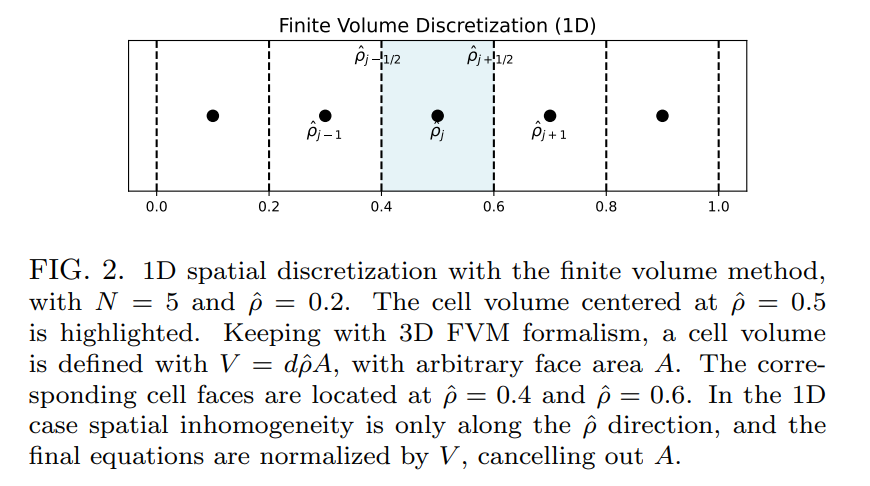
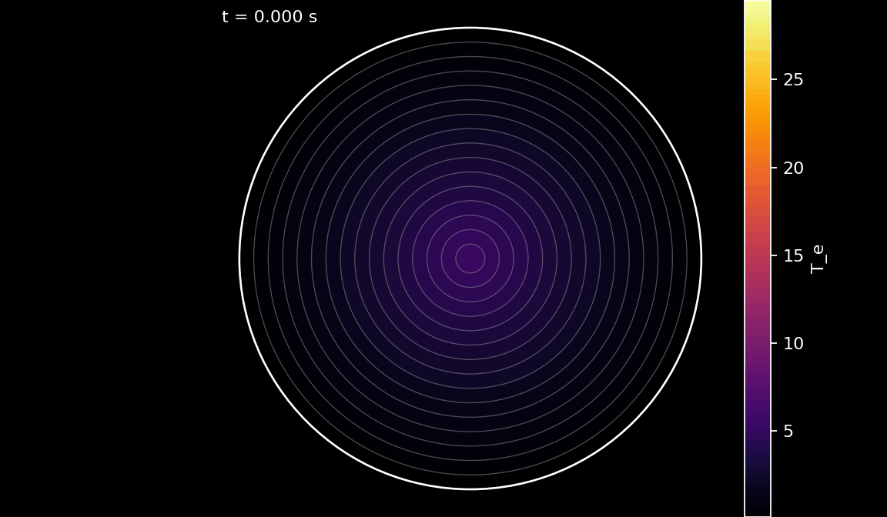
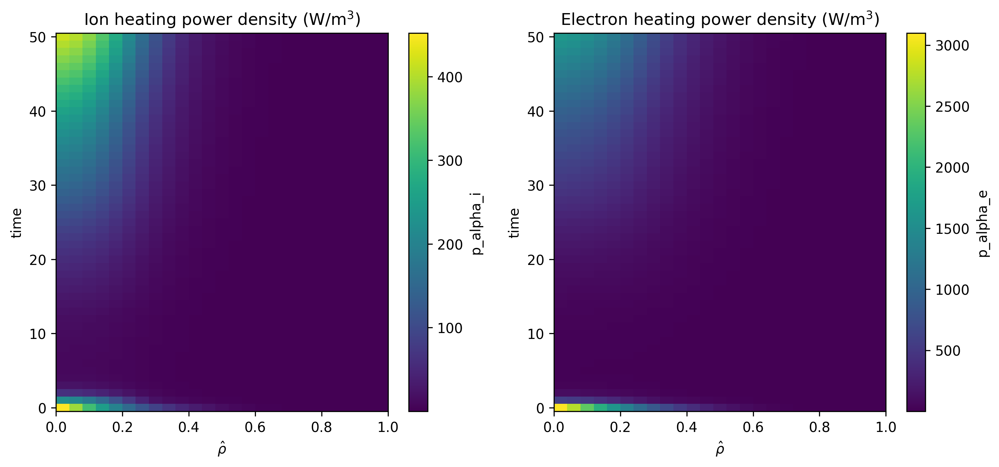

I think there are 3 major milestones remaining for humanity and one of them is *clean and abundant energy*. Fusion energy has the potential to provide a nearly limitless source of clean energy by replicating the processes that power the sun. However, achieving controlled fusion reactions on Earth has proven to be a formidable and very challenging task.

Recently, I saw that DeepMind has made significant strides in this area by using RL to optimize the control of tokamak reactors [[3]](#references). I read their paper and I wanted to summarize what I learned: physical laws, how to derive the equations, and the numerical methods used to solve them.

The idea is to simulate plasma inside a tokamak reactor (a toroidal chamber or doughnut-shaped device). The equations governing the behavior of the plasma are 4 Heat/Diffufions-based equations in 1D. 

$$ \frac{\partial u}{\partial t} = \nabla \cdot (D \nabla u) + \text{Sources} $$

The interesting thing is that by using toroidal flux coordinates, the complex 3D geometry of the tokamak is simplified into a 1D radial coordinate system based on magnetic flux surfaces.


*Source: [[2]](#references)*

## Introduction


We have 4 PDE equations and 5 variables in normalized toroidal flux coordinates, $\hat \rho$, with $0 \leq \hat \rho \leq 1$. The important quantities being modeled are:

*   **${\color{red}{T_i}}, {\color{orange}{T_e}}$**: Ion and Electron **Temperatures** (Energy per particle). High temperature is required for fusion.
*   **${\color{brown}{n_i}}, {\color{blue}{n_e}}$**: Ion and Electron **Densities** (Particles per cubic meter). However, we do not model ion density explicitly, it is computed from electron density assuming quasi-neutrality.
*   **${\color{teal}{\psi}}$**: **Poloidal Magnetic Flux**. This describes the magnetic field structure and stability.


Here we summarize the variables and parameters used in the equations:

| Symbol | Description | Units / Notes |
|:-------|:-------------|:--------------|
| $ {\color{red}{T_i}}, {\color{orange}{T_e}} $ | Ion and electron temperatures | keV or eV |
| $ {\color{brown}{n_i}}, {\color{blue}{n_e}} $ | Ion and electron densities | m⁻³ |
| $ {\color{teal}{\psi}} $ | Poloidal magnetic flux | Wb (Weber) |
| $ \Phi(\psi) $ | Toroidal magnetic flux enclosed by the magnetic poloidal flux surface | Wb |
| $ \Phi_b $ | Toroidal flux enclosed by the plasma boundary (last-closed-flux surface) | Wb |
| $ \hat{\rho}= \sqrt{\tfrac{\Phi({\color{teal}{\psi}})}{\Phi_b}} $ | Normalized toroidal flux coordinate | Dimensionless |
| $ V'\equiv\tfrac{dV}{d\hat \rho} $ | Derivative of plasma volume w.r.t. $ \hat{\rho} $, i.e. flux surface volume derivative | m³ |
| $ g_0 = \langle \nabla V \rangle $ | Flux-surface-averaged gradient of the plasma volume | m² |
| $ g_1 = \langle (\nabla V)^2 \rangle $ | Flux-surface-averaged square of the volume gradient | m⁴ |
| $ g_2 = \left\langle \frac{(\nabla V)^2}{R^2} \right\rangle $ | Flux-surface-averaged geometric factor involving major radius | m² |
| $ g_3 = \left\langle \frac{1}{R^2} \right\rangle $ | Flux-surface-averaged reciprocal of squared major radius | 1/m² |
| $ R $ | Major radius along the flux surface | m |
| $ B_\varphi $ | Toroidal magnetic field | T (Tesla) |
| $ \mathbf{B} $ | Total magnetic field | T (Tesla) |
| $ \sigma_\parallel $ |  Plasma neoclassical conductivity | S/m |
| $ \mu_0 $ | Magnetic permeability of free space | $4\pi \times 10^{-7}$ H/m |
| $ F = R B_\varphi $ | Toroidal field flux function | T·m |
| $ \chi_i, \chi_e $ | Ion and electron heat conductivities | m²/s |
| $ q_{0i}^{conv}, q_{0e}^{conv} $ | Ion/electron heat convective losses | W/m³ |
| $ D_e $ | Electron particle diffusivity | m²/s |
| $ V_e $ | Electron particle convection velocity | m/s |
| $ Q_i, Q_e $ | Ion and electron heat sources | W/m³ |
| $ S_n $ | Total electron particle source | 1/s or m⁻³·s⁻¹ |
| $ \mathbf{j}_{ni} $ | Non-inductive current density (bootstrap + external drive) | A/m² |
| $ I_p $ | Total plasma current | A |
| $ J $ | Jacobian determinant or related geometric factor (see text) | — |
| $ R_0 $ | Major radius at magnetic axis | m |
| $ \langle \cdot \rangle $ | Flux-surface average | — |


**Boundary Conditions:**
The boundary conditions are as follows. All equations have a zero-derivative boundary condition at $\hat{\rho} = 0$ (Von-Neumann). 
The $T_i$, $T_e$, $n_e$ equations have fixed boundary conditions at $\hat{\rho} = 1$. 
The $\psi$ equation has a Neumann (derivative) boundary condition at $\hat{\rho} = 1$, 
which sets the total plasma current through the relation:

$$
I_p = 
\left[
\frac{\partial \psi}{\partial \rho} 
\frac{g_2 g_3}{\rho} 
\frac{R_0 J}{16 \pi^4 \mu_0}
\right]_{LCFS}
$$
where $LCFS$ stands for Last Closed Flux Surface (i.e. $\hat{\rho} = 1$).
The equations are derived from the transport equations in toroidal geometry under the assumption of static background flux surfaces [[2]](#references).


## 1.1 Electron Particle Transport Equation

For an arbitrary plasma species $\alpha$, which may refer to electrons, main or impurity ion species, or fusion-born $\alpha$ particles, let $n_\alpha$ be the local particle density of the species and
$\mathbf{u}_\alpha$ be the local velocity of the particles. The continuity equation for this species is stated
as
$$
\frac{\partial n_\alpha}{\partial t} + \nabla \cdot (n_\alpha \mathbf{u}_\alpha) = s_\alpha 
$$
Here $s_\alpha$ is a localized particle source. By writing the above equation inside a toroidal flux surface we obtain
$$
\left(\frac{\partial}{\partial t} + \frac{\dot{B}_0}{2B_0}\rho\frac{\partial}{\partial\rho}\right)
(\langle n_\alpha\rangle V') = -\frac{\partial\Gamma_\alpha}{\partial\rho} + V'S_\alpha.\tag{1}
$$

A detailed derivation of the transport equations is provided in the [Appendix](#appendix-derivation-of-the-1d-transport-equations).

We denote $\alpha=e$ (by the electron species) and denoting $\langle n_e \rangle \equiv n_e$. Using the specific form of the *flux-surface averaged radial particle flux*
$$
\Gamma_e=- D_e n_e \frac{g_1}{V'}\frac{\partial n_e}{\partial \rho}+
g_0 V_e n_e.
$$

Then
$$
-\frac{\partial \Gamma_e}{\partial \rho}= \frac{\partial}{\partial \rho}\Big[ D_e n_e\frac{g_1}{V'}\frac{\partial n_e}{\partial \rho}-
g_0 V_e n_e\Big].
$$

Plugging (1), we get:
$$
\Big(\frac{\partial}{\partial t}+\frac{\dot B_0}{2B_0}\rho\frac{\partial}{\partial \rho}\Big)(n_eV') = \frac{\partial}{\partial \rho}\Big[ D_e n_e\frac{g_1}{V'}\frac{\partial n_e}{\partial \rho}-
g_0 V_e n_e \Big] +V'S_n .
$$

Rewriting the grid-motion term using the *toroidal flux* $\Phi_b$ and a normalized radius $\hat\rho$. Using $\hat\rho^2 = \frac{\Phi}{\Phi_b(t)}$,
so if $\Phi_b$ changes in time, by a chain-rule term:

$$
\left.\frac{\partial}{\partial t}\right|_{\hat\rho}=
\left.\frac{\partial}{\partial t}\right|_{\Phi} +\frac{\dot\Phi_b}{2\Phi_b}\hat\rho\frac{\partial}{\partial \hat\rho}.
$$

That is exactly the operator appearing in the final equation:
$$
\Big(\frac{\partial}{\partial t}-\frac{\dot\Phi_b}{2\Phi_b}\hat\rho\frac{\partial}{\partial \hat\rho}\Big)(n_eV').
$$


Putting the pieces together gives:
$$
\boxed{\;
\Big(\frac{\partial}{\partial t}-\frac{\dot\Phi_b}{2\Phi_b}\hat\rho\frac{\partial}{\partial \hat\rho}\Big)(n_eV') =
\frac{\partial}{\partial \hat\rho}\Big[ D_e n_e \frac{g_1}{V'} \frac{\partial n_e}{\partial \hat\rho}-g_0 V_e n_e\Big]+V'S_n.\;}
$$


## 1.2 Current Diffusion Equation.

In [Appendix](#appendix-derivation-of-the-1d-transport-equations), we derived the 1D equation for the evolution of the poloidal flux $\psi$ using Ohm's law and Faraday's law:

$$
\sigma_\parallel \left(
\frac{\partial\psi}{\partial t} + \rho\frac{\dot{B}_0}{2B_0}\frac{\partial\psi}{\partial\rho}
\right)= \frac{R_0 J^2}{\mu_0 \rho}\frac{\partial}{\partial\rho}
\left(\frac{G^2}{J}\frac{\partial\psi}{\partial\rho}\right)- \frac{V'}{2\pi\rho}(j_{bs} + j_{cd})
$$
Using the change of variables to $\hat\rho$ and $\Phi_b$, we get, as before, that:
$$
\left(\frac{\partial \psi}{\partial t}\right)_{\Phi}=
\left(\frac{\partial \psi}{\partial t}\right)_{\hat\rho}-\frac{\dot{\hat\Phi}_b}{2\hat\Phi_b}\hat\rho
\frac{\partial \psi}{\partial \hat\rho}.
$$
The diffusion term is
$$
\frac{R_0J^2}{\mu_0\rho}\frac{\partial}{\partial\rho}
\left(\frac{G_2}{J}\frac{\partial\psi}{\partial\rho}\right),
\qquad
J=\frac{F}{R_0B_0},\quad
G_2=\frac{V'}{4\pi^2}\Big\langle\frac{(\nabla\rho)^2}{R^2}\Big\rangle.
$$
Transport-code forms typically package all those geometric combinations into something like
$$
\frac{\partial}{\partial\hat\rho}\left(\frac{g_2g_3}{\hat\rho}\frac{\partial\psi}{\partial\hat\rho}\right),
$$
where $g_2=\langle (\nabla V)^2/R^2\rangle$ and $g_3=\langle 1/R^2\rangle$. Therefore we obtain the final form of the current diffusion equation
$$
\boxed{\;
\frac{16 \pi^2 \sigma_{\parallel}}{\mu_0} 
\frac{\hat\rho^2 \dot{\Phi}_b^2}{F^2}
\left(
\frac{\partial \psi}{\partial t} - \frac{\hat\rho \dot{\Phi}_b}{2 \Phi_b} 
\frac{\partial \psi}{\partial \hat\rho}
\right) =
\frac{\partial}{\partial \hat\rho}
\left(
\frac{g_2 g_3}{\hat\rho} 
\frac{\partial \psi}{\partial \hat\rho}
\right) - \frac{8 \pi^2 V' \mu_0 \Phi_b}{F^2}
\langle \mathbf{B} \cdot \mathbf{j}_{ni} \rangle\;}
$$


## 1.3 Ion and Electron Heat Transport Equations

In a similar manner as the particle transport equation, an equation for energy transport can be derived [[4, Eq. 7.46]](#references). 

$$
\frac{3}{2}(V')^{5/3} \left(\frac{\partial}{\partial t} - \frac{\dot B}{2B_0}\frac{\partial}{\partial \rho}\rho\right)\left[(V')^{-5/3} n_\alpha T_\alpha\right] + \frac{1}{V'}\frac{\partial}{\partial \rho} \left( q_\alpha + \frac{5}{3}T_\alpha \Gamma_\alpha \right) = P_\alpha
$$
where $P_\alpha$ is the heat source for species $\alpha$ (ions or electrons), $q_\alpha$ is the heat flux, and $\Gamma_\alpha$ is the particle flux

$$
\Gamma_\alpha = -V' G_1 n_\alpha \left[\sum_{\beta\in \text{species}} \left(D^\alpha_{n_\beta} \frac{1}{n_\beta}\frac{\partial n_\beta}{\partial \rho} + D^\alpha_{T_\beta} \frac{1}{T_\beta}\frac{\partial T_\beta}{\partial \rho}\right) + D_E \frac{E_\|}{B_p}\right]
$$

$$
q_\alpha = -V'G_1  T_\alpha  n_\alpha \left[\sum_{\beta\in \text{species}} \left(\chi^\alpha_{n_\beta} \frac{1}{n_\beta}\frac{\partial n_\beta}{\partial \rho} + \chi^\alpha_{T_\beta} \frac{1}{T_\beta}\frac{\partial T_\beta}{\partial \rho}\right) + \chi_E \frac{E_\|}{B_p}\right]
$$
where $E_\|$ is the parallel electric field and $G_1 := \langle (\nabla \rho)^2\rangle$. 
The various transport coefficients $D^\alpha_{x_\beta}, \chi^\alpha_{x_\beta}$ quantify, respectively the particle and heat
flux of species $\alpha$ due to a gradient in the profile of $x_\beta$, while $D_E$ and $\chi_E$ represent (typically
inward) fluxes due to parallel electric fields.

We use the same change of variables as before to express the equations in terms of $\hat\rho$ and $\Phi_b$. 
Using 

$$
q_\alpha+\frac{5}{2}T_\alpha\Gamma_\alpha
\quad\equiv\quad
-\Big(\chi_\alpha n_\alpha \frac{g_1}{V'}\frac{\partial T_\alpha}{\partial\hat\rho}\ -\ g_0 q_\alpha^{\mathrm{conv}} T_\alpha\Big),
$$
we get to the final form of the ion and electron heat transport equations.


$$
\boxed{\;
\begin{aligned}
\frac{3}{2} V'^{-5/3}
\left( 
\frac{\partial}{\partial t} - \frac{\dot{\Phi}_b}{2\Phi_b} 
\frac{\partial}{\partial \hat{\rho}}
\right)
\left[ 
V'^{5/3} n_i {{T_i}}
\right] &=
\frac{1}{V'} 
\frac{\partial}{\partial \hat{\rho}}
\left[ \chi_i n_i \frac{g_1}{V'} 
\frac{\partial {T_i}}{\partial \hat{\rho}} - g_0 q_i^{\text{conv}} {T_i}
\right] + Q_i \\
\frac{3}{2} V'^{-5/3}
\left(  \frac{\partial}{\partial t} - \frac{\dot{\Phi}_b}{2\Phi_b} \frac{\partial}{\partial \hat{\rho}}
\right)
\left[ 
V'^{5/3} {n_e} {T_e}
\right] &=
\frac{1}{V'} 
\frac{\partial}{\partial \hat{\rho}}
\left[
\chi_e {n_e} 
\frac{g_1}{V'} 
\frac{\partial {T_e}}{\partial \hat{\rho}} - g_0 q_e^{\text{conv}} {T_e}
\right] + Q_e 
\end{aligned}\;}
$$


## 2. Discretization and Numerical Methods

In [[1]](#references), the authors use a finite-volume method to discretize the spatial derivatives in the transport equations.

### 2.1 Spatial discretization: Finite Volume Method (FVM)
The 1D spatial domain, $0 \leq \hat{\rho} \leq 1$, is divided into a
uniform grid of $N$ cells, each with a width of
$d \hat{\rho} = 1/N$.  The cell centers are denoted by
$\hat{\rho}_i$, where $i = 1, 2,..., N-1$, and the $N+1$ cell
faces are located at $\hat{\rho}_{i\pm1/2}$. Both $\hat{\rho}=0$ and
$\hat{\rho}=1$ are on the face grid.

For a generic conservation law of the form:
$$
  \frac{\partial x}{\partial t} + \nabla \cdot \mathbf{\Gamma} = S
$$
where $x$ is a conserved quantity, $\mathbf{\Gamma}$ is the flux,
and $S$ is a source term, the FVM approach involves integrating the PDE
over a control volume (named a "cell") and applying the divergence theorem to
convert volume integrals to surface integrals. For 1D systems, following
dividing by the cell volume, the finite volume method reduces to a special case
of finite differences:

$$
  \frac{\partial }{\partial t}(x_i) + \frac{1}{d \hat{\rho}}({\Gamma}_{i+1/2}  - {\Gamma}_{i-1/2})  = S_i
$$
where $x_i$ is the cell-averaged value of $x$ in cell $i$,
$\Gamma_{i+1/2}$ is the flux at face $i+1/2$, and $S_i$ is the
cell-averaged source term in cell $i$.

In general, the fluxes are decomposed as

$$
  \Gamma = -D\frac{\partial x}{\partial \hat{\rho}} + Vx
$$

where $D$ is a diffusion coefficient and $V$ now denotes a
convection coefficient, leading to:

$$
  \begin{aligned}
  \Gamma_{i+1/2} &= -D_{i+1/2}\frac{x_{i+1} - x_{i}}{d\hat{\rho}} +
   V_{i+1/2}x_{i+1/2} \\
  \Gamma_{i-1/2} &= -D_{i-1/2}\frac{x_{i} - x_{i-1}}{d\hat{\rho}} +
   V_{i-1/2}x_{i-1/2}
  \end{aligned}
$$
The diffusion and convection coefficients are thus calculated on the face grid.
The value of $x$ on the face grid is approximated by implementing a
power-law scheme for Péclet-number weighting, which smoothly transitions between
central differencing and upwinding, as follows:

$$
  \begin{aligned}
  x_{i+1/2} &= \alpha_{i+1/2}x_i + (1 - \alpha_{i+1/2}) x_{i+1} \\
  x_{i-1/2} &= \alpha_{i-1/2}x_i + (1 - \alpha_{i-1/2}) x_{i-1} \\
  \end{aligned}
$$
where the $\alpha$ weighting factor depends on the Péclet number,
defined as:

$$
  Pe = \frac{V d \hat{\rho}}{D}
$$
where $V$ is convection and $D$ is diffusion. The power-law scheme
is as follows:

$$
  \alpha = \begin{cases}
  \frac{Pe - 1}{Pe}  & \text{if } Pe > 10, \\
  \frac{(Pe - 1) + (1 - Pe/10)^5}{Pe} & \text{if } 0 < Pe < 10, \\
  \frac{(1 + Pe/10)^5 - 1}{Pe} & \text{if } -10 < Pe < 0, \\
  -\frac{1}{Pe} & \text{if } Pe < -10.
  \end{cases}
$$
The *Péclet number* quantifies the relative strength of convection and diffusion.
If the Péclet number is small and diffusion dominates, then the weighting scheme
converges to central differencing. If the absolute value of the Péclet number is
large, and convection dominates, then the scheme converges to upwinding.

Boundary conditions are taken into account by introducing ghost cells
$x_{N}$ and $x_{-1}$ whose values are determined by assuming linear
extrapolation through the edge cells and the face boundary conditions (for
Dirichlet boundary conditions), or by directly satisfying the derivative
(Neumann) boundary conditions.

The above equations, when combined, define the elements of the discretization
matrix and boundary condition vectors for the PDE diffusion term.

### 2.2 Time discretization and solver options

TORAX uses the theta method for time discretization, and employs several options
for solving the discretized PDE system. These are described below.

The `θ-method` is a weighted average between the explicit and implicit Euler
methods. For a generic ODE of the form:

$$  \frac{dx}{dt} = F(x, t) $$

where $x$ is the state vector, the theta method approximates the solution at time
$t + \Delta t$ as:

$$
  x_{t + \Delta t} - x_t = \Delta t \big[ \theta F(x_{t + \Delta t}, t +
  \Delta t) + (1 - \theta) F(x_t, t)\big] \tag{1}
$$
where $\theta$ is a user-selected weighting parameter in the range
$[0, 1]$. Different values of $\theta$ correspond to well-known
solution methods: explicit Euler ($\theta = 0$), Crank-Nicolson
($\theta = 0.5$), and implicit Euler ($\theta = 1$), which is
unconditionally stable.


Upon inspection of the equations, we generalize equation (1) and
write the state evolution equation as:

$$\tag{2}
  \begin{aligned}
  & \mathbf{\tilde{T}}(x_{t + \Delta t}, u_{t + \Delta t})\odot
  \mathbf{x}_{t + \Delta t} - \mathbf{\tilde{T}}(x_t, u_t)\odot\mathbf{x}_t =
  \\
  & \Delta t \big[ \theta \big( \mathbf{\bar{C}}(x_{t+\Delta t}, u_{t+\Delta t})
  \mathbf{x}_{t+\Delta t} + \mathbf{c}(x_{t+\Delta t}, u_{t+\Delta t}) \big)  + (1-\theta) \big( \mathbf{\bar{C}}(x_t, u_t)\mathbf{x}_t +
  \mathbf{c}(x_{t}, u_{t}) \big) \big]
  \end{aligned}
$$
Starting from an initial condition $\mathbf{x}_0$, equation
(2) solves for $\mathbf{x}_{t+\Delta t}$ at each
timestep. $\mathbf{x}_t$ is the evolving state vector at time $t$,
including all variables being solved by the system, and is of length
$\#N$, where $\#$ is the number of solved variables. 


Source: [[1]](#references)

$\mathbf{u}_t$ corresponds to all known input parameters at time
$t$. This includes boundary conditions, prescribed profiles
(e.g. $n_e$ in the example above), and input parameters such as heating
powers or locations.

$\mathbf{\tilde{T}}$ is the transient term, where $\odot$ 
signifies element-wise multiplication. For example, for the $T_e$
equation, $\mathbf{\tilde{T}}=\mathbf{n_e}$, which makes the system
nonlinear if $\mathbf{n_e}$ itself is an evolving variable.

$\mathbf{\bar{C}}(x_t, u_t)$ and
$\mathbf{\bar{C}}(x_{t+\Delta t}, u_{t+\Delta t})$ are the discretization
matrices, of size $\#N\times \#N$. In general, depending on the physics
models used, $\mathbf{\bar{C}}$ depends on state variables
$\mathbf{x}$, for example through state-variable dependencies of transport
coefficients $\chi$, $D$, $V$, plasma conductivity, and
ion-electron heat exchange, making the system nonlinear due to the
$x_{t+\Delta t}$ dependence. $\mathbf{c}$ is a vector, containing
source terms and boundary condition terms.


There are two solver options for solving the nonlinear evolution system of equations.

#### Linear solver

This solver addresses the nonlinearity of the PDE system with fixed-point
iteration, also known as the predictor-corrector method. For $K$
iterations (user-configurable), an approximation for
$\mathbf{x}_{t+\Delta t}$ is obtained by solving the following equation
iteratively with $k=1,2,..,K$:

$$
  \begin{aligned}
  & \mathbf{\tilde{T}}(x_{t + \Delta t}^{k-1}, u_{t + \Delta t})\odot
  \mathbf{x}_{t + \Delta t}^k - \mathbf{\tilde{T}}(x_t, u_t)\odot\mathbf{x}_t =
  \\
  & \Delta t \big[ \theta \big( \mathbf{\bar{C}}(x_{t+\Delta t}^{k-1},
  u_{t+\Delta t})\mathbf{x}_{t+\Delta t}^k + \mathbf{c}(x_{t+\Delta t}^{k-1},
  u_{t+\Delta t}) \big) + (1-\theta) \big( \mathbf{\bar{C}}(x_t, u_t)\mathbf{x}_t +
  \mathbf{c}(x_{t}, u_{t}) \big) \big]
  \end{aligned}
$$
and where $\mathbf{x}_{t+\Delta t}^{0} = \mathbf{x}_t$.

By replacing $\mathbf{x}_{t+\Delta t}$ with
$\mathbf{x}_{t+\Delta t}^{k-1}$ within the coefficients
$\mathbf{\tilde{T}}$, $\mathbf{\bar{C}}$ and $\mathbf{c}$,
these coefficients become known at every iteration step, describing a linear system of equations. $\mathbf{x}_{t+\Delta t}^k$ can then be solved using standard linear algebra methods implemented in JAX.


#### Newton-Raphson Solver

This solver solves the nonlinear PDE system, using a gradient-based iterative
Newton-Raphson root-finding method for finding the value of
$\mathbf{x}_{t+\Delta t}$ that renders the residual vector zero:
$$\tag{3}
  \mathbf{R}(\mathbf{x}_{t+\Delta t},\mathbf{x}_t,\mathbf{u}_{t+\Delta t},
  \mathbf{u}_t, \theta, \Delta t) = 0
$$
where $\mathbf{R}$ is the LHS-RHS of equation (2).

Starting from an initial guess
$\mathbf{x}_{t+\Delta t}=\mathbf{x}_{t+\Delta t}^0$, the Newton-Raphson
method linearizes equation (3) about iteration
$\mathbf{x}_{t+\Delta t}^k$ and solves the linear system for a step
$\delta\mathbf{x}$:

$$
  \mathbf{\bar{J}}(\mathbf{x}_{t+\Delta t}^k) \delta\mathbf{x} =
  -\mathbf{R}(\mathbf{x}_{t+\Delta t}^k)
$$

where $\mathbf{\bar{J}}$ is the Jacobian of $\mathbf{R}$ with
respect to $\mathbf{x}_{t+\Delta t}$. Crucially, JAX automatically
calculates $\mathbf{\bar{J}}$ using auto-differentiation.

With
$\delta\mathbf{x} = \mathbf{x}_{t+\Delta t}^{k+1} - \mathbf{x}_{t+\Delta t}^{k}$,
$\mathbf{x}_{t+\Delta t}^{k+1}$ is solved using standard linear algebra
methods implemented in JAX such as LU decomposition. This process iterates until
the residual falls below a user-configurable tolerance
$\varepsilon$,  i.e:
$\| \mathbf{R}(\mathbf{x}_{t+\Delta t}^{k+1}) \|_2 < \varepsilon$, where
$\|\cdot\|_2$ is the vector two-norm.


## 3. Code Implementation (Torax)
You can see more examples and documentation at the [Torax GitHub repository](https://torax.readthedocs.io/en/v1.2.0/index.html).
```python
import torax
torax_config = torax.build_torax_config_from_file('examples/iterhybrid_rampup.py') # load Iter hybrid config
torax_config.update_fields({
    "numerics.fixed_dt": 1.0,
    "numerics.t_final": 100.0, 
})
dt, state_history = torax.run_simulation(torax_config)
```
And after some post-processing, you can generate plots like the following:


*Figure: Axial view of plasma inside a tokamak during a simulation.*

The most important quantities are the ones related to fusion power density, which can be plotted as follows:
```python
fig, (ax1, ax2) = plt.subplots(1, 2, figsize=(12, 5))

# Plot p_alpha_i on first subplot
dt.profiles.p_alpha_i.plot(ax=ax1)
ax1.set_xlabel('$\\hat{\\rho}$')
ax1.set_title('Ion heating power density (W/m$^3$)')

# Plot p_alpha_e on second subplot
dt.profiles.p_alpha_e.plot(ax=ax2)
ax2.set_xlabel('$\\hat{\\rho}$')
ax2.set_title('Electron heating power density (W/m$^3$)')

plt.savefig('fusion_power_density.png', dpi=300, bbox_inches='tight')
plt.show()
```



*Figure: Ion and electron heating power density from fusion reactions during a simulation of ITER hybrid scenario ramp-up phase.*
## References

[0] The code used for the figures is available at: https://github.com/dani2442/dani2442_code/tree/main/torax

[1] Citrin, Jonathan, Ian Goodfellow, Akhil Raju, Jeremy Chen, Jonas Degrave, Craig Donner, Federico Felici et al. "TORAX: A fast and differentiable tokamak transport simulator in JAX." arXiv preprint arXiv:2406.06718 (2024).

[2] Felici, Federico. "Real-time control of tokamak plasmas: from control of physics to physics-based control." (2011).

[3] https://deepmind.google/discover/blog/bringing-ai-to-the-next-generation-of-fusion-energy/

[4] Hinton, F. L. and R. D. Hazeltine (1976). “Theory of plasma transport in toroidal confinement systems.” In: Rev. Mod. Phys. 48.2, pp. 239–308. doi: 10.1103/RevModPhys. 48.239.


## Appendix: Derivation of the 1D Transport Equations

> Derivation of the Poloidal Flux Diffusion Equation

We derive the poloidal flux diffusion equation, describing the temporal evolution of the poloidal flux under the assumption of static background flux surfaces. We follow [[2]](#references)
*Preliminaries*. We use the useful relation
$$
\begin{align*}
\langle \nabla \cdot \mathbf{F} \rangle &= \frac{\partial}{\partial V}\int (\nabla \cdot \mathbf{F}) dV = \frac{\partial}{\partial V} \int (\nabla \cdot \mathbf{F}) Rd\phi d\ell_p \frac{d\psi}{|\nabla\psi|} \\
&= \frac{\partial }{\partial V} \oint  \mathbf{F} \cdot \frac{\nabla V}{|\nabla V|} Rd\phi d\ell_p  \frac{d\psi}{|\nabla\psi|} \\
&= \frac{\partial }{\partial V}2\pi \oint \mathbf{F} \cdot \nabla V \frac{\partial \psi}{\partial V} \frac{Rd\ell_p}{|\nabla\psi|} \\
&= \frac{\partial}{\partial V} \langle \mathbf{F} \cdot \nabla V\rangle \tag{A.0}
\end{align*}
$$
Here, we used that the average of $\nabla \cdot \mathbf{F}$ over a flux surface can be represented by the derivative with respect to the enclosed volume $V$ of the volume integral of $\nabla \cdot \mathbf{F}$. Then we change to flux coordinates
$$
dV = Rd\phi d\ell_p \frac{d\psi}{|\nabla\psi|}
$$
where $\phi$ is the toroidal angle and $\ell_p$ the poloidal length along the flux surface.
Then we use Gauss divergence theorem to convert volume to surface integral,
$$
\int_V (\nabla \cdot \mathbf{F}) dV = \oint_{\partial V} \mathbf{F} \cdot \mathbf{n} dS = \oint_{\partial V} \mathbf{F} \cdot \frac{\nabla V}{|\nabla V|}dS
$$
Because $\phi$ is symmetric (axis) then the integral over $\phi$ gives a factor $2\pi$. Finally, the differential surface area of the flux surface is
$$dS = 2\pi R d\ell_p$$
Next, by the chain rule, we have
$$
|\nabla V| = \frac{\partial V}{\partial \psi} |\nabla \psi|
$$
Thus,
$$
\langle\mathbf{F} \cdot \nabla V\rangle = \int_V (\mathbf{F}\cdot \nabla V) dV = \oint \frac{(\mathbf{F}\cdot V) dS}{|\nabla V|} = \oint (\mathbf{F}\cdot \nabla \psi) \frac{\partial \psi}{\partial V} \frac{dS}{|\nabla \psi|}
$$
And this finishes the proof of the relation.


Consider a surface of constant poloidal flux whose boundary moves with velocity $\mathbf{u}_\psi$. For this surface:
$$
\frac{\partial \psi}{\partial t} + \mathbf{u}_\psi \cdot \nabla \psi = 0 \tag{A.1}
$$

For a scalar field $F(t, \mathbf{x})$, define $H(t) = \int_V F\,dV$, where $V$ is the volume enclosed by $\psi = \text{const}$ moving with $\mathbf{u}_\psi$. By the Reynolds Transport Theorem, we have
$$
\begin{align*}
\frac{\partial H}{\partial t}\bigg|_{\psi=\text{const}} &=
\overbrace{\int_V \frac{\partial F}{\partial t} dV}^{\text{change inside volume}}+\overbrace{\oint_S F \mathbf{u}_\psi \cdot \mathbf{dS}_\psi}^{\text{change due to moving boundary}}\\
&=
\int_V \frac{\partial F}{\partial t} dV +
\oint_S F \mathbf{u}_\psi \cdot \frac{\nabla \psi}{|\nabla \psi|} dS
\end{align*}\tag{A.1b}
$$

Using this equality, the time rate of change of toroidal flux $\Phi$ enclosed by $\psi = \text{const}$, i.e., $F=\mathbf{B}\cdot\nabla\phi$ and $\Phi(t)=\int_V \mathbf{B}\cdot\nabla\phi\, dV$, is:
$$
\begin{aligned}
\frac{\partial \Phi}{\partial t}\bigg|_{\psi=\text{const}} &= \frac{1}{2\pi} \frac{\partial}{\partial t} \int_V \mathbf{B}\cdot\nabla\phi\, dV \nonumber \\ &= \frac{1}{2\pi} \int_V \frac{\partial \mathbf{B}}{\partial t}\cdot\nabla\phi\, dV + \frac{1}{2\pi} \oint_S (\mathbf{B}\cdot\nabla\phi)(\mathbf{u}_\psi\cdot\nabla\psi) \frac{dS}{|\nabla\psi|}
\end{aligned}\tag{A.2}
$$

> 1. Poloidal electric field.

Using Faraday’s law $\partial_t \mathbf{B} = -\nabla\times\mathbf{E}$, we can rewrite the first volume integral (A.2) as:
$$
\begin{aligned}
\int_V \frac{\partial \mathbf{B}}{\partial t}\cdot\nabla\phi\, dV
&= -\int_V (\nabla\times\mathbf{E})\cdot\nabla\phi\, dV
= -\int_V \nabla\cdot(\mathbf{E}\times\nabla\phi)\, dV \nonumber\\
&= -\oint_S (\mathbf{E}\times \nabla \phi)\frac{\nabla\psi}{|\nabla \psi|}dS \tag{Gauss}\\
&= -\oint_S \mathbf{E}\cdot(\nabla\phi\times\nabla\psi)\, \frac{dS}{|\nabla\psi|}
= -2\pi \oint_S \mathbf{E}\cdot\mathbf{B}_p \frac{dS}{|\nabla\psi|}
\end{aligned}
$$

> 2. Toroidal electric field.

We can rewrite the second integral of (A.2) using Ampère’s law:
$$
\begin{aligned}
\nabla\psi\cdot\frac{\partial\mathbf{B}}{\partial t}
&= -\nabla\psi\cdot(\nabla\times\mathbf{E})
= \nabla\cdot(\nabla\psi\times\nabla \mathbf{E})- \underbrace{ \mathbf{E}\cdot(\nabla\times \nabla\psi)}_{=0}\\
&= \nabla \cdot (\nabla \psi \times \nabla \phi R E_\phi) 
=-\nabla\cdot(2\pi \mathbf{B}_p R E_\phi)
\end{aligned}
$$
Using that $\mathbf{B} \cdot \nabla \psi = 0$, we have
$$
0 = \partial_t (\mathbf{B} \cdot \nabla \psi) = \partial_t \mathbf{B} \cdot \nabla \psi + \mathbf{B} \cdot \nabla (\partial_t \psi)
$$
Then,
$$
\begin{aligned}
\mathbf{B} \cdot \nabla (\partial_t \psi) &= -\partial_t \mathbf{B} \cdot \nabla \psi = \nabla\cdot(2\pi \mathbf{B}_p R E_\phi) \\
&= \mathbf{B}_b \cdot \nabla (2\pi R E_\phi) + 2\pi R E_\phi \underbrace{\nabla \cdot \mathbf{B}_p}_{=0}\\
&= \mathbf{B} \cdot \nabla (2\pi R E_\phi)
\end{aligned}
$$
Thus, using previous equation and (A.1):
$$
\mathbf{B} \cdot \nabla (\partial_t \psi) = 2\pi R E_\phi = -\mathbf{u}_\psi \cdot \nabla\psi
$$
Combining previous results into (A.2):
$$
\begin{aligned}
\frac{\partial \Phi}{\partial t}\bigg|_{\psi=\text{const}}
&= -\oint_S (\mathbf{E}\cdot\mathbf{B}_p + B_\phi E_\phi) \frac{dS}{|\nabla\psi|}
= -\oint_S \mathbf{E}\cdot\mathbf{B} \frac{dS}{|\nabla\psi|}
= -\frac{\partial V}{\partial\psi}\langle \mathbf{E}\cdot\mathbf{B}\rangle
\end{aligned}
$$

> 3. Rate of change of poloidal flux.

$$
\begin{aligned}
&\frac{\partial\psi}{\partial t}\bigg|_{\Phi=\text{const}}
= \frac{\partial\psi}{\partial V}\frac{\partial V}{\partial\Phi}\frac{\partial\Phi}{\partial t}\bigg|_{\psi=\text{const}} \\
&\frac{\partial\psi}{\partial t}\bigg|_{\rho} + \frac{\partial\psi}{\partial\rho}\frac{\partial\rho}{\partial t}\bigg|_{\Phi}= -\frac{\partial V}{\partial\Phi}\langle \mathbf{E}\cdot\mathbf{B}\rangle \tag{A.3}\\
&\frac{\partial\psi}{\partial t}\bigg|_{\rho} - \rho\frac{\dot{B}_0}{2B_0}\frac{\partial\psi}{\partial\rho}
= -2\pi R_0^2 \frac{\langle \mathbf{E}\cdot\mathbf{B}\rangle}{F\langle R_0^2/R^2\rangle}
\end{aligned}
$$

Define the equivalent cylindrical fields:
$$
\begin{aligned}
B_{po} &= \frac{1}{2\pi R_0} \frac{\partial\psi}{\partial\rho} \\
E_o &= R_0 \frac{\langle \mathbf{E}\cdot\mathbf{B}\rangle}{F\langle R_0^2/R^2\rangle}
\end{aligned}
$$
Then, for $\dot{B}_0=0$:
$$
\frac{\partial B_{p0}}{\partial t} = -\frac{\partial E_0}{\partial\rho}
$$

> 4. Ohm’s law.

We can write the flux-surface-averaged Ohm’s law as:
$$
\langle \mathbf{j}\cdot\mathbf{B}\rangle = \sigma_\parallel \langle \mathbf{E}\cdot\mathbf{B}\rangle + \langle \mathbf{j}_{ni}\cdot\mathbf{B}\rangle
$$
where $\mathbf{j}_{ni} = \mathbf{j}_{bs} + \mathbf{j}_{cd}$ is the non-inductive current density, which includes the bootstrap current density $\mathbf{j}_{bs}$ and the external current drive density $\mathbf{j}_{cd}$. Equivalently
$$
\sigma_\parallel \frac{\langle \mathbf{E}\cdot\mathbf{B}\rangle}{B_0} = \frac{\langle \mathbf{j}\cdot\mathbf{B}\rangle}{B_0} - \frac{\langle \mathbf{j}_{bs}\cdot\mathbf{B}\rangle}{B_0} - \frac{\langle \mathbf{j}_{cd}\cdot\mathbf{B}\rangle}{B_0}
\quad \Leftrightarrow \quad
\sigma_\parallel E_\parallel = j_\parallel - j_{bs} - j_{cd}\tag{A.4}
$$

> 5. Parallel current.

Finally, we rewrite the parallel current $j_\parallel = \frac{\langle \mathbf{j}\cdot\mathbf{B}\rangle}{B_0}$ in terms of the poloidal flux $\psi$:
$$
\begin{aligned}
\frac{\langle \mathbf{j}\cdot\mathbf{B}\rangle}{B_0}
&= \frac{T}{2\pi \mu_0 B_0}\langle \nabla\cdot (\nabla \psi/R^2)\rangle + \frac{1}{2\pi \mu_0 B_0}\langle \nabla T \cdot \nabla \psi /R^2\rangle\\
&=\frac{1}{2\pi \mu_0 B_0}\left(\frac{4\pi^2 T}{V'} \frac{\partial}{\partial \rho}\left(G^2\frac{\partial\psi}{\partial \rho}\right) + \frac{4\pi^2}{V'}\frac{V'}{4\pi^2} \left\langle \frac{(\nabla \rho)^2}{R^2}\right\rangle \frac{\partial T}{\partial \rho}\frac{\partial \psi}{\partial \rho}\right)\\
&=\frac{2\pi R_0 J^2}{\mu_0 V'}\left(\frac{1}{J} \frac{\partial}{\partial \rho}\left(G^2 \frac{\partial \psi}{\partial \rho}\right) + \frac{G^2}{J^2}\frac{\partial J}{\partial \rho}\frac{\partial \psi}{\partial \rho}\right)
\\
&=\frac{2\pi R_0 J^2}{\mu_0 V'} \frac{\partial}{\partial\rho}
\left(\frac{G^2}{J}\frac{\partial\psi}{\partial\rho}\right)\tag{A.5}
\end{aligned}
$$

The key step is converting flux-surface averages of divergences into 1D (radial) derivatives:
$$
\left\langle \nabla\cdot \mathbf{F}\right\rangle = \frac{1}{V'}\frac{\partial}{\partial\rho}\left(V'\left\langle \mathbf{F}\cdot\nabla\rho\right\rangle\right),\qquad V'\equiv\frac{\partial V}{\partial\rho}.
$$
Taking $\mathbf{F}=\nabla\psi/R^2$ and using $\psi=\psi(\rho)$ gives $\nabla\psi=(\partial\psi/\partial\rho)\nabla\rho$ and hence
$\mathbf{F}\cdot\nabla\rho=((\nabla\rho)^2/R^2)(\partial\psi/\partial\rho)$.
Also, since $T=T(\rho)$,
$\langle \nabla T\cdot\nabla\psi/R^2\rangle = \langle (\nabla\rho)^2/R^2\rangle(\partial T/\partial\rho)(\partial\psi/\partial\rho)$.
Defining $G^2\equiv \frac{V'}{4\pi^2}\left\langle \frac{(\nabla\rho)^2}{R^2} \right\rangle$ packages the terms and the product rule yields the final compact form.
with
$$
J = \frac{F}{R_0 B_0}, \quad
G^2 = \frac{V'}{4\pi^2}\left\langle \frac{(\nabla\rho)^2}{R^2} \right\rangle, \quad
V' = \frac{\partial V}{\partial\rho}
$$

> The poloidal flux diffusion equation.
Combining (A.3), (A.4) and (A.5):
$$
\sigma_\parallel \left(
\frac{\partial\psi}{\partial t} + \rho\frac{\dot{B}_0}{2B_0}\frac{\partial\psi}{\partial\rho}
\right)
= \frac{R_0 J^2}{\mu_0 \rho}\frac{\partial}{\partial\rho}
\left(\frac{G^2}{J}\frac{\partial\psi}{\partial\rho}\right)- \frac{V'}{2\pi\rho}(j_{bs} + j_{cd})
$$

> Derivation of the Particle Transport Equation

For an arbitrary plasma species $\alpha$, let $n_\alpha$ be the density, $\mathbf{u}_\alpha$ the velocity, $s_\alpha$ the source term. The continuity equation is:
$$
\frac{\partial n_\alpha}{\partial t} + \nabla\cdot(n_\alpha \mathbf{u}_\alpha) = s_\alpha
$$

Integrating over the volume enclosed by a flux surface (and using Gauss theorem for the second term):
$$
\int \frac{\partial n_\alpha}{\partial t} dV +  \oint n_\alpha \mathbf{u}_\alpha\cdot\frac{\nabla\Phi}{|\nabla\Phi|} dS = \int s_\alpha dV
$$

Using Eq. (A.1b) with $F=n_\alpha$ and $\Phi=\text{const}$ and the fact that $\nabla \rho \| \nabla \Phi$:
$$
\frac{\partial}{\partial t}\bigg|_\Phi \int n_\alpha dV + \oint n_\alpha (\mathbf{u}_\alpha - \mathbf{u}_\Phi)\cdot\frac{\nabla\rho}{|\nabla\rho|} dS
= \int s_\alpha dV
$$

Using flux surface averaging:
$$
\frac{\partial}{\partial t}\bigg|_\Phi  \langle n_\alpha\rangle V' d\rho +  V' \langle n_\alpha(\mathbf{u}_\alpha - \mathbf{u}_\Phi)\cdot\nabla\rho\rangle 
= \int\langle s_\alpha\rangle V'd\rho
$$
Then taking the derivative with respect to $\rho$:
$$
\frac{\partial}{\partial t}\bigg|_\Phi [\langle n_\alpha\rangle V'] + \underbrace{\frac{\partial}{\partial \rho} \left( V' \langle n_\alpha(\mathbf{u}_\alpha - \mathbf{u}_\Phi)\cdot\nabla\rho\rangle \right)}_{\Gamma_\alpha} = \underbrace{\langle s_\alpha\rangle}_{S_\alpha} V'
$$
where $\Gamma_\alpha$ is the particle flux and $S_\alpha$ the source term.
Finally, at constant $\rho$:
$$
\frac{1}{V'}\left(\frac{\partial}{\partial t} + \frac{\dot{B}_0}{2B_0}\rho\frac{\partial}{\partial\rho}\right)
(\langle n_\alpha\rangle V') + \frac{1}{V'}\frac{\partial\Gamma_\alpha}{\partial\rho}
= S_\alpha.
$$
