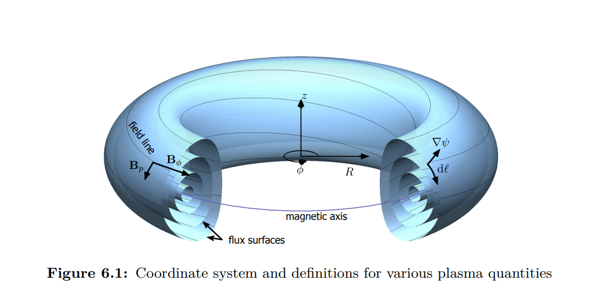
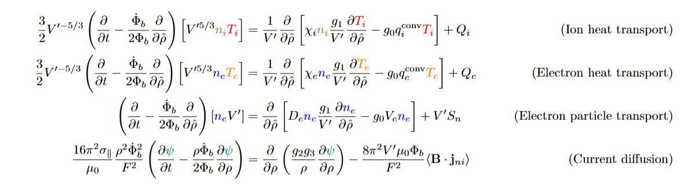

*Source: [[2]](#references)*

TORAX is a fast, differentiable tokamak core transport simulator implemented in JAX [[1]](#references). It evolves a coupled set of 1D, flux-surface-averaged PDEs for:

- ion and electron heat transport ($T_i$, $T_e$),
- electron particle transport ($n_e$),
- current diffusion (poloidal flux $\psi$).

This post collects the governing equations, clarifies the notation, and explains the “moving grid” term that appears when the boundary toroidal flux $\Phi_b(t)$ changes in time.

## 1. Governing equations and notation

TORAX solves the PDEs in a *normalized toroidal flux* coordinate $\rho$ (often also written $\hat\rho$), with $0 \leq \rho \leq 1$:
$$
\rho \;\equiv\; \sqrt{\frac{\Phi(\psi)}{\Phi_b(t)}}.
$$
Here $\Phi(\psi)$ is the toroidal magnetic flux enclosed by the poloidal flux surface labelled by $\psi$, and $\Phi_b(t)$ is the toroidal flux enclosed by the last-closed-flux-surface (LCFS).

| Symbol | Description | Units / Notes |
|:-------|:-------------|:--------------|
| $ {\color{red}{T_i}}, {\color{orange}{T_e}} $ | Ion and electron temperatures | keV or eV |
| $ n_i, {\color{blue}{n_e}} $ | Ion and electron densities | $m^{-3}$ |
| $ {\color{teal}{\psi}} $ | Poloidal magnetic flux | Wb (Weber) |
| $ \Phi(\psi) $ | Toroidal magnetic flux enclosed by the magnetic poloidal flux surface | Wb |
| $ \Phi_b $ | Toroidal flux enclosed by the plasma boundary (last-closed-flux surface) | Wb |
| $ \rho \equiv \sqrt{\tfrac{\Phi(\psi)}{\Phi_b(t)}} $ | Normalized toroidal flux coordinate | Dimensionless |
| $ V'\equiv\tfrac{dV}{d\rho} $ | Flux-surface volume derivative | $m^3$ |
| $ g_0 = \langle \nabla V \rangle $ | Flux-surface-averaged gradient of the plasma volume | $m^{2}$ |
| $ g_1 = \langle (\nabla V)^2 \rangle $ | Flux-surface-averaged square of the volume gradient | $m^{4}$ |
| $ g_2 = \left\langle \frac{(\nabla V)^2}{R^2} \right\rangle $ | Flux-surface-averaged geometric factor involving major radius | $m^{2}$ |
| $ g_3 = \left\langle \frac{1}{R^2} \right\rangle $ | Flux-surface-averaged reciprocal of squared major radius | $m^{-2}$ |
| $ R $ | Major radius along the flux surface | m |
| $ B_\varphi $ | Toroidal magnetic field | T (Tesla) |
| $ \mathbf{B} $ | Total magnetic field | T (Tesla) |
| $ \sigma_\parallel $ |  Plasma neoclassical conductivity | S/m |
| $ \mu_0 $ | Magnetic permeability of free space | $4\pi \times 10^{-7}$ H/m |
| $ F = R B_\varphi $ | Toroidal field flux function | T·m |
| $ J \equiv \frac{F}{R_0 B_0} $ | Normalized toroidal field flux function (dimensionless) | Used in $I_p$ boundary condition |
| $ \chi_i, \chi_e $ | Ion and electron heat conductivities | $m^{2}/s$ |
| $ q_i^{\mathrm{conv}}, q_e^{\mathrm{conv}} $ | Ion/electron heat convection coefficients | TORAX model coefficient |
| $ D_e $ | Electron particle diffusivity | $m^{2}/s$ |
| $ V_e $ | Electron particle convection velocity | m/s |
| $ Q_i, Q_e $ | Ion and electron heat sources | W/$m^{3}$ |
| $ S_n $ | Total electron particle source | $m^{-3}s^{-1}$ |
| $ \mathbf{j}_{ni} $ | Non-inductive current density (bootstrap + external drive) | A/$m^{2}$ |
| $ I_p $ | Total plasma current | A |
| $ \dot{\Phi}_b $ | Time derivative of boundary toroidal flux | Wb/s |
| $ R_0 $ | Major radius at magnetic axis | m |
| $ \langle \cdot \rangle $ | Flux-surface average | — |

**Boundary Conditions:**
All equations have a zero-derivative (Neumann) boundary condition at $\rho = 0$ (regularity at the magnetic axis). The $T_i$, $T_e$, and $n_e$ equations have fixed boundary conditions at $\rho = 1$ (LCFS), which are user-defined. The $\psi$ equation has a Neumann boundary condition at $\rho = 1$, chosen to set the total plasma current:

$$
I_p = 
\left[
\frac{\partial \psi}{\partial \rho} 
\frac{g_2 g_3}{\rho} 
\frac{R_0 J}{16 \pi^4 \mu_0}
\right]_{LCFS}
$$

The governing equations below follow the TORAX paper [[1]](#references). When $\dot\Phi_b \neq 0$, additional effective convection/source terms can appear; TORAX discusses these in detail (see Appendix in [[1]](#references)).

### 1.1 Ion and Electron Heat Transport Equations

TORAX writes ion/electron heat transport as a 1D, flux-surface-averaged conservation law. In normalized toroidal flux coordinate $\rho$, the governing PDEs are [[1]](#references):

$$
\boxed{\;
\frac{3}{2} V'^{-5/3}
\left( 
\frac{\partial}{\partial t}
-
\frac{\dot{\Phi}_b}{2\Phi_b}\,\rho \frac{\partial}{\partial \rho}
\right)
\left[ 
V'^{5/3} n_i T_i
\right]
=
\frac{1}{V'} 
\frac{\partial}{\partial \rho}
\left[
\chi_i n_i 
\frac{g_1}{V'} 
\frac{\partial T_i}{\partial \rho}
- g_0 q_i^{\mathrm{conv}} T_i
\right]
+ Q_i \;}
$$

$$
\boxed{\;
\frac{3}{2} V'^{-5/3}
\left( 
\frac{\partial}{\partial t}
-
\frac{\dot{\Phi}_b}{2\Phi_b}\,\rho \frac{\partial}{\partial \rho}
\right)
\left[ 
V'^{5/3} n_e T_e
\right]
=
\frac{1}{V'} 
\frac{\partial}{\partial \rho}
\left[
\chi_e n_e 
\frac{g_1}{V'} 
\frac{\partial T_e}{\partial \rho}
- g_0 q_e^{\mathrm{conv}} T_e
\right]
+ Q_e \;}
$$

The “grid-motion” operator $\left(\frac{\partial}{\partial t}-\frac{\dot{\Phi}_b}{2\Phi_b}\rho\frac{\partial}{\partial \rho}\right)$ is the time derivative at fixed physical flux label $\Phi$, rewritten in terms of the simulation coordinate $\rho$; it is derived explicitly in the particle-transport section below.

### 1.2 Electron Particle Transport Equation

For an arbitrary plasma species $\alpha$, which may refer to electrons, main or impurity ion species, or fusion-born $\alpha$ particles, let $n_\alpha$ be the local particle density of the species and
$\mathbf{u}_\alpha$ be the local velocity of the particles. The continuity equation for this species is stated
as
$$
\frac{\partial n_\alpha}{\partial t} + \nabla \cdot (n_\alpha \mathbf{u}_\alpha) = s_\alpha 
$$
Here $s_\alpha$ is a localized particle source. By writing the above equation inside a toroidal flux surface we obtain
$$
\left(\frac{\partial}{\partial t} - \frac{\dot{\Phi}_b}{2\Phi_b}\rho\frac{\partial}{\partial\rho}\right)
(\langle n_\alpha\rangle V') = -\frac{\partial\Gamma_\alpha}{\partial\rho}
+ V'S_\alpha.\tag{1}
$$

A detailed derivation of the flux-surface-averaged 1D form is provided in the [Appendix](#appendix).

We denote $\alpha=e$ (electrons) and identify $\langle n_e \rangle \equiv n_e$. TORAX uses the following diffusive + convective closure for the flux-surface-averaged radial particle flux [[1]](#references):
$$
\Gamma_e=
- D_e n_e \frac{g_1}{V'}\frac{\partial n_e}{\partial \rho}+
g_0 V_e n_e.
$$

Then
$$
-\frac{\partial \Gamma_e}{\partial \rho}=
\frac{\partial}{\partial \rho}\Big[
D_e n_e\frac{g_1}{V'}\frac{\partial n_e}{\partial \rho}-
g_0 V_e n_e
\Big].
$$

Plugging (1), we get:
$$
\Big(\frac{\partial}{\partial t}-\frac{\dot \Phi_b}{2\Phi_b}\rho\frac{\partial}{\partial \rho}\Big)(n_eV')
=
\frac{\partial}{\partial \rho}\Big[
D_e n_e\frac{g_1}{V'}\frac{\partial n_e}{\partial \rho}-
g_0 V_e n_e
\Big]
+ V' S_n.
$$

### The moving-grid (chain rule) term

The flux coordinate is defined by $\rho^2 = \frac{\Phi}{\Phi_b(t)}$. In the transport derivation, the natural time derivative is taken at fixed physical flux label $\Phi$ (i.e. on a fixed flux surface). Rewriting that derivative in terms of the simulation coordinate $\rho$ gives a “moving grid” correction.

At fixed $\Phi$,
$$
\left.\frac{\partial \rho}{\partial t}\right|_{\Phi}
=
\left.\frac{\partial}{\partial t}\right|_{\Phi}\sqrt{\frac{\Phi}{\Phi_b(t)}}
=
-\frac{\dot\Phi_b}{2\Phi_b}\rho.
$$
Therefore, for any profile $f(\rho,t)$,
$$
\left.\frac{\partial f}{\partial t}\right|_{\Phi}
=
\left.\frac{\partial f}{\partial t}\right|_{\rho}
+\frac{\partial f}{\partial \rho}\left.\frac{\partial \rho}{\partial t}\right|_{\Phi}
=
\left(
\frac{\partial}{\partial t}
-\frac{\dot\Phi_b}{2\Phi_b}\rho\frac{\partial}{\partial\rho}
\right) f.
$$
This is the origin of the operator $\left(\frac{\partial}{\partial t}-\frac{\dot\Phi_b}{2\Phi_b}\rho\frac{\partial}{\partial\rho}\right)$ used throughout the TORAX PDEs.

### 1.3 Current Diffusion Equation 
TORAX evolves the poloidal flux $\psi$ using a flux-surface-averaged current diffusion equation [[1]](#references):

$$
\boxed{\;
\frac{16 \pi^2 \sigma_{\parallel}\mu_0 \rho \Phi_b^2}{F^2}
\left(
\frac{\partial \psi}{\partial t}
-
\frac{\rho \dot{\Phi}_b}{2 \Phi_b} 
\frac{\partial \psi}{\partial \rho}
\right)
=
\frac{\partial}{\partial \rho}
\left(
\frac{g_2 g_3}{\rho} 
\frac{\partial \psi}{\partial \rho}
\right)
-
\frac{8 \pi^2 V' \mu_0 \Phi_b}{F^2}
\langle \mathbf{B} \cdot \mathbf{j}_{ni} \rangle\;}
$$

The last term represents non-inductive current drive (bootstrap + externally driven current), projected along and multiplied by the magnetic field and then flux-surface averaged.
## References

[1] Citrin, Jonathan, Ian Goodfellow, Akhil Raju, Jeremy Chen, Jonas Degrave, Craig Donner, Federico Felici et al. "TORAX: A fast and differentiable tokamak transport simulator in JAX." arXiv preprint arXiv:2406.06718 (2024).

[2] Felici, Federico. "Real-time control of tokamak plasmas: from control of physics to physics-based control." (2011).

[3] https://deepmind.google/discover/blog/bringing-ai-to-the-next-generation-of-fusion-energy/

[4] Hinton, F. L. and R. D. Hazeltine (1976). “Theory of plasma transport in toroidal confinement systems.” In: Rev. Mod. Phys. 48.2, pp. 239–308. doi: 10.1103/RevModPhys. 48.239.

## Appendix

### (A) Derivation of the particle transport equation

This appendix derives the conservative 1D form used in TORAX for particle transport (the same flux-surface-averaging step underlies the other 1D equations). The full set of governing equations and geometric definitions are given in [[1]](#references), and a more detailed derivation can be found in [[2]](#references).

For an arbitrary plasma species $\alpha$, let $n_\alpha$ be the density, $\mathbf{u}_\alpha$ the velocity, and $s_\alpha$ the source term. The continuity equation is:
$$
\frac{\partial n_\alpha}{\partial t} + \nabla\cdot(n_\alpha \mathbf{u}_\alpha) = s_\alpha
$$

Integrate over the volume enclosed by a flux surface of constant physical toroidal flux label $\Phi$ (and use Gauss’ theorem for the second term):
$$
\int \frac{\partial n_\alpha}{\partial t} dV +  \oint n_\alpha \mathbf{u}_\alpha\cdot\frac{\nabla\Phi}{|\nabla\Phi|} dS = \int s_\alpha dV
$$

Introduce the velocity $\mathbf{u}_\Phi$ of the $\Phi=\text{const}$ surface and apply the Reynolds transport theorem to the first term to write the time derivative at fixed $\Phi$:
$$
\frac{\partial}{\partial t}\bigg|_\Phi \int n_\alpha dV + \oint n_\alpha (\mathbf{u}_\alpha - \mathbf{u}_\Phi)\cdot\frac{\nabla\rho}{|\nabla\rho|} dS
= \int s_\alpha dV
$$

Define $V(\rho)$ as the volume enclosed by $\rho=\text{const}$ and $V'=\frac{dV}{d\rho}$. Using flux-surface averaging, define the 1D (flux-surface-averaged) particle flux and source as
$$
\Gamma_\alpha \equiv V'\left\langle n_\alpha(\mathbf{u}_\alpha - \mathbf{u}_\Phi)\cdot\nabla\rho\right\rangle,
\qquad
S_\alpha \equiv \langle s_\alpha\rangle.
$$
Differentiating with respect to $\rho$ gives the conservative 1D form at fixed $\Phi$:
$$
\frac{\partial}{\partial t}\bigg|_\Phi [\langle n_\alpha\rangle V'] + \frac{\partial\Gamma_\alpha}{\partial \rho} = S_\alpha V'.
$$

Finally, rewrite the fixed-$\Phi$ time derivative using the moving-grid chain rule derived in the main text:
$$
\frac{\partial}{\partial t}\bigg|_\Phi
=
\left(\frac{\partial}{\partial t}-\frac{\dot\Phi_b}{2\Phi_b}\rho\frac{\partial}{\partial\rho}\right).
$$
which yields the TORAX form used in the main text.
