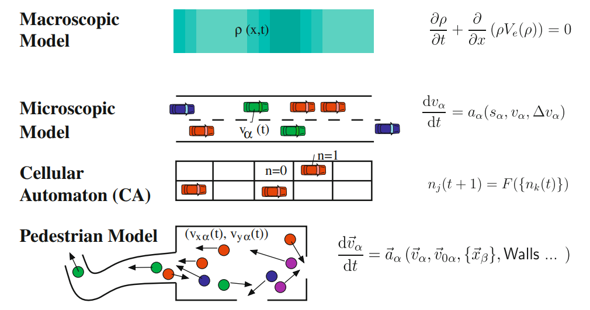
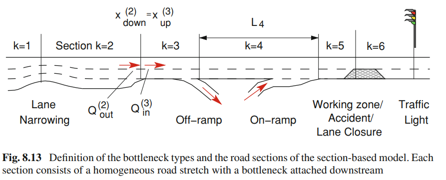
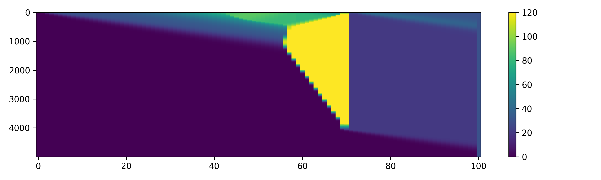
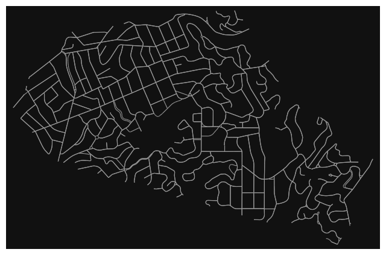
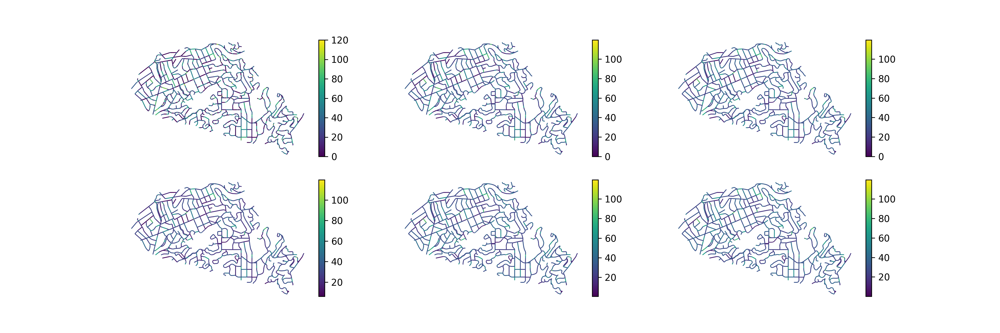

What do traffic congestion, supermarket lines and fluid dynamics have in common? While we are driving, we are used to think of cars as single individuals/entities. Although, every individual has its own driving tendencies and peculiarities, at a higher-scale, we behave within certain constraints and collective behavior. This quantities can be interpreted in many cases as a homogeneous dense fluid of cars. In this post I will focus on modelling traffic flow using fluid dynamics principles. 

*Extracted from Traffic Fluid Dynamics by Treiber and Kesting.*

## Continuity Equation

The continuity equation describes the conservation of mass (vehicles) in terms of density (traffic density) and the velocity

$$\tag{Continuity Equation}
\frac{\partial \rho}{\partial t} + \nabla \cdot [\rho \pmb{v}] = 0
$$

This equation will be used along 1-dimensional axis (x), which result in the following equation
$$
\frac{\partial \rho}{\partial t} + \frac{\partial (\rho v)}{\partial x} = 0
$$

One important quantity that will be use in this model is the flow $Q$, that can be interpreted as $Q = \rho V$. This equation can be solved using different numerical methods (there is no analytical solution) based on finite difference or finite volume method. However, this equation is not sufficient to solve for $\rho$ and $v$. In the following section, Lighthill, Whitham, and Richards assumed that $v$ could be expressed in terms of $\rho$.

It is interesting to consider some edge cases, for example when there is a decrease(increase) in the number of traffic lanes, an on-/off-ramps intersection, etc. 

### Lighthill-Whitham-Richards Model

This model is based on the continuity equation and assumes that $Q(x,t)$ depends only on the density $\rho$ and therefore the right term in the continuity equation can be expressed as follows
\begin{equation}
\frac{\partial (\rho v)}{\partial x} = \frac{\partial Q}{\partial x} = \frac{dQ(\rho)}{d\rho}\frac{\partial \rho}{\partial x}
\end{equation}
Therefore, the model can be rewritten 
\begin{equation}\tag{LWR Model}
\frac{\partial \rho}{\partial t} + \frac{dQ(\rho)}{d\rho}\frac{\partial \rho}{\partial x} = 0 
\end{equation}

Here is an example of solution of the equation using finite differnces where the $x$-axis represent the position, $y$-axis the time, and the colors are the density of the cars (maximum 120 vehicles per km). We observe that there is a traffic jam at the 60-th km, that is becuase we reduce the number of lanes to 0.01, simulating a crash that force the flow of cars to be reduced significantly.

We experimented with both numerical methods: 
- first-order approximation using finite-differences
$$
\frac{\rho_j^{n+1} - \rho_j^n}{\Delta t} + \frac{dQ_e(\rho_j^n)}{d\rho}\frac{\rho_{j}^n - \rho_{j-1}^n}{\Delta x} = 0
$$
- [Godunov's method](https://en.wikipedia.org/wiki/Godunov%27s_scheme) (Finite Volume Method): 

$$
\rho^{n+1}_j = \rho_j^n - \lambda [g^G(\rho_j^n,\rho_{j+1}^n) - g^G(\rho_{j-1}^n,\rho_j^n)]
$$

where we define $g^G(u,v)$ as follows
$$
g^G(u_l, u_r):= 
\begin{cases}
\min_{u\in[u_l, u_r]} f(u) & \text{if }u_l \leq u_r\\
\max_{u\in[u_l, u_r]} f(u) & \text{if }u_l > u_r
\end{cases}
$$

## Higher-Order Approximations

There are high-order methods that take into account more complex behaviour. This section needs to be completed.

## Experiment: Real Scenario
Using real data from Open Street Maps [1](https://www.openstreetmap.org), we can simulate the traffic of a small city or neighborhood. The data is given as a graph network, where each edge is a treet segment. and many edges can intersect in nodes. As well, there are different road sizes and speeds in the network. We wanted to keep it simple at first. We use data from a small neighborhood in California, Piedmont. 

We code it using a high-performance mathematical framework called Jax [2](https://github.com/google/jax). We use the graph representation form, where each operation can be expressed using the adjacency matrix. We have different features in the edges of the adjacency matrix: traffic density, boolean adjacency, road lanes, segment length. There are around 3000 nodes in the graph, therefore, the matrix is \(\mathbb{R}^{3000} \times \mathbb{R}^{3000} \times \mathbb{R}^4\) and total dimension of 3.6e10. However, in future versions we can use the sparse notation to speed up the executions. 

We can see in the following picture, the simulation of 6 hours of traffic in this graph

The code is publicly available at GitHub: [https://github.com/dani2442/TrafficFlow](https://github.com/dani2442/TrafficFlow)
## Future Research

Travel time estimation, Fuel consumption and emissions, traffic flow optimization